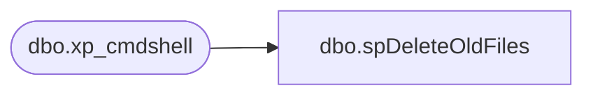

# dbo.spDeleteOldFiles

**Database:** IntegrationStaging  
**Server:** STL-SSIS-P-01  

## Architecture Diagram



## Table Dependencies

| Referenced Table |
|---|
| dbo.xp_cmdshell |

## Stored Procedure Code

```sql
-- Example:		exec spDeleteOldFiles @path = 'c:\temp\', @filemask = '*.zip', @retention = 7
------------------------------------------------------------------------------------------------
CREATE proc [dbo].[spDeleteOldFiles] (@path varchar(100), @filemask varchar(20), @retention int = 2)

as

set nocount on

declare @cmd varchar(1000)
declare @rowcnt int	--stores @@rowcount
declare @WhichFile VARCHAR(1000)


-- Stores the name of the file to be deleted
CREATE TABLE #DeleteOldFiles
 (
  DirInfo VARCHAR(7000)
 )

-- Build the command that will list out all of the files in a directory
SELECT @cmd = 'dir ' + @path + @filemask + ' /OD'

  -- Run the dir command and put the results into a temp table
  INSERT INTO #DeleteOldFiles
  EXEC master.dbo.xp_cmdshell @cmd

  -- Delete all rows from the temp table except the ones that correspond to the files to be deleted
  DELETE
  FROM #DeleteOldFiles
  WHERE ISDATE(SUBSTRING(DirInfo, 1, 10)) = 0 OR DirInfo LIKE '%
%' OR SUBSTRING(DirInfo, 25, 5) = '<DIR>'
	OR SUBSTRING(DirInfo, 1, 10) >= GETDATE() - @retention

  -- Get the file name portion of the row that corresponds to the file to be deleted
  SELECT TOP 1 @WhichFile = SUBSTRING(DirInfo, LEN(DirInfo) -  PATINDEX('% %', REVERSE(DirInfo)) + 2, LEN(DirInfo))
  FROM #DeleteOldFiles
  
  SET @rowcnt = @@ROWCOUNT
  
  -- Interate through the temp table until there are no more files to delete
  WHILE @rowcnt <> 0
  BEGIN
  
   -- Build the del command
   SELECT @cmd = 'del ' + @path + @WhichFile + ' /Q /F'
   
   -- Delete the file
   EXEC master.dbo.xp_cmdshell @cmd, NO_OUTPUT
   
   -- To move to the next file, the current file name needs to be deleted from the temp table
   DELETE
   FROM #DeleteOldFiles
   WHERE SUBSTRING(DirInfo, LEN(DirInfo) -  PATINDEX('% %', REVERSE(DirInfo)) + 2, LEN(DirInfo))  = @WhichFile

   -- Get the file name portion of the row that corresponds to the file to be deleted
   SELECT TOP 1 @WhichFile = SUBSTRING(DirInfo, LEN(DirInfo) -  PATINDEX('% %', REVERSE(DirInfo)) + 2, LEN(DirInfo))
   FROM #DeleteOldFiles
  
   SET @rowcnt = @@ROWCOUNT
  
  END
  
  DROP TABLE #DeleteOldFiles


dbo,spDeleteOldFiles_StoreForcePosSalesExtract,CREATE proc spDeleteOldFiles_StoreForcePosSalesExtract

as 

set nocount on

--=========STAGE FILE DATA, FILTER FOR FILES OLDER THAN TODAY======================================
IF (Object_ID('tempdb..#DEL') IS NOT NULL) DROP TABLE #DEL
create table #DEL(output varchar(1000))
insert #DEL exec master..xp_cmdshell 'dir \\stl-ssis-p-01\IntegrationStaging\HR\StoreForceSalesExtract\Archive\'


IF (Object_ID('tempdb..#FilesToDelete') IS NOT NULL) DROP TABLE #FilesToDelete;
with 
FileStage as
	(
		select 
			cast(substring(output, 0,21) as datetime) as FileDate,
			substring(output, charindex(' POS', output,0)+1, 100) as FileName
		from #DEL
		where output like '%/%/%'
		and output not like '%dir%'
		and output not like '%Daily_POS%'
		UNION
		select 
			cast(substring(output, 0,21) as datetime) as FileDate,
			substring(output, charindex('Daily_POS', output,0), 100) as FileName
		from #DEL
		where output like '%/%/%'
		and output not like '%dir%'
		and output like '%Daily_POS%'
	)
select *
into #FilesToDelete
from FileStage
where datediff(dd, FileDate, getdate()) > 0

--=====LOOP THROUGH FILES AND DELETE=======================

declare 
	@Total int,
	@Count int,
	@Filepath varchar(1000),
	@Filename varchar(100),
	@Del varchar(2000)

select @Filepath = '\\stl-ssis-p-01\IntegrationStaging\HR\StoreForceSalesExtract\Archive\'

select @total = count(*) from #FilesToDelete
while @total > 0
	begin
		select @Filename = min(FileName) from #FilesToDelete
		select @Del = 'del ' + @Filepath + @Filename
		exec master..xp_cmdshell @Del
		select @Del
		delete from #FilesToDelete where FileName = @Filename
		select @total = count(*) from #FilesToDelete
		if @total = 0
			break
				else
			continue
	end
```

