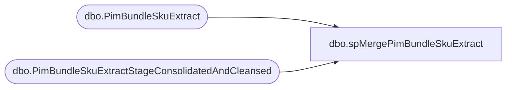

# dbo.spMergePimBundleSkuExtract

**Database:** IntegrationStaging  
**Server:** STL-SSIS-P-01  

## Architecture Diagram



## Table Dependencies

| Referenced Table |
|---|
| dbo.PimBundleSkuExtract |
| dbo.PimBundleSkuExtractStageConsolidatedAndCleansed |

## Stored Procedure Code

```sql
CREATE proc [dbo].[spMergePimBundleSkuExtract] -- Update to Proper Name 

as 

-------------------------------------------------------------------------------------------------------
--	Tim Callahan	-	2024-03-13	-	Created proc - Merges PIM Bundle Sku Data
--	Tim Callahan	-	2024-09-05	-	Updated merge to update Display name and KeyStory, updated source definition as well 
--	Tim Callahan	-	2024-09-26	-	Updated merge to include new field ComponentQuantity per JIRA BIB-1024
--	Tim Callahan	-	2025-04-30	-	Updated Merge to delete unmatched records but remarked out code 
--										Will only deploy at approval of Bryce Ahrens 
--	Tim Callahan	-	2025-06-04	-	Updated merge to Updated Local Product Code if change detected 
-------------------------------------------------------------------------------------------------------

set nocount on

merge into [PimBundleSkuExtract] as target
--using PimBundleSkuExtractStageConsolidatedAndCleansed as source -- Use Entire Table as Source 

using 
(
select *
from PimBundleSkuExtractStageConsolidatedAndCleansed
where 1=1
and GroupingType = 'Bundle' -- Per Bryce Only Entries with a Grouping Type of Bundle should flow to SFCC -- So eliminating that noise 
)
as source 

on 
	(
		target.[PrimaryId]=source.[PrimaryId] -- Key 
			and 
		target.[Catalog] = source.[Catalog] -- Key 
			and 
		--target.[KeyStory]=source.[KeyStory] -- Key 
		--	and 
		target.[GroupingType]=source.[GroupingType] -- Key 
			and
		target.[ComponentProducts]=source.[ComponentProducts] -- Key 
			and 
		target.[ComponentQuantity]=source.[ComponentQuantity] -- Key 
			
	)
When Matched and
	(				
		    isnull(target.[DisplayName],'x')<>isnull(source.[DisplayName],'x')
				or 
			isnull(target.[KeyStory],'x')<>isnull(source.[KeyStory],'x')
				or -- Added this on 2025-06-04
			isnull(target.[LocalProductCode],'x')<>isnull(source.[LocalProductCode],'x')

			       
	)
Then Update
	-- Fields to be updated
	set     
		 target.[DisplayName]=source.[DisplayName],		 
		 target.[KeyStory]=source.[KeyStory],		
		 target.[LocalProductCode] = source.[LocalProductCode], -- Added this on 2025-06-04
		 target.[UpdateDate]=getdate()

When Not Matched by target
Then Insert
	(
		-- Fields to be inserted 
		 PrimaryId
		,LocalProductCode
		,KeyStory
		,GroupingType
		,MSTAT
		,ComponentProducts
		,DisplayName
		,Catalog
		,CountComponentProducts
		,ComponentQuantity
		,InsertDate
         
	)
Values
	(
		  source.PrimaryId
		, source.LocalProductCode
		, source.KeyStory
		, source.GroupingType
		, source.MSTAT
		, source.ComponentProducts
		, source.DisplayName
		, source.Catalog
		, source.CountComponentProducts
		, source.ComponentQuantity
		,getdate()

	)
-- Deployed on Apr 30 2025 per Bryce Ahrens Approval 
When Not Matched by source  
Then delete

;
```

