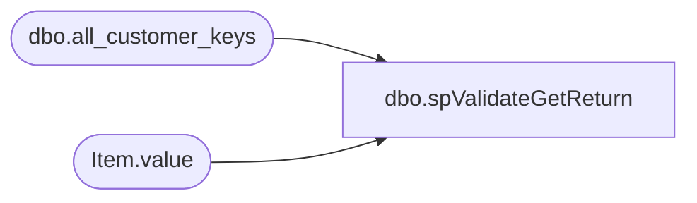

# dbo.spValidateGetReturn

**Database:** IntegrationStaging  
**Server:** STL-SSIS-P-01  

## Architecture Diagram



## Table Dependencies

| Referenced Table |
|---|
| dbo.all_customer_keys |
| Item.value |

## Stored Procedure Code

```sql
CREATE PROCEDURE [dbo].[spValidateGetReturn]
	@XMLToValidate AS XML

-- =============================================================================================================
-- Name: spValidateGetReturn
--
-- Description:	
--
-- Output: 
--	ds
-- Dependencies: 
--
-- Revision History
--		Name:			Date:			Comments:
--		Ben Barud		05/07/2018		Initial Creation
--		Tim Bytnar		06/07/2018		Changed the lookup table to the all_customer_keys table in CRM
--		Ben Barud		11/14/2018		Updated to point to new CRM server for CRM Updgrade
-- =============================================================================================================

AS
BEGIN
	-- SET NOCOUNT ON added to prevent extra result sets from
	-- interfering with SELECT statements.
	SET NOCOUNT ON;
	--DECLARE @XMLToValidate AS XML
	--SET @XMLToValidate = '<?xml version="1.0" encoding="utf-8"?><ValidateGetReturn><ValidationID>1</ValidationID><CustomerID>4D5A567F-EF99-4966-B41B-5FD91F627ECB</CustomerID></ValidateGetReturn>'
    DECLARE @ValidationID AS INT, @CustUID AS UNIQUEIDENTIFIER

	--SELECT @ValidationID = T.Item.value('VaidationID[1]', 'INT'),
	--       @guid = T.Item.value('CustUID[1]', 'UNIQUEIDENTIFIER')
	--FROM @XMLToValidate.nodes('/XMLToValid/ValidationID') AS T(Item)
	SELECT @ValidationID = T.Item.value('ValidationID[1]', 'INT')
	FROM @XMLToValidate.nodes('/ValidateGetReturn') AS T(Item)

	IF @ValidationID = 1
	BEGIN
		SELECT @CustUID = T.Item.value('CustomerID[1]', 'UNIQUEIDENTIFIER')
		FROM @XMLToValidate.nodes('/ValidateGetReturn') AS T(Item)

		PRINT CAST(@XMLToValidate AS VARCHAR(MAX))
		PRINT @ValidationID
		PRINT @CustUID

		SELECT '<?xml version="1.0" encoding="UTF-8"?>' + 
		CAST((
		SELECT @ValidationID AS 'ValidationID', [customer_no] AS 'CustomerNo'
        FROM [STL-CRMDB-P-01].[crm].[dbo].[all_customer_keys]
		WHERE cust_uid = @CustUID
		FOR XML PATH ('ValidateGetReturn'), type
		) AS VARCHAR(MAX))
	END
	IF @ValidationID = 2
	BEGIN
		SELECT @CustUID = T.Item.value('CustomerID[1]', 'UNIQUEIDENTIFIER')
		FROM @XMLToValidate.nodes('/ValidateGetReturn') AS T(Item)

		SELECT CAST([customer_no] AS VARCHAR(20))
        FROM [STL-CRMDB-P-01].[crm].[dbo].[all_customer_keys]
		WHERE cust_uid = @CustUID
	END
END


dbo,usp_SSIS_ScriptEnvironment,CREATE PROCEDURE dbo.usp_SSIS_ScriptEnvironment
          @folder sysname
        , @env sysname
AS
        SET NOCOUNT ON;

        DECLARE @project_id int,
                @reference_location char(1),
                @folder_description nvarchar(1024),
                @sql varchar(max) = '',
                @name sysname,
                @cr char(1) = char(10),
                @tab char(4) = SPACE(4),
                @ver nvarchar(128) = CAST(serverproperty('ProductVersion') AS nvarchar);

        SET @ver = CAST(SUBSTRING(@ver, 1, CHARINDEX('.', @ver) - 1) as int);       
        IF (@ver < 11)
        BEGIN
                RAISERROR ('This procedure is not supported on versions prior SQL 2012', 16, 1) WITH NOWAIT;
                RETURN 1;
        END;
        IF NOT EXISTS(SELECT TOP 1 1 FROM sys.databases WHERE name = 'SSISDB')
        BEGIN
                RAISERROR('The SSISDB database does not exist on this server', 16, 1) WITH NOWAIT;
                RETURN 1;
        END;

        /* TO DO - get the folder, environment description-*/
        SET @sql = '/**************************************************************************************' + @cr;
        SET @sql += @tab + 'This script creates a script to generate and SSIS Environment and its variables.' + @cr;
        SET @sql += @tab + 'Replace the necessary entries to create a new envrionment' + @cr;
        SET @sql += @tab + '***NOTE: variables marked as sensitive have their values masked with ''<REPLACE_ME>''.' + @cr;
        SET @sql += @tab + @tab + 'These values will need to be replace with the actual values' + @cr;
        SET @sql += '**************************************************************************************/' + @cr +@cr;
        SET @sql += 'DECLARE @ReturnCode INT=0, @folder_id bigint' + @cr + @cr;       
        SET @sql += '/*****************************************************' + @cr;
        SET @sql += @tab + 'Variable declarations, make any changes here' + @cr;
        SET @sql += '*****************************************************/' + @cr;
        SET @sql += 'DECLARE @folder sysname = ''' + @folder + ''' /* this is the name of the new folder you want to create */'  + @cr;
        SET @sql += @tab + @tab + ', @env sysname = ''' + @env + ''' /* this is the name of the new environment you want to create */';
       
        PRINT @sql;

        /*
                Generate the variable declarations at the "top" this makes it easier to replace/update the values
                The variable names here map to the name of the variable being created
        */

        SELECT [env_var] = @tab + @tab + ', @' + ev.name + ' '  + ev.base_data_type  + '= N''' + ISNULL(CONVERT(varchar(max), ev.value), '<REPLACE_ME>') + ''''
                        , [name] = ev.name
        INTO #env_var
        FROM [SSISDB].[catalog].[folders] f        
        INNER JOIN [SSISDB].[catalog].[environments] e ON f.folder_id =  e.folder_id        
        INNER JOIN [SSISDB].[internal].[environment_variables] ev ON e.environment_id = ev.environment_id    
        WHERE (f.name = @folder) AND (e.name = @env);

        /*
                Yes, I am looping here.  We don't know how many variables, sql_variant can be up to 8,000 bytes for the base type
                and don't want to be limited trying to print varchar(max) to the output window
                ... so we're going to print them one at a time
        */
        WHILE EXISTS (SELECT TOP 1 1 FROM #env_var)
        BEGIN
                SELECT TOP 1 @sql = env_var, @name = name FROM #env_var ORDER BY name;
                PRINT @sql;
                DELETE FROM #env_var WHERE name = @name;
        END;

        SET @sql = ';' + @cr + '/* Starting the transaction */' + @cr;
        SET @sql += 'BEGIN TRANSACTION' + @cr;                  
        SET @sql += @tab + 'IF NOT EXISTS (SELECT 1 FROM [SSISDB].[catalog].[folders] WHERE name = @folder)' + @cr;
        SET @sql += @tab + 'BEGIN' + @cr;
        SET @sql += @tab + @tab + 'RAISERROR(''Creating folder: %s ...'', 10, 1, @folder) WITH NOWAIT;' + @cr;
        SET @sql += @tab + @tab + 'EXEC @ReturnCode = [SSISDB].[catalog].[create_folder] @folder_name=@folder, @folder_id=@folder_id OUTPUT' + @cr;
        SET @sql += @tab + @tab + 'IF (@@ERROR <> 0 OR @ReturnCode <> 0) GOTO QuitWithRollback;' + @cr;
        SET @sql += @tab + 'END' + @cr + @cr;   
        SET @sql += @tab + 'RAISERROR(''Creating Environtment: %s'', 10, 1, @env) WITH NOWAIT;' + @cr;
        SET @sql += @tab + 'EXEC @ReturnCode = [SSISDB].[catalog].[create_environment] @folder_name=@folder, @environment_name=@env'  + @cr;
        SET @sql += @tab + 'IF (@@ERROR <> 0 OR @ReturnCode <> 0) GOTO QuitWithRollback;' + @cr + @cr;
        SET @sql += @tab + '/******************************************************' + @cr;
        SET @sql += @tab + @tab + 'Variable creation' + @cr;
        SET @sql += @tab + '******************************************************/' ;     
        PRINT @sql;

        /* Generate the variable creation */
        SELECT [cmd] = @tab + 'RAISERROR(''Creating variable: ' + ev.name + ' ...'', 10, 1) WITH NOWAIT;' + @cr
                                        + @tab + 'EXEC @ReturnCode = [SSISDB].[catalog].[create_environment_variable]' + @cr
                                        + @tab + @tab + '@variable_name=N''' + ev.name + '''' + @cr
                                        + @tab + @tab + ', @sensitive=' + CONVERT(varchar(2), ev.sensitive) + @cr
                                        + @tab + @tab + ', @description=N''' + ev.[description] + '''' + @cr
                                        + @tab + @tab + ', @environment_name=@env' + @cr
                                        + @tab + @tab + ', @folder_name=@folder' + @cr
                                        + @tab + @tab + ', @value=@' + ev.name + @cr
                                        + @tab + @tab + ', @data_type=N''' + ev.type + '''' + @cr
                                        + @tab + 'IF (@@ERROR <> 0 OR @ReturnCode <> 0) GOTO QuitWithRollback;' + @cr
                                , [name] = ev.name
        INTO #cmd
        FROM [SSISDB].[catalog].[folders] f        
        INNER JOIN [SSISDB].[catalog].[environments] e ON f.folder_id =  e.folder_id        
        INNER JOIN [SSISDB].[catalog].[environment_variables] ev ON e.environment_id = ev.environment_id    
        WHERE (f.name = @folder) AND (e.name = @env);

        /*Print out the variable creation procs */
        WHILE EXISTS (SELECT TOP 1 1 FROM #cmd)
        BEGIN
                SELECT TOP 1 @sql = cmd, @name = name FROM #cmd ORDER BY name;
                PRINT @sql;
               
                DELETE FROM #cmd WHERE name = @name;
        END;

        /* finsih the transaction handling */
        SET @sql = 'COMMIT TRANSACTION' + @cr;
        SET @sql += 'RAISERROR(N''Complete!'', 10, 1) WITH NOWAIT;' + @cr;
        SET @sql += 'GOTO EndSave' + @cr + @cr;
        SET @sql += 'QuitWithRollback:' + @cr;
        SET @sql += 'IF (@@TRANCOUNT > 0) ROLLBACK TRANSACTION' + @cr;
        SET @sql += 'RAISERROR(N''Variable creation failed'', 16,1) WITH NOWAIT;' + @cr + @cr;
        SET @sql += 'EndSave:' + @cr;
        SET @sql += 'GO';
       
        PRINT @sql;
        RETURN 0;

dbo,WareHouseQAapp_sp_GetOrder,-- =============================================
-- Author:		<Author,,Name>
-- Create date: <Create Date,,>
-- Description:	<Description,,>
-- =============================================
CREATE PROCEDURE WareHouseQAapp_sp_GetOrder
	@ordernum varchar(max)
AS
BEGIN

	select Orderid, OrderDate, OrderStatus, OrderType from wm.Orders where OrderNum=@ordernum;

END

dbo,WareHouseQAapp_sp_GetOrderItem,-- =============================================
-- Author:		<Author,,Name>
-- Create date: <Create Date,,>
-- Description:	<Description,,>
-- =============================================
CREATE PROCEDURE [dbo].[WareHouseQAapp_sp_GetOrderItem]
	@orderid varchar(max)
AS
BEGIN

	select sku, ItemDescription, qty, isnull(ParentItem,0) ParentItem, orderitemid, 
	isnull(convert(varchar(max),height),'') +
	isnull(convert(varchar(max),weight),'') + 
	isnull(EyeColor,'') + 
	isnull(furcolor,'') + 
	isnull(belongsto,'') + 
	isnull(fullname,'') as itemattr,
	idnum  
	from wm.OrderItems where OrderID=@orderid;

END

dbo,WareHouseQAapp_sp_InsertLog,-- =============================================
-- Author:		<Author,,Name>
-- Create date: <Create Date,,>
-- Description:	<Description,,>
-- =============================================
CREATE PROCEDURE WareHouseQAapp_sp_InsertLog

	@OrderNumber varchar(max),
	@StationID varchar(max),
	@UserID varchar(max)


AS
BEGIN

	insert into WM.qalog (ordernumber,stationid,UserID, LogDateTime) 
	values
	(@OrderNumber, @stationid, @userid, getdate());

END

dbo,WareHouseQAapp_sp_SaveFindABear,-- =============================================
-- Author:		<Author,,Name>
-- Create date: <Create Date,,>
-- Description:	<Description,,>
-- =============================================
CREATE PROCEDURE WareHouseQAapp_sp_SaveFindABear
	@bearbarcode varchar(Max),
	@orderitemid int
AS
BEGIN

	update wm.orderitems set idnum=@bearbarcode where OrderItemID=@orderitemid;

END
```

