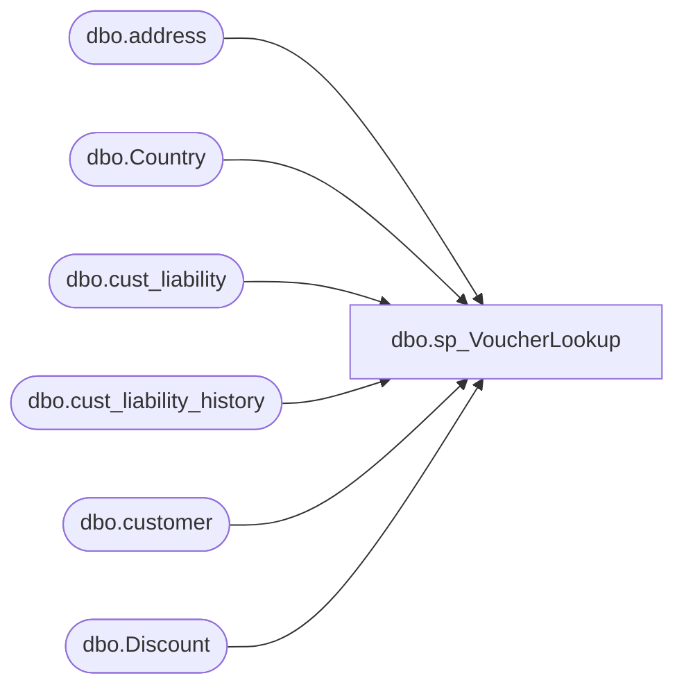

# dbo.sp_VoucherLookup

**Database:** IntegrationStaging  
**Server:** STL-SSIS-P-01  

## Architecture Diagram



## Table Dependencies

| Referenced Table |
|---|
| dbo.address |
| dbo.Country |
| dbo.cust_liability |
| dbo.cust_liability_history |
| dbo.customer |
| dbo.Discount |

## Stored Procedure Code

```sql
CREATE PROCEDURE [dbo].[sp_VoucherLookup]
	-- Add the parameters for the stored procedure here
	@sfs_Number varchar(20) = 'NoData',
	@voucher_number varchar(20) = 'NoData',
	@coupon_number varchar(20) = 'NoData',
	@refType int
AS
-- =============================================
-- Author:		Tim Paschedag
-- ALTER  date: 9/17/2008
-- Description:	Modified to add lookup by Voucher Voucher Number & Customer Number
--		Name:			Date:			Comments:
--		Garyd			08/30/2010		Initial version in source control
--		Keith Missey	01/11/2011		added case statement
--		Mike Pelikan	03/10/2014		Added Top 1 to Country Code selection
--		Mike Pelikan	04/29/2014		Changed DiscountManager linked server reference
--		Ben Barud		02/16/2018		Added Logic to show vouchers are redeemed if the pos_amount_1 value is 0
--exec sp_VoucherLookup '721838780', '0107431345840679'
-- =============================================
--DECLARE @sfs_Number varchar(20) ,
--	@voucher_number varchar(20) ,
--	@coupon_number varchar(20) ,
--	@refType int

--SELECT @sfs_Number = '703787798',
--	@voucher_number = 'NoData',
--	@coupon_number = 'NoData',
--	@refType =31

BEGIN

	SET NOCOUNT ON;

DECLARE @select AS VARCHAR(3000), @cntryCode AS VARCHAR(3)

IF @sfs_Number != 'NoData'
BEGIN
	SELECT @cntryCode = (SELECT TOP 1 a.country_code
	FROM [stl-crmdb-p-01].crm.dbo.customer c
	INNER JOIN [stl-crmdb-p-01].crm.dbo.address a ON c.customer_id = a.customer_id
	WHERE c.customer_no = @sfs_Number
	ORDER BY address_id)

	IF @cntryCode NOT IN ('FRA', 'GBR', 'IRE')
	BEGIN
		SET @select = 'SELECT DISTINCT c.reference_no AS [VoucherNumber]
			,[RedeemedDate]
			,[RedeemedAt]
			,c.date_issued AS [IssuedDate]
			,CASE WHEN expiry_date <= CONVERT(VARCHAR,DATEADD(DAY,-0,GETDATE()),111) 
				  THEN ''Yes'' 
				  ELSE ''No'' 
			END AS [Expired]
			,DATEADD(SECOND, -1, c.expiry_date) AS [ExpirationDate]
			,c.pos_amount_1 AS [Balance]
			,CASE WHEN (c.liability_amount != c.amount_3 AND [RedeemedDate] IS NOT NULL)
				  THEN ''Redeemed''
				  WHEN c.pos_amount_1 = 0
				  THEN ''Redeemed''
				  WHEN c.pos_status = ''30'' AND c.liability_amount = c.amount_3 AND c.amount_4 = 0 AND c.expiry_date > CONVERT(VARCHAR,DATEADD(DAY,-0,GETDATE()),111) 
				  THEN ''Valid'' 
				  WHEN c.pos_status = ''0'' 
				  THEN ''Cancelled'' 
				  WHEN c.pos_status = ''50'' 
				  THEN ''Forfeited'' 
				  WHEN c.expiry_date <= CONVERT(VARCHAR,DATEADD(DAY,-0,GETDATE()),111) 
				  THEN ''Expired'' 
						END AS [Status]
			,c.customer_no AS [CustomerNumber]
			,c.last_name AS [LastName]
			,c.first_name AS [FirstName]
			,c.email_address AS [EmailAddress]
			,''-'' AS [Tier]
		FROM bedrockdb01.auditworks.dbo.cust_liability c (NOLOCK) 
		LEFT OUTER JOIN bedrockdb01.auditworks.dbo.cust_liability_history h (NOLOCK) ON c.reference_no = h.reference_no
		LEFT OUTER JOIN [stl-crmdb-p-01].crm.dbo.customer cc (NOLOCK) ON c.customer_no = cc.customer_no
		LEFT JOIN 
			   (
					  SELECT MIN(h2.transaction_date) [RedeemedDate], MIN(h2.store_no) [RedeemedAt], reference_no
					  FROM bedrockdb01.auditworks.dbo.cust_liability_history h2 (NOLOCK)
					  WHERE h2.store_no <> 990
					  GROUP BY reference_no
			   ) qry ON c.reference_no = qry.reference_no 

		WHERE h.store_no = 990 AND (c.reference_type = ' + CAST(@refType AS VARCHAR(2)) + ' OR c.reference_type = 35) AND c.customer_no = ' + CAST(@sfs_Number AS VARCHAR(9)) + '
		ORDER BY c.date_issued'
	END
	ELSE
	BEGIN
		SET @select = 'SELECT DISTINCT c.reference_no AS [VoucherNumber]
			,[RedeemedDate]
			,[RedeemedAt]
			,c.date_issued AS [IssuedDate]
			,CASE WHEN expiry_date <= CONVERT(VARCHAR,DATEADD(DAY,-0,GETDATE()),111) 
				  THEN ''Yes'' 
				  ELSE ''No'' 
			END AS [Expired]
			,DATEADD(SECOND, -1, c.expiry_date) AS [ExpirationDate]
			,c.pos_amount_1 AS [Balance]
			,CASE WHEN c.liability_amount != c.amount_3 AND [RedeemedDate] IS NOT NULL
				  THEN ''Redeemed''
				  WHEN c.pos_amount_1 = 0
				  THEN ''Redeemed''
				  WHEN c.pos_status = ''30'' AND c.liability_amount = c.amount_3 AND c.amount_4 = 0 AND c.expiry_date > CONVERT(VARCHAR,DATEADD(DAY,-0,GETDATE()),111) 
				  THEN ''Valid'' 
				  WHEN c.pos_status = ''0'' 
				  THEN ''Cancelled'' 
				  WHEN c.pos_status = ''50'' 
				  THEN ''Forfeited'' 
				  WHEN c.expiry_date <= CONVERT(VARCHAR,DATEADD(DAY,-0,GETDATE()),111) 
				  THEN ''Expired'' 
						END AS [Status]
			,c.customer_no AS [CustomerNumber]
			,c.last_name AS [LastName]
			,c.first_name AS [FirstName]
			,c.email_address AS [EmailAddress]
			,NULL AS [Tier]
		FROM bedrockdb01.auditworks.dbo.cust_liability c (NOLOCK) 
		LEFT OUTER JOIN bedrockdb01.auditworks.dbo.cust_liability_history h (NOLOCK) ON c.reference_no = h.reference_no
		LEFT JOIN 
			   (
					  SELECT MIN(h2.transaction_date) [RedeemedDate], MIN(h2.store_no) [RedeemedAt], reference_no
					  FROM bedrockdb01.auditworks.dbo.cust_liability_history h2 (NOLOCK)
					  WHERE h2.store_no <> 990
					  GROUP BY reference_no
			   ) qry ON c.reference_no = qry.reference_no 

		WHERE h.store_no = 990 AND (c.reference_type = ' + CAST(@refType AS VARCHAR(2)) + ' OR c.reference_type = 35) AND c.customer_no = ' + CAST(@sfs_Number AS VARCHAR(9)) + '
		ORDER BY c.date_issued'
	END

	EXEC(@select)
END

IF @voucher_number != 'NoData'
BEGIN
SELECT DISTINCT c.reference_no AS 'VoucherNumber'
	,[RedeemedDate]
	,[RedeemedAt]
	,c.date_issued AS 'IssuedDate'
	,CASE WHEN expiry_date <= CONVERT(VARCHAR,DATEADD(DAY,-0,GETDATE()),111) 
		  THEN 'Yes' 
		  ELSE 'No' 
	END AS 'Expired'
	,DATEADD(SECOND, -1, c.expiry_date) AS 'ExpirationDate'
	,c.pos_amount_1 AS 'Balance'
	,CASE WHEN c.liability_amount != c.amount_3 
		  THEN 'Redeemed' 
		  WHEN c.pos_amount_1 = 0
		  THEN 'Redeemed'
		  WHEN c.pos_status = '30' AND c.liability_amount = c.amount_3 AND c.amount_4 = 0 AND c.expiry_date > CONVERT(VARCHAR,DATEADD(DAY,-0,GETDATE()),111) 
		  THEN 'Valid' 
		  WHEN c.pos_status = '0' 
		  THEN 'Cancelled' 
		  WHEN c.pos_status = '50' 
		  THEN 'Forfeited' 
		  WHEN c.expiry_date <= CONVERT(VARCHAR,DATEADD(DAY,-0,GETDATE()),111) 
		  THEN 'Expired' 
				END AS 'Status'
	,c.customer_no AS 'CustomerNumber'
	,c.last_name AS 'LastName'
	,c.first_name AS 'FirstName'
	,c.email_address AS 'EmailAddress' 
	,NULL AS 'Tier' 
FROM bedrockdb01.auditworks.dbo.cust_liability c (NOLOCK) 
LEFT OUTER JOIN bedrockdb01.auditworks.dbo.cust_liability_history h (NOLOCK) ON c.reference_no = h.reference_no
--LEFT OUTER JOIN crmtestdb02.crm.dbo.customer cc (NOLOCK) ON c.customer_no = cc.customer_no
--INNER JOIN crmtestdb02.crm.dbo.customer_attribute ca (NOLOCK) ON cc.customer_id = ca.customer_id
LEFT JOIN 
       (
              SELECT MIN(h2.transaction_date) [RedeemedDate], MIN(h2.store_no) [RedeemedAt], reference_no
              FROM bedrockdb01.auditworks.dbo.cust_liability_history h2 (NOLOCK)
              WHERE h2.store_no <> 990
              GROUP BY reference_no
       ) qry ON c.reference_no = qry.reference_no 

WHERE h.store_no = 990 AND (c.reference_type = @refType OR c.reference_type = 35) AND c.reference_no LIKE @voucher_number
ORDER BY c.date_issued
END

IF @coupon_number != 'NoData'
BEGIN
	SELECT couponNumber 'CouponNumber'
	  ,c.Abbrv 'Country'	  
	  ,Title 'Offer'
	  ,rptDescription 'Description'
      ,CONVERT(SMALLDATETIME, startDate) 'StartDate'
      ,DATEADD(SECOND, -1, (DATEADD(DAY, 1, CONVERT(DATETIME, endingDate)))) 'EndingDate'
      ,CASE
		WHEN startDate > GETDATE() THEN 'Pending'
		WHEN GETDATE() >= endingDate THEN 'Expired'
		ELSE 'Active'
	  END 'Status'	
  FROM kodiak.DiscountMstrData.dbo.Discount d
  LEFT JOIN kodiak.DiscountMstrData.dbo.Country c ON d.countryID = c.countryID
  WHERE couponNumber = @coupon_Number
END

END
```

