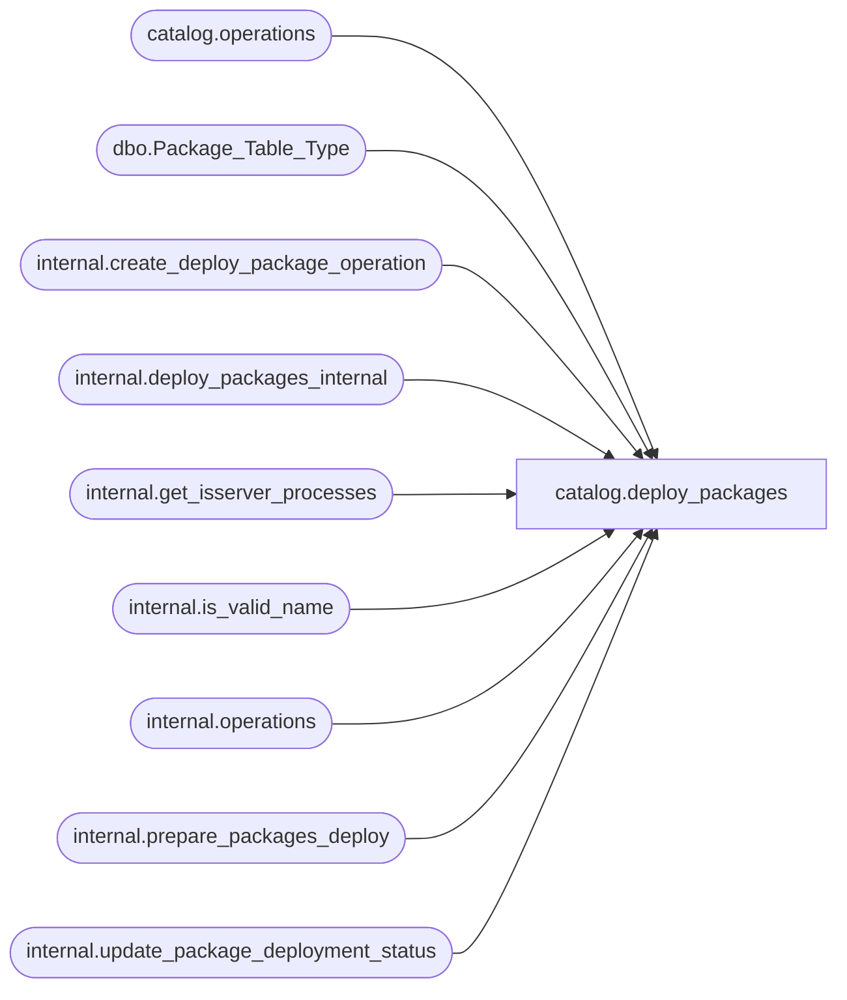

# catalog.deploy_packages

**Database:** SSISDB  
**Server:** STL-SSIS-P-01  

## Architecture Diagram



## Table Dependencies

| Referenced Table |
|---|
| catalog.operations |
| dbo.Package_Table_Type |
| internal.create_deploy_package_operation |
| internal.deploy_packages_internal |
| internal.get_isserver_processes |
| internal.is_valid_name |
| internal.operations |
| internal.prepare_packages_deploy |
| internal.update_package_deployment_status |

## Stored Procedure Code

```sql
CREATE PROCEDURE [catalog].[deploy_packages]
    @folder_name nvarchar(128),
    @project_name nvarchar(128),
    @packages_table Package_Table_Type ReadOnly,
    @operation_id bigint = NULL output
AS
    SET NOCOUNT ON
    
    DECLARE @deploy_id  bigint
    DECLARE @version_id bigint
    DECLARE @project_id bigint
    DECLARE @retval int
    DECLARE @time   datetimeoffset
    DECLARE @status int   

    IF (@folder_name IS NULL OR @project_name IS NULL)
    BEGIN
        RAISERROR(27138, 16 , 6) WITH NOWAIT 
        RETURN 1 
    END
    
    IF [internal].[is_valid_name](@project_name) = 0
    BEGIN
        RAISERROR(27145, 16, 1, @project_name) WITH NOWAIT
        RETURN 1
    END

    EXEC @retval = [internal].[create_deploy_package_operation] 
                       @folder_name,
                       @project_name,
                       @deploy_id output
    IF @retval <> 0
    BEGIN
        RETURN 1
    END   
    
    SET @operation_id = @deploy_id

    
    SET TRANSACTION ISOLATION LEVEL SERIALIZABLE
    
    
    
    DECLARE @tran_count INT = @@TRANCOUNT;
    DECLARE @savepoint_name NCHAR(32);
    IF @tran_count > 0
    BEGIN
        SET @savepoint_name = REPLACE(CONVERT(NCHAR(36), NEWID()), N'-', N'');
        SAVE TRANSACTION @savepoint_name;
    END
    ELSE
        BEGIN TRANSACTION;                                                                                        
    BEGIN TRY
        EXEC @retval = [internal].[prepare_packages_deploy] 
                           @folder_name,
                           @project_name,
                           @packages_table,
                           @deploy_id,
                           @version_id output,
                           @project_id output
        IF @retval <> 0
        BEGIN
            RAISERROR(27230, 16, 1) WITH NOWAIT
        END
    
        EXEC @retval = [internal].[deploy_packages_internal]
                            @deploy_id,
                            @version_id,
                            @project_id,
                            @project_name,
                            @folder_name
        IF @retval <> 0
        BEGIN
            RAISERROR(27230, 16, 1) WITH NOWAIT
        END      
    
        IF @tran_count = 0
            COMMIT TRANSACTION;                                                                                 
    END TRY
    
    BEGIN CATCH
        
        IF @tran_count = 0 
            ROLLBACK TRANSACTION;
        
        ELSE IF XACT_STATE() <> -1
            ROLLBACK TRANSACTION @savepoint_name;                                                                           
        SET @time = SYSDATETIMEOFFSET()
        
        UPDATE [internal].[operations] SET 
            [end_time]  = SYSDATETIMEOFFSET(),
            [status]    = 4
            WHERE operation_id    = @operation_id;
        THROW 
    END CATCH
    
    
    DECLARE @process_id bigint
    SELECT @process_id = [process_id] FROM [catalog].[operations] 
        WHERE operation_id = @deploy_id
    
    SET @status = NULL
    WHILE @status IS NULL
    BEGIN
        WAITFOR DELAY '00:00:01'  
        
        SELECT @status = [status] FROM [catalog].[operations] 
                    WHERE operation_id = @deploy_id AND [status] <> 2
                    
        IF @status IS NULL
        BEGIN
           
           IF NOT EXISTS (SELECT [process_id] 
                 FROM internal.get_isserver_processes() 
                 WHERE [process_id]= @process_id)
            BEGIN
               
               
               DECLARE @end_time datetimeoffset(7)
               
               SET @status = 4
               SET @end_time = SYSDATETIMEOFFSET()
               EXEC @retval = [internal].[update_package_deployment_status]
                      @deploy_id,
                      @version_id,
                      @end_time,
                      4,
                      ''  
           END
        END
    END
    
    IF @status = 7
    BEGIN
        RETURN 0
    END
    ELSE
    BEGIN
        RAISERROR (27231, 16,1, @deploy_id) WITH NOWAIT
        RETURN 1
    END

catalog,deploy_project,CREATE PROCEDURE [catalog].[deploy_project]
    @folder_name nvarchar(128),
    @project_name nvarchar(128),
    @project_stream varbinary(MAX),
    @operation_id bigint = NULL output
AS
    SET NOCOUNT ON
    
    DECLARE @deploy_id  bigint
    DECLARE @version_id bigint
    DECLARE @project_id bigint
    DECLARE @retval int
    DECLARE @time   datetimeoffset
    DECLARE @status int
              
    IF (@folder_name IS NULL OR @project_name IS NULL OR @project_stream IS NULL)
    BEGIN
        RAISERROR(27138, 16 , 6) WITH NOWAIT 
        RETURN 1 
    END
    
    IF [internal].[is_valid_name](@project_name) = 0
    BEGIN
        RAISERROR(27145, 16, 1, @project_name) WITH NOWAIT
        RETURN 1
    END
    
     EXEC @retval = [internal].[create_deploy_operation] 
                       @folder_name,
                       @project_name,
                       @deploy_id output
    IF @retval <> 0
    BEGIN
        RETURN 1
    END   
    
    SET @operation_id = @deploy_id
    
    
    SET TRANSACTION ISOLATION LEVEL SERIALIZABLE
    
    
    
    DECLARE @tran_count INT = @@TRANCOUNT;
    DECLARE @savepoint_name NCHAR(32);
    IF @tran_count > 0
    BEGIN
        SET @savepoint_name = REPLACE(CONVERT(NCHAR(36), NEWID()), N'-', N'');
        SAVE TRANSACTION @savepoint_name;
    END
    ELSE
        BEGIN TRANSACTION;                                                                                        
    BEGIN TRY
        EXEC @retval = [internal].[prepare_deploy] 
                           @folder_name,
                           @project_name,
                           @project_stream,
                           @deploy_id,
                           @version_id output,
                           @project_id output
        IF @retval <> 0
        BEGIN
            RAISERROR(27118, 16, 1) WITH NOWAIT
        END
    
        EXEC @retval = [internal].[deploy_project_internal]
                            @deploy_id,
                            @version_id,
                            @project_id,
                            @project_name
        IF @retval <> 0
        BEGIN
            RAISERROR(27118,16,1) WITH NOWAIT
        END      
    
        IF @tran_count = 0
            COMMIT TRANSACTION;                                                                                 
    END TRY
    
    BEGIN CATCH
        
        IF @tran_count = 0 
            ROLLBACK TRANSACTION;
        
        ELSE IF XACT_STATE() <> -1
            ROLLBACK TRANSACTION @savepoint_name;                                                                           
        SET @time = SYSDATETIMEOFFSET()
        
        UPDATE [internal].[operations] SET 
            [end_time]  = SYSDATETIMEOFFSET(),
            [status]    = 4
            WHERE operation_id    = @operation_id;         
        THROW 
    END CATCH
    
    
    DECLARE @process_id bigint
    SELECT @process_id = [process_id] FROM [catalog].[operations] 
        WHERE operation_id = @deploy_id
    
    SET @status = NULL
    WHILE @status IS NULL
    BEGIN
        WAITFOR DELAY '00:00:01'  
        
        SELECT @status = [status] FROM [catalog].[operations] 
                    WHERE operation_id = @deploy_id AND [status] <> 2
                    
        IF @status IS NULL
        BEGIN
           
           IF NOT EXISTS (SELECT [process_id] 
                 FROM internal.get_isserver_processes() 
                 WHERE [process_id]= @process_id)
           BEGIN
               
               
               DECLARE @end_time datetimeoffset(7)
               
               SET @status = 4
               SET @end_time = SYSDATETIMEOFFSET()
               EXEC @retval = [internal].[update_project_deployment_status]
                      @deploy_id,
                      @version_id,
                      @end_time,
                      4,
                      ''  
           END
            
        END
    END
    
    IF @status = 7
    BEGIN
        RETURN 0
    END
    ELSE
    BEGIN
        RAISERROR (27203, 16,1, @deploy_id) WITH NOWAIT
        RETURN 1
    END

catalog,get_parameter_values,CREATE PROCEDURE [catalog].[get_parameter_values]
    @folder_name nvarchar(128),
    @project_name nvarchar(128),
    @package_name nvarchar(260),
    @reference_id  bigint = NULL
AS
    SET NOCOUNT ON
    DECLARE @project_id bigint
    DECLARE @environment_id bigint
    DECLARE @version_id bigint
    DECLARE @result bit
    DECLARE @environment_found bit
    
    IF (@folder_name IS NULL OR @project_name IS NULL 
            OR @package_name IS NULL )
    BEGIN
        RAISERROR(27138, 16 , 1) WITH NOWAIT 
        RETURN 1 
    END
    
    
    SET TRANSACTION ISOLATION LEVEL SERIALIZABLE
    
    
    
    DECLARE @tran_count INT = @@TRANCOUNT;
    DECLARE @savepoint_name NCHAR(32);
    IF @tran_count > 0
    BEGIN
        SET @savepoint_name = REPLACE(CONVERT(NCHAR(36), NEWID()), N'-', N'');
        SAVE TRANSACTION @savepoint_name;
    END
    ELSE
        BEGIN TRANSACTION;                                                                                      
    BEGIN TRY
    
        EXECUTE AS CALLER
            SELECT @project_id = projs.[project_id],
                   @version_id = projs.[object_version_lsn]
                FROM [catalog].[projects] projs INNER JOIN [catalog].[folders] fds
                ON projs.[folder_id] = fds.[folder_id] INNER JOIN [catalog].[packages] pkgs
                ON projs.[project_id] = pkgs.[project_id] 
                WHERE fds.[name] = @folder_name AND projs.[name] = @project_name
                AND pkgs.[name] = @package_name
        REVERT
        
        IF (@project_id IS NULL)
        BEGIN
            RAISERROR(27146, 16, 1) WITH NOWAIT
        END
        
        DECLARE @environment_name nvarchar(128)
        DECLARE @environment_folder_name nvarchar(128)
        DECLARE @reference_type char(1)
        
        
        DECLARE @result_set TABLE
        (
            [parameter_id] bigint,
            [object_type] smallint, 
            [parameter_data_type] nvarchar(128),
            [parameter_name] nvarchar(128),
            [parameter_value] sql_variant,
            [sensitive]  bit,
            [required]  bit,
            [value_set] bit
        );
        
        
        IF(@reference_id IS NOT NULL)
        BEGIN
            
            EXECUTE AS CALLER
                SELECT @environment_name = environment_name,
                       @environment_folder_name = environment_folder_name,
                       @reference_type = reference_type
                FROM [catalog].[environment_references]
                WHERE project_id = @project_id AND reference_id = @reference_id
            REVERT
            IF (@environment_name IS NULL)
            BEGIN
                RAISERROR(27208, 16, 1, @reference_id) WITH NOWAIT
            END                                                     
            
            
            SET @environment_found = 1
            IF (@reference_type = 'A')
            BEGIN
                SELECT @environment_id = envs.[environment_id]
                FROM [internal].[folders] fds INNER JOIN [internal].[environments] envs
                ON fds.[folder_id] = envs.[folder_id]
                WHERE envs.[environment_name] = @environment_name AND fds.[name] = @environment_folder_name
            END
            ELSE IF (@reference_type = 'R')
            BEGIN
                SELECT @environment_id = envs.[environment_id]
                FROM  [internal].[projects] projs INNER JOIN [internal].[environments] envs
                ON projs.[folder_id] = envs.[folder_id]
                WHERE envs.[environment_name] = @environment_name AND projs.[project_id] = @project_id
            END
            IF (@environment_id IS NULL)
            BEGIN
                SET @environment_found = 0
            END
            
            EXECUTE AS CALLER
                SET @result =  [internal].[check_permission]
                    (
                        3,
                        @environment_id,
                        1
                     )
            REVERT
            IF @result = 0
            BEGIN
                SET @environment_found = 0
            END
            
            IF @environment_found = 0
            BEGIN
                RAISERROR(27182 , 16 , 1, @environment_name) WITH NOWAIT
            END
            
            
            INSERT INTO @result_set 
            SELECT params.[parameter_id],
                   params.[object_type],  
                   params.[data_type],
                   params.[parameter_name],
                   NULL,
                   params.[sensitive],
                   params.[required],
                   params.[value_set]
            FROM [catalog].[object_parameters] params INNER JOIN
             ([internal].[environments] envs INNER JOIN [internal].[environment_variables] vars
            ON envs.[environment_id] = vars.[environment_id])
            ON vars.[name] = params.[referenced_variable_name] AND params.[value_type] = 'R'
            WHERE  params.[project_id] = @project_id
            AND (params.[object_type] = 20
            OR (params.[object_name] = @package_name
            AND params.[object_type] = 30))
            AND envs.[environment_id] = @environment_id
            AND params.[data_type] <> vars.[type]
                       
            
            DECLARE @pname  nvarchar(128)
            DECLARE @otype  smallint
            
            DECLARE result_cursor CURSOR LOCAL FOR
            SELECT [parameter_name], [object_type]
            FROM @result_set
            
            OPEN result_cursor
            FETCH NEXT FROM result_cursor
            INTO @pname, @otype
            
            WHILE @@FETCH_STATUS = 0
            BEGIN
                RAISERROR(27148, 10, 1, @pname) WITH NOWAIT
                FETCH NEXT FROM result_cursor
                INTO @pname, @otype
            END
            CLOSE result_cursor
            DEALLOCATE result_cursor
                 
        END
    
        INSERT INTO @result_set 
        SELECT [parameter_id],
               [object_type],  
               [parameter_data_type],
               [parameter_name],
               [default_value],
               [sensitive],
               [required],
               [value_set] 
        FROM [internal].[object_parameters] 
        WHERE [project_id] = @project_id 
        AND ([object_type] = 20 
        OR ([object_name] = @package_name 
        AND [object_type] = 30))
        AND [value_type] = 'V' 
        AND [project_version_lsn] = @version_id       

        
        IF @environment_id IS NOT NULL
        BEGIN
            INSERT INTO @result_set 
            SELECT params.[parameter_id],
                   params.[object_type],  
                   params.[parameter_data_type],
                   params.[parameter_name],
                   vars.[value],
                   params.[sensitive],
                   params.[required],
                   params.[value_set]
            FROM [internal].[object_parameters] params 
            INNER JOIN [internal].[environment_variables] vars
                ON params.[referenced_variable_name] = vars.[name] 
            WHERE params.[project_id] = @project_id 
            AND (params.[object_type] = 20
            OR (params.[object_name] = @package_name 
            AND params.[object_type] = 30))
            AND params.[value_type] = 'R' 
            AND params.[parameter_data_type] = vars.[type]
            AND params.[project_version_lsn] = @version_id
            AND vars.[environment_id] = @environment_id
        END

        
        INSERT INTO @result_set 
        SELECT objParams.[parameter_id],
               objParams.[object_type],  
               objParams.[parameter_data_type],
               objParams.[parameter_name],
               NULL,
               objParams.[sensitive],
               objParams.[required],
               objParams.[value_set]
        FROM [internal].[object_parameters] objParams LEFT JOIN @result_set resultset
        ON objParams.[object_type] = resultset.[object_type]
        AND objParams.[parameter_name] = resultset.[parameter_name] COLLATE SQL_Latin1_General_CP1_CS_AS
        WHERE objParams.[project_id] = @project_id 
        AND objParams.[object_name] = @package_name 
        AND objParams.[object_type] = 30
        AND objParams.[value_type] = 'R' 
        AND objParams.[project_version_lsn] = @version_id 
        AND resultset.[parameter_name] IS NULL
            
        INSERT INTO @result_set 
        SELECT objParams.[parameter_id],
               objParams.[object_type],  
               objParams.[parameter_data_type],
               objParams.[parameter_name],
               NULL,
               objParams.[sensitive],
               objParams.[required],
               objParams.[value_set]
        FROM [internal].[object_parameters] objParams LEFT JOIN @result_set resultset
        ON objParams.[object_type] = resultset.[object_type]
        AND objParams.[parameter_name] = resultset.[parameter_name] COLLATE SQL_Latin1_General_CP1_CS_AS
        WHERE objParams.[project_id] = @project_id 
        AND objParams.[object_name] = @project_name 
        AND objParams.[object_type] = 20
        AND objParams.[value_type] = 'R' 
        AND objParams.[project_version_lsn] = @version_id 
        AND resultset.[parameter_name] IS NULL
        
        SELECT [parameter_id] ,
            [object_type], 
            [parameter_data_type],
            [parameter_name],
            [parameter_value],
            [sensitive],
            [required],
            [value_set]
        FROM @result_set
        
    
        IF @tran_count = 0
            COMMIT TRANSACTION;                                                                                 
    END TRY
    
    BEGIN CATCH
        
        IF @tran_count = 0 
            ROLLBACK TRANSACTION;
        
        ELSE IF XACT_STATE() <> -1
            ROLLBACK TRANSACTION @savepoint_name;                                                                           
        
        IF (CURSOR_STATUS('local', 'result_cursor') = 1 
            OR CURSOR_STATUS('local', 'result_cursor') = 0)
        BEGIN
            CLOSE result_cursor
            DEALLOCATE result_cursor            
        END;             
        THROW;
    END CATCH
    
    RETURN 0      
    

catalog,get_project,CREATE PROCEDURE [catalog].[get_project]
        @folder_name  nvarchar(128),
        @project_name nvarchar(128)
AS
    SET NOCOUNT ON
    
    DECLARE @caller_id     int
    DECLARE @caller_name   [internal].[adt_sname]
    DECLARE @caller_sid    [internal].[adt_sid]
    DECLARE @suser_name    [internal].[adt_sname]
    DECLARE @suser_sid     [internal].[adt_sid]
    
    EXECUTE AS CALLER
        EXEC [internal].[get_user_info]
            @caller_name OUTPUT,
            @caller_sid OUTPUT,
            @suser_name OUTPUT,
            @suser_sid OUTPUT,
            @caller_id OUTPUT;
          
          
        IF(
            EXISTS(SELECT [name]
                    FROM sys.server_principals
                    WHERE [sid] = @suser_sid AND [type] = 'S')  
            OR
            EXISTS(SELECT [name]
                    FROM sys.database_principals
                    WHERE ([sid] = @caller_sid AND [type] = 'S')) 
            )
        BEGIN
            RAISERROR(27123, 16, 2) WITH NOWAIT
            RETURN 1
        END
    REVERT
    
    IF(
            EXISTS(SELECT [name]
                    FROM sys.server_principals
                    WHERE [sid] = @suser_sid AND [type] = 'S')  
            OR
            EXISTS(SELECT [name]
                    FROM sys.database_principals
                    WHERE ([sid] = @caller_sid AND [type] = 'S')) 
            )
    BEGIN
            RAISERROR(27123, 16, 2) WITH NOWAIT
            RETURN 1
    END
    
    DECLARE @project_version_lsn    bigint
    DECLARE @project_id             bigint
    DECLARE @project_stream         varbinary(MAX)
    DECLARE @return_value           bigint
    
    IF (@folder_name IS NULL OR @project_name IS NULL)
    BEGIN
        RAISERROR(27138, 16 , 1) WITH NOWAIT 
        RETURN 1         
    END
    
    
    SET TRANSACTION ISOLATION LEVEL SERIALIZABLE
    
    
    
    DECLARE @tran_count INT = @@TRANCOUNT;
    DECLARE @savepoint_name NCHAR(32);
    IF @tran_count > 0
    BEGIN
        SET @savepoint_name = REPLACE(CONVERT(NCHAR(36), NEWID()), N'-', N'');
        SAVE TRANSACTION @savepoint_name;
    END
    ELSE
        BEGIN TRANSACTION;                                                                                        
    BEGIN TRY 
        SELECT @project_version_lsn = proj.[object_version_lsn], @project_id = proj.project_id
                FROM [catalog].[projects] proj INNER JOIN
                [catalog].[folders] fd ON proj.folder_id = fd.folder_id WHERE
                fd.name = @folder_name AND proj.name = @project_name
        
        IF (@project_version_lsn IS NULL OR @project_version_lsn < 0 OR
                @project_id IS NULL OR @project_id < 0)
        BEGIN
            RAISERROR(27109, 16, 1, @project_name) WITH NOWAIT
        END
        
        EXEC @return_value = [internal].[get_project_internal] 
                                 @project_version_lsn, @project_id, @project_name
        IF @return_value <> 0
        BEGIN
            RAISERROR(27170, 16, 1) WITH NOWAIT
        END
        
        
        IF @tran_count = 0
            COMMIT TRANSACTION;                                                                                 
    END TRY
    BEGIN CATCH
        
        IF @tran_count = 0 
            ROLLBACK TRANSACTION;
        
        ELSE IF XACT_STATE() <> -1
            ROLLBACK TRANSACTION @savepoint_name;                                                                                          
        THROW 
    END CATCH
```

