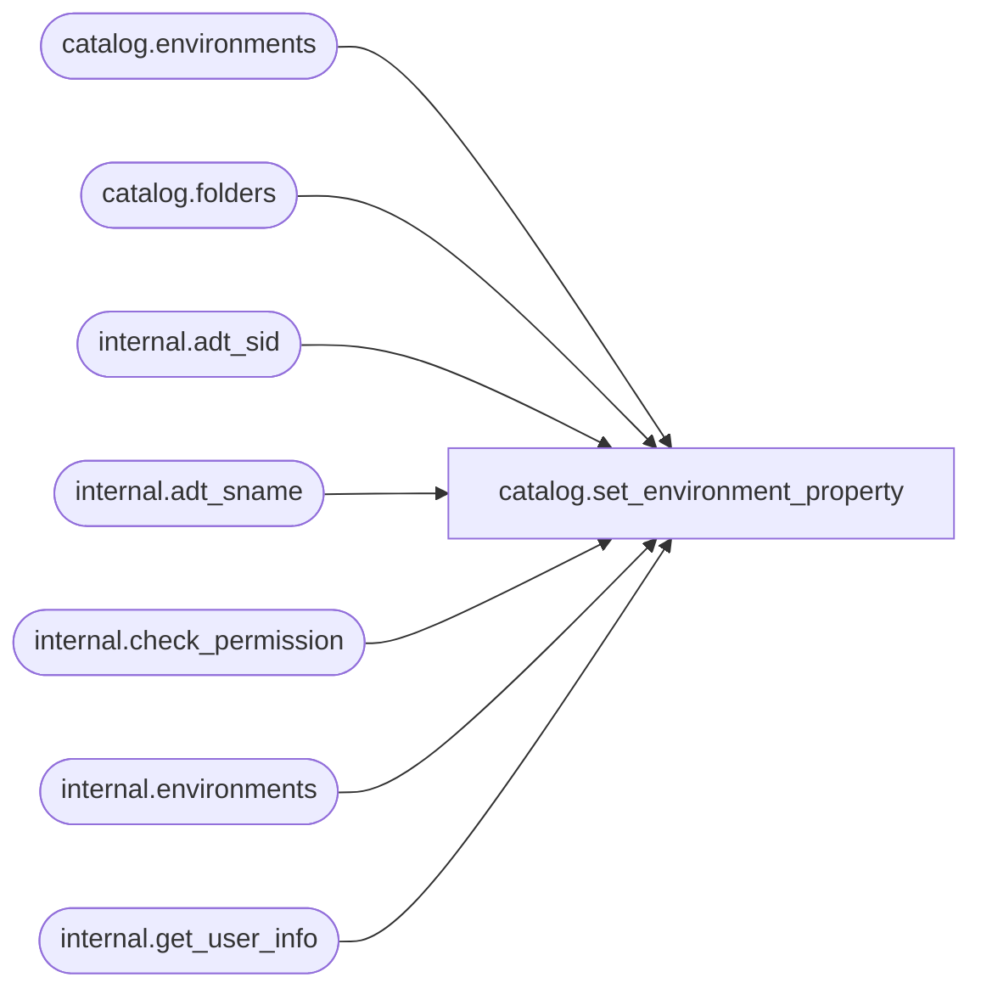

# catalog.set_environment_property

**Database:** SSISDB  
**Server:** STL-SSIS-P-01  

## Architecture Diagram



## Table Dependencies

| Referenced Table |
|---|
| catalog.environments |
| catalog.folders |
| internal.adt_sid |
| internal.adt_sname |
| internal.check_permission |
| internal.environments |
| internal.get_user_info |

## Stored Procedure Code

```sql
CREATE PROCEDURE [catalog].[set_environment_property]
        @folder_name        nvarchar(128),        
        @environment_name   nvarchar(128),        
        @property_name      nvarchar(128),        
        @property_value     nvarchar(1024)        
AS
    SET NOCOUNT ON 
    
    DECLARE @result bit
    
    
    DECLARE @caller_id     int
    DECLARE @caller_name   [internal].[adt_sname]
    DECLARE @caller_sid    [internal].[adt_sid]
    DECLARE @suser_name    [internal].[adt_sname]
    DECLARE @suser_sid     [internal].[adt_sid]
    
    EXECUTE AS CALLER
        EXEC [internal].[get_user_info]
            @caller_name OUTPUT,
            @caller_sid OUTPUT,
            @suser_name OUTPUT,
            @suser_sid OUTPUT,
            @caller_id OUTPUT;
          
          
        IF(
            EXISTS(SELECT [name]
                    FROM sys.server_principals
                    WHERE [sid] = @suser_sid AND [type] = 'S')  
            OR
            EXISTS(SELECT [name]
                    FROM sys.database_principals
                    WHERE ([sid] = @caller_sid AND [type] = 'S')) 
            )
        BEGIN
            RAISERROR(27123, 16, 7) WITH NOWAIT
            RETURN 1
        END
    REVERT
    
    IF(
            EXISTS(SELECT [name]
                    FROM sys.server_principals
                    WHERE [sid] = @suser_sid AND [type] = 'S')  
            OR
            EXISTS(SELECT [name]
                    FROM sys.database_principals
                    WHERE ([sid] = @caller_sid AND [type] = 'S')) 
            )
    BEGIN
            RAISERROR(27123, 16, 7) WITH NOWAIT
            RETURN 1
    END    
    
    IF (@folder_name IS NULL OR @environment_name IS NULL OR @property_name IS NULL)
    BEGIN
        RAISERROR(27138, 16 , 6) WITH NOWAIT 
        RETURN 1     
    END    
    
    SET TRANSACTION ISOLATION LEVEL SERIALIZABLE
    
    
    
    DECLARE @tran_count INT = @@TRANCOUNT;
    DECLARE @savepoint_name NCHAR(32);
    IF @tran_count > 0
    BEGIN
        SET @savepoint_name = REPLACE(CONVERT(NCHAR(36), NEWID()), N'-', N'');
        SAVE TRANSACTION @savepoint_name;
    END
    ELSE
        BEGIN TRANSACTION;                                                                                        
    
    BEGIN TRY 
        
    DECLARE @environment_id bigint;
    EXECUTE AS CALLER
        SET @environment_id = (SELECT env.[environment_id]
                                FROM [catalog].[environments] env INNER JOIN [catalog].[folders] fld
                                ON env.[folder_id] = fld.[folder_id]
                                AND env.[name] = @environment_name
                                AND fld.name = @folder_name);
    REVERT
    IF @environment_id IS NULL
    BEGIN
        RAISERROR(27182 , 16 , 1, @environment_name) WITH NOWAIT
    END
    EXECUTE AS CALLER
        SET @result = [internal].[check_permission]
        (
            3,
            @environment_id,
            2
         )
   REVERT
   IF @result = 0
   BEGIN
       RAISERROR(27182 , 16 , 1, @environment_name) WITH NOWAIT
   END     
        
        IF (@property_name = 'DESCRIPTION')
        BEGIN
            UPDATE [internal].[environments] 
                SET [description] = @property_value
                WHERE [environment_id] = @environment_id
            IF @@ROWCOUNT <> 1
            BEGIN
                RAISERROR(27112, 16, 1, N'environments') WITH NOWAIT
            END
        END
        ELSE
        BEGIN
            RAISERROR(27101, 16 , 1, 'DESCRIPTION') WITH NOWAIT
        END
        
        IF @tran_count = 0
            COMMIT TRANSACTION;                                                                                 
    END TRY
    BEGIN CATCH
        
        IF @tran_count = 0 
            ROLLBACK TRANSACTION;
        
        ELSE IF XACT_STATE() <> -1
            ROLLBACK TRANSACTION @savepoint_name;                                                                                  
        THROW 
    END CATCH
    RETURN 0

catalog,set_environment_reference_type,CREATE PROCEDURE [catalog].[set_environment_reference_type]
        @reference_id       bigint,                  
        @reference_type char(1),                 
        @environment_folder_name nvarchar(128) = NULL       
AS
    SET NOCOUNT ON
    
    
    DECLARE @caller_id     int
    DECLARE @caller_name   [internal].[adt_sname]
    DECLARE @caller_sid    [internal].[adt_sid]
    DECLARE @suser_name    [internal].[adt_sname]
    DECLARE @suser_sid     [internal].[adt_sid]
    
    EXECUTE AS CALLER
        EXEC [internal].[get_user_info]
            @caller_name OUTPUT,
            @caller_sid OUTPUT,
            @suser_name OUTPUT,
            @suser_sid OUTPUT,
            @caller_id OUTPUT;
          
          
        IF(
            EXISTS(SELECT [name]
                    FROM sys.server_principals
                    WHERE [sid] = @suser_sid AND [type] = 'S')  
            OR
            EXISTS(SELECT [name]
                    FROM sys.database_principals
                    WHERE ([sid] = @caller_sid AND [type] = 'S')) 
            )
        BEGIN
            RAISERROR(27123, 16, 1) WITH NOWAIT
            RETURN 1
        END
    REVERT
    
    IF(
            EXISTS(SELECT [name]
                    FROM sys.server_principals
                    WHERE [sid] = @suser_sid AND [type] = 'S')  
            OR
            EXISTS(SELECT [name]
                    FROM sys.database_principals
                    WHERE ([sid] = @caller_sid AND [type] = 'S')) 
            )
    BEGIN
            RAISERROR(27123, 16, 1) WITH NOWAIT
            RETURN 1
    END
    
    DECLARE @project_id bigint
    DECLARE @environment_name nvarchar(128)
    DECLARE @environment_id bigint
    DECLARE @result bit
    
    IF (@reference_id IS NULL)
    BEGIN
        RAISERROR(27138, 16 , 6) WITH NOWAIT 
        RETURN 1 
    END
    
    IF ( @reference_type NOT IN ('R','A'))
    BEGIN
        RAISERROR(27101, 16 , 10, N'reference_type') WITH NOWAIT
        RETURN 1 
    END
    
     
    IF (@reference_type = 'A' AND @environment_folder_name IS NULL)
    BEGIN
        RAISERROR(27101, 16 , 10, N'environment_folder_name') WITH NOWAIT
        RETURN 1 
    END      
	
	
    IF (@reference_type = 'R' AND @environment_folder_name IS NOT NULL)
    BEGIN
        RAISERROR(27101, 16 , 10, N'environment_folder_name') WITH NOWAIT
        RETURN 1 
    END 
    
    
    SET TRANSACTION ISOLATION LEVEL SERIALIZABLE
    
    
    
    DECLARE @tran_count INT = @@TRANCOUNT;
    DECLARE @savepoint_name NCHAR(32);
    IF @tran_count > 0
    BEGIN
        SET @savepoint_name = REPLACE(CONVERT(NCHAR(36), NEWID()), N'-', N'');
        SAVE TRANSACTION @savepoint_name;
    END
    ELSE
        BEGIN TRANSACTION;                                                                                      
    BEGIN TRY    
        
        
        SELECT @project_id= [project_id], @environment_name = [environment_name]
            FROM [catalog].[environment_references] 
            WHERE [reference_id] = @reference_id
        
        IF (@project_id IS NULL)
        BEGIN
            RAISERROR(27111 , 16 , 1, @reference_id) WITH NOWAIT  
        END
        
        SET @result = [internal].[check_permission]
        (
            2,
            @project_id,
            2
         ) 
        
        IF @result = 0
        BEGIN
            RAISERROR(27109 , 16 , 1, '') WITH NOWAIT
        END

        IF (@reference_type = 'A')
        BEGIN
            SET @environment_id = (SELECT envs.[environment_id] 
                FROM [catalog].[environments] envs INNER JOIN [catalog].[folders] fds 
                ON envs.folder_id = fds.folder_id 
                WHERE envs.[name] = @environment_name AND fds.[name] = @environment_folder_name)
            
            IF (@environment_id IS NULL)
            BEGIN
                RAISERROR(27182 , 16 , 1, @environment_name) WITH NOWAIT  
            END           
            
            
            SET @result = [internal].[check_permission]
            (
                3,
                @environment_id,
                1
             ) 
            IF @result= 0
            BEGIN
                RAISERROR(27182 , 16 , 1, @environment_name) WITH NOWAIT    
            END
            
            IF EXISTS (SELECT @reference_id FROM [internal].[environment_references]
				WHERE [reference_type] = 'A' AND [project_id] = @project_id
				AND [environment_folder_name] = @environment_folder_name
				AND [environment_name] = @environment_name)
			BEGIN
				RAISERROR(27204 , 16 , 1) WITH NOWAIT
			END
            
            UPDATE [internal].[environment_references] 
                SET [reference_type] = 'A', [environment_folder_name] = @environment_folder_name
                WHERE [reference_id] = @reference_id
            IF @@ROWCOUNT <> 1
            BEGIN
                RAISERROR(27112, 16, 1, N'environment_references') WITH NOWAIT
            END                           
        END
        
        ELSE IF (@reference_type = 'R')
        BEGIN
            SET @environment_id = (SELECT [environment_id] FROM [catalog].[environments]
                WHERE [name] = @environment_name AND [folder_id] = 
                (SELECT fds.[folder_id] FROM [catalog].[projects] projs INNER JOIN [catalog].[folders] fds 
                    ON projs.[folder_id] = fds.[folder_id]
                    WHERE projs.[project_id] = @project_id))
            
            IF (@environment_id IS NULL)
            BEGIN
                RAISERROR(27182 , 16 , 1, @environment_name) WITH NOWAIT  
            END           
            
            
            SET @result = [internal].[check_permission]
            (
                3,
                @environment_id,
                1
             ) 
            IF @result= 0
            BEGIN
                RAISERROR(27182 , 16 , 1, @environment_name) WITH NOWAIT    
            END
            
            IF EXISTS (SELECT @reference_id FROM [internal].[environment_references]
                WHERE [reference_type] = 'R' AND [project_id] = @project_id
                AND [environment_name] = @environment_name)
            BEGIN
                RAISERROR(27204 , 16 , 1) WITH NOWAIT
            END            
            
            UPDATE [internal].[environment_references] 
                SET [reference_type] = 'R', [environment_folder_name] = null
                WHERE [reference_id] = @reference_id
            IF @@ROWCOUNT <> 1
            BEGIN
                RAISERROR(27112, 16, 1, N'environment_references') WITH NOWAIT
            END             
        END
        
        
        
        IF @tran_count = 0
            COMMIT TRANSACTION;                                                                                 
    END TRY
    BEGIN CATCH
        
        IF @tran_count = 0 
            ROLLBACK TRANSACTION;
        
        ELSE IF XACT_STATE() <> -1
            ROLLBACK TRANSACTION @savepoint_name;                                                                                  
        THROW 
    END CATCH   
    
    RETURN 0
```

