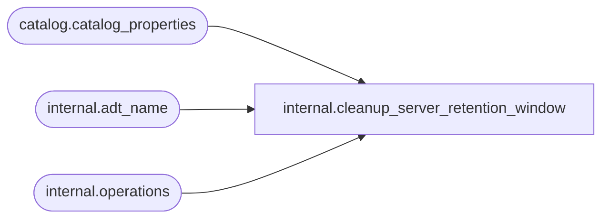

# internal.cleanup_server_retention_window

**Database:** SSISDB  
**Server:** STL-SSIS-P-01  

## Architecture Diagram



## Table Dependencies

| Referenced Table |
|---|
| catalog.catalog_properties |
| internal.adt_name |
| internal.operations |

## Stored Procedure Code

```sql
CREATE PROCEDURE [internal].[cleanup_server_retention_window]
WITH EXECUTE AS 'AllSchemaOwner'
AS
    SET NOCOUNT ON
    
    DECLARE @enable_clean_operation bit
    DECLARE @retention_window_length int
    DECLARE @server_operation_encryption_level int
    
    DECLARE @caller_name nvarchar(256)
    DECLARE @caller_sid  varbinary(85)
    DECLARE @operation_id bigint
    
    EXECUTE AS CALLER
        SET @caller_name =  SUSER_NAME()
        SET @caller_sid =   SUSER_SID()
    REVERT
         
    
    BEGIN TRY
        SELECT @enable_clean_operation = CONVERT(bit, property_value) 
            FROM [catalog].[catalog_properties]
            WHERE property_name = 'OPERATION_CLEANUP_ENABLED'
        
        IF @enable_clean_operation = 1
        BEGIN
            SELECT @retention_window_length = CONVERT(int,property_value)  
                FROM [catalog].[catalog_properties]
                WHERE property_name = 'RETENTION_WINDOW'
                

            IF @retention_window_length <= 0 
            BEGIN
                RAISERROR(27163    ,16,1,'RETENTION_WINDOW')
            END
            
            SELECT @server_operation_encryption_level = CONVERT(int,property_value)  
                FROM [catalog].[catalog_properties]
                WHERE property_name = 'SERVER_OPERATION_ENCRYPTION_LEVEL'

            IF @server_operation_encryption_level NOT in (1, 2)       
            BEGIN
                RAISERROR(27163    ,16,1,'SERVER_OPERATION_ENCRYPTION_LEVEL')
            END
            INSERT INTO [internal].[operations] (
                [operation_type],  
                [created_time], 
                [object_type],
                [object_id],
                [object_name],
                [status], 
                [start_time],
                [caller_sid], 
                [caller_name]
                )
            VALUES (
                2,
                SYSDATETIMEOFFSET(),
                NULL,                     
                NULL,                     
                NULL,                     
                1,      
                SYSDATETIMEOFFSET(),
                @caller_sid,            
                @caller_name            
                ) 
            SET @operation_id = SCOPE_IDENTITY() 
            
            DECLARE @temp_date datetimeoffset
            DECLARE @rows_affected bigint
            DECLARE @delete_batch_size int

            
            SET @delete_batch_size = 1000  
            SET @rows_affected = @delete_batch_size
            
            SET @temp_date = DATEADD(day, -@retention_window_length, SYSDATETIMEOFFSET())
            
            IF @server_operation_encryption_level = 1
            BEGIN
                CREATE TABLE #deleted_ops (operation_id bigint, operation_type smallint)

                DECLARE execution_cursor CURSOR LOCAL FOR 
                    SELECT operation_id FROM #deleted_ops 
                    WHERE operation_type = 200

                DECLARE @execution_id bigint
                DECLARE @sqlString              nvarchar(1024)
                DECLARE @sqlString_cert         nvarchar(1024)
                DECLARE @key_name               [internal].[adt_name]
                DECLARE @certificate_name       [internal].[adt_name]

            WHILE (@rows_affected = @delete_batch_size)
            BEGIN
                DELETE TOP (@delete_batch_size)
                    FROM [internal].[operations] 
                        OUTPUT DELETED.operation_id, DELETED.operation_type INTO #deleted_ops
                    WHERE ( [end_time] <= @temp_date
                    
                    OR ([end_time] IS NULL AND [status] = 1 AND [created_time] <= @temp_date ))
                    
                SET @rows_affected = @@ROWCOUNT
            
            OPEN execution_cursor
            FETCH NEXT FROM execution_cursor INTO @execution_id
            
            WHILE @@FETCH_STATUS = 0
            BEGIN
                SET @key_name = 'MS_Enckey_Exec_'+CONVERT(varchar,@execution_id)
                SET @certificate_name = 'MS_Cert_Exec_'+CONVERT(varchar,@execution_id)
                        SET @sqlString = 'DROP SYMMETRIC KEY '+ @key_name
                        SET @sqlString_cert = 'DROP CERTIFICATE '+ @certificate_name

                        BEGIN TRY
                    EXECUTE sp_executesql @sqlString
                            EXECUTE sp_executesql @sqlString_cert
                        END TRY

                        BEGIN CATCH
                            
                        END CATCH

                FETCH NEXT FROM execution_cursor INTO @execution_id
            END
            CLOSE execution_cursor
                    TRUNCATE TABLE #deleted_ops
                END
                DROP TABLE #deleted_ops

            DEALLOCATE execution_cursor
            END
            ELSE BEGIN
                WHILE (@rows_affected = @delete_batch_size)
                BEGIN
                    DELETE TOP (@delete_batch_size)
                        FROM [internal].[operations] 
                        WHERE ( [end_time] <= @temp_date
                        OR ([end_time] IS NULL AND [status] = 1 AND [created_time] <= @temp_date ))
                    SET @rows_affected = @@ROWCOUNT
                END
            END
            
            UPDATE [internal].[operations]
                SET [status] = 7,
                [end_time] = SYSDATETIMEOFFSET()
                WHERE [operation_id] = @operation_id                                  
        END
    END TRY
    BEGIN CATCH
        
        
        IF @server_operation_encryption_level = 1
        BEGIN
        IF (CURSOR_STATUS('local', 'execution_cursor') = 1 
            OR CURSOR_STATUS('local', 'execution_cursor') = 0)
        BEGIN
            CLOSE execution_cursor
            DEALLOCATE execution_cursor            
        END
        END
        
        UPDATE [internal].[operations]
            SET [status] = 4,
            [end_time] = SYSDATETIMEOFFSET()
            WHERE [operation_id] = @operation_id;       
        THROW
    END CATCH
    
    RETURN 0

internal,configure_environment_encryption_algorithm,CREATE PROCEDURE [internal].[configure_environment_encryption_algorithm]
        @algorithm_name     nvarchar(255),
        @operation_id       bigint
WITH EXECUTE AS 'AllSchemaOwner'
AS
    SET NOCOUNT ON
    IF (@algorithm_name IS NULL)
    BEGIN
        RAISERROR(27100, 16, 2, N'algorithm_name') WITH NOWAIT
        RETURN 1;
    END
    
    DECLARE @environment_id bigint
    DECLARE @decrypt_values [internal].[decrypted_data_table]
    
    DECLARE @key_name               [internal].[adt_name]
    DECLARE @certificate_name       [internal].[adt_name]
    DECLARE @sqlString              nvarchar(1024)
    
    
    SET TRANSACTION ISOLATION LEVEL SERIALIZABLE
    
    
    
    DECLARE @tran_count INT = @@TRANCOUNT;
    DECLARE @savepoint_name NCHAR(32);
    IF @tran_count > 0
    BEGIN
        SET @savepoint_name = REPLACE(CONVERT(NCHAR(36), NEWID()), N'-', N'');
        SAVE TRANSACTION @savepoint_name;
    END
    ELSE
        BEGIN TRANSACTION;                                                                                      
    
    BEGIN TRY

        
        IF EXISTS (SELECT operation_id FROM [internal].[operations]
                WHERE [status] IN (2, 5)
                AND   [operation_id] <> @operation_id )
        BEGIN    
            RAISERROR(27139, 16, 1) WITH NOWAIT
            RETURN 1
        END
        
        
        DECLARE environment_cursor CURSOR LOCAL
            FOR SELECT [environment_id] FROM [internal].[environments]
        OPEN environment_cursor
        
        FETCH NEXT FROM environment_cursor
            INTO @environment_id
        
        
        WHILE (@@FETCH_STATUS = 0)
        BEGIN
            
            DELETE @decrypt_values
            
            
            SET @key_name = 'MS_Enckey_Env_'+CONVERT(varchar(1024),@environment_id)
            SET @certificate_name = 'MS_Cert_Env_'+CONVERT(varchar(1024),@environment_id)
            
            SELECT @sqlString = 'OPEN SYMMETRIC KEY ' + @key_name + ' DECRYPTION BY CERTIFICATE '+ @certificate_name
            EXECUTE sp_executesql @sqlString
    
            
            INSERT @decrypt_values 
            SELECT [variable_id], DECRYPTBYKEY(sensitive_value)            
               FROM [internal].[environment_variables] 
               WHERE [environment_id] = @environment_id
               AND [sensitive] = 1
    
            
            SELECT @sqlString = 'CLOSE SYMMETRIC KEY '+ @key_name
            EXECUTE sp_executesql @sqlString
        
            
            SELECT @sqlString = 'DROP SYMMETRIC KEY ' + @key_name
            EXECUTE sp_executesql @sqlString
            SELECT @sqlString = 'CREATE SYMMETRIC KEY '+ @key_name + ' WITH ALGORITHM = ' 
                + @algorithm_name + ' ENCRYPTION BY CERTIFICATE ' + @certificate_name
            EXECUTE sp_executesql @sqlString
            
            
            SELECT @sqlString = 'OPEN SYMMETRIC KEY ' + @key_name + ' DECRYPTION BY CERTIFICATE '+ @certificate_name
            EXECUTE sp_executesql @sqlString
            
            
            UPDATE [internal].[environment_variables] 
                SET sensitive_value =  EncryptByKey(KEY_GUID(@key_name),src.value)
                FROM @decrypt_values src
                WHERE variable_id = src.id
            
            
            SELECT @sqlString = 'CLOSE SYMMETRIC KEY '+ @key_name
            EXECUTE sp_executesql @sqlString
            
            
            FETCH NEXT FROM environment_cursor
                INTO @environment_id            
        END
        CLOSE environment_cursor
        DEALLOCATE environment_cursor
        
        
        IF @tran_count = 0
            COMMIT TRANSACTION;                                                                                 
    END TRY
    BEGIN CATCH
        
        IF @tran_count = 0 
            ROLLBACK TRANSACTION;
        
        ELSE IF XACT_STATE() <> -1
            ROLLBACK TRANSACTION @savepoint_name;                                                                           
        
        
        IF (CURSOR_STATUS('local', 'environment_cursor') = 1 
            OR CURSOR_STATUS('local', 'environment_cursor') = 0)
        BEGIN
            CLOSE environment_cursor
            DEALLOCATE environment_cursor            
        END
        
        
        IF (@key_name <> '')
        BEGIN
            SET @sqlString = 'IF EXISTS (SELECT key_name FROM sys.openkeys WHERE key_name = ''' + @key_name +''') ' 
                  + 'CLOSE SYMMETRIC KEY '+ @key_name
            EXECUTE sp_executesql @sqlString
        END;
        THROW;
    END CATCH
    RETURN 0
```

