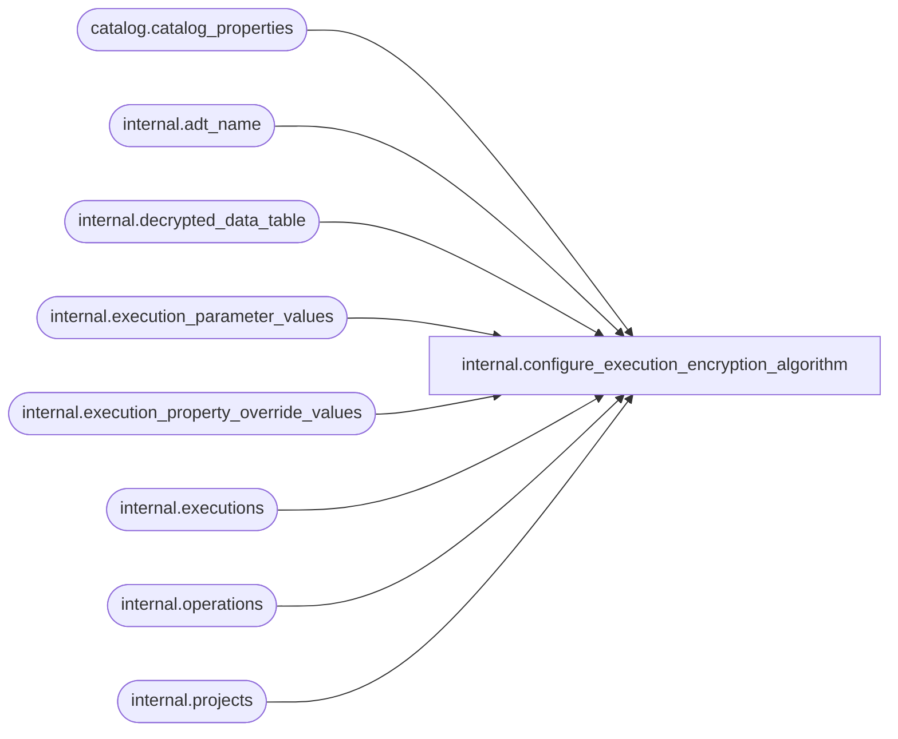

# internal.configure_execution_encryption_algorithm

**Database:** SSISDB  
**Server:** STL-SSIS-P-01  

## Architecture Diagram



## Table Dependencies

| Referenced Table |
|---|
| catalog.catalog_properties |
| internal.adt_name |
| internal.decrypted_data_table |
| internal.execution_parameter_values |
| internal.execution_property_override_values |
| internal.executions |
| internal.operations |
| internal.projects |

## Stored Procedure Code

```sql
CREATE PROCEDURE [internal].[configure_execution_encryption_algorithm]
        @algorithm_name     nvarchar(255),
        @operation_id       bigint
WITH EXECUTE AS 'AllSchemaOwner'
AS
    SET NOCOUNT ON
    IF (@algorithm_name IS NULL)
    BEGIN
        RAISERROR(27100, 16, 2, N'algorithm_name') WITH NOWAIT
        RETURN 1;
    END
    
    DECLARE @execution_id bigint
    DECLARE @decrypt_values [internal].[decrypted_data_table]
    DECLARE @decrypt_property_override_values [internal].[decrypted_data_table]
    
    DECLARE @key_name               [internal].[adt_name]
    DECLARE @certificate_name       [internal].[adt_name]
    DECLARE @sqlString              nvarchar(1024)
    DECLARE @server_operation_encryption_level       int


    SELECT @server_operation_encryption_level = CONVERT(int,property_value)  
            FROM [catalog].[catalog_properties]
            WHERE property_name = 'SERVER_OPERATION_ENCRYPTION_LEVEL'

    IF @server_operation_encryption_level NOT in (1, 2)     
    BEGIN
        RAISERROR(27163    ,16,1,'SERVER_OPERATION_ENCRYPTION_LEVEL') WITH NOWAIT
        RETURN 1
    END
    
    
    SET TRANSACTION ISOLATION LEVEL SERIALIZABLE
    
    
    
    DECLARE @tran_count INT = @@TRANCOUNT;
    DECLARE @savepoint_name NCHAR(32);
    IF @tran_count > 0
    BEGIN
        SET @savepoint_name = REPLACE(CONVERT(NCHAR(36), NEWID()), N'-', N'');
        SAVE TRANSACTION @savepoint_name;
    END
    ELSE
        BEGIN TRANSACTION;                                                                                      
    IF @server_operation_encryption_level = 1
    BEGIN
    BEGIN TRY
        
        IF EXISTS (SELECT operation_id FROM [internal].[operations]
                WHERE [status] IN (2, 5)
                AND   [operation_id] <> @operation_id )
        BEGIN    
            RAISERROR(27139, 16, 1) WITH NOWAIT
            RETURN 1
        END
        
        
        DECLARE execution_cursor CURSOR LOCAL
            FOR SELECT [execution_id] FROM [internal].[executions]
        OPEN execution_cursor
        
        FETCH NEXT FROM execution_cursor
            INTO @execution_id
        
        
        WHILE (@@FETCH_STATUS = 0)
        BEGIN
            
            DELETE @decrypt_values
            DELETE @decrypt_property_override_values
            
            
            SET @key_name = 'MS_Enckey_Exec_'+CONVERT(varchar(1024),@execution_id)
            SET @certificate_name = 'MS_Cert_Exec_'+CONVERT(varchar(1024),@execution_id)
            
            SELECT @sqlString = 'OPEN SYMMETRIC KEY ' + @key_name + ' DECRYPTION BY CERTIFICATE '+ @certificate_name
            EXECUTE sp_executesql @sqlString
    
            
            INSERT @decrypt_values 
            SELECT [execution_parameter_id], DECRYPTBYKEY(sensitive_parameter_value)            
               FROM [internal].[execution_parameter_values] 
               WHERE [execution_id] = @execution_id
               AND [sensitive] = 1
               AND [value_set] = 1
    
            INSERT @decrypt_property_override_values 
            SELECT [property_id], DECRYPTBYKEY(sensitive_property_value)            
               FROM [internal].[execution_property_override_values] 
               WHERE [execution_id] = @execution_id
               AND [sensitive] = 1

            
            SELECT @sqlString = 'CLOSE SYMMETRIC KEY '+ @key_name
            EXECUTE sp_executesql @sqlString
        
            
            SELECT @sqlString = 'DROP SYMMETRIC KEY ' + @key_name
            EXECUTE sp_executesql @sqlString
            SELECT @sqlString = 'CREATE SYMMETRIC KEY '+ @key_name + ' WITH ALGORITHM = ' 
                + @algorithm_name + ' ENCRYPTION BY CERTIFICATE ' + @certificate_name
            EXECUTE sp_executesql @sqlString
            
            
            SELECT @sqlString = 'OPEN SYMMETRIC KEY ' + @key_name + ' DECRYPTION BY CERTIFICATE '+ @certificate_name
            EXECUTE sp_executesql @sqlString
            
            
            UPDATE [internal].[execution_parameter_values] 
                SET sensitive_parameter_value =  EncryptByKey(KEY_GUID(@key_name),src.value)
                FROM @decrypt_values src
                WHERE execution_parameter_id = src.id
            
            
            UPDATE [internal].[execution_property_override_values] 
                SET sensitive_property_value =  EncryptByKey(KEY_GUID(@key_name),src.value)
                FROM @decrypt_property_override_values src
                WHERE property_id = src.id

            
            SELECT @sqlString = 'CLOSE SYMMETRIC KEY '+ @key_name
            EXECUTE sp_executesql @sqlString
            
            
            FETCH NEXT FROM execution_cursor
                INTO @execution_id            
        END
        CLOSE execution_cursor
        DEALLOCATE execution_cursor
        
        
        IF @tran_count = 0
            COMMIT TRANSACTION;                                                                                 
    END TRY
    BEGIN CATCH
        
        IF @tran_count = 0 
            ROLLBACK TRANSACTION;
        
        ELSE IF XACT_STATE() <> -1
            ROLLBACK TRANSACTION @savepoint_name;                                                                           

        
        IF (CURSOR_STATUS('local', 'execution_cursor') = 1 
            OR CURSOR_STATUS('local', 'execution_cursor') = 0)
        BEGIN
            CLOSE execution_cursor
            DEALLOCATE execution_cursor            
        END
            IF (@key_name <> '')
            BEGIN
                SET @sqlString = 'IF EXISTS (SELECT key_name FROM sys.openkeys WHERE key_name = ''' + @key_name +''') ' 
                  + 'CLOSE SYMMETRIC KEY '+ @key_name
                EXECUTE sp_executesql @sqlString
            END;
            THROW;
        END CATCH
    END
    ELSE 
    BEGIN
        BEGIN TRY
             
            IF EXISTS (SELECT operation_id FROM [internal].[operations]
                WHERE [status] IN (2, 5)
                AND   [operation_id] <> @operation_id )
            BEGIN
                RAISERROR(27139, 16, 1) WITH NOWAIT
                RETURN 1
            END

            
            DECLARE project_cursor CURSOR LOCAL
                FOR SELECT [project_id] FROM [internal].[projects]

            CREATE TABLE #decryped_values_table (execution_parameter_id bigint, execution_id bigint, 
                decrypt_values varbinary(MAX))
                        
            CREATE TABLE #decryped_property_override_values_table(property_id bigint, execution_id bigint, 
                decrypt_property_override_values varbinary(MAX))

            DECLARE @project_id bigint

            OPEN project_cursor
            FETCH NEXT FROM project_cursor
                INTO @project_id

            
            WHILE (@@FETCH_STATUS = 0)
            BEGIN
                
                SET @key_name = 'MS_Enckey_Proj_Param_' + CONVERT(varchar(1024),@project_id)
                SET @certificate_name = 'MS_Cert_Proj_Param_' + CONVERT(varchar(1024),@project_id)

                IF EXISTS (SELECT * from sys.symmetric_keys WHERE name = @key_name)
                BEGIN
                    SELECT @sqlString = 'OPEN SYMMETRIC KEY ' + @key_name + ' DECRYPTION BY CERTIFICATE '+ @certificate_name
                    EXECUTE sp_executesql @sqlString

                    TRUNCATE TABLE #decryped_values_table
                    TRUNCATE TABLE #decryped_property_override_values_table

                    INSERT INTO #decryped_values_table(execution_parameter_id, execution_id, decrypt_values) 
                        SELECT [execution_parameter_id],[execution_id], DECRYPTBYKEY(sensitive_parameter_value)
                        FROM [internal].[execution_parameter_values] inner join [internal].[operations] ON 
                                [execution_parameter_values].[execution_id] = [operations].[operation_id]
                        WHERE [operations].[object_id] = @project_id
                            AND [execution_parameter_values].[sensitive] = 1
                            AND [execution_parameter_values].[value_set] = 1

                    INSERT INTO #decryped_property_override_values_table(property_id, execution_id,decrypt_property_override_values)
                        SELECT [property_id], [execution_id],DECRYPTBYKEY(sensitive_property_value)
                        FROM [internal].[execution_property_override_values] inner join [internal].[operations] ON
                            [execution_property_override_values].[execution_id] = [operations].[operation_id]
                        WHERE [operations].[object_id] = @project_id
                        AND [execution_property_override_values].[sensitive] = 1

                    
                    SELECT @sqlString = 'DROP SYMMETRIC KEY ' + @key_name
                    EXECUTE sp_executesql @sqlString
                    SELECT @sqlString = 'CREATE SYMMETRIC KEY '+ @key_name + ' WITH ALGORITHM = ' 
                        + @algorithm_name + ' ENCRYPTION BY CERTIFICATE ' + @certificate_name
                    EXECUTE sp_executesql @sqlString
               
                    
                    SELECT @sqlString = 'OPEN SYMMETRIC KEY ' + @key_name + ' DECRYPTION BY CERTIFICATE '+ @certificate_name
                    EXECUTE sp_executesql @sqlString

                    
                    UPDATE [internal].[execution_parameter_values] 
                        SET sensitive_parameter_value =  EncryptByKey(KEY_GUID(@key_name),#decryped_values_table.decrypt_values)
                        FROM #decryped_values_table
                        WHERE [execution_parameter_values].[execution_id] = #decryped_values_table.execution_id
                            AND [execution_parameter_values].[execution_parameter_id] = #decryped_values_table.execution_parameter_id

                    
                    UPDATE [internal].[execution_property_override_values] 
                        SET sensitive_property_value =  EncryptByKey(KEY_GUID(@key_name),#decryped_property_override_values_table.decrypt_property_override_values)
                        FROM #decryped_property_override_values_table
                        WHERE [execution_property_override_values].[property_id] = #decryped_property_override_values_table.property_id
                            AND [execution_property_override_values].[execution_id] = #decryped_property_override_values_table.execution_id

                    
                    SELECT @sqlString = 'CLOSE SYMMETRIC KEY '+ @key_name
                    EXECUTE sp_executesql @sqlString
                END
                FETCH NEXT FROM project_cursor
                    INTO @project_id
            END
        
            CLOSE project_cursor

            DEALLOCATE project_cursor
            DROP TABLE #decryped_values_table
            DROP TABLE #decryped_property_override_values_table

            IF @tran_count = 0
                COMMIT TRANSACTION;
        END TRY
        BEGIN CATCH
            
        IF @tran_count = 0 
            ROLLBACK TRANSACTION;
        
        ELSE IF XACT_STATE() <> -1
            ROLLBACK TRANSACTION @savepoint_name;                                                                           

            
            IF (CURSOR_STATUS('local', 'project_cursor') = 1 
                OR CURSOR_STATUS('local', 'project_cursor') = 0)
            BEGIN
                CLOSE project_cursor
                DEALLOCATE project_cursor
            END

        IF (@key_name <> '')
        BEGIN
            SET @sqlString = 'IF EXISTS (SELECT key_name FROM sys.openkeys WHERE key_name = ''' + @key_name +''') ' 
                  + 'CLOSE SYMMETRIC KEY '+ @key_name
            EXECUTE sp_executesql @sqlString
        END;
        THROW;
    END CATCH
    END
    RETURN 0

internal,configure_project_encryption_algorithm,CREATE PROCEDURE [internal].[configure_project_encryption_algorithm]
        @algorithm_name     nvarchar(255),
        @old_algorithm_name  nvarchar(255),
        @operation_id       bigint
WITH EXECUTE AS 'AllSchemaOwner'
AS
    SET NOCOUNT ON
    IF (@algorithm_name IS NULL)
    BEGIN
        RAISERROR(27100, 16, 2, N'algorithm_name') WITH NOWAIT
        RETURN 1;
    END
    
    DECLARE @project_id bigint
    DECLARE @decrypt_parameter_values [internal].[decrypted_data_table]
    DECLARE @decrypt_project_values [internal].[decrypted_data_table]
    
    DECLARE @key_name               [internal].[adt_name]
    DECLARE @certificate_name       [internal].[adt_name]
    DECLARE @sqlString              nvarchar(1024)
    DECLARE @KEY                    varbinary(8000)
    DECLARE @IV                     varbinary(8000)
    
    
    SET TRANSACTION ISOLATION LEVEL SERIALIZABLE
    
    
    
    DECLARE @tran_count INT = @@TRANCOUNT;
    DECLARE @savepoint_name NCHAR(32);
    IF @tran_count > 0
    BEGIN
        SET @savepoint_name = REPLACE(CONVERT(NCHAR(36), NEWID()), N'-', N'');
        SAVE TRANSACTION @savepoint_name;
    END
    ELSE
        BEGIN TRANSACTION;                                                                                      
    
    BEGIN TRY

        
        IF EXISTS (SELECT operation_id FROM [internal].[operations]
                WHERE [status] IN (2, 5)
                AND   [operation_id] <> @operation_id )
        BEGIN    
            RAISERROR(27139, 16, 1) WITH NOWAIT
        END
        
        
        DECLARE project_cursor CURSOR LOCAL
            FOR SELECT [project_id] FROM [internal].[projects]
        OPEN project_cursor
        
        FETCH NEXT FROM project_cursor
            INTO @project_id
        
        
        WHILE (@@FETCH_STATUS = 0)
        BEGIN
            
            DELETE @decrypt_project_values
            DELETE @decrypt_parameter_values
            
            
            SET @key_name = 'MS_Enckey_Proj_'+CONVERT(varchar(1024),@project_id)
            SET @certificate_name = 'MS_Cert_Proj_'+CONVERT(varchar(1024),@project_id)
            
            SELECT @sqlString = 'OPEN SYMMETRIC KEY ' + @key_name + ' DECRYPTION BY CERTIFICATE '+ @certificate_name
            EXECUTE sp_executesql @sqlString
            
            SELECT @KEY = DECRYPTBYKEY([key]), @IV = DECRYPTBYKEY([IV]) 
                FROM [internal].[catalog_encryption_keys]
                WHERE [key_name] = @key_name
            IF (@KEY IS NULL OR @IV IS NULL)
            BEGIN
                RAISERROR(27117, 16 ,1) WITH NOWAIT
            END
            
            INSERT @decrypt_project_values 
            SELECT [object_version_lsn], [internal].[decrypt_lob_data](@old_algorithm_name, @KEY, @IV,object_data)            
               FROM [internal].[object_versions] 
               WHERE [object_id] = @project_id 
               AND [object_type] = 20
               
            
            INSERT @decrypt_parameter_values
            SELECT [parameter_id], DECRYPTBYKEY(sensitive_default_value)           
               FROM [internal].[object_parameters] 
               WHERE [project_id] = @project_id 
               AND [value_type] = 'V' 
               AND [value_set] = 1
    
            
            SELECT @sqlString = 'CLOSE SYMMETRIC KEY '+ @key_name
            EXECUTE sp_executesql @sqlString
        
            
            SELECT @sqlString = 'DROP SYMMETRIC KEY ' + @key_name
            EXECUTE sp_executesql @sqlString
            SELECT @sqlString = 'CREATE SYMMETRIC KEY '+ @key_name + ' WITH ALGORITHM = ' 
                + @algorithm_name + ' ENCRYPTION BY CERTIFICATE ' + @certificate_name
            EXECUTE sp_executesql @sqlString
            
            
            SELECT @sqlString = 'OPEN SYMMETRIC KEY ' + @key_name + ' DECRYPTION BY CERTIFICATE '+ @certificate_name
            EXECUTE sp_executesql @sqlString
            
            
            EXEC internal.[create_key_information] @algorithm_name, @KEY output, @IV output
            
            UPDATE [internal].[catalog_encryption_keys]
                SET [key] = ENCRYPTBYKEY( KEY_GUID(@key_name), @KEY), 
                    [IV] = ENCRYPTBYKEY( KEY_GUID(@key_name), @IV )
                WHERE key_name = @key_name
            
            
            UPDATE [internal].[object_parameters] 
                SET sensitive_default_value =  EncryptByKey(KEY_GUID(@key_name),src.value)
                FROM @decrypt_parameter_values src
                WHERE parameter_id = src.id
                
            
            UPDATE [internal].[object_versions] 
                SET object_data =  [internal].[encrypt_lob_data](@algorithm_name,@KEY, @IV, src.value)
                FROM @decrypt_project_values src
                WHERE [object_version_lsn] = src.id
            
            
            SELECT @sqlString = 'CLOSE SYMMETRIC KEY '+ @key_name
            EXECUTE sp_executesql @sqlString
            
            
            FETCH NEXT FROM project_cursor
                INTO @project_id            
        END
        CLOSE project_cursor
        DEALLOCATE project_cursor
        
        
        IF @tran_count = 0
            COMMIT TRANSACTION;                                                                                 
    END TRY
    BEGIN CATCH
        
        IF @tran_count = 0 
            ROLLBACK TRANSACTION;
        
        ELSE IF XACT_STATE() <> -1
            ROLLBACK TRANSACTION @savepoint_name;                                                                           
        
        IF (CURSOR_STATUS('local', 'project_cursor') = 1 
            OR CURSOR_STATUS('local', 'project_cursor') = 0)
        BEGIN
            CLOSE project_cursor
            DEALLOCATE project_cursor            
        END
        
        IF (@key_name <> '')
        BEGIN
            SET @sqlString = 'IF EXISTS (SELECT key_name FROM sys.openkeys WHERE key_name = ''' + @key_name +''') ' 
                  + 'CLOSE SYMMETRIC KEY '+ @key_name
            EXECUTE sp_executesql @sqlString
        END;
        THROW;
    END CATCH
    RETURN 0

internal,create_deploy_operation,CREATE PROCEDURE [internal].[create_deploy_operation]
    @folder_name nvarchar(128),
    @project_name nvarchar(128),
    @operation_id bigint output
AS 
    SET NOCOUNT ON
   
    
    DECLARE @caller_id     int
    DECLARE @caller_name   [internal].[adt_sname]
    DECLARE @caller_sid    [internal].[adt_sid]
    DECLARE @suser_name    [internal].[adt_sname]
    DECLARE @suser_sid     [internal].[adt_sid]
    
    EXECUTE AS CALLER
        EXEC [internal].[get_user_info]
            @caller_name OUTPUT,
            @caller_sid OUTPUT,
            @suser_name OUTPUT,
            @suser_sid OUTPUT,
            @caller_id OUTPUT;
          
          
        IF(
            EXISTS(SELECT [name]
                    FROM sys.server_principals
                    WHERE [sid] = @suser_sid AND [type] = 'S')  
            OR
            EXISTS(SELECT [name]
                    FROM sys.database_principals
                    WHERE ([sid] = @caller_sid AND [type] = 'S')) 
            )
        BEGIN
            RAISERROR(27123, 16, 1) WITH NOWAIT
            RETURN 1
        END
    REVERT
    
    IF(
            EXISTS(SELECT [name]
                    FROM sys.server_principals
                    WHERE [sid] = @suser_sid AND [type] = 'S')  
            OR
            EXISTS(SELECT [name]
                    FROM sys.database_principals
                    WHERE ([sid] = @caller_sid AND [type] = 'S')) 
            )
    BEGIN
            RAISERROR(27123, 16, 1) WITH NOWAIT
            RETURN 1
    END  
    
    DECLARE @folder_id bigint
    DECLARE @start_time     DATETIMEOFFSET
    DECLARE @return_value   int 
     
    
    SET TRANSACTION ISOLATION LEVEL SERIALIZABLE
    
    
    
    DECLARE @tran_count INT = @@TRANCOUNT;
    DECLARE @savepoint_name NCHAR(32);
    IF @tran_count > 0
    BEGIN
        SET @savepoint_name = REPLACE(CONVERT(NCHAR(36), NEWID()), N'-', N'');
        SAVE TRANSACTION @savepoint_name;
    END
    ELSE
        BEGIN TRANSACTION;                                                                                        
    
        BEGIN TRY       
            EXECUTE AS CALLER
               SET @folder_id = 
                    (SELECT [folder_id] FROM [catalog].[folders] WHERE [name] = @folder_name)
            REVERT
                
            IF @folder_id IS NULL
            BEGIN
                RAISERROR(27104 , 16 , 1, @folder_name) WITH NOWAIT
            END 
            
            SET @start_time = SYSDATETIMEOFFSET() 
            

            EXEC @return_value = [internal].[insert_operation] 
                                101, 
                                @start_time,    
                                20,             
                                NULL,             
                                @project_name,
                                5,                                  
                                @start_time,    
                                null,           
                                @caller_sid,    
                                @caller_name,   
                                null,           
                                null,           
                                null,           
                                @operation_id OUTPUT  
        
        IF @return_value <> 0
        BEGIN
            RAISERROR(27169,16,1) WITH NOWAIT
        END
        
        
        EXEC @return_value = [internal].[init_object_permissions] 
                4, @operation_id, @caller_id 
        IF @return_value <> 0
        BEGIN
            
            RAISERROR(27153,16,1) WITH NOWAIT
        END
     
    
        IF @tran_count = 0
            COMMIT TRANSACTION;                                                                                 
    END TRY
    BEGIN CATCH
        
        IF @tran_count = 0 
            ROLLBACK TRANSACTION;
        
        ELSE IF XACT_STATE() <> -1
            ROLLBACK TRANSACTION @savepoint_name;                                                                                  
        THROW 
    END CATCH
    
    RETURN 0
```

