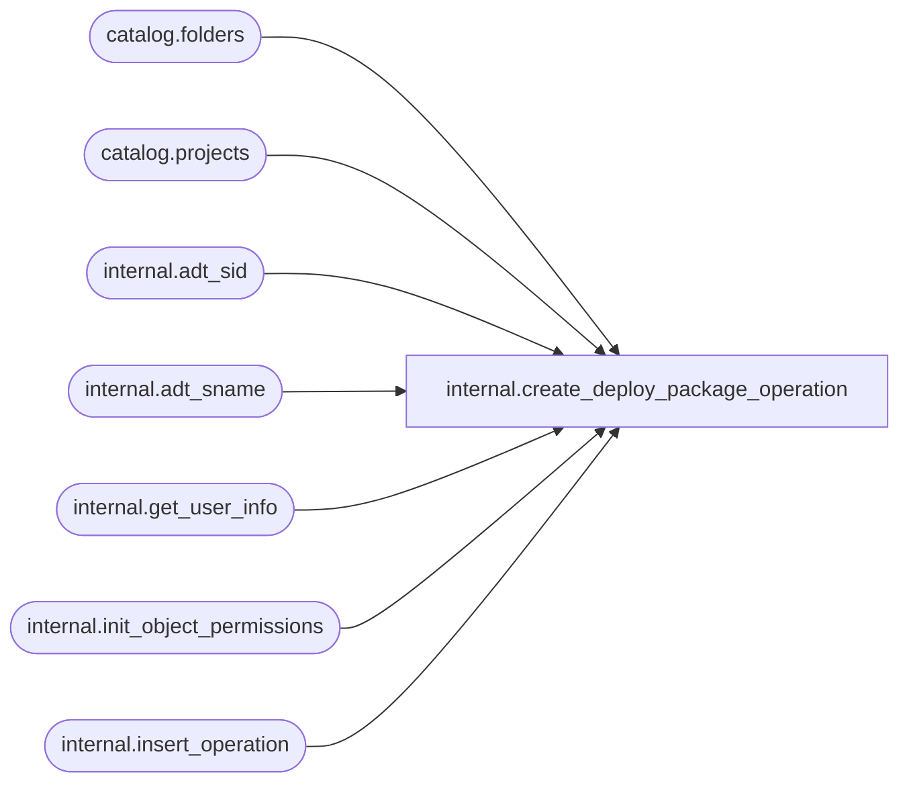

# internal.create_deploy_package_operation

**Database:** SSISDB  
**Server:** STL-SSIS-P-01  

## Architecture Diagram



## Table Dependencies

| Referenced Table |
|---|
| catalog.folders |
| catalog.projects |
| internal.adt_sid |
| internal.adt_sname |
| internal.get_user_info |
| internal.init_object_permissions |
| internal.insert_operation |

## Stored Procedure Code

```sql
CREATE PROCEDURE [internal].[create_deploy_package_operation]
    @folder_name nvarchar(128),
    @project_name nvarchar(128),
    @operation_id bigint output
AS 
    SET NOCOUNT ON
   
    
    DECLARE @caller_id     int
    DECLARE @caller_name   [internal].[adt_sname]
    DECLARE @caller_sid    [internal].[adt_sid]
    DECLARE @suser_name    [internal].[adt_sname]
    DECLARE @suser_sid     [internal].[adt_sid]
    
    EXECUTE AS CALLER
        EXEC [internal].[get_user_info]
            @caller_name OUTPUT,
            @caller_sid OUTPUT,
            @suser_name OUTPUT,
            @suser_sid OUTPUT,
            @caller_id OUTPUT;
          
          
        IF(
            EXISTS(SELECT [name]
                    FROM sys.server_principals
                    WHERE [sid] = @suser_sid AND [type] = 'S')  
            OR
            EXISTS(SELECT [name]
                    FROM sys.database_principals
                    WHERE ([sid] = @caller_sid AND [type] = 'S')) 
            )
        BEGIN
            RAISERROR(27123, 16, 1) WITH NOWAIT
            RETURN 1
        END
    REVERT
    
    IF(
            EXISTS(SELECT [name]
                    FROM sys.server_principals
                    WHERE [sid] = @suser_sid AND [type] = 'S')  
            OR
            EXISTS(SELECT [name]
                    FROM sys.database_principals
                    WHERE ([sid] = @caller_sid AND [type] = 'S')) 
            )
    BEGIN
            RAISERROR(27123, 16, 1) WITH NOWAIT
            RETURN 1
    END  
    
    DECLARE @folder_id      bigint
    DECLARE @project_id     bigint
    DECLARE @start_time     DATETIMEOFFSET
    DECLARE @return_value   int 
     
    
    SET TRANSACTION ISOLATION LEVEL SERIALIZABLE
    
    
    
    DECLARE @tran_count INT = @@TRANCOUNT;
    DECLARE @savepoint_name NCHAR(32);
    IF @tran_count > 0
    BEGIN
        SET @savepoint_name = REPLACE(CONVERT(NCHAR(36), NEWID()), N'-', N'');
        SAVE TRANSACTION @savepoint_name;
    END
    ELSE
        BEGIN TRANSACTION;                                                                                        
    
    BEGIN TRY
        EXECUTE AS CALLER
           SET @folder_id =
                (SELECT [folder_id] FROM [catalog].[folders] WHERE [name] = @folder_name)
        REVERT

        IF @folder_id IS NULL
        BEGIN
            RAISERROR(27104 , 16 , 1, @folder_name) WITH NOWAIT
        END 

        EXECUTE AS CALLER
           SET @project_id = 
                (SELECT [project_id] FROM [catalog].[projects] WHERE [name] = @project_name AND [folder_id] = @folder_id)
        REVERT

        IF @project_id IS NULL
        BEGIN
            RAISERROR(27187 , 16 , 1, @project_name) WITH NOWAIT
        END 

        SET @start_time = SYSDATETIMEOFFSET() 
        

        EXEC @return_value = [internal].[insert_operation] 
                            102, 
                            @start_time,    
                            20,             
                            @project_id,    
                            @project_name,
                            5,                                  
                            @start_time,    
                            null,           
                            @caller_sid,    
                            @caller_name,   
                            null,           
                            null,           
                            null,           
                            @operation_id OUTPUT  
        
        IF @return_value <> 0
        BEGIN
            RAISERROR(27169,16,1) WITH NOWAIT
        END
        
        
        EXEC @return_value = [internal].[init_object_permissions] 
                4, @operation_id, @caller_id 
        IF @return_value <> 0
        BEGIN
            
            RAISERROR(27153,16,1) WITH NOWAIT
        END
     
    
        IF @tran_count = 0
            COMMIT TRANSACTION;                                                                                 
    END TRY
    BEGIN CATCH
        
        IF @tran_count = 0 
            ROLLBACK TRANSACTION;
        
        ELSE IF XACT_STATE() <> -1
            ROLLBACK TRANSACTION @savepoint_name;                                                                                  
        THROW 
    END CATCH
    
    RETURN 0

internal,create_extended_operation_info,CREATE PROCEDURE [internal].[create_extended_operation_info]
        @operation_id       bigint,         
        @object_name        nvarchar(260), 
        @object_type        int,            
        @reference_id       bigint = NULL,         
        @status             int,            
        @info_id            bigint output   
AS
    DECLARE @result bit
    DECLARE @start_time datetimeoffset
    
    IF @operation_id IS NULL OR @object_name IS NULL
        OR @object_type IS NULL OR @status IS NULL
    BEGIN
        RAISERROR(27138, 16 , 4) WITH NOWAIT
        RETURN 1
    END
    
    
    SET TRANSACTION ISOLATION LEVEL SERIALIZABLE
    
    
    
    DECLARE @tran_count INT = @@TRANCOUNT;
    DECLARE @savepoint_name NCHAR(32);
    IF @tran_count > 0
    BEGIN
        SET @savepoint_name = REPLACE(CONVERT(NCHAR(36), NEWID()), N'-', N'');
        SAVE TRANSACTION @savepoint_name;
    END
    ELSE
        BEGIN TRANSACTION;                                                                                      
    BEGIN TRY 
        
        IF NOT EXISTS (SELECT [operation_id] FROM [internal].[operations]
            WHERE [operation_id] = @operation_id 
            AND ([operation_type] = 301 
                OR [operation_type] = 300)
            AND [status] = 2)
        BEGIN
            RAISERROR(27143 , 16 , 1, @operation_id) WITH NOWAIT  
        END
    
        SET @result = [internal].[check_permission]
        (
            4,
            @operation_id,
            2
         ) 
        IF @result= 0
        BEGIN
            RAISERROR(27143 , 16 , 1, @operation_id) WITH NOWAIT    
        END
        
        SET @start_time = SYSDATETIMEOFFSET();
        
        INSERT INTO [internal].[extended_operation_info]
                   ([operation_id],
                    [object_name],
                    [object_type],
                    [reference_id],
                    [status],
                    [start_time],
                    [end_time])
             VALUES
                   (@operation_id,
                   @object_name,
                   @object_type,
                   @reference_id,
                   @status,
                   @start_time,
                   null)
          IF @@ROWCOUNT = 1
          BEGIN
            SET @info_id = scope_identity()
          END
        
        
        IF @tran_count = 0
            COMMIT TRANSACTION;                                                                                 
    END TRY
    BEGIN CATCH
        
        IF @tran_count = 0 
            ROLLBACK TRANSACTION;
        
        ELSE IF XACT_STATE() <> -1
            ROLLBACK TRANSACTION @savepoint_name;                                                                                  
        THROW 
    END CATCH   
    
    RETURN 0
```

