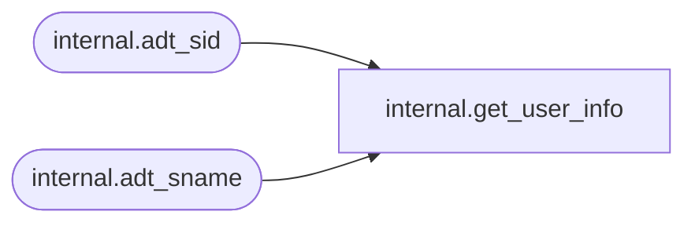

# internal.get_user_info

**Database:** SSISDB  
**Server:** STL-SSIS-P-01  

## Architecture Diagram



## Table Dependencies

| Referenced Table |
|---|
| internal.adt_sid |
| internal.adt_sname |

## Stored Procedure Code

```sql
CREATE PROCEDURE [internal].[get_user_info]
        @caller_name        [internal].[adt_sname] OUTPUT,
        @caller_sid         [internal].[adt_sid] OUTPUT,
        @context_name       [internal].[adt_sname] OUTPUT,
        @context_sid        [internal].[adt_sid] OUTPUT,
        @db_principal_id    int = NULL OUTPUT
AS
SET NOCOUNT ON
BEGIN
    SET @caller_name =  SUSER_NAME();
    SET @caller_sid =   SUSER_SID();
    SET @context_name = SUSER_NAME();
    SET @context_sid =  SUSER_SID();
    SET @db_principal_id = DATABASE_PRINCIPAL_ID();
END
```

