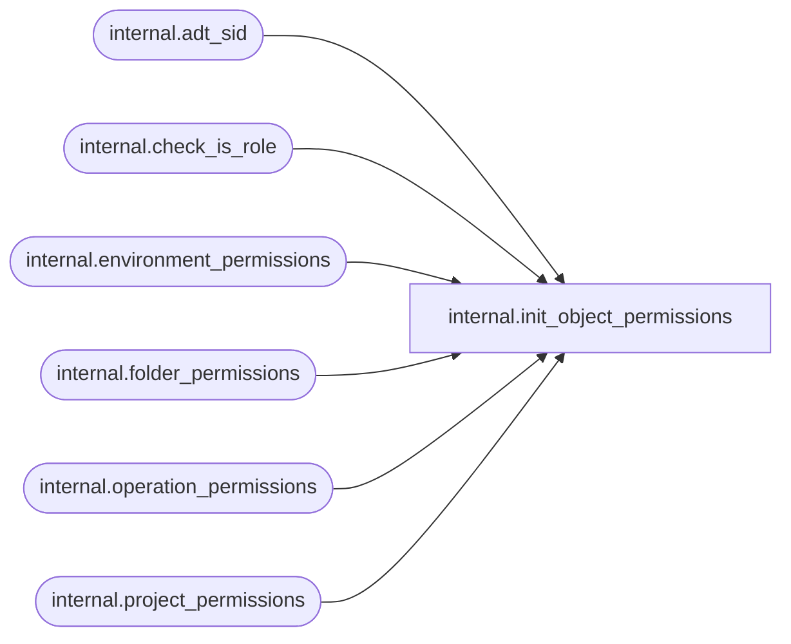

# internal.init_object_permissions

**Database:** SSISDB  
**Server:** STL-SSIS-P-01  

## Architecture Diagram



## Table Dependencies

| Referenced Table |
|---|
| internal.adt_sid |
| internal.check_is_role |
| internal.environment_permissions |
| internal.folder_permissions |
| internal.operation_permissions |
| internal.project_permissions |

## Stored Procedure Code

```sql
CREATE PROCEDURE [internal].[init_object_permissions]
    @object_type SMALLINT,
    @object_id BIGINT,
    @creator_id INTEGER
AS
BEGIN
    DECLARE @ret INTEGER
    DECLARE @is_role BIT
    DECLARE @creator_sid [internal].[adt_sid]
    DECLARE @grantor_sid [internal].[adt_sid]
    SELECT @grantor_sid = USER_SID (DATABASE_PRINCIPAL_ID())
    
    EXEC @ret = [internal].[check_is_role] @creator_id,@is_role OUTPUT
    IF @ret <> 0
    BEGIN
        RAISERROR(27101,16,1,N'principal_id') WITH NOWAIT
        RETURN 1
    END
    
    SELECT @creator_sid = USER_SID(@creator_id)

    IF @object_type = 1
    BEGIN
        INSERT INTO [internal].[folder_permissions]
            ([object_id],[sid],[is_deny],[is_role],[grantor_sid],[permission_type])
        VALUES
            (@object_id, @creator_sid, 0, @is_role, @grantor_sid, 1),
            (@object_id, @creator_sid, 0, @is_role, @grantor_sid, 2),
            (@object_id, @creator_sid, 0, @is_role, @grantor_sid, 4),
            (@object_id, @creator_sid, 0, @is_role, @grantor_sid, 100),
            (@object_id, @creator_sid, 0, @is_role, @grantor_sid, 101),
            (@object_id, @creator_sid, 0, @is_role, @grantor_sid, 102),
            (@object_id, @creator_sid, 0, @is_role, @grantor_sid, 103),
            (@object_id, @creator_sid, 0, @is_role, @grantor_sid, 104);
    END
    ELSE IF @object_type = 2
    BEGIN
        INSERT INTO [internal].[project_permissions]
            ([object_id],[sid],[is_deny],[is_role],[grantor_sid],[permission_type])
        VALUES
            (@object_id, @creator_sid, 0, @is_role, @grantor_sid, 1),
            (@object_id, @creator_sid, 0, @is_role, @grantor_sid, 2),
            (@object_id, @creator_sid, 0, @is_role, @grantor_sid, 3),
            (@object_id, @creator_sid, 0, @is_role, @grantor_sid, 4)
    END
    ELSE IF @object_type = 3
    BEGIN
        INSERT INTO [internal].[environment_permissions]
            ([object_id],[sid],[is_deny],[is_role],[grantor_sid],[permission_type])
        VALUES
            (@object_id, @creator_sid, 0, @is_role, @grantor_sid, 1),
            (@object_id, @creator_sid, 0, @is_role, @grantor_sid, 2),
            (@object_id, @creator_sid, 0, @is_role, @grantor_sid, 4)
    END
    ELSE IF @object_type = 4
    BEGIN
        INSERT INTO [internal].[operation_permissions]
            ([object_id],[sid],[is_deny],[is_role],[grantor_sid],[permission_type])
        VALUES
            (@object_id, @creator_sid, 0, @is_role, @grantor_sid, 1),
            (@object_id, @creator_sid, 0, @is_role, @grantor_sid, 2),
            (@object_id, @creator_sid, 0, @is_role, @grantor_sid, 4)
    END
    
    RETURN 0
END
```

