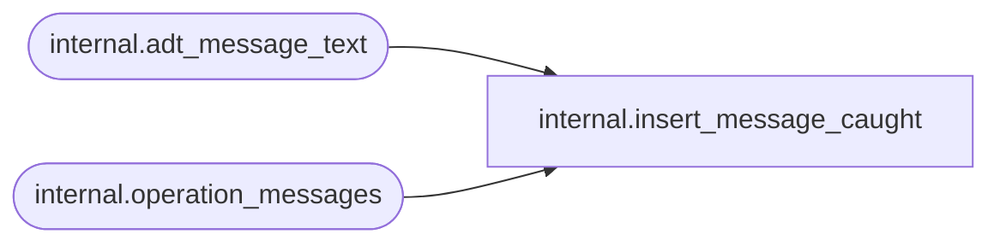

# internal.insert_message_caught

**Database:** SSISDB  
**Server:** STL-SSIS-P-01  

## Architecture Diagram



## Table Dependencies

| Referenced Table |
|---|
| internal.adt_message_text |
| internal.operation_messages |

## Stored Procedure Code

```sql
CREATE PROCEDURE [internal].[insert_message_caught] 
    @operation_id       BIGINT
AS
SET NOCOUNT ON

    
    IF ERROR_NUMBER() IS NULL
        RETURN;
    IF @operation_id IS NULL
        RETURN;

    DECLARE 
        @error_severity   INT,
        @message_text    [internal].[adt_message_text];
    SELECT 
        @error_severity = ERROR_SEVERITY(),
        @message_text = ERROR_MESSAGE();

    
    DECLARE @message_type       smallint;
    SET @message_type = 
        CASE  
            WHEN @error_severity > 10 THEN 120 
            ELSE 110 
        END
        
    INSERT INTO [internal].[operation_messages] (
        [operation_id],
        [message_type],
        [message_time],
        [message_source_type],
        [message]
        )
    VALUES (
        @operation_id,
        @message_type,
        SYSDATETIMEOFFSET(),
        10,
        @message_text
        );


internal,insert_object_versions,CREATE PROCEDURE internal.insert_object_versions
        @object_id              bigint,
        @object_name            nvarchar(260),
        @object_type            int,
        @description            nvarchar(1024),
        @created_by             [internal].[adt_sname],
        @created_time           datetimeoffset,
        @restored_by            [internal].[adt_sname],
        @last_restored_time     datetimeoffset,
        @object_data            varbinary(MAX),
        @object_status          char(1),  
        @KEY                    varbinary(8000),
        @IV                     varbinary(8000),
        @algorithm_name         nvarchar(255),
        @version_id             bigint output
WITH EXECUTE AS 'AllSchemaOwner'
AS
    SET NOCOUNT ON
    
    DECLARE @sqlString    nvarchar(1024)
    DECLARE @key_name               [internal].[adt_name]
    DECLARE @certificate_name       [internal].[adt_name]
    DECLARE @encryption_algorithm   nvarchar(255)
    DECLARE @encrypted_value        varbinary(MAX)
    
    SET @key_name = 'MS_Enckey_Proj_'+CONVERT(varchar,@object_id)
    SET @certificate_name = 'MS_Cert_Proj_'+CONVERT(varchar,@object_id)
    
    IF NOT EXISTS (SELECT name FROM sys.symmetric_keys WHERE name = @key_name )
       OR NOT EXISTS (SELECT name FROM sys.certificates WHERE name = @certificate_name )
    BEGIN
        
        RAISERROR(27172, 16, 1, @object_name) WITH NOWAIT
        RETURN 1
    END
    
    BEGIN TRY
        SET @sqlString = 'OPEN SYMMETRIC KEY ' + @key_name 
                            + ' DECRYPTION BY CERTIFICATE ' + @certificate_name  
        EXECUTE sp_executesql @sqlString 
        
        SET @encrypted_value = [internal].[encrypt_lob_data](@algorithm_name, @KEY, @IV, @object_data); 
        
        IF @encrypted_value IS NULL
        BEGIN
            RAISERROR(27119, 16, 1, @object_name) WITH NOWAIT
            RETURN 1
        END
    
        SET @sqlString = 'CLOSE SYMMETRIC KEY '+ @key_name
            EXECUTE sp_executesql @sqlString  
            
        INSERT INTO [internal].[object_versions] (
            [object_id],
            [object_type],
            [description],
            [created_by],
            [created_time],
            [restored_by],
            [last_restored_time],
            [object_data],
            [object_status]) 
        VALUES (
            @object_id,
            @object_type,
            @description,
            @created_by,
            @created_time,
            @restored_by,
            @last_restored_time,
            @encrypted_value,
            @object_status)
  
        IF @@ROWCOUNT = 1
            BEGIN
            SET @version_id = scope_identity()
            RETURN 0
        END
        ELSE BEGIN
            SET @version_id = -1
            RETURN 1
        END
    END TRY  
    BEGIN CATCH
        SET @sqlString = 'IF EXISTS (SELECT key_name FROM sys.openkeys WHERE key_name = ''' + @key_name +''') ' 
                    + 'CLOSE SYMMETRIC KEY '+ @key_name
        EXECUTE sp_executesql @sqlString;        
        THROW
    END CATCH
```

