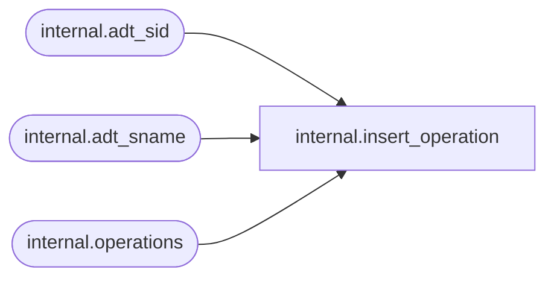

# internal.insert_operation

**Database:** SSISDB  
**Server:** STL-SSIS-P-01  

## Architecture Diagram



## Table Dependencies

| Referenced Table |
|---|
| internal.adt_sid |
| internal.adt_sname |
| internal.operations |

## Stored Procedure Code

```sql
CREATE PROCEDURE [internal].[insert_operation]
        @operation_type     smallint,
        @created_time       datetimeoffset,
        @object_type        int,
        @object_id          bigint,
        @object_name        nvarchar(260),
        @status             int,
        @start_time         datetimeoffset,
        @end_time           datetimeoffset,
        @caller_sid         [internal].[adt_sid],
        @caller_name        [internal].[adt_sname],
        @process_id         int=null,
        @stopped_by_sid     [internal].[adt_sid],
        @stopped_by_name    [internal].[adt_sname],
        @operation_id       bigint output
AS
SET NOCOUNT ON
BEGIN
  DECLARE @operation_guid uniqueidentifier
  DECLARE @servername sysname
  DECLARE @machinename sysname

  SET @operation_guid = NEWID()
  SET @servername = CONVERT(sysname, SERVERPROPERTY('servername'))
  SET @machinename = CONVERT(sysname, SERVERPROPERTY('machinename'))


  INSERT INTO internal.operations (
        operation_type,
        created_time,
        object_type,
        [object_id],
        [object_name],
        [status],
        start_time,
        end_time,
        caller_sid,
        caller_name,
        process_id,
        stopped_by_sid,
        stopped_by_name,
        operation_guid,
        server_name,
        machine_name
        ) 
  VALUES (
        @operation_type,
        @created_time,
        @object_type,
        @object_id,
        @object_name,
        @status,
        @start_time,
        @end_time,
        @caller_sid,
        @caller_name,
        @process_id,
        @stopped_by_sid,
        @stopped_by_name,
        @operation_guid,
        @servername,
        @machinename
        )
  
  IF @@ROWCOUNT = 1
  BEGIN
    SET @operation_id = scope_identity()
    RETURN 0
  END
  ELSE BEGIN
    SET @operation_id = -1
    RETURN -1
  END
END


internal,insert_project,CREATE PROCEDURE internal.insert_project
        @folder_id              bigint,
        @name                   nvarchar(128),
        @description            nvarchar(1024),
        @project_format_version int,
        @deployed_by_sid          [internal].[adt_sid],
        @deployed_by_name         [internal].[adt_sname],
        @last_deployed_time       datetimeoffset,
        @created_time           datetimeoffset,
        @object_version_lsn     bigint,
        @validation_status      char(1),
        @last_validation_time   datetimeoffset,  
        @project_id             bigint output
WITH EXECUTE AS CALLER
AS
    SET NOCOUNT ON
    
    MERGE [internal].[projects] AS target
    USING( select @folder_id,@name) AS source(folder_id, name)
    ON (target.folder_id = source.folder_id AND target.name = source.name)
    WHEN NOT MATCHED THEN 
      INSERT(
            [folder_id] ,
            [name],
            [description],
            [project_format_version],
            [deployed_by_sid],
            [deployed_by_name],
            [last_deployed_time],
            [created_time],
            [object_version_lsn],
            [validation_status],
            [last_validation_time]) 
      VALUES (
            @folder_id,
            @name,
            @description,
            @project_format_version,
            @deployed_by_sid,
            @deployed_by_name,
            @last_deployed_time,
            @created_time,
            @object_version_lsn,
            @validation_status,
            @last_validation_time);
      
      IF @@ROWCOUNT = 1
      BEGIN
        SET @project_id = scope_identity()
        RETURN 0
      END
      ELSE BEGIN
        SET @project_id = -1
        RETURN 1
      END

internal,prepare_deploy,CREATE PROCEDURE [internal].[prepare_deploy]
    @folder_name nvarchar(128),
    @project_name nvarchar(128),
    @project_stream varbinary(MAX),
    @operation_id bigint,
    @version_id bigint output,
    @project_id bigint output
WITH EXECUTE AS 'AllSchemaOwner'
AS
    SET NOCOUNT ON
    
    
    DECLARE @caller_id     int
    DECLARE @caller_name   [internal].[adt_sname]
    DECLARE @caller_sid    [internal].[adt_sid]
    DECLARE @suser_name    [internal].[adt_sname]
    DECLARE @suser_sid     [internal].[adt_sid]
    
    EXECUTE AS CALLER
        EXEC [internal].[get_user_info]
            @caller_name OUTPUT,
            @caller_sid OUTPUT,
            @suser_name OUTPUT,
            @suser_sid OUTPUT,
            @caller_id OUTPUT;
          
          
        IF(
            EXISTS(SELECT [name]
                    FROM sys.server_principals
                    WHERE [sid] = @suser_sid AND [type] = 'S')  
            OR
            EXISTS(SELECT [name]
                    FROM sys.database_principals
                    WHERE ([sid] = @caller_sid AND [type] = 'S')) 
            )
        BEGIN
            RAISERROR(27123, 16, 1) WITH NOWAIT
            RETURN 1
        END
    REVERT
    
    IF(
            EXISTS(SELECT [name]
                    FROM sys.server_principals
                    WHERE [sid] = @suser_sid AND [type] = 'S')  
            OR
            EXISTS(SELECT [name]
                    FROM sys.database_principals
                    WHERE ([sid] = @caller_sid AND [type] = 'S')) 
            )
    BEGIN
            RAISERROR(27123, 16, 1) WITH NOWAIT
            RETURN 1
    END
    
    

    DECLARE @start_time     DATETIMEOFFSET
    DECLARE @return_value   int
    DECLARE @folder_id      bigint
    
    DECLARE @sqlString              nvarchar(1024)
    DECLARE @key_name               [internal].[adt_name]
    DECLARE @certificate_name       [internal].[adt_name]
    DECLARE @encryption_algorithm   nvarchar(255)
    DECLARE @result         bit
    DECLARE @KEY            varbinary(8000)
    DECLARE @IV             varbinary(8000)
    
    EXECUTE AS CALLER
       SET @folder_id = 
            (SELECT [folder_id] FROM [catalog].[folders] WHERE [name] = @folder_name)
    REVERT
       
    BEGIN TRY
                     
        SET @start_time = SYSDATETIMEOFFSET() 
                     
        
        SET @project_id = (SELECT [project_id] FROM [catalog].[projects]
                       WHERE [folder_id] = @folder_id AND [name] = @project_name)
                       
        IF(@project_id IS NULL)
        
        BEGIN
          
            EXECUTE AS CALLER   
                SET @result = [internal].[check_permission] 
                (
                    1,
                    @folder_id,
                    100
                ) 
            REVERT
            
            IF @result = 0                
            BEGIN
                RAISERROR(27206 , 16 , 1, @folder_name) WITH NOWAIT
                RETURN 1        
            END         
            
            IF EXISTS (SELECT [project_id] FROM [internal].[projects]
                    WHERE [folder_id] = @folder_id AND [name] = @project_name)
            BEGIN
                RAISERROR(27118, 16, 1) WITH NOWAIT
                RETURN 1                
            END
            
            EXEC @return_value = [internal].[insert_project] 
                        @folder_id,     
                        @project_name,  
                        null,
                        null,
                        @caller_sid,    
                        @caller_name,   
                        @start_time,
                        @start_time,
                        -1,             
                        'N',            
                        null,                          
                        @project_id OUTPUT  
            IF @return_value <> 0
                RETURN 1;

            
            
            SET @encryption_algorithm = (SELECT [internal].[get_encryption_algorithm]())
        
            IF @encryption_algorithm IS NULL
            BEGIN
                RAISERROR(27156, 16, 1, 'ENCRYPTION_ALGORITHM') WITH NOWAIT
                RETURN 1
            END
            
            SET @key_name = 'MS_Enckey_Proj_'+CONVERT(varchar,@project_id)
            SET @certificate_name = 'MS_Cert_Proj_'+CONVERT(varchar,@project_id)
            
            SET @sqlString = 'CREATE CERTIFICATE ' + @certificate_name + ' WITH SUBJECT = ''ISServerCertificate'''
            
            IF  NOT EXISTS (SELECT [name] FROM [sys].[certificates] WHERE [name] = @certificate_name)
                EXECUTE sp_executesql @sqlString 
            
            SET @sqlString = 'CREATE SYMMETRIC KEY ' + @key_name +' WITH ALGORITHM = ' 
                                + @encryption_algorithm + ' ENCRYPTION BY CERTIFICATE ' + @certificate_name
                                
            IF  NOT EXISTS (SELECT [name] FROM [sys].[symmetric_keys] WHERE [name] = @key_name)
                EXECUTE sp_executesql @sqlString 
            
                        
            
            EXEC @return_value = 
                internal.[create_key_information] @encryption_algorithm, @KEY output, @IV output
            IF(@return_value <> 0)
                RETURN 1;
            
            SET @sqlString = 'OPEN SYMMETRIC KEY ' + @key_name 
                            + ' DECRYPTION BY CERTIFICATE ' + @certificate_name  
            EXECUTE sp_executesql @sqlString 
            
            INSERT INTO [internal].[catalog_encryption_keys]
                VALUES (@key_name, ENCRYPTBYKEY( KEY_GUID(@key_name), @KEY), ENCRYPTBYKEY( KEY_GUID(@key_name), @IV ))
            
            SET @sqlString = 'CLOSE SYMMETRIC KEY '+ @key_name
            EXECUTE sp_executesql @sqlString  
            
            EXEC @return_value = [internal].[insert_object_versions] 
                    @project_id,     
                    @project_name,   
                    20, 
                    null,            
                    @caller_name,    
                    @start_time,     
                    null,            
                    null,            
                    @project_stream, 
                    'D',             
                    @KEY,
                    @IV,
                    @encryption_algorithm,
                    @version_id OUTPUT  
            IF @return_value <> 0
                RETURN 1;
            
            
            EXECUTE AS CALLER
                EXEC @return_value = [internal].[init_object_permissions] 
                    2, @project_id, @caller_id 
            REVERT
            IF @return_value <> 0
            BEGIN
                
                RAISERROR(27110, 16, 1) WITH NOWAIT
                RETURN 1
            END            
                 
        END
        
        ELSE  
        BEGIN
            EXECUTE AS CALLER   
                SET @result = [internal].[check_permission] 
                (
                    2,
                    @project_id,
                    1
                ) 
            REVERT
            
            IF @result = 0                
            BEGIN
                RAISERROR(27109 , 16 , 1, @project_name) WITH NOWAIT
                RETURN 1        
            END
            
            
            IF EXISTS (SELECT [project_id] FROM [internal].[projects] projs INNER JOIN [internal].[object_versions] vers
                            ON projs.[project_id] = vers.[object_id] WHERE vers.[object_status] = 'D' AND
                             [folder_id] = @folder_id AND [name] = @project_name)
            BEGIN
                RAISERROR(27118, 16, 1) WITH NOWAIT
                RETURN 1            
            END
            
            EXECUTE AS CALLER   
                SET @result = [internal].[check_permission] 
                (
                    2,
                    @project_id,
                    2
                ) 
            REVERT
            
            IF @result = 0                
            BEGIN
                RAISERROR(27109 , 16 , 1, @project_name) WITH NOWAIT
                RETURN 1        
            END
            
            SET @encryption_algorithm = (SELECT [internal].[get_encryption_algorithm]())
        
            IF @encryption_algorithm IS NULL
            BEGIN
                RAISERROR(27156, 16, 1, 'ENCRYPTION_ALGORITHM') WITH NOWAIT
                RETURN 1
            END
            
            SET @key_name = 'MS_Enckey_Proj_'+CONVERT(varchar,@project_id)
            SET @certificate_name = 'MS_Cert_Proj_'+CONVERT(varchar,@project_id)
            SET @sqlString = 'OPEN SYMMETRIC KEY ' + @key_name 
                            + ' DECRYPTION BY CERTIFICATE ' + @certificate_name  
            EXECUTE sp_executesql @sqlString 
            
            SELECT @KEY = DECRYPTBYKEY([key]), @IV = DECRYPTBYKEY([IV]) 
                FROM [internal].[catalog_encryption_keys]
                WHERE [key_name] = @key_name
                
            IF (@KEY IS NULL OR @IV IS NULL)
            BEGIN
                RAISERROR(27117, 16 ,1) WITH NOWAIT
                RETURN 1
            END
            
            SET @sqlString = 'CLOSE SYMMETRIC KEY '+ @key_name
            EXECUTE sp_executesql @sqlString          
            
            EXEC @return_value = [internal].[insert_object_versions] 
                    @project_id,     
                    @project_name,   
                    20,  
                    null,            
                    @caller_name,    
                    @start_time,     
                    null,            
                    null,            
                    @project_stream, 
                    'D',             
                    @KEY,
                    @IV,
                    @encryption_algorithm,
                    @version_id OUTPUT  
            IF @return_value <> 0
                RETURN 1;                    
        END
        
        UPDATE [internal].[operations] 
            SET [object_id] = @project_id
            WHERE [operation_id] = @operation_id
            
        IF @@ROWCOUNT <> 1
        BEGIN
            RAISERROR(27112, 16, 1, N'operations') WITH NOWAIT
            RETURN 1
        END
           
    END TRY
    BEGIN CATCH 
        UPDATE [internal].[operations] SET 
            [end_time]  = SYSDATETIMEOFFSET(),
            [status]    = 4
            WHERE [operation_id]    = @operation_id;             
        THROW 
    END CATCH

internal,prepare_execution,CREATE PROCEDURE [internal].[prepare_execution]
        @execution_id       bigint,         
        @project_id         bigint output,  
        @version_id         bigint output,  
        @use32bitruntime    bit output      
AS 
    SET NOCOUNT ON
    DECLARE @result bit
    DECLARE @project_name nvarchar(128)
    DECLARE @folder_name nvarchar(128)

    
    SET TRANSACTION ISOLATION LEVEL SERIALIZABLE
    
    
    
    DECLARE @tran_count INT = @@TRANCOUNT;
    DECLARE @savepoint_name NCHAR(32);
    IF @tran_count > 0
    BEGIN
        SET @savepoint_name = REPLACE(CONVERT(NCHAR(36), NEWID()), N'-', N'');
        SAVE TRANSACTION @savepoint_name;
    END
    ELSE
        BEGIN TRANSACTION;                                                                                      
    BEGIN TRY
        
        DECLARE @id bigint
        EXECUTE AS CALLER
            SELECT @id = [operation_id] FROM [catalog].[operations]
                WHERE [operation_id] = @execution_id 
                  AND [object_type] = 20
                  AND [operation_type] = 200
        REVERT    
        
        IF @id IS NULL
        BEGIN
            RAISERROR(27103 , 16 , 1, @execution_id) WITH NOWAIT
        END
        
        
        
        SET @result = [internal].[check_permission] 
            (
                4,
                @execution_id,
                2
            ) 
        
        IF @result = 0
        BEGIN
            RAISERROR(27103 , 16 , 1, @execution_id) WITH NOWAIT        
        END
                   
        
        SELECT @project_id = [object_id],
               @project_name = [project_name],
               @version_id = [project_lsn], 
               @folder_name = [folder_name],
               @use32bitruntime = [use32bitruntime]
            FROM [internal].[execution_info]
            WHERE [execution_id] = @execution_id 
              AND [status] = 1
              AND [object_type] = 20
              AND [operation_type] = 200
        
        IF (@project_id IS NULL)
        BEGIN
            RAISERROR(27121 , 16 , 1) WITH NOWAIT
        END

        

        SELECT @folder_name = fd.[name]
        FROM [catalog].[projects] proj INNER JOIN
            [catalog].[folders] fd ON proj.[folder_id] = fd.[folder_id] WHERE
            fd.[name] = @folder_name AND proj.[project_id] = @project_id
        
        IF @folder_name IS NULL
        BEGIN
            RAISERROR(27109 , 16 , 1, @project_name) WITH NOWAIT        
        END

        
        SET @result = [internal].[check_permission] 
            (
                2,
                @project_id,
                3
            ) 

        
        IF @result = 0
        BEGIN
            RAISERROR(27178 , 16 , 1, @project_name) WITH NOWAIT        
        END
        
        
        DECLARE @version_current bigint
        SET @version_current = (SELECT [object_version_lsn] 
                                    FROM [internal].[projects]
                                    WHERE [project_id] = @project_id)
        
        IF (@version_current <> @version_id)
        BEGIN
            RAISERROR(27150 , 16 , 1) WITH NOWAIT
        END
        
        
        IF EXISTS (SELECT [execution_parameter_id] 
            FROM [internal].[execution_parameter_values]
            WHERE [execution_id] = @execution_id AND [required] = 1 AND [value_set] = 0)
        BEGIN
            RAISERROR(27184 , 16 , 1) WITH NOWAIT 
        END
        
        
        EXEC [internal].[set_system_informations]
              @execution_id

        
        UPDATE [internal].[operations]
        SET [status] = 5,
            [start_time] = SYSDATETIMEOFFSET(),
            [server_name] = CONVERT(sysname, SERVERPROPERTY('servername')),
            [machine_name] = CONVERT(sysname, SERVERPROPERTY('machinename'))
        WHERE [operation_id] = @execution_id
        IF @@ROWCOUNT <> 1
        BEGIN
            RAISERROR(27112, 16, 1, N'operations') WITH NOWAIT
        END       
            
        
        IF @tran_count = 0
            COMMIT TRANSACTION;                                                                                 
    END TRY
    
    BEGIN CATCH
        
        IF @tran_count = 0 
            ROLLBACK TRANSACTION;
        
        ELSE IF XACT_STATE() <> -1
            ROLLBACK TRANSACTION @savepoint_name;                                                                           
        THROW;
    END CATCH
    
    RETURN 0
```

