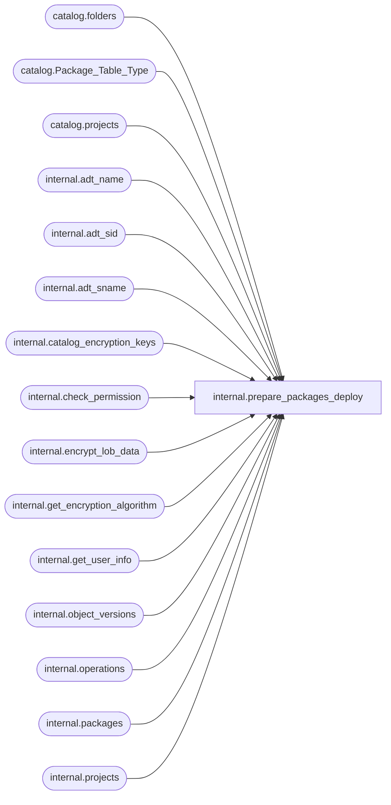

# internal.prepare_packages_deploy

**Database:** SSISDB  
**Server:** STL-SSIS-P-01  

## Architecture Diagram



## Table Dependencies

| Referenced Table |
|---|
| catalog.folders |
| catalog.Package_Table_Type |
| catalog.projects |
| internal.adt_name |
| internal.adt_sid |
| internal.adt_sname |
| internal.catalog_encryption_keys |
| internal.check_permission |
| internal.encrypt_lob_data |
| internal.get_encryption_algorithm |
| internal.get_user_info |
| internal.object_versions |
| internal.operations |
| internal.packages |
| internal.projects |

## Stored Procedure Code

```sql
CREATE PROCEDURE [internal].[prepare_packages_deploy]
    @folder_name nvarchar(128),
    @project_name nvarchar(128),
    @packages_table [catalog].[Package_Table_Type] ReadOnly,
    @operation_id bigint,
    @version_id bigint output,
    @project_id bigint output
WITH EXECUTE AS 'AllSchemaOwner'
AS
    SET NOCOUNT ON

    
    DECLARE @caller_id     int
    DECLARE @caller_name   [internal].[adt_sname]
    DECLARE @caller_sid    [internal].[adt_sid]
    DECLARE @suser_name    [internal].[adt_sname]
    DECLARE @suser_sid     [internal].[adt_sid]
    
    EXECUTE AS CALLER
        EXEC [internal].[get_user_info]
            @caller_name OUTPUT,
            @caller_sid OUTPUT,
            @suser_name OUTPUT,
            @suser_sid OUTPUT,
            @caller_id OUTPUT;
          
          
        IF(
            EXISTS(SELECT [name]
                    FROM sys.server_principals
                    WHERE [sid] = @suser_sid AND [type] = 'S')  
            OR
            EXISTS(SELECT [name]
                    FROM sys.database_principals
                    WHERE ([sid] = @caller_sid AND [type] = 'S')) 
            )
        BEGIN
            RAISERROR(27123, 16, 1) WITH NOWAIT
            RETURN 1
        END
    REVERT
    
    IF(
            EXISTS(SELECT [name]
                    FROM sys.server_principals
                    WHERE [sid] = @suser_sid AND [type] = 'S')  
            OR
            EXISTS(SELECT [name]
                    FROM sys.database_principals
                    WHERE ([sid] = @caller_sid AND [type] = 'S')) 
            )
    BEGIN
            RAISERROR(27123, 16, 1) WITH NOWAIT
            RETURN 1
    END

    DECLARE @start_time             DATETIMEOFFSET
    DECLARE @return_value           int
    DECLARE @folder_id              bigint
    DECLARE @sqlString              nvarchar(1024)
    DECLARE @key_name               [internal].[adt_name]
    DECLARE @certificate_name       [internal].[adt_name]
    DECLARE @encryption_algorithm   nvarchar(255)
    DECLARE @result                 bit
    DECLARE @KEY                    varbinary(8000)
    DECLARE @IV                     varbinary(8000)
    
    EXECUTE AS CALLER
        SET @folder_id = 
            (SELECT [folder_id] FROM [catalog].[folders] WHERE [name] = @folder_name)
            
    IF @folder_id IS NULL
    BEGIN
        RAISERROR(27104 , 16 , 1, @folder_name) WITH NOWAIT
    END 
    REVERT

    
    SET @project_id = (SELECT [project_id] FROM [catalog].[projects]
                   WHERE [folder_id] = @folder_id AND [name] = @project_name)

    IF(@project_id IS NULL)
    
    BEGIN
        RAISERROR(27187, 16, 1) WITH NOWAIT
        RETURN 1
    END
    
    BEGIN TRY

        SET @start_time = SYSDATETIMEOFFSET() 

        BEGIN
            EXECUTE AS CALLER   
                SET @result = [internal].[check_permission] 
                (
                    2,
                    @project_id,
                    1
                ) 
            REVERT
            
            IF @result = 0
            BEGIN
                RAISERROR(27109 , 16 , 1, @project_name) WITH NOWAIT
                RETURN 1
            END
            
            
            IF EXISTS (SELECT [project_id] FROM [internal].[projects] projs INNER JOIN [internal].[object_versions] vers
                            ON projs.[project_id] = vers.[object_id] WHERE vers.[object_status] = 'D' AND
                            [folder_id] = @folder_id AND [name] = @project_name)
            BEGIN
                RAISERROR(27230, 16, 1) WITH NOWAIT
                RETURN 1
            END

            
            EXECUTE AS CALLER   
                SET @result = [internal].[check_permission] 
                (
                    2,
                    @project_id,
                    2
                ) 
            REVERT
            
            IF @result = 0
            BEGIN
                RAISERROR(27109 , 16 , 1, @project_name) WITH NOWAIT
                RETURN 1
            END
            
            SET @encryption_algorithm = (SELECT [internal].[get_encryption_algorithm]())
        
            IF @encryption_algorithm IS NULL
            BEGIN
                RAISERROR(27156, 16, 1, 'ENCRYPTION_ALGORITHM') WITH NOWAIT
                RETURN 1
            END
            
            SET @key_name = 'MS_Enckey_Proj_'+CONVERT(varchar,@project_id)
            SET @certificate_name = 'MS_Cert_Proj_'+CONVERT(varchar,@project_id)
            SET @sqlString = 'OPEN SYMMETRIC KEY ' + @key_name 
                            + ' DECRYPTION BY CERTIFICATE ' + @certificate_name  
            EXECUTE sp_executesql @sqlString 
            
            SELECT @KEY = DECRYPTBYKEY([key]), @IV = DECRYPTBYKEY([IV]) 
                FROM [internal].[catalog_encryption_keys]
                WHERE [key_name] = @key_name
                
            IF (@KEY IS NULL OR @IV IS NULL)
            BEGIN
                RAISERROR(27117, 16 ,1) WITH NOWAIT
                RETURN 1
            END
            
            SET @sqlString = 'CLOSE SYMMETRIC KEY '+ @key_name
            EXECUTE sp_executesql @sqlString
            
            INSERT INTO [internal].[object_versions] (
                [object_id],
                [object_type],
                [description],
                [created_by],
                [created_time],
                [restored_by],
                [last_restored_time],
                [object_data],
                [object_status]) 
            VALUES (
                @project_id,
                20,
                null,
                @caller_name,
                @start_time,
                null,
                null,
                0,
                'D')
  
            IF @@ROWCOUNT = 1
                BEGIN
                SET @version_id = scope_identity()
            END
            ELSE BEGIN
                 RAISERROR(27112, 16, 1, N'object_versions') WITH NOWAIT
                 RETURN 1
            END

            INSERT INTO [internal].[packages]
               ([project_version_lsn]
               ,[name]
               ,[package_guid]
               ,[description]
               ,[package_format_version]
               ,[version_major]
               ,[version_minor]
               ,[version_build]
               ,[version_comments]
               ,[version_guid]
               ,[project_id]
               ,[entry_point]
               ,[validation_status]
               ,[last_validation_time]
               ,[package_data])
                SELECT
                @version_id
               ,[name]
               ,'00000000-0000-0000-0000-000000000000'
               ,null
               ,0
               ,0
               ,0
               ,0
               ,null
               ,'00000000-0000-0000-0000-000000000000'
               ,@project_id
               ,0
               ,'0'
               ,null
               ,[internal].[encrypt_lob_data](@encryption_algorithm, @KEY, @IV, [package_data])
            FROM @packages_table
        END
    END TRY
    BEGIN CATCH 
        UPDATE [internal].[operations] SET 
            [end_time]  = SYSDATETIMEOFFSET(),
            [status]    = 4
            WHERE [operation_id] = @operation_id;
        THROW 
    END CATCH

internal,prepare_stop,CREATE PROCEDURE [internal].[prepare_stop]
        @operation_id bigint,              
        @process_id   int   output,              
        @operation_guid UniqueIdentifier output,  
        @stop_id    bigint output           
AS
    SET NOCOUNT ON
    
    DECLARE @caller_id     int
    DECLARE @caller_name   [internal].[adt_sname]
    DECLARE @caller_sid    [internal].[adt_sid]
    DECLARE @suser_name    [internal].[adt_sname]
    DECLARE @suser_sid     [internal].[adt_sid]
    
    EXECUTE AS CALLER
        EXEC [internal].[get_user_info]
            @caller_name OUTPUT,
            @caller_sid OUTPUT,
            @suser_name OUTPUT,
            @suser_sid OUTPUT,
            @caller_id OUTPUT;
          
          
        IF(
            EXISTS(SELECT [name]
                    FROM sys.server_principals
                    WHERE [sid] = @suser_sid AND [type] = 'S')  
            OR
            EXISTS(SELECT [name]
                    FROM sys.database_principals
                    WHERE ([sid] = @caller_sid AND [type] = 'S')) 
            )
        BEGIN
            RAISERROR(27123, 16, 11) WITH NOWAIT
            RETURN 1
        END
    REVERT
    
    IF(
            EXISTS(SELECT [name]
                    FROM sys.server_principals
                    WHERE [sid] = @suser_sid AND [type] = 'S')  
            OR
            EXISTS(SELECT [name]
                    FROM sys.database_principals
                    WHERE ([sid] = @caller_sid AND [type] = 'S')) 
            )
    BEGIN
            RAISERROR(27123, 16, 11) WITH NOWAIT
            RETURN 1
    END
       
    DECLARE @operation_type smallint
    DECLARE @return_value int
    DECLARE @status int
    DECLARE @object_id bigint
    DECLARE @object_name nvarchar(260)
    
    INSERT INTO [internal].[operations] (
        [operation_type],  
        [created_time], 
        [object_type],
        [object_id],
        [object_name],
        [status], 
        [start_time],
        [caller_sid], 
        [caller_name]
        )
    VALUES (
        202,
        SYSDATETIMEOFFSET(),
        20,
        NULL,                     
        NULL,                     
        2,      
        SYSDATETIMEOFFSET(),
        @caller_sid,            
        @caller_name            
        )
            
    SET @stop_id = SCOPE_IDENTITY()

    EXECUTE AS CALLER
        EXEC @return_value = [internal].[init_object_permissions] 
                4, @stop_id, @caller_id 
    REVERT            
    IF @return_value <> 0
    BEGIN
        
        RAISERROR(27153, 16, 1) WITH NOWAIT
    END      
    
    
    SET TRANSACTION ISOLATION LEVEL SERIALIZABLE
    
    
    
    DECLARE @tran_count INT = @@TRANCOUNT;
    DECLARE @savepoint_name NCHAR(32);
    IF @tran_count > 0
    BEGIN
        SET @savepoint_name = REPLACE(CONVERT(NCHAR(36), NEWID()), N'-', N'');
        SAVE TRANSACTION @savepoint_name;
    END
    ELSE
        BEGIN TRANSACTION;                                                                                      
        
    BEGIN TRY
        SELECT @operation_guid = [operation_guid],
               @process_id = [process_id],
               @status = [status],
               @object_id = [object_id],
               @object_name = [object_name],
               @operation_type = [operation_type]
        FROM   [internal].[operations] 
        WHERE  [operation_id] = @operation_id AND ([status] = 2 OR [status] = 8)
        AND ([operation_type] = 200 OR [operation_type] = 301
            OR [operation_type] = 300) 
            
        IF @operation_guid IS NULL OR @object_id IS NULL
        BEGIN
            RAISERROR(27124, 16 , 1, @operation_id) WITH NOWAIT
        END
        
        IF @status = 8
        BEGIN
            RAISERROR(27126, 16 , 1) WITH NOWAIT
        END
        
        IF @process_id IS NULL
        BEGIN
            RAISERROR(27125, 16 , 1) WITH NOWAIT
        END
        
        
        DECLARE @permission_ret bit
        EXECUTE AS CALLER
           SET @permission_ret = [internal].[check_permission]
           (
              4,
              @operation_id,      
              2
           )
        REVERT
        
        IF (@permission_ret = 0)
        BEGIN
            RAISERROR(27143, 16, 6, @operation_id) WITH NOWAIT
        END
        
        
        EXECUTE AS CALLER
           SET @permission_ret = [internal].[check_permission]
           (
              4,
              @operation_id,      
              1
           )
        REVERT
        
        IF (@permission_ret = 0)
        BEGIN
            RAISERROR(27143, 16, 6, @operation_id) WITH NOWAIT
        END
        
        
        UPDATE [internal].[operations]
            SET status = 8
        WHERE operation_id = @operation_id
            
        IF @@ROWCOUNT = 0
        BEGIN
            RAISERROR(27112, 16, 7) WITH NOWAIT
        END
        
        UPDATE [internal].[operations]
            SET [object_id] = @object_id,
                [object_name] = @object_name
        WHERE operation_id = @stop_id
        
        IF @@ROWCOUNT = 0
        BEGIN
            RAISERROR(27112, 16, 7) WITH NOWAIT
        END
         
        
        IF @tran_count = 0
            COMMIT TRANSACTION;                                                                                 
    END TRY
    
    BEGIN CATCH
        
        IF @tran_count = 0 
            ROLLBACK TRANSACTION;
        
        ELSE IF XACT_STATE() <> -1
            ROLLBACK TRANSACTION @savepoint_name;                                                                           
        UPDATE [internal].[operations]
            SET [status] = 4,
                [end_time] = SYSDATETIMEOFFSET()
        WHERE operation_id = @stop_id;              
        THROW;
    END CATCH
    RETURN 0
```

