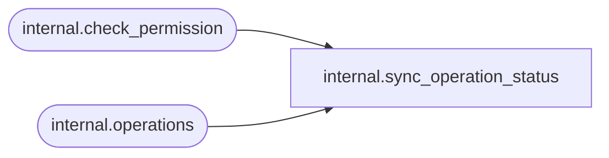

# internal.sync_operation_status

**Database:** SSISDB  
**Server:** STL-SSIS-P-01  

## Architecture Diagram



## Table Dependencies

| Referenced Table |
|---|
| internal.check_permission |
| internal.operations |

## Stored Procedure Code

```sql
CREATE PROCEDURE [internal].[sync_operation_status]
        @operation_id       bigint,       
        @operation_type     smallint      
AS
    SET NOCOUNT ON

    
    SET TRANSACTION ISOLATION LEVEL SERIALIZABLE
    
    
    
    DECLARE @tran_count INT = @@TRANCOUNT;
    DECLARE @savepoint_name NCHAR(32);
    IF @tran_count > 0
    BEGIN
        SET @savepoint_name = REPLACE(CONVERT(NCHAR(36), NEWID()), N'-', N'');
        SAVE TRANSACTION @savepoint_name;
    END
    ELSE
        BEGIN TRANSACTION;                                                                                      
    BEGIN TRY

        
        IF (NOT EXISTS (SELECT operation_id
                        FROM [internal].[operations]  
                        WHERE operation_id = @operation_id))
        BEGIN
            RAISERROR(27143, 16, 3, @operation_id) WITH NOWAIT;
        END

           
        DECLARE @can_access BIT;

        SET @can_access =
            [internal].[check_permission] 
                (4,
                 @operation_id,
                 2)
                     
        IF @can_access = 0
            BEGIN
                RAISERROR(27143, 16, 4, @operation_id) WITH NOWAIT;
            END
             
         DECLARE @end_time datetimeoffset
         SET @end_time = SYSDATETIMEOFFSET()
          
         UPDATE [internal].[operations] 
            SET [status] = 6,
                [end_time] = @end_time 
            WHERE operation_id =@operation_id
            AND ([status] = 2 OR [status] = 5)
            AND [operation_type] = @operation_type

        
        

        
        IF @tran_count = 0
            COMMIT TRANSACTION;                                                                                 
    END TRY

    BEGIN CATCH
        
        IF @tran_count = 0 
            ROLLBACK TRANSACTION;
        
        ELSE IF XACT_STATE() <> -1
            ROLLBACK TRANSACTION @savepoint_name;                                                                           

        THROW;
    END CATCH
    

internal,sync_parameter_versions,CREATE PROCEDURE [internal].[sync_parameter_versions]
        @project_id             bigint,
        @object_version_lsn     bigint
AS
    SET NOCOUNT ON
    
    DECLARE @result bit

    IF (@project_id IS NULL  OR @object_version_lsn IS NULL)
    BEGIN
        RAISERROR(27138, 16 , 6) WITH NOWAIT 
        RETURN 1     
    END
    
    IF (@project_id <= 0)
    BEGIN
        RAISERROR(27101, 16 , 10, N'project_id') WITH NOWAIT
        RETURN 1 
    END

    IF (@object_version_lsn <= 0)
    BEGIN
        RAISERROR(27101, 16 , 10, N'object_version_lsn') WITH NOWAIT
        RETURN 1  
    END  
    
    IF NOT EXISTS (SELECT [object_version_lsn] FROM [internal].[object_versions] 
                WHERE [object_version_lsn] = @object_version_lsn AND [object_type] = 20
                AND [object_id] = @project_id AND [object_status] = 'D')
    BEGIN
        RAISERROR(27194 , 16 , 1) WITH NOWAIT
        RETURN 1         
    END

    SET @result = [internal].[check_permission] 
    (
        2,
        @project_id,
        2
    ) 

    IF @result = 0        
    BEGIN
        RAISERROR(27194 , 16 , 1) WITH NOWAIT
        RETURN 1        
    END
    DECLARE @latest_version bigint
    
    SELECT @latest_version = object_version_lsn 
        FROM [catalog].[projects] WHERE [project_id] = @project_id
    
    IF (@latest_version IS NOT NULL)
    BEGIN
        
        WITH ExistingValue( [object_type], [object_name], [parameter_name],
            [parameter_data_type], [required], [sensitive], [default_value], [sensitive_default_value],
            [value_type], [value_set], [referenced_variable_name])
        AS 
           (SELECT [object_type],
                   [object_name],
                   [parameter_name],
                   [parameter_data_type],
                   [required],
                   [sensitive],
                   [default_value],
                   [sensitive_default_value],
                   [value_type],
                   [value_set],
                   [referenced_variable_name]
            FROM [internal].[object_parameters]
            WHERE  [project_id] = @project_id AND [project_version_lsn] = @latest_version)
        UPDATE [internal].[object_parameters]
            SET [default_value] = e.[default_value],
                [sensitive_default_value] = e.[sensitive_default_value],
                [value_type] = e.[value_type],
                [value_set] = e.[value_set],
                [referenced_variable_name] = e.[referenced_variable_name]
            FROM [internal].[object_parameters] AS params
            INNER JOIN ExistingValue e ON
            e.[parameter_data_type] = params.[parameter_data_type] 
            AND e.[parameter_name] = params.[parameter_name] COLLATE SQL_Latin1_General_CP1_CS_AS
            AND e.[sensitive] = params.[sensitive] AND e.[object_type] = params.[object_type]
            AND e.[object_name] = params.[object_name] AND e.[required] = params.[required]
            WHERE params.[project_id] = @project_id AND params.[project_version_lsn] = @object_version_lsn
    END
```

