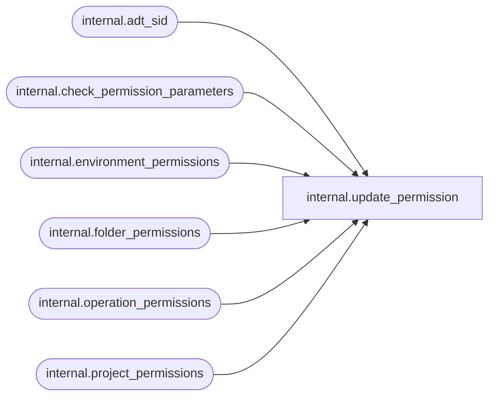

# internal.update_permission

**Database:** SSISDB  
**Server:** STL-SSIS-P-01  

## Architecture Diagram



## Table Dependencies

| Referenced Table |
|---|
| internal.adt_sid |
| internal.check_permission_parameters |
| internal.environment_permissions |
| internal.folder_permissions |
| internal.operation_permissions |
| internal.project_permissions |

## Stored Procedure Code

```sql
CREATE PROCEDURE [internal].[update_permission]
    @object_type SMALLINT,
    @object_id BIGINT,
    @principal_id INTEGER,
    @permission_type SMALLINT,
    @is_deny BIT,
    @grantor_id INTEGER
AS
BEGIN
    SET NOCOUNT ON
    DECLARE @ret INTEGER
    DECLARE @is_role BIT
    DECLARE @sid [internal].[adt_sid]
    DECLARE @grantor_sid [internal].[adt_sid]
    
    
    SET TRANSACTION ISOLATION LEVEL SERIALIZABLE
    
    
    
    DECLARE @tran_count INT = @@TRANCOUNT;
    DECLARE @savepoint_name NCHAR(32);
    IF @tran_count > 0
    BEGIN
        SET @savepoint_name = REPLACE(CONVERT(NCHAR(36), NEWID()), N'-', N'');
        SAVE TRANSACTION @savepoint_name;
    END
    ELSE
        BEGIN TRANSACTION;                                                                                      
    BEGIN TRY
        EXEC @ret = internal.check_permission_parameters
             @object_type,
             @object_id,
             @principal_id,
             @permission_type,
             @is_role OUTPUT
             
        IF @ret<>0  
             RETURN 1
        
        SELECT @sid = USER_SID(@principal_id)

        SELECT @grantor_sid = USER_SID(@grantor_id)

        IF @object_type = 1
        BEGIN
            
        MERGE [internal].[folder_permissions] AS TARGET
        USING
           (VALUES (@object_type,@object_id,@sid,@permission_type,@is_deny))
           AS SOURCE ([object_type],[object_id],[sid],[permission_type],[is_deny])
        ON   TARGET.[object_id] = SOURCE.[object_id]
             AND TARGET.[permission_type] = SOURCE.[permission_type]
             AND TARGET.[sid] = SOURCE.[sid]
        WHEN MATCHED THEN
           UPDATE SET TARGET.[is_deny] = @is_deny, TARGET.[grantor_sid] = @grantor_sid
        WHEN NOT MATCHED THEN
           INSERT ([object_id],[sid],[permission_type],[is_deny],[is_role],[grantor_sid])
           VALUES (@object_id,@sid,@permission_type,@is_deny,@is_role,@grantor_sid);
        IF @@ROWCOUNT<> 1
        BEGIN
            RAISERROR(27112, 16, 10, N'folder_permissions') WITH NOWAIT
            RETURN 1
        END                                                                                     
        END
        ELSE IF @object_type = 2
        BEGIN
            
        MERGE [internal].[project_permissions] AS TARGET
        USING
           (VALUES (@object_type,@object_id,@sid,@permission_type,@is_deny))
           AS SOURCE ([object_type],[object_id],[sid],[permission_type],[is_deny])
        ON   TARGET.[object_id] = SOURCE.[object_id]
             AND TARGET.[permission_type] = SOURCE.[permission_type]
             AND TARGET.[sid] = SOURCE.[sid]
        WHEN MATCHED THEN
           UPDATE SET TARGET.[is_deny] = @is_deny, TARGET.[grantor_sid] = @grantor_sid
        WHEN NOT MATCHED THEN
           INSERT ([object_id],[sid],[permission_type],[is_deny],[is_role],[grantor_sid])
           VALUES (@object_id,@sid,@permission_type,@is_deny,@is_role,@grantor_sid);
        IF @@ROWCOUNT<> 1
        BEGIN
            RAISERROR(27112, 16, 10, N'project_permissions') WITH NOWAIT
            RETURN 1
        END                                                                                     
        END
        ELSE IF @object_type = 3
        BEGIN
            
        MERGE [internal].[environment_permissions] AS TARGET
        USING
           (VALUES (@object_type,@object_id,@sid,@permission_type,@is_deny))
           AS SOURCE ([object_type],[object_id],[sid],[permission_type],[is_deny])
        ON   TARGET.[object_id] = SOURCE.[object_id]
             AND TARGET.[permission_type] = SOURCE.[permission_type]
             AND TARGET.[sid] = SOURCE.[sid]
        WHEN MATCHED THEN
           UPDATE SET TARGET.[is_deny] = @is_deny, TARGET.[grantor_sid] = @grantor_sid
        WHEN NOT MATCHED THEN
           INSERT ([object_id],[sid],[permission_type],[is_deny],[is_role],[grantor_sid])
           VALUES (@object_id,@sid,@permission_type,@is_deny,@is_role,@grantor_sid);
        IF @@ROWCOUNT<> 1
        BEGIN
            RAISERROR(27112, 16, 10, N'environment_permissions') WITH NOWAIT
            RETURN 1
        END                                                                                     
        END
        ELSE
        BEGIN
            
        MERGE [internal].[operation_permissions] AS TARGET
        USING
           (VALUES (@object_type,@object_id,@sid,@permission_type,@is_deny))
           AS SOURCE ([object_type],[object_id],[sid],[permission_type],[is_deny])
        ON   TARGET.[object_id] = SOURCE.[object_id]
             AND TARGET.[permission_type] = SOURCE.[permission_type]
             AND TARGET.[sid] = SOURCE.[sid]
        WHEN MATCHED THEN
           UPDATE SET TARGET.[is_deny] = @is_deny, TARGET.[grantor_sid] = @grantor_sid
        WHEN NOT MATCHED THEN
           INSERT ([object_id],[sid],[permission_type],[is_deny],[is_role],[grantor_sid])
           VALUES (@object_id,@sid,@permission_type,@is_deny,@is_role,@grantor_sid);
        IF @@ROWCOUNT<> 1
        BEGIN
            RAISERROR(27112, 16, 10, N'operation_permissions') WITH NOWAIT
            RETURN 1
        END                                                                                     
        END
        
        
        IF @tran_count = 0
            COMMIT TRANSACTION;                                                                                 
        RETURN 0
    END TRY
    
    BEGIN CATCH
        
        IF @tran_count = 0 
            ROLLBACK TRANSACTION;
        
        ELSE IF XACT_STATE() <> -1
            ROLLBACK TRANSACTION @savepoint_name;                                                                           
        THROW
    END CATCH
END

internal,update_project_deployment_status,CREATE PROCEDURE [internal].[update_project_deployment_status]
        @operation_id           bigint,
        @project_version_lsn    bigint,
        @end_time               datetimeoffset,
        @status                 int,
        @description            nvarchar(1024) = NULL,
        @project_format_version int = NULL
WITH EXECUTE AS 'AllSchemaOwner'
AS
    SET NOCOUNT ON
    
    DECLARE @project_id bigint
    DECLARE @result bit
    
    
    DECLARE @caller_id     int
    DECLARE @caller_name   [internal].[adt_sname]
    DECLARE @caller_sid    [internal].[adt_sid]
    DECLARE @suser_name    [internal].[adt_sname]
    DECLARE @suser_sid     [internal].[adt_sid]
    
    EXECUTE AS CALLER
        EXEC [internal].[get_user_info]
            @caller_name OUTPUT,
            @caller_sid OUTPUT,
            @suser_name OUTPUT,
            @suser_sid OUTPUT,
            @caller_id OUTPUT;
          
          
        IF(
            EXISTS(SELECT [name]
                    FROM sys.server_principals
                    WHERE [sid] = @suser_sid AND [type] = 'S')  
            OR
            EXISTS(SELECT [name]
                    FROM sys.database_principals
                    WHERE ([sid] = @caller_sid AND [type] = 'S')) 
            )
        BEGIN
            RAISERROR(27123, 16, 1) WITH NOWAIT
            RETURN 1
        END
    REVERT
    
    IF(
            EXISTS(SELECT [name]
                    FROM sys.server_principals
                    WHERE [sid] = @suser_sid AND [type] = 'S')  
            OR
            EXISTS(SELECT [name]
                    FROM sys.database_principals
                    WHERE ([sid] = @caller_sid AND [type] = 'S')) 
            )
    BEGIN
            RAISERROR(27123, 16, 1) WITH NOWAIT
            RETURN 1
    END

    IF (@operation_id IS NULL OR @end_time IS NULL  OR @status IS NULL)
    BEGIN
        RAISERROR(27138, 16 , 6) WITH NOWAIT 
        RETURN 1     
    END    
        
    EXECUTE AS CALLER   
        SET @result = [internal].[check_permission] 
        (
            4,
            @operation_id,
            2
        ) 
    REVERT
    
    IF @result = 0        
    BEGIN
        RAISERROR(27105 , 16 , 1, @operation_id) WITH NOWAIT
        RETURN 1        
    END
    
    
    
    SET TRANSACTION ISOLATION LEVEL SERIALIZABLE
    
    
    
    DECLARE @tran_count INT = @@TRANCOUNT;
    DECLARE @savepoint_name NCHAR(32);
    IF @tran_count > 0
    BEGIN
        SET @savepoint_name = REPLACE(CONVERT(NCHAR(36), NEWID()), N'-', N'');
        SAVE TRANSACTION @savepoint_name;
    END
    ELSE
        BEGIN TRANSACTION;                                                                                       
    BEGIN TRY
        
        
        IF EXISTS (SELECT [operation_id] FROM [internal].[operations]
            WHERE ([status] = 5 OR [status] = 2 
            OR [status] = 4) 
            AND [operation_id] = @operation_id AND [operation_type] = 101)
        BEGIN
            
            
            IF @project_version_lsn IS NULL 
            BEGIN
                UPDATE [internal].[operations] SET 
                    [end_time]  = SYSDATETIMEOFFSET(),
                    [status]    = 4
                    WHERE [operation_id]    = @operation_id;             
            END
            
            ELSE
                BEGIN
                SET @project_id = (SELECT vers.[object_id] FROM [internal].[object_versions] vers 
                        INNER JOIN [internal].[projects] projs 
                        ON projs.[project_id] = vers.[object_id]
                        WHERE vers.[object_status] = 'D' AND vers.[object_version_lsn] = @project_version_lsn)
                        
                
                IF @project_id IS NOT NULL
                BEGIN
                    
                    EXECUTE AS CALLER   
                        IF [internal].[check_permission] 
                        (
                            2,
                            @project_id,
                            2
                        ) = 0
                        BEGIN
                            RAISERROR(27194 , 16 , 1) WITH NOWAIT       
                        END
                    REVERT        
                    
                    IF @status = 4
                    BEGIN
                        
                        UPDATE [internal].[operations]
                            SET [end_time] = @end_time,
                            [status] = 4
                        WHERE [operation_id] = @operation_id
                                       
                        
                        DELETE FROM [internal].[projects]
                            WHERE [project_id] = @project_id
                            AND [object_version_lsn] = -1 

                        
                        DELETE FROM [internal].[object_versions]
                            WHERE [object_version_lsn] = @project_version_lsn
                            AND [object_status] = 'D' 
                        
                        
                        IF NOT EXISTS (SELECT [project_id] FROM [internal].[projects]
                            WHERE [project_id] = @project_id)
                        BEGIN
                            DECLARE @sqlString              nvarchar(1024)
                            DECLARE @key_name               [internal].[adt_name]
                            DECLARE @certificate_name       [internal].[adt_name]
                            
                            
    SET @key_name = 'MS_Enckey_Proj_'+CONVERT(varchar,@project_id)
    SET @certificate_name = 'MS_Cert_Proj_'+CONVERT(varchar,@project_id)
    SET @sqlString = 'IF EXISTS (SELECT name FROM sys.symmetric_keys WHERE name = ''' + @key_name +''') '
        +'DROP SYMMETRIC KEY '+ @key_name
        EXECUTE sp_executesql @sqlString
    SET @sqlString = 'IF EXISTS (select name from sys.certificates WHERE name = ''' + @certificate_name +''') '
        +'DROP CERTIFICATE '+ @certificate_name
        EXECUTE sp_executesql @sqlString
                            
                            DELETE FROM [internal].[catalog_encryption_keys]
                                WHERE key_name = @key_name                     
                        END                          
                    END
                    
                    ELSE IF @status = 7
                    BEGIN
                        
                        UPDATE [internal].[operations]
                            SET [end_time] = @end_time,
                            [status] = 7
                        WHERE [operation_id] = @operation_id
                                    
                        
                        UPDATE [internal].[projects]
                            SET [last_deployed_time] = @end_time,
                            [object_version_lsn] = @project_version_lsn,
                            [description] = @description,
                            [project_format_version] = @project_format_version
                            WHERE [project_id] = @project_id
                            
                        
                        UPDATE [internal].[object_versions]
                            SET [object_status] = 'C', 
                                [description] = @description
                            WHERE [object_version_lsn] = @project_version_lsn
                            AND [object_status] = 'D'                                 
                    END
                END
            END
        END        
        
        IF @tran_count = 0
            COMMIT TRANSACTION;                                                                                 
    END TRY
    BEGIN CATCH
        
        IF @tran_count = 0 
            ROLLBACK TRANSACTION;
        
        ELSE IF XACT_STATE() <> -1
            ROLLBACK TRANSACTION @savepoint_name;                                                                             
        UPDATE [internal].[operations] SET 
            [end_time]  = SYSDATETIMEOFFSET(),
            [status]    = 4
            WHERE [operation_id]    = @operation_id;
        THROW 
    END CATCH
```

