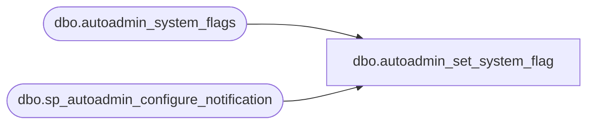

# dbo.autoadmin_set_system_flag

**Database:** msdb  
**Server:** STL-SSIS-P-01  

## Architecture Diagram



## Table Dependencies

| Referenced Table |
|---|
| dbo.autoadmin_system_flags |
| dbo.sp_autoadmin_configure_notification |

## Stored Procedure Code

```sql
CREATE PROCEDURE autoadmin_set_system_flag
    @flag_name		NVARCHAR(128),
    @flag_value		NVARCHAR(MAX)
AS
BEGIN
    DECLARE @TranCounter INT
    SET @TranCounter = @@TRANCOUNT
    IF (@TranCounter > 0)
    BEGIN
        SAVE TRANSACTION tran_autoadmin_set_system_flag
    END
    ELSE
    BEGIN
        BEGIN TRANSACTION
    END

    BEGIN TRY
        -- Check if we are updating / adding Notification email ID 
        IF(@flag_name IS NOT NULL)
        BEGIN
            IF(@flag_name = N'SSMBackup2WANotificationEmailIds')
            BEGIN
                EXEC sp_autoadmin_configure_notification 
            END
        END

        IF EXISTS (SELECT TOP 1 * FROM autoadmin_system_flags WHERE name = @flag_name)
        BEGIN
            UPDATE autoadmin_system_flags SET value = @flag_value WHERE name = @flag_name
        END
        ELSE
        BEGIN
            INSERT autoadmin_system_flags VALUES (@flag_name, @flag_value)
        END

        IF (@TranCounter = 0)
            COMMIT TRANSACTION
        RETURN (0)

    END TRY
    BEGIN CATCH
        IF (@TranCounter = 0 OR XACT_STATE() = -1)
            ROLLBACK TRANSACTION
        ELSE IF (XACT_STATE() = 1)
            ROLLBACK TRANSACTION tran_autoadmin_set_system_flag

        DECLARE @ErrorMessage   NVARCHAR(4000);
        DECLARE @ErrorSeverity  INT;
        DECLARE @ErrorState     INT;
        DECLARE @ErrorNumber    INT;
        DECLARE @ErrorLine      INT;
        DECLARE @ErrorProcedure NVARCHAR(200);
        SELECT @ErrorLine = ERROR_LINE(),
               @ErrorSeverity = ERROR_SEVERITY(),
               @ErrorState = ERROR_STATE(),
               @ErrorNumber = ERROR_NUMBER(),
               @ErrorMessage = ERROR_MESSAGE(),
               @ErrorProcedure = ISNULL(ERROR_PROCEDURE(), '-');

        RAISERROR (14684, @ErrorSeverity, -1 , @ErrorNumber, @ErrorSeverity, @ErrorState, @ErrorProcedure, @ErrorLine, @ErrorMessage);

        RETURN (1)
    END CATCH
END

dbo,autoadmin_update_task_agent_path,CREATE PROCEDURE autoadmin_update_task_agent_path
        @assembly_name		VARCHAR(255),
        @new_assembly_path	VARCHAR(MAX)
AS
BEGIN
    UPDATE autoadmin_task_agents 
	SET task_assembly_path = @new_assembly_path
    WHERE autoadmin_task_agents.task_assembly_name = @assembly_name
END

dbo,sp_add_alert,CREATE PROCEDURE sp_add_alert
  @name                         sysname,
  @message_id                   INT              = 0,
  @severity                     INT              = 0,
  @enabled                      TINYINT          = 1,
  @delay_between_responses      INT              = 0,
  @notification_message         NVARCHAR(512)    = NULL,
  @include_event_description_in TINYINT          = 5,    -- 0 = None, 1 = Email, 2 = Pager, 4 = NetSend, 7 = All
  @database_name                sysname          = NULL,
  @event_description_keyword    NVARCHAR(100)    = NULL,
  @job_id                       UNIQUEIDENTIFIER = NULL, -- If provided must NOT also provide job_name
  @job_name                     sysname          = NULL, -- If provided must NOT also provide job_id
  @raise_snmp_trap              TINYINT          = 0,
  @performance_condition        NVARCHAR(512)    = NULL, -- New for 7.0
  @category_name                sysname          = NULL, -- New for 7.0
  @wmi_namespace                sysname             = NULL, -- New for 9.0
  @wmi_query                    NVARCHAR(512)     = NULL  -- New for 9.0
AS
BEGIN
  DECLARE @verify_alert         INT
  
  --Always verify alerts before adding
  SELECT @verify_alert = 1

  EXECUTE msdb.dbo.sp_add_alert_internal @name,
                                         @message_id,
                                         @severity,
                                         @enabled,
                                         @delay_between_responses,
                                         @notification_message,
                                         @include_event_description_in,
                                         @database_name,
                                         @event_description_keyword,
                                         @job_id,
                                         @job_name,
                                         @raise_snmp_trap,
                                         @performance_condition,
                                         @category_name,
                                         @wmi_namespace,
                                         @wmi_query,
                                         @verify_alert
END

dbo,sp_add_alert_internal,CREATE PROCEDURE sp_add_alert_internal
  @name                         sysname,
  @message_id                   INT              = 0,
  @severity                     INT              = 0,
  @enabled                      TINYINT          = 1,
  @delay_between_responses      INT              = 0,
  @notification_message         NVARCHAR(512)    = NULL,
  @include_event_description_in TINYINT          = 5,    -- 0 = None, 1 = Email, 2 = Pager, 4 = NetSend, 7 = All
  @database_name                sysname          = NULL,
  @event_description_keyword    NVARCHAR(100)    = NULL,
  @job_id                       UNIQUEIDENTIFIER = NULL, -- If provided must NOT also provide job_name
  @job_name                     sysname          = NULL, -- If provided must NOT also provide job_id
  @raise_snmp_trap              TINYINT          = 0,
  @performance_condition        NVARCHAR(512)    = NULL, -- New for 7.0
  @category_name                sysname          = NULL, -- New for 7.0
 @wmi_namespace                NVARCHAR(512)     = NULL, -- New for 9.0
  @wmi_query                    NVARCHAR(512)     = NULL, -- New for 9.0
  @verify_alert                    TINYINT             = 1     -- 0 = do not verify alert, 1(or anything else) = verify alert before adding
AS
BEGIN
  DECLARE @event_source           NVARCHAR(100)
  DECLARE @event_category_id      INT
  DECLARE @event_id               INT
  DECLARE @last_occurrence_date   INT
  DECLARE @last_occurrence_time   INT
  DECLARE @last_notification_date INT
  DECLARE @last_notification_time INT
  DECLARE @occurrence_count       INT
  DECLARE @count_reset_date       INT
  DECLARE @count_reset_time       INT
  DECLARE @has_notification       INT
  DECLARE @return_code            INT
  DECLARE @duplicate_name         sysname
  DECLARE @category_id            INT
  DECLARE @alert_id               INT

  SET NOCOUNT ON

  -- Remove any leading/trailing spaces from parameters
  SELECT @name                      = LTRIM(RTRIM(@name))
  SELECT @notification_message      = LTRIM(RTRIM(@notification_message))
  SELECT @database_name             = LTRIM(RTRIM(@database_name))
  SELECT @event_description_keyword = LTRIM(RTRIM(@event_description_keyword))
  SELECT @job_name                  = LTRIM(RTRIM(@job_name))
  SELECT @performance_condition     = LTRIM(RTRIM(@performance_condition))
  SELECT @category_name             = LTRIM(RTRIM(@category_name))

  -- Turn [nullable] empty string parameters into NULLs
  IF (@notification_message      = N'') SELECT @notification_message = NULL
  IF (@database_name             = N'') SELECT @database_name = NULL
  IF (@event_description_keyword = N'') SELECT @event_description_keyword = NULL
  IF (@job_name                  = N'') SELECT @job_name = NULL
  IF (@performance_condition     = N'') SELECT @performance_condition = NULL
  IF (@category_name             = N'') SELECT @category_name = NULL

  SELECT @message_id = ISNULL(@message_id, 0)
  SELECT @severity = ISNULL(@severity, 0)

  -- Only a sysadmin can do this
  IF ((ISNULL(IS_SRVROLEMEMBER(N'sysadmin'), 0) <> 1))
  BEGIN
    RAISERROR(15003, 16, 1, N'sysadmin')
    RETURN(1) -- Failure
  END

  -- Check if SQLServerAgent is in the process of starting
  EXECUTE @return_code = msdb.dbo.sp_is_sqlagent_starting
  IF (@return_code <> 0)
    RETURN(1) -- Failure

  -- Hard-code the new Alert defaults
  -- event source needs to be instance aware
  DECLARE @instance_name sysname
  SELECT @instance_name = CONVERT (sysname, SERVERPROPERTY ('InstanceName'))
  IF (@instance_name IS NULL OR @instance_name = N'MSSQLSERVER')
    SELECT @event_source  = N'MSSQLSERVER'
  ELSE
    SELECT @event_source  = N'MSSQL$' + @instance_name

  SELECT @event_category_id = NULL
  SELECT @event_id = NULL
  SELECT @last_occurrence_date = 0
  SELECT @last_occurrence_time = 0
  SELECT @last_notification_date = 0
  SELECT @last_notification_time = 0
  SELECT @occurrence_count = 0
  SELECT @count_reset_date = 0
  SELECT @count_reset_time = 0
  SELECT @has_notification = 0
  
  IF (@category_name IS NULL)
  BEGIN
    --Default category_id for alerts
    SELECT @category_id = 98

    SELECT @category_name = name
    FROM msdb.dbo.syscategories
    WHERE (category_id = 98)
  END

  -- Map a job_id of 0 to the real value we use to mean 'no job'
  IF (@job_id = CONVERT(UNIQUEIDENTIFIER, 0x00)) AND (@job_name IS NULL)
    SELECT @job_name = N''

  -- Verify the Alert if @verify_alert <> 0
  IF (@verify_alert <> 0)
  BEGIN
    IF (@job_id = CONVERT(UNIQUEIDENTIFIER, 0x00))
        SELECT @job_id = NULL
    EXECUTE @return_code = sp_verify_alert @name,
                                            @message_id,
                                            @severity,
                                            @enabled,
                                            @delay_between_responses,
                                            @notification_message,
                                            @include_event_description_in,
                                            @database_name,
                                            @event_description_keyword,
                                            @job_id OUTPUT,
                                            @job_name OUTPUT,
                                            @occurrence_count,
                                            @raise_snmp_trap,
                                            @performance_condition,
                                            @category_name,
                                            @category_id OUTPUT,
                                            @count_reset_date,
                                            @count_reset_time,
                                            @wmi_namespace,
                                            @wmi_query,
                                            @event_id OUTPUT
    IF (@return_code <> 0)
    BEGIN
        RETURN(1) -- Failure
    END
  END

  -- For WMI alerts replace 
  -- database_name with wmi_namespace and 
  -- performance_conditon with wmi_query
  -- so we can store them in those columns in sysalerts table
  IF (@event_id = 8)
  BEGIN
    SELECT @database_name = @wmi_namespace
    SELECT @performance_condition = @wmi_query
  END
  
  -- Check if this Alert already exists
  SELECT @duplicate_name = FORMATMESSAGE(14205)
  SELECT @duplicate_name = name
  FROM msdb.dbo.sysalerts
  WHERE ((event_id = 8) AND 
       (ISNULL(performance_condition, N'') = ISNULL(@performance_condition, N'')) AND
       (ISNULL(database_name, N'') = ISNULL(@database_name, N''))) OR
      ((ISNULL(event_id,1) <> 8) AND 
       (ISNULL(performance_condition, N'apples') = ISNULL(@performance_condition, N'oranges'))) OR 
      ((performance_condition IS NULL) AND
         (message_id = @message_id) AND
         (severity = @severity) AND
         (ISNULL(database_name, N'') = ISNULL(@database_name, N'')) AND
         (ISNULL(event_description_keyword, N'') = ISNULL(@event_description_keyword, N'')))
  IF (@duplicate_name <> FORMATMESSAGE(14205))
  BEGIN
    RAISERROR(14501, 16, 1, @duplicate_name)
    RETURN(1) -- Failure
  END
  
  -- Finally, do the actual INSERT
  INSERT INTO msdb.dbo.sysalerts
         (name,
          event_source,
          event_category_id,
          event_id,
          message_id,
          severity,
          enabled,
          delay_between_responses,
          last_occurrence_date,
          last_occurrence_time,
          last_response_date,
          last_response_time,
          notification_message,
          include_event_description,
          database_name,
          event_description_keyword,
          occurrence_count,
          count_reset_date,
          count_reset_time,
          job_id,
          has_notification,
          flags,
          performance_condition,
          category_id)
  VALUES (@name,
          @event_source,
          @event_category_id,
          @event_id,
          @message_id,
          @severity,
          @enabled,
          @delay_between_responses,
          @last_occurrence_date,
          @last_occurrence_time,
          @last_notification_date,
          @last_notification_time,
          @notification_message,
          @include_event_description_in,
          @database_name,
          @event_description_keyword,
          @occurrence_count,
          @count_reset_date,
          @count_reset_time,
          ISNULL(@job_id, CONVERT(UNIQUEIDENTIFIER, 0x00)),
          @has_notification,
          @raise_snmp_trap,
          @performance_condition,
          @category_id)

  -- Notify SQLServerAgent of the change
  SELECT @alert_id = id
  FROM msdb.dbo.sysalerts
  WHERE (name = @name)
  EXECUTE msdb.dbo.sp_sqlagent_notify @op_type     = N'A',
                                      @alert_id    = @alert_id,
                                      @action_type = N'I'
  RETURN(0) -- Success
END

dbo,sp_add_category,CREATE PROCEDURE sp_add_category
  @class VARCHAR(8)   = 'JOB',   -- JOB or ALERT or OPERATOR
  @type  VARCHAR(12)  = 'LOCAL', -- LOCAL or MULTI-SERVER (for JOB) or NONE otherwise
  @name  sysname
AS
BEGIN
  DECLARE @retval         INT
  DECLARE @category_type  INT
  DECLARE @category_class INT

  SET NOCOUNT ON

  -- Remove any leading/trailing spaces from parameters
  SELECT @class = LTRIM(RTRIM(@class))
  SELECT @type  = LTRIM(RTRIM(@type))
  SELECT @name  = LTRIM(RTRIM(@name))

  EXECUTE @retval = sp_verify_category @class,
                                       @type,
                                       @name,
                                       @category_class OUTPUT,
                                       @category_type  OUTPUT
  IF (@retval <> 0)
    RETURN(1) -- Failure

  -- Check name
  IF (EXISTS (SELECT *
              FROM msdb.dbo.syscategories
              WHERE (category_class = @category_class)
                AND (name = @name)))
  BEGIN
    RAISERROR(14261, -1, -1, '@name', @name)
    RETURN(1) -- Failure
  END

  -- Add the row
  INSERT INTO msdb.dbo.syscategories (category_class, category_type, name)
  VALUES (@category_class, @category_type, @name)

  RETURN(@@error) -- 0 means success
END

dbo,sp_add_job,CREATE PROCEDURE sp_add_job
  @job_name                     sysname,
  @enabled                      TINYINT          = 1,        -- 0 = Disabled, 1 = Enabled
  @description                  NVARCHAR(512)    = NULL,
  @start_step_id                INT              = 1,
  @category_name                sysname          = NULL,
  @category_id                  INT              = NULL,     -- A language-independent way to specify which category to use
  @owner_login_name             sysname          = NULL,     -- The procedure assigns a default
  @notify_level_eventlog        INT              = 2,        -- 0 = Never, 1 = On Success, 2 = On Failure, 3 = Always
  @notify_level_email           INT              = 0,        -- 0 = Never, 1 = On Success, 2 = On Failure, 3 = Always
  @notify_level_netsend         INT              = 0,        -- 0 = Never, 1 = On Success, 2 = On Failure, 3 = Always
  @notify_level_page            INT              = 0,        -- 0 = Never, 1 = On Success, 2 = On Failure, 3 = Always
  @notify_email_operator_name   sysname          = NULL,
  @notify_netsend_operator_name sysname          = NULL,
  @notify_page_operator_name    sysname          = NULL,
  @delete_level                 INT              = 0,        -- 0 = Never, 1 = On Success, 2 = On Failure, 3 = Always
  @job_id                       UNIQUEIDENTIFIER = NULL OUTPUT,
  @originating_server           sysname           = NULL      -- For SQLAgent use only
AS
BEGIN
  DECLARE @retval                     INT
  DECLARE @notify_email_operator_id   INT
  DECLARE @notify_netsend_operator_id INT
  DECLARE @notify_page_operator_id    INT
  DECLARE @owner_sid                  VARBINARY(85)
  DECLARE @originating_server_id      INT

  SET NOCOUNT ON

  -- Remove any leading/trailing spaces from parameters (except @owner_login_name)
  SELECT @originating_server           = UPPER(LTRIM(RTRIM(@originating_server)))
  SELECT @job_name                     = LTRIM(RTRIM(@job_name))
  SELECT @description                  = LTRIM(RTRIM(@description))
  SELECT @category_name                = LTRIM(RTRIM(@category_name))
  SELECT @notify_email_operator_name   = LTRIM(RTRIM(@notify_email_operator_name))
  SELECT @notify_netsend_operator_name = LTRIM(RTRIM(@notify_netsend_operator_name))
  SELECT @notify_page_operator_name    = LTRIM(RTRIM(@notify_page_operator_name))
  SELECT @originating_server_id        = NULL

  -- Turn [nullable] empty string parameters into NULLs
  IF (@originating_server           = N'') SELECT @originating_server           = NULL
  IF (@description                  = N'') SELECT @description                  = NULL
  IF (@category_name                = N'') SELECT @category_name                = NULL
  IF (@notify_email_operator_name   = N'') SELECT @notify_email_operator_name   = NULL
  IF (@notify_netsend_operator_name = N'') SELECT @notify_netsend_operator_name = NULL
  IF (@notify_page_operator_name    = N'') SELECT @notify_page_operator_name    = NULL

  IF (@originating_server IS NULL) OR (@originating_server = '(LOCAL)')
    SELECT @originating_server= UPPER(CONVERT(sysname, SERVERPROPERTY('ServerName')))

  --only members of sysadmins role can set the owner
  IF (@owner_login_name IS NOT NULL AND ISNULL(IS_SRVROLEMEMBER(N'sysadmin'), 0) = 0) AND (@owner_login_name <> SUSER_SNAME())
  BEGIN
    RAISERROR(14515, -1, -1)
    RETURN(1) -- Failure
  END
    
  -- Default the owner (if not supplied or if a non-sa is [illegally] trying to create a job for another user)
  -- allow special account only when caller is sysadmin
  IF (@owner_login_name = N'$(SQLAgentAccount)')  AND 
     (ISNULL(IS_SRVROLEMEMBER(N'sysadmin'), 0) = 1)
  BEGIN
    SELECT @owner_sid = 0xFFFFFFFF   
  END
  ELSE 
  IF (@owner_login_name IS NULL) OR ((ISNULL(IS_SRVROLEMEMBER(N'sysadmin'), 0) = 0) AND (@owner_login_name <> SUSER_SNAME()))
  BEGIN
    SELECT @owner_sid = SUSER_SID()
  END
  ELSE
  BEGIN
    --force case insensitive comparation for NT users
    SELECT @owner_sid = SUSER_SID(@owner_login_name, 0) -- If @owner_login_name is invalid then SUSER_SID() will return NULL
  END

  -- Default the description (if not supplied)
  IF (@description IS NULL)
    SELECT @description = FORMATMESSAGE(14571)

  -- If a category ID is provided this overrides any supplied category name
  EXECUTE @retval = sp_verify_category_identifiers '@category_name',
                                                   '@category_id',
                                                    @category_name OUTPUT,
                                                    @category_id   OUTPUT
  IF (@retval <> 0)
    RETURN(1) -- Failure

  -- Check parameters
  EXECUTE @retval = sp_verify_job NULL,  --  The job id is null since this is a new job
                                  @job_name,
                                  @enabled,
                                  @start_step_id,
                                  @category_name,
                                  @owner_sid                  OUTPUT,
                                  @notify_level_eventlog,
                                  @notify_level_email         OUTPUT,
                                  @notify_level_netsend       OUTPUT,
                                  @notify_level_page          OUTPUT,
                                  @notify_email_operator_name,
                                  @notify_netsend_operator_name,
                                  @notify_page_operator_name,
                                  @delete_level,
                                  @category_id                OUTPUT,
                                  @notify_email_operator_id   OUTPUT,
                                  @notify_netsend_operator_id OUTPUT,
                                  @notify_page_operator_id    OUTPUT,
                                  @originating_server         OUTPUT
  IF (@retval <> 0)
    RETURN(1) -- Failure
    
    
  SELECT @originating_server_id = originating_server_id 
  FROM msdb.dbo.sysoriginatingservers_view 
  WHERE (originating_server = @originating_server)
  IF (@originating_server_id IS NULL)
  BEGIN
    RAISERROR(14370, -1, -1)
    RETURN(1) -- Failure
  END
    

  IF (@job_id IS NULL)
  BEGIN
    -- Assign the GUID
    SELECT @job_id = NEWID()
  END
  ELSE
  BEGIN
    -- A job ID has been provided, so check that the caller is SQLServerAgent (inserting an MSX job)
    IF (PROGRAM_NAME() NOT LIKE N'SQLAgent%')
    BEGIN
      RAISERROR(14274, -1, -1)
      RETURN(1) -- Failure
    END
  END

  INSERT INTO msdb.dbo.sysjobs
         (job_id,
          originating_server_id,
          name,
          enabled,
          description,
          start_step_id,
          category_id,
          owner_sid,
          notify_level_eventlog,
          notify_level_email,
          notify_level_netsend,
          notify_level_page,
          notify_email_operator_id,
          notify_netsend_operator_id,
          notify_page_operator_id,
          delete_level,
          date_created,
          date_modified,
          version_number)
  VALUES  (@job_id,
          @originating_server_id,
          @job_name,
          @enabled,
          @description,
          @start_step_id,
          @category_id,
          @owner_sid,
          @notify_level_eventlog,
          @notify_level_email,
          @notify_level_netsend,
          @notify_level_page,
          @notify_email_operator_id,
          @notify_netsend_operator_id,
          @notify_page_operator_id,
          @delete_level,
          GETDATE(),
          GETDATE(),
          1) -- Version number 1
  SELECT @retval = @@error

  -- NOTE: We don't notify SQLServerAgent to update it's cache (we'll do this in sp_add_jobserver)

  RETURN(@retval) -- 0 means success
END

dbo,sp_add_jobschedule,CREATE PROCEDURE sp_add_jobschedule                 
  @job_id                 UNIQUEIDENTIFIER = NULL,
  @job_name               sysname          = NULL,
  @name                   sysname,
  @enabled                TINYINT          = 1,
  @freq_type              INT              = 1,
  @freq_interval          INT              = 0,
  @freq_subday_type       INT              = 0,
  @freq_subday_interval   INT              = 0,
  @freq_relative_interval INT              = 0,
  @freq_recurrence_factor INT              = 0,
  @active_start_date      INT              = NULL,     -- sp_verify_schedule assigns a default
  @active_end_date        INT              = 99991231, -- December 31st 9999
  @active_start_time      INT              = 000000,   -- 12:00:00 am
  @active_end_time        INT              = 235959,    -- 11:59:59 pm
  @schedule_id            INT              = NULL  OUTPUT,
  @automatic_post         BIT              = 1,         -- If 1 will post notifications to all tsx servers to that run this job
  @schedule_uid           UNIQUEIDENTIFIER = NULL OUTPUT
AS
BEGIN
  DECLARE @retval           INT
  DECLARE @owner_login_name sysname
  DECLARE @owner_sid varbinary(85)

  SET NOCOUNT ON

  -- Check authority (only SQLServerAgent can add a schedule to a non-local job)
  EXECUTE @retval = sp_verify_jobproc_caller @job_id = @job_id, @program_name = N'SQLAgent%'
  IF (@retval <> 0)
    RETURN(@retval)

  -- Check that we can uniquely identify the job
  EXECUTE @retval = sp_verify_job_identifiers '@job_name',
                                              '@job_id',
                                               @job_name OUTPUT,
                                               @job_id   OUTPUT
  IF (@retval <> 0)
    RETURN(1) -- Failure

  -- Get the owner of the job. Prior to resusable schedules the job owner also owned the schedule
  SELECT @owner_login_name = dbo.SQLAGENT_SUSER_SNAME(owner_sid),
         @owner_sid = owner_sid
  FROM   sysjobs
  WHERE  (job_id = @job_id) 
 
  -- Switching to use SID instead of SNAME() to fix TFS#4427530
  IF ((ISNULL(IS_SRVROLEMEMBER(N'sysadmin'), 0) <> 1) AND 
	(SUSER_SID() <> @owner_sid))
  BEGIN
   RAISERROR(14525, -1, -1)
   RETURN(1) -- Failure
  END

  -- Check authority (only SQLServerAgent can add a schedule to a non-local job)
  EXECUTE @retval = sp_verify_jobproc_caller @job_id = @job_id, @program_name = N'SQLAgent%'
  IF (@retval <> 0)
    RETURN(@retval)

  -- Add the schedule first
  EXECUTE @retval = msdb.dbo.sp_add_schedule @schedule_name          = @name,
                                             @enabled                = @enabled,
                                             @freq_type              = @freq_type,
                                             @freq_interval          = @freq_interval,
                                             @freq_subday_type       = @freq_subday_type,
                                             @freq_subday_interval   = @freq_subday_interval,
                                             @freq_relative_interval = @freq_relative_interval,
                                             @freq_recurrence_factor = @freq_recurrence_factor,
                                             @active_start_date      = @active_start_date,
                                             @active_end_date        = @active_end_date,
                                             @active_start_time      = @active_start_time,
                                             @active_end_time        = @active_end_time,
                                             @owner_login_name       = @owner_login_name,
                                             @schedule_uid           = @schedule_uid OUTPUT,
                                             @schedule_id            = @schedule_id  OUTPUT
  IF (@retval <> 0)
    RETURN(1) -- Failure
 
 
  EXECUTE @retval = msdb.dbo.sp_attach_schedule @job_id           = @job_id, 
                                                @job_name         = NULL,
                                                @schedule_id      = @schedule_id,
                                                @schedule_name    = NULL,
                                                @automatic_post   = @automatic_post
  IF (@retval <> 0)
    RETURN(1) -- Failure
    
    

  RETURN(@retval) -- 0 means success
END
```

