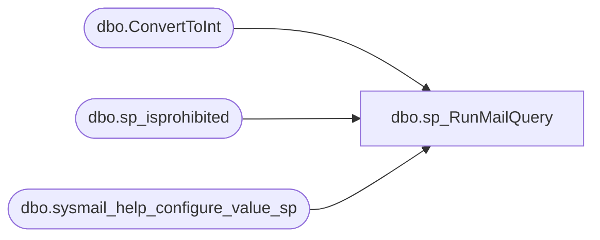

# dbo.sp_RunMailQuery

**Database:** msdb  
**Server:** STL-SSIS-P-01  

## Architecture Diagram



## Table Dependencies

| Referenced Table |
|---|
| dbo.ConvertToInt |
| dbo.sp_isprohibited |
| dbo.sysmail_help_configure_value_sp |

## Stored Procedure Code

```sql
CREATE PROCEDURE [dbo].[sp_RunMailQuery]
   @query                      NVARCHAR(max),
   @attach_results             BIT,
   @query_attachment_filename  NVARCHAR(260) = NULL,
   @no_output                  BIT,
   @query_result_header        BIT,
   @separator                  VARCHAR(1),
   @echo_error                 BIT,
   @dbuse                      sysname,
   @width                      INT,
   @temp_table_uid             uniqueidentifier,
   @query_no_truncate          BIT,
   @query_result_no_padding    BIT
AS
BEGIN
    SET NOCOUNT ON
    SET QUOTED_IDENTIFIER ON

    DECLARE @rc             INT,
            @prohibitedExts NVARCHAR(1000),
            @fileSizeStr    NVARCHAR(256),
            @fileSize       INT,
            @attach_res_int INT,
            @no_output_int  INT,
            @no_header_int  INT,
            @echo_error_int INT,
            @query_no_truncate_int INT,
            @query_result_no_padding_int   INT,
            @mailDbName     sysname,
            @uid            uniqueidentifier,
            @uidStr         VARCHAR(36)

    -- Initialize return code value as 1
    SET @rc = 1

    --
    --Get config settings and verify parameters
    --
    SET @query_attachment_filename = LTRIM(RTRIM(@query_attachment_filename))

    --Get the maximum file size allowed for attachments from sysmailconfig.
    EXEC msdb.dbo.sysmail_help_configure_value_sp @parameter_name = N'MaxFileSize', 
                                                @parameter_value = @fileSizeStr OUTPUT
    --ConvertToInt will return the default if @fileSizeStr is null
    SET @fileSize = dbo.ConvertToInt(@fileSizeStr, 0x7fffffff, 100000)

    IF (@attach_results = 1)
    BEGIN
        --Need this if attaching the query
        EXEC msdb.dbo.sysmail_help_configure_value_sp @parameter_name = N'ProhibitedExtensions', 
                                                    @parameter_value = @prohibitedExts OUTPUT

        -- If attaching query results to a file and a filename isn't given create one
        IF ((@query_attachment_filename IS NOT NULL) AND (LEN(@query_attachment_filename) > 0))
        BEGIN 
          EXEC @rc = sp_isprohibited @query_attachment_filename, @prohibitedExts
          IF (@rc <> 0)
          BEGIN
              RAISERROR(14630, 16, 1, @query_attachment_filename, @prohibitedExts)
              RETURN 2
          END
        END
        ELSE
        BEGIN
            --If queryfilename is not specified, generate a random name (doesn't have to be unique)
           SET @query_attachment_filename = 'QueryResults' + CONVERT(varchar, ROUND(RAND() * 1000000, 0)) + '.txt'
        END
    END

    --Init variables used in the query execution
    SET @mailDbName = db_name()
    SET @uidStr = convert(varchar(36), @temp_table_uid)

    SET @attach_res_int        = CONVERT(int, @attach_results)
    SET @no_output_int         = CONVERT(int, @no_output)
    IF(@query_result_header = 0) SET @no_header_int  = 1 ELSE SET @no_header_int  = 0
    SET @echo_error_int        = CONVERT(int, @echo_error)
    SET @query_no_truncate_int = CONVERT(int, @query_no_truncate)
    SET @query_result_no_padding_int = CONVERT(int, @query_result_no_padding )

    EXEC @rc = master..xp_sysmail_format_query  
            @query                      = @query,
            @message                    = @mailDbName,
            @subject                    = @uidStr,
            @dbuse                      = @dbuse, 
            @attachments                = @query_attachment_filename,
            @attach_results             = @attach_res_int,
            -- format params
            @separator                  = @separator,
            @no_header                  = @no_header_int,
            @no_output                  = @no_output_int,
            @echo_error                 = @echo_error_int,
            @max_attachment_size        = @fileSize,
            @width                      = @width, 
            @query_no_truncate          = @query_no_truncate_int,
            @query_result_no_padding    = @query_result_no_padding_int
   RETURN @rc
END

dbo,sp_sem_add_message,CREATE PROCEDURE sp_sem_add_message
  @msgnum   INT           = NULL,
  @severity SMALLINT      = NULL,
  @msgtext  NVARCHAR(255) = NULL,
  @lang     sysname       = NULL, -- Message language name
  @with_log VARCHAR(5)    = 'FALSE',
  @replace  VARCHAR(7)    = NULL
AS
BEGIN
  DECLARE @retval        INT
  DECLARE @language_name sysname

  SET NOCOUNT ON

  SET ROWCOUNT 1
  SELECT @language_name = name
  FROM sys.syslanguages
  WHERE msglangid = (SELECT number
                     FROM master.dbo.spt_values
                     WHERE (type = 'LNG')
                       AND (name = @lang))
  SET ROWCOUNT 0

  SELECT @language_name = ISNULL(@language_name, 'us_english')
  EXECUTE @retval = master.dbo.sp_addmessage @msgnum, @severity, @msgtext, @language_name, @with_log, @replace
  RETURN(@retval)
END

dbo,sp_sem_drop_message,CREATE PROCEDURE sp_sem_drop_message
  @msgnum int     = NULL,
  @lang   sysname = NULL -- Message language name
AS
BEGIN
  DECLARE @retval        INT
  DECLARE @language_name sysname

  SET NOCOUNT ON

  SET ROWCOUNT 1
  SELECT @language_name = name
  FROM sys.syslanguages
  WHERE msglangid = (SELECT number
                     FROM master.dbo.spt_values
                     WHERE (type = 'LNG')
                       AND (name = @lang))
  SET ROWCOUNT 0

  SELECT @language_name = ISNULL(@language_name, 'us_english')
  EXECUTE @retval = master.dbo.sp_dropmessage @msgnum, @language_name
  RETURN(@retval)
END

dbo,sp_send_dbmail,-- sp_send_dbmail : Sends a mail from Yukon outbox.
--
CREATE PROCEDURE [dbo].[sp_send_dbmail]
   @profile_name               sysname    = NULL,        
   @recipients                 VARCHAR(MAX)  = NULL, 
   @copy_recipients            VARCHAR(MAX)  = NULL,
   @blind_copy_recipients      VARCHAR(MAX)  = NULL,
   @subject                    NVARCHAR(255) = NULL,
   @body                       NVARCHAR(MAX) = NULL, 
   @body_format                VARCHAR(20)   = NULL, 
   @importance                 VARCHAR(6)    = 'NORMAL',
   @sensitivity                VARCHAR(12)   = 'NORMAL',
   @file_attachments           NVARCHAR(MAX) = NULL,  
   @query                      NVARCHAR(MAX) = NULL,
   @execute_query_database     sysname       = NULL,  
   @attach_query_result_as_file BIT          = 0,
   @query_attachment_filename  NVARCHAR(260) = NULL,  
   @query_result_header        BIT           = 1,
   @query_result_width         INT           = 256,            
   @query_result_separator     CHAR(1)       = ' ',
   @exclude_query_output       BIT           = 0,
   @append_query_error         BIT           = 0,
   @query_no_truncate          BIT           = 0,
   @query_result_no_padding    BIT           = 0,
   @mailitem_id               INT            = NULL OUTPUT,
   @from_address               VARCHAR(max)  = NULL,
   @reply_to                   VARCHAR(max)  = NULL
  WITH EXECUTE AS 'dbo'
AS
BEGIN
    SET NOCOUNT ON

    -- And make sure ARITHABORT is on. This is the default for yukon DB's
    SET ARITHABORT ON

    --Declare variables used by the procedure internally
    DECLARE @profile_id         INT,
            @temp_table_uid     uniqueidentifier,
            @sendmailxml        VARCHAR(max),
            @CR_str             NVARCHAR(2),
            @localmessage       NVARCHAR(255),
            @QueryResultsExist  INT,
            @AttachmentsExist   INT,
            @RetErrorMsg        NVARCHAR(4000), --Impose a limit on the error message length to avoid memory abuse 
            @rc                 INT,
            @procName           sysname,
            @trancountSave      INT,
            @tranStartedBool    INT,
            @is_sysadmin        BIT,
            @send_request_user  sysname,
            @database_user_id   INT,
            @sid                varbinary(85)

    -- Initialize 
    SELECT  @rc                 = 0,
            @QueryResultsExist  = 0,
            @AttachmentsExist   = 0,
            @temp_table_uid     = NEWID(),
            @procName           = OBJECT_NAME(@@PROCID),
            @tranStartedBool    = 0,
            @trancountSave      = @@TRANCOUNT,
            @sid                = NULL

    EXECUTE AS CALLER
       SELECT @is_sysadmin       = IS_SRVROLEMEMBER('sysadmin'),
              @send_request_user = SUSER_SNAME(),
              @database_user_id  = USER_ID()
    REVERT

    --Check if SSB is enabled in this database
    IF (ISNULL(DATABASEPROPERTYEX(DB_NAME(), N'IsBrokerEnabled'), 0) <> 1)
    BEGIN
       RAISERROR(14650, 16, 1)
       RETURN 1
    END

    --Report error if the mail queue has been stopped. 
    --sysmail_stop_sp/sysmail_start_sp changes the receive status of the SSB queue
    IF NOT EXISTS (SELECT * FROM sys.service_queues WHERE name = N'ExternalMailQueue' AND is_receive_enabled = 1)
    BEGIN
       RAISERROR(14641, 16, 1)
       RETURN 1
    END

    -- Get the relevant profile_id 
    --
    IF (@profile_name IS NULL)
    BEGIN
        -- Use the global or users default if profile name is not supplied
        SELECT TOP (1) @profile_id = pp.profile_id
        FROM msdb.dbo.sysmail_principalprofile as pp
        WHERE (pp.is_default = 1) AND
            (dbo.get_principal_id(pp.principal_sid) = @database_user_id OR pp.principal_sid = 0x00)
        ORDER BY dbo.get_principal_id(pp.principal_sid) DESC

        --Was a profile found
        IF(@profile_id IS NULL)
        BEGIN
            -- Try a profile lookup based on Windows Group membership, if any
            EXEC @rc = msdb.dbo.sp_validate_user @send_request_user, @sid OUTPUT
            IF (@rc = 0)
            BEGIN
                SELECT TOP (1) @profile_id = pp.profile_id
                FROM msdb.dbo.sysmail_principalprofile as pp
                WHERE (pp.is_default = 1) AND
                      (pp.principal_sid = @sid)
                ORDER BY dbo.get_principal_id(pp.principal_sid) DESC
            END

            IF(@profile_id IS NULL)
            BEGIN
                RAISERROR(14636, 16, 1)
                RETURN 1
            END
        END
    END
    ELSE
    BEGIN
        --Get primary account if profile name is supplied
        EXEC @rc = msdb.dbo.sysmail_verify_profile_sp @profile_id = NULL, 
                         @profile_name = @profile_name, 
                         @allow_both_nulls = 0, 
                         @allow_id_name_mismatch = 0,
                         @profileid = @profile_id OUTPUT
        IF (@rc <> 0)
            RETURN @rc

        --Make sure this user has access to the specified profile.
        --sysadmins can send on any profiles
        IF ( @is_sysadmin <> 1)
        BEGIN
            --Not a sysadmin so check users access to profile
            iF NOT EXISTS(SELECT * 
                        FROM msdb.dbo.sysmail_principalprofile 
                        WHERE ((profile_id = @profile_id) AND
                                (dbo.get_principal_id(principal_sid) = @database_user_id OR principal_sid = 0x00)))
            BEGIN
                EXEC msdb.dbo.sp_validate_user @send_request_user, @sid OUTPUT
                IF(@sid IS NULL)
                BEGIN
                    RAISERROR(14607, -1, -1, 'profile')
                    RETURN 1
                END
            END
        END
    END

    --Attach results must be specified
    IF @attach_query_result_as_file IS NULL
    BEGIN
       RAISERROR(14618, 16, 1, 'attach_query_result_as_file')
       RETURN 2
    END

    --No output must be specified
    IF @exclude_query_output IS NULL
    BEGIN
       RAISERROR(14618, 16, 1, 'exclude_query_output')
       RETURN 3
    END

    --No header must be specified
    IF @query_result_header IS NULL
    BEGIN
       RAISERROR(14618, 16, 1, 'query_result_header')
       RETURN 4
    END

    -- Check if query_result_separator is specifed
    IF @query_result_separator IS NULL OR DATALENGTH(@query_result_separator) = 0
    BEGIN
       RAISERROR(14618, 16, 1, 'query_result_separator')
       RETURN 5
    END

    --Echo error must be specified
    IF @append_query_error IS NULL
    BEGIN
       RAISERROR(14618, 16, 1, 'append_query_error')
       RETURN 6
    END

    --@body_format can be TEXT (default) or HTML
    IF (@body_format IS NULL)
    BEGIN
       SET @body_format = 'TEXT'
    END
    ELSE
    BEGIN
       SET @body_format = UPPER(@body_format)

       IF @body_format NOT IN ('TEXT', 'HTML') 
       BEGIN
          RAISERROR(14626, 16, 1, @body_format)
          RETURN 13
       END
    END

    --Importance must be specified
    IF @importance IS NULL
    BEGIN
       RAISERROR(14618, 16, 1, 'importance')
       RETURN 15
    END

    SET @importance = UPPER(@importance)

    --Importance must be one of the predefined values
    IF @importance NOT IN ('LOW', 'NORMAL', 'HIGH')
    BEGIN
       RAISERROR(14622, 16, 1, @importance)
       RETURN 16
    END

    --Sensitivity must be specified
    IF @sensitivity IS NULL
    BEGIN
       RAISERROR(14618, 16, 1, 'sensitivity')
       RETURN 17
    END

    SET @sensitivity = UPPER(@sensitivity)

    --Sensitivity must be one of predefined values
    IF @sensitivity NOT IN ('NORMAL', 'PERSONAL', 'PRIVATE', 'CONFIDENTIAL')
    BEGIN
       RAISERROR(14623, 16, 1, @sensitivity)
       RETURN 18
    END

    --Message body cannot be null. Atleast one of message, subject, query,
    --attachments must be specified.
    IF( (@body IS NULL AND @query IS NULL AND @file_attachments IS NULL AND @subject IS NULL)
       OR
    ( (LEN(@body) IS NULL OR LEN(@body) <= 0)  
       AND (LEN(@query) IS NULL  OR  LEN(@query) <= 0)
       AND (LEN(@file_attachments) IS NULL OR LEN(@file_attachments) <= 0)
       AND (LEN(@subject) IS NULL OR LEN(@subject) <= 0)
    )
    )
    BEGIN
       RAISERROR(14624, 16, 1, '@body, @query, @file_attachments, @subject')
       RETURN 19
    END   
    ELSE
       IF @subject IS NULL OR LEN(@subject) <= 0
          SET @subject='SQL Server Message'

    --Recipients cannot be empty. Atleast one of the To, Cc, Bcc must be specified
    IF ( (@recipients IS NULL AND @copy_recipients IS NULL AND 
       @blind_copy_recipients IS NULL
        )     
       OR
        ( (LEN(@recipients) IS NULL OR LEN(@recipients) <= 0)
       AND (LEN(@copy_recipients) IS NULL OR LEN(@copy_recipients) <= 0)
       AND (LEN(@blind_copy_recipients) IS NULL OR LEN(@blind_copy_recipients) <= 0)
        )
    )
    BEGIN
       RAISERROR(14624, 16, 1, '@recipients, @copy_recipients, @blind_copy_recipients')
       RETURN 20
    END

    EXEC @rc = msdb.dbo.sysmail_verify_addressparams_sp @address = @recipients, @parameter_name='@recipients' 
    IF (@rc <> 0)
       RETURN @rc
    EXEC @rc = msdb.dbo.sysmail_verify_addressparams_sp @address = @copy_recipients, @parameter_name='@copy_recipients' 
    IF (@rc <> 0)
       RETURN @rc
    EXEC @rc = msdb.dbo.sysmail_verify_addressparams_sp @address = @blind_copy_recipients, @parameter_name='@blind_copy_recipients' 
    IF (@rc <> 0)
       RETURN @rc
    EXEC @rc = msdb.dbo.sysmail_verify_addressparams_sp @address = @reply_to, @parameter_name='@reply_to' 
    IF (@rc <> 0)
       RETURN @rc

    --If query is not specified, attach results and no header cannot be true.
    IF ( (@query IS NULL OR LEN(@query) <= 0) AND @attach_query_result_as_file = 1)
    BEGIN
       RAISERROR(14625, 16, 1)
       RETURN 21
    END

    --
    -- Execute Query if query is specified
    IF ((@query IS NOT NULL) AND (LEN(@query) > 0))
    BEGIN
        EXECUTE AS CALLER
        EXEC @rc = sp_RunMailQuery 
                @query                     = @query,
                @attach_results            = @attach_query_result_as_file,
                @query_attachment_filename = @query_attachment_filename,
                @no_output                 = @exclude_query_output,
                @query_result_header       = @query_result_header,
                @separator                 = @query_result_separator,
                @echo_error                = @append_query_error,
                @dbuse                     = @execute_query_database,
                @width                     = @query_result_width,
                @temp_table_uid            = @temp_table_uid,
                @query_no_truncate         = @query_no_truncate,
                @query_result_no_padding   = @query_result_no_padding
        
        --Switches the execution context back to the caller after last EXECUTE AS CALLER
        REVERT      

        IF(@rc <> 0 )
        BEGIN
            GOTO ErrorHandler;
        END
 
         -- Always check the transfer tables for data. They may also contain error messages
         -- Only one of the tables receives data in the call to sp_RunMailQuery
         IF(@attach_query_result_as_file = 1)
         BEGIN
             IF EXISTS(SELECT * FROM sysmail_attachments_transfer WHERE uid = @temp_table_uid)
            SET @AttachmentsExist = 1
         END
         ELSE
         BEGIN
             IF EXISTS(SELECT * FROM sysmail_query_transfer WHERE uid = @temp_table_uid AND uid IS NOT NULL)
            SET @QueryResultsExist = 1
         END

         -- Exit if there was an error and caller doesn't want the error appended to the mail
         IF (@rc <> 0 AND @append_query_error = 0)
         BEGIN
            --Error msg with be in either the attachment table or the query table 
            --depending on the setting of @attach_query_result_as_file
            IF(@attach_query_result_as_file = 1)
            BEGIN
               --Copy query results from the attachments table to mail body
               SELECT @RetErrorMsg = CONVERT(NVARCHAR(4000), attachment)
               FROM sysmail_attachments_transfer 
               WHERE uid = @temp_table_uid
            END
            ELSE
            BEGIN
               --Copy query results from the query table to mail body
               SELECT @RetErrorMsg = text_data 
               FROM sysmail_query_transfer 
               WHERE uid = @temp_table_uid
            END

            GOTO ErrorHandler;
         END
         SET @AttachmentsExist = @attach_query_result_as_file
    END
    ELSE
    BEGIN
        --If query is not specified, attach results cannot be true.
        IF (@attach_query_result_as_file = 1)
        BEGIN
           RAISERROR(14625, 16, 1)
           RETURN 21
        END
    END

    --Get the prohibited extensions for attachments from sysmailconfig.
    IF ((@file_attachments IS NOT NULL) AND (LEN(@file_attachments) > 0)) 
    BEGIN
        EXECUTE AS CALLER
        EXEC @rc = sp_GetAttachmentData 
                        @attachments = @file_attachments, 
                        @temp_table_uid = @temp_table_uid,
                        @exclude_query_output = @exclude_query_output
        REVERT
        IF (@rc <> 0)
            GOTO ErrorHandler;
        
        IF EXISTS(SELECT * FROM sysmail_attachments_transfer WHERE uid = @temp_table_uid)
            SET @AttachmentsExist = 1
    END

    -- Start a transaction if not already in one. 
    -- Note: For rest of proc use GOTO ErrorHandler for falures  
    if (@trancountSave = 0) 
       BEGIN TRAN @procName

    SET @tranStartedBool = 1

    -- Store complete mail message for history/status purposes  
    INSERT sysmail_mailitems
    (
       profile_id,   
       recipients,
       copy_recipients,
       blind_copy_recipients,
       subject,
       body, 
       body_format, 
       importance,
       sensitivity,
       file_attachments,  
       attachment_encoding,
       query,
       execute_query_database,
       attach_query_result_as_file,
       query_result_header,
       query_result_width,          
       query_result_separator,
       exclude_query_output,
       append_query_error,
       send_request_user,
       from_address,
       reply_to
    )
    VALUES
    (
       @profile_id,        
       @recipients, 
       @copy_recipients,
       @blind_copy_recipients,
       @subject,
       @body, 
       @body_format, 
       @importance,
       @sensitivity,
       @file_attachments,  
       'MIME',
       @query,
       @execute_query_database,  
       @attach_query_result_as_file,
       @query_result_header,
       @query_result_width,            
       @query_result_separator,
       @exclude_query_output,
       @append_query_error,
       @send_request_user,
       @from_address,
       @reply_to
    )

    SELECT @rc          = @@ERROR,
           @mailitem_id = SCOPE_IDENTITY()

    IF(@rc <> 0)
        GOTO ErrorHandler;

    --Copy query into the message body
    IF(@QueryResultsExist = 1)
    BEGIN
      -- if the body is null initialize it
        UPDATE sysmail_mailitems
        SET body = N''
        WHERE mailitem_id = @mailitem_id
        AND body is null

        --Add CR, a \r followed by \n, which is 0xd and then 0xa
        SET @CR_str = CHAR(13) + CHAR(10)
        UPDATE sysmail_mailitems
        SET body.WRITE(@CR_str, NULL, NULL)
        WHERE mailitem_id = @mailitem_id

   --Copy query results to mail body
        UPDATE sysmail_mailitems
        SET body.WRITE( (SELECT text_data from sysmail_query_transfer WHERE uid = @temp_table_uid), NULL, NULL )
        WHERE mailitem_id = @mailitem_id

    END

    --Copy into the attachments table
    IF(@AttachmentsExist = 1)
    BEGIN
        --Copy temp attachments to sysmail_attachments      
        INSERT INTO sysmail_attachments(mailitem_id, filename, filesize, attachment)
        SELECT @mailitem_id, filename, filesize, attachment
        FROM sysmail_attachments_transfer
        WHERE uid = @temp_table_uid
    END

    -- Create the primary SSB xml maessage
    SET @sendmailxml = '<requests:SendMail xmlns:xsi="http://www.w3.org/2001/XMLSchema-instance" xsi:schemaLocation="http://schemas.microsoft.com/databasemail/requests RequestTypes.xsd" xmlns:requests="http://schemas.microsoft.com/databasemail/requests"><MailItemId>'
                        + CONVERT(NVARCHAR(20), @mailitem_id) + N'</MailItemId></requests:SendMail>'

    -- Send the send request on queue.
    EXEC @rc = sp_SendMailQueues @sendmailxml
    IF @rc <> 0
    BEGIN
       RAISERROR(14627, 16, 1, @rc, 'send mail')
       GOTO ErrorHandler;
    END

    -- Print success message if required
    IF (@exclude_query_output = 0)
    BEGIN
       SET @localmessage = FORMATMESSAGE(14635, @mailitem_id)
       PRINT @localmessage
    END  

    --
    -- See if the transaction needs to be commited
    --
    IF (@trancountSave = 0 and @tranStartedBool = 1)
       COMMIT TRAN @procName

    -- All done OK
    goto ExitProc;

    -----------------
    -- Error Handler
    -----------------
ErrorHandler:
    IF (@tranStartedBool = 1) 
       ROLLBACK TRAN @procName

    ------------------
    -- Exit Procedure
    ------------------
ExitProc:
   
    --Always delete query and attactment transfer records. 
   --Note: Query results can also be returned in the sysmail_attachments_transfer table
    DELETE sysmail_attachments_transfer WHERE uid = @temp_table_uid
    DELETE sysmail_query_transfer WHERE uid = @temp_table_uid

   --Raise an error it the query execution fails
   -- This will only be the case when @append_query_error is set to 0 (false)
   IF( (@RetErrorMsg IS NOT NULL) AND (@exclude_query_output=0) )
   BEGIN
      RAISERROR(14661, -1, -1, @RetErrorMsg)
   END

    RETURN (@rc)
END

dbo,sp_SendMailMessage,-- sp_SendMailMessage : Sends a request on the mail items SSB queue
CREATE PROCEDURE sp_SendMailMessage
    @contract_name sysname, -- Name of contract
    @message_type sysname,  -- Type of message
    @request varchar(max) -- XML message to send
  WITH EXECUTE AS 'dbo'
AS

SET NOCOUNT ON

DECLARE @conversationHandle uniqueidentifier;
DECLARE @error int

-- Start a conversation with the remote service
BEGIN DIALOG  @conversationHandle
    FROM SERVICE    [InternalMailService]
    TO SERVICE      'ExternalMailService'
    ON CONTRACT     @contract_name
    WITH ENCRYPTION=OFF

-- Check error
SET @error = @@ERROR
IF @error <> 0
BEGIN
    RETURN @error
END

-- Send message
;SEND ON CONVERSATION @conversationHandle MESSAGE TYPE @message_type (@request)

-- Check error
SET @error = @@ERROR
IF @error <> 0
BEGIN
    RETURN @error
END

RETURN 0

dbo,sp_SendMailQueues,-- sp_SendMailQueues : Writes a send mail request to the queue.
--
CREATE  PROCEDURE sp_SendMailQueues
    @message_data      varchar(max) -- The request in XML
AS
BEGIN
    SET NOCOUNT ON

    DECLARE @contract_name nvarchar(128)
    DECLARE @message_type nvarchar(128)
    DECLARE @retValue int

    SET @message_type = '{//www.microsoft.com/databasemail/messages}SendMail'
    SET @contract_name = '//www.microsoft.com/databasemail/contracts/SendMail/v1.0'

    --Writes the message to the queue
    EXEC @retValue = sp_SendMailMessage @contract_name, @message_type, @message_data

    RETURN @retValue
END

dbo,sp_set_local_time,CREATE PROCEDURE sp_set_local_time
  @server_name           sysname = NULL,
  @adjustment_in_minutes INT          = 0 -- Only needed for Win9x
AS
BEGIN
  DECLARE @ret              INT
  DECLARE @local_time       INT
  DECLARE @local_date       INT
  DECLARE @current_datetime DATETIME
  DECLARE @local_time_sz    VARCHAR(30)
  DECLARE @cmd              NVARCHAR(200)
  DECLARE @date_format      NVARCHAR(64)
  DECLARE @year_sz          NVARCHAR(16)
  DECLARE @month_sz         NVARCHAR(16)
  DECLARE @day_sz           NVARCHAR(16)

  -- Synchronize the clock with the remote server (if supplied)
  -- NOTE: NT takes timezones into account, whereas Win9x does not
  IF (@server_name IS NOT NULL)
  BEGIN
    SELECT @cmd = N'net time \\' + @server_name + N' /set /y'
    EXECUTE @ret = master.dbo.xp_cmdshell @cmd, no_output
    IF (@ret <> 0)
      RETURN(1) -- Failure
  END

  -- Since NET TIME on Win9x does not take time zones into account we need to manually adjust
  -- for this using @adjustment_in_minutes which will be the difference between the MSX GMT
  -- offset and the target server GMT offset
  IF ((PLATFORM() & 0x2) = 0x2) -- Win9x
  BEGIN
    -- Get the date format from the registry (so that we can construct our DATE command-line command)
    EXECUTE master.dbo.xp_regread N'HKEY_CURRENT_USER',
                                  N'Control Panel\International',
                                  N'sShortDate',
                                  @date_format OUTPUT,
                                  N'no_output'
    SELECT @date_format = LOWER(@date_format)

    IF (@adjustment_in_minutes <> 0)
    BEGIN
      -- Wait for SQLServer to re-cache the OS time
      WAITFOR DELAY '00:01:00'

      SELECT @current_datetime = DATEADD(mi, @adjustment_in_minutes, GETDATE())
      SELECT @local_time_sz = SUBSTRING(CONVERT(VARCHAR, @current_datetime, 8), 1, 5)
      SELECT @local_time = CONVERT(INT, LTRIM(SUBSTRING(@local_time_sz, 1, PATINDEX('%:%', @local_time_sz) - 1)  + SUBSTRING(@local_time_sz, PATINDEX('%:%', @local_time_sz) + 1, 2)))
      SELECT @local_date = CONVERT(INT, CONVERT(VARCHAR, @current_datetime, 112))

      -- Set the date
      SELECT @year_sz = CONVERT(NVARCHAR, @local_date / 10000)
      SELECT @month_sz = CONVERT(NVARCHAR, (@local_date % 10000) / 100)
      SELECT @day_sz = CONVERT(NVARCHAR, @local_date % 100)

      IF (@date_format LIKE N'y%m%d')
        SELECT @cmd = N'DATE ' + @year_sz + N'-' + @month_sz + N'-' + @day_sz
      IF (@date_format LIKE N'y%d%m')
        SELECT @cmd = N'DATE ' + @year_sz + N'-' + @day_sz + N'-' + @month_sz
      IF (@date_format LIKE N'm%d%y')
        SELECT @cmd = N'DATE ' + @month_sz + N'-' + @day_sz + N'-' + @year_sz
      IF (@date_format LIKE N'd%m%y')
        SELECT @cmd = N'DATE ' + @day_sz + N'-' + @month_sz + N'-' + @year_sz

      EXECUTE @ret = master.dbo.xp_cmdshell @cmd, no_output
      IF (@ret <> 0)
        RETURN 1 -- Failure

      -- Set the time (NOTE: We can't set the millisecond part of the time, so we may be up to .999 sec off)
      SELECT @cmd = N'TIME ' + CONVERT(NVARCHAR, @local_time / 100) + N':' + CONVERT(NVARCHAR, @local_time % 100) + ':' + CONVERT(NVARCHAR(2), DATEPART(SS, GETDATE()))
      EXECUTE @ret = master.dbo.xp_cmdshell @cmd, no_output
      IF (@ret <> 0)
        RETURN 1 -- Failure
    END

  END

  RETURN(0) -- Success
END
```

