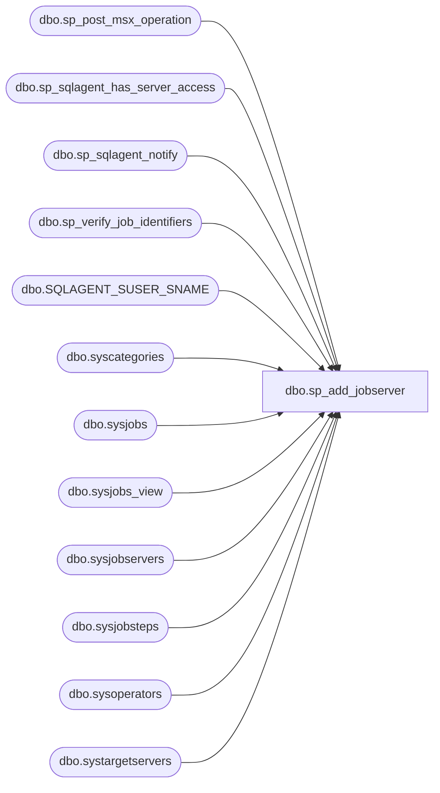

# dbo.sp_add_jobserver

**Database:** msdb  
**Server:** STL-SSIS-P-01  

## Architecture Diagram



## Table Dependencies

| Referenced Table |
|---|
| dbo.sp_post_msx_operation |
| dbo.sp_sqlagent_has_server_access |
| dbo.sp_sqlagent_notify |
| dbo.sp_verify_job_identifiers |
| dbo.SQLAGENT_SUSER_SNAME |
| dbo.syscategories |
| dbo.sysjobs |
| dbo.sysjobs_view |
| dbo.sysjobservers |
| dbo.sysjobsteps |
| dbo.sysoperators |
| dbo.systargetservers |

## Stored Procedure Code

```sql
CREATE PROCEDURE sp_add_jobserver
  @job_id         UNIQUEIDENTIFIER = NULL, -- Must provide either this or job_name
  @job_name       sysname          = NULL, -- Must provide either this or job_id
  @server_name    sysname         = NULL, -- if NULL will default to serverproperty('ServerName')
  @automatic_post BIT = 1                  -- Flag for SEM use only
AS
BEGIN
  DECLARE @retval                    INT
  DECLARE @server_id                 INT
  DECLARE @job_type                  VARCHAR(12)
  DECLARE @current_job_category_type VARCHAR(12)
  DECLARE @msx_operator_id           INT
  DECLARE @local_server_name         sysname
  DECLARE @is_sysadmin               INT
  DECLARE @job_owner                 sysname
  DECLARE @owner_sid                 VARBINARY(85)
  DECLARE @owner_name                sysname

  SET NOCOUNT ON

  IF (@server_name IS NULL) OR (UPPER(@server_name collate SQL_Latin1_General_CP1_CS_AS) = N'(LOCAL)')
    SELECT @server_name = CONVERT(sysname, SERVERPROPERTY('ServerName'))

  -- Remove any leading/trailing spaces from parameters
  SELECT @server_name = UPPER(LTRIM(RTRIM(@server_name)))

  EXECUTE @retval = sp_verify_job_identifiers '@job_name',
                                              '@job_id',
                                               @job_name OUTPUT,
                                               @job_id   OUTPUT
  IF (@retval <> 0)
    RETURN(1) -- Failure

  -- First, check if the server is the local server
  SELECT @local_server_name = CONVERT(NVARCHAR,SERVERPROPERTY ('SERVERNAME'))

  IF (@server_name = UPPER(@local_server_name))
    SELECT @server_name = UPPER(CONVERT(sysname, SERVERPROPERTY('ServerName')))

  -- For a multi-server job...
  IF (@server_name <> UPPER(CONVERT(sysname, SERVERPROPERTY('ServerName'))))
  BEGIN
    -- 1) Only sysadmin can add a multi-server job
    IF (ISNULL(IS_SRVROLEMEMBER(N'sysadmin'), 0) = 0) 
    BEGIN
       RAISERROR(14398, -1, -1);
       RETURN(1) -- Failure
    END

    -- 2) Job must be owned by sysadmin
    SELECT @owner_sid = owner_sid, @owner_name = dbo.SQLAGENT_SUSER_SNAME(owner_sid)
    FROM msdb.dbo.sysjobs
    WHERE (job_id = @job_id)

    IF @owner_sid = 0xFFFFFFFF
    BEGIN
      SELECT @is_sysadmin = 1
    END
    ELSE
    BEGIN
      SELECT @is_sysadmin = 0
      EXECUTE msdb.dbo.sp_sqlagent_has_server_access @login_name = @owner_name, @is_sysadmin_member = @is_sysadmin OUTPUT
    END
    
    IF (@is_sysadmin = 0)
    BEGIN
      RAISERROR(14544, -1, -1, @owner_name, N'sysadmin')
      RETURN(1) -- Failure
    END

    -- 3) Check if any of the TSQL steps have a non-null database_user_name
    IF (EXISTS (SELECT *
                FROM msdb.dbo.sysjobsteps
                WHERE (job_id = @job_id)
                  AND (subsystem = N'TSQL')
                  AND (database_user_name IS NOT NULL)))
    BEGIN
      RAISERROR(14542, -1, -1, N'database_user_name')
      RETURN(1) -- Failure
    END

    SELECT @server_id = server_id
    FROM msdb.dbo.systargetservers
    WHERE (UPPER(server_name) = @server_name)
    IF (@server_id IS NULL)
    BEGIN
      RAISERROR(14262, -1, -1, '@server_name', @server_name)
      RETURN(1) -- Failure
    END
  END
  ELSE
    SELECT @server_id = 0

  -- Check that this job has not already been targeted at this server
  IF (EXISTS (SELECT *
               FROM msdb.dbo.sysjobservers
               WHERE (job_id = @job_id)
                 AND (server_id = @server_id)))
  BEGIN
    RAISERROR(14269, -1, -1, @job_name, @server_name)
    RETURN(1) -- Failure
  END

  -- Prevent the job from being targeted at both the local AND remote servers
  SELECT @job_type = 'UNKNOWN'
  IF (EXISTS (SELECT *
              FROM msdb.dbo.sysjobservers
              WHERE (job_id = @job_id)
                AND (server_id = 0)))
    SELECT @job_type = 'LOCAL'
  ELSE
  IF (EXISTS (SELECT *
              FROM msdb.dbo.sysjobservers
              WHERE (job_id = @job_id)
                AND (server_id <> 0)))
    SELECT @job_type = 'MULTI-SERVER'

  IF ((@server_id = 0) AND (@job_type = 'MULTI-SERVER'))
  BEGIN
    RAISERROR(14290, -1, -1)
    RETURN(1) -- Failure
  END
  IF ((@server_id <> 0) AND (@job_type = 'LOCAL'))
  BEGIN
    RAISERROR(14291, -1, -1)
    RETURN(1) -- Failure
  END

  -- For a multi-server job, check that any notifications are to the MSXOperator
  IF (@job_type = 'MULTI-SERVER')
  BEGIN
    SELECT @msx_operator_id = id
    FROM msdb.dbo.sysoperators
    WHERE (name = N'MSXOperator')

    IF (EXISTS (SELECT *
                FROM msdb.dbo.sysjobs
                WHERE (job_id = @job_id)
                  AND (((notify_email_operator_id <> 0)   AND (notify_email_operator_id <> @msx_operator_id)) OR
                       ((notify_page_operator_id <> 0)    AND (notify_page_operator_id <> @msx_operator_id))  OR
                       ((notify_netsend_operator_id <> 0) AND (notify_netsend_operator_id <> @msx_operator_id)))))
    BEGIN
      RAISERROR(14221, -1, -1, 'MSXOperator')
      RETURN(1) -- Failure
    END
  END

  -- Insert the sysjobservers row
  INSERT INTO msdb.dbo.sysjobservers
         (job_id,
          server_id,
          last_run_outcome,
          last_outcome_message,
          last_run_date,
          last_run_time,
          last_run_duration)
  VALUES (@job_id,
          @server_id,
          5,  -- ie. SQLAGENT_EXEC_UNKNOWN (can't use 0 since this is SQLAGENT_EXEC_FAIL)
          NULL,
          0,
          0,
          0)

  -- Re-categorize the job (if necessary)
  SELECT @current_job_category_type = CASE category_type
                                        WHEN 1 THEN 'LOCAL'
                                        WHEN 2 THEN 'MULTI-SERVER'
                                      END
  FROM msdb.dbo.sysjobs_view  sjv,
       msdb.dbo.syscategories sc
  WHERE (sjv.category_id = sc.category_id)
    AND (sjv.job_id = @job_id)

  IF (@server_id = 0) AND (@current_job_category_type = 'MULTI-SERVER')
  BEGIN
    UPDATE msdb.dbo.sysjobs
    SET category_id = 0 -- [Uncategorized (Local)]
    WHERE (job_id = @job_id)
  END
  IF (@server_id <> 0) AND (@current_job_category_type = 'LOCAL')
  BEGIN
    UPDATE msdb.dbo.sysjobs
    SET category_id = 2 -- [Uncategorized (Multi-Server)]
    WHERE (job_id = @job_id)
  END

  -- Instruct the new server to pick up the job
  IF (@automatic_post = 1)
    EXECUTE @retval = sp_post_msx_operation 'INSERT', 'JOB', @job_id, @server_name

  -- If the job is local, make sure that SQLServerAgent caches it
  IF (@server_id = 0)
  BEGIN
    EXECUTE msdb.dbo.sp_sqlagent_notify @op_type     = N'J',
                                        @job_id      = @job_id,
                                        @action_type = N'I'
  END

  RETURN(@retval) -- 0 means success
END

dbo,sp_add_jobstep,CREATE PROCEDURE dbo.sp_add_jobstep
  @job_id                UNIQUEIDENTIFIER = NULL,   -- Must provide either this or job_name
  @job_name              sysname          = NULL,   -- Must provide either this or job_id
  @step_id               INT              = NULL,   -- The proc assigns a default
  @step_name             sysname,
  @subsystem             NVARCHAR(40)     = N'TSQL',
  @command               NVARCHAR(max)   = NULL,   
  @additional_parameters NVARCHAR(max)    = NULL,
  @cmdexec_success_code  INT              = 0,
  @on_success_action     TINYINT          = 1,      -- 1 = Quit With Success, 2 = Quit With Failure, 3 = Goto Next Step, 4 = Goto Step
  @on_success_step_id    INT              = 0,
  @on_fail_action        TINYINT          = 2,      -- 1 = Quit With Success, 2 = Quit With Failure, 3 = Goto Next Step, 4 = Goto Step
  @on_fail_step_id       INT              = 0,
  @server                sysname      = NULL,
  @database_name         sysname          = NULL,
  @database_user_name    sysname          = NULL,
  @retry_attempts        INT              = 0,      -- No retries
  @retry_interval        INT              = 0,      -- 0 minute interval
  @os_run_priority       INT              = 0,      -- -15 = Idle, -1 = Below Normal, 0 = Normal, 1 = Above Normal, 15 = Time Critical)
  @output_file_name      NVARCHAR(200)    = NULL,
  @flags                 INT              = 0,       -- 0 = Normal, 
                                                     -- 1 = Encrypted command (read only), 
                                                     -- 2 = Append output files (if any), 
                                                     -- 4 = Write TSQL step output to step history,                                            
                                                     -- 8 = Write log to table (overwrite existing history), 
                                                     -- 16 = Write log to table (append to existing history)
                                                     -- 32 = Write all output to job history
                                                     -- 64 = Create a Windows event to use as a signal for the Cmd jobstep to abort
  @proxy_id                 INT                = NULL,
  @proxy_name               sysname          = NULL,
  -- mutual exclusive; must specify only one of above 2 parameters to 
  -- identify the proxy. 
  @step_uid UNIQUEIDENTIFIER = NULL OUTPUT
AS
BEGIN
  DECLARE @retval      INT

  SET NOCOUNT ON
  -- Only sysadmin's or db_owner's of msdb can add replication job steps directly
  IF (UPPER(@subsystem collate SQL_Latin1_General_CP1_CS_AS) IN
                        (N'DISTRIBUTION',
                         N'SNAPSHOT',
                         N'LOGREADER',
                         N'MERGE',
                         N'QUEUEREADER'))
  BEGIN
    IF NOT ((ISNULL(IS_SRVROLEMEMBER(N'sysadmin'), 0) = 1) OR
            (ISNULL(IS_MEMBER(N'db_owner'), 0) = 1) OR
            (UPPER(USER_NAME() collate SQL_Latin1_General_CP1_CS_AS) = N'DBO'))
    BEGIN
      RAISERROR(14260, -1, -1)
      RETURN(1) -- Failure
    END
  END

  --Only sysadmin can specify @database_user_name
  IF (@database_user_name IS NOT NULL) AND (ISNULL(IS_SRVROLEMEMBER(N'sysadmin'), 0) <> 1)
  BEGIN
    RAISERROR(14583, -1, -1)
    RETURN(1) -- Failure    
  END

  -- Make sure Dts is translated into new subsystem's name SSIS
  IF UPPER(@subsystem collate SQL_Latin1_General_CP1_CS_AS) = N'DTS'
  BEGIN
    SET @subsystem = N'SSIS'
  END

  EXECUTE @retval = dbo.sp_add_jobstep_internal @job_id = @job_id,
                                                @job_name = @job_name,
                                                @step_id = @step_id,
                                                @step_name = @step_name,
                                                @subsystem = @subsystem,
                                                @command = @command,
                                                @additional_parameters = @additional_parameters,
                                                @cmdexec_success_code = @cmdexec_success_code,
                                                @on_success_action = @on_success_action,
                                                @on_success_step_id = @on_success_step_id,
                                                @on_fail_action = @on_fail_action,
                                                @on_fail_step_id = @on_fail_step_id,
                                                @server = @server,
                                                @database_name = @database_name,
                                                @database_user_name = @database_user_name,
                                                @retry_attempts = @retry_attempts,
                                                @retry_interval = @retry_interval,
                                                @os_run_priority = @os_run_priority,
                                                @output_file_name = @output_file_name,
                                                @flags = @flags,
                                                            @proxy_id = @proxy_id,
                                                @proxy_name = @proxy_name,
                                                            @step_uid = @step_uid OUTPUT


  RETURN(@retval)
END

dbo,sp_add_jobstep_internal,CREATE PROCEDURE dbo.sp_add_jobstep_internal
  @job_id                UNIQUEIDENTIFIER = NULL,   -- Must provide either this or job_name
  @job_name              sysname          = NULL,   -- Must provide either this or job_id
  @step_id               INT              = NULL,   -- The proc assigns a default
  @step_name             sysname,
  @subsystem             NVARCHAR(40)     = N'TSQL',
  @command               NVARCHAR(max)    = NULL,
  @additional_parameters NVARCHAR(max)    = NULL,
  @cmdexec_success_code  INT              = 0,
  @on_success_action     TINYINT          = 1,      -- 1 = Quit With Success, 2 = Quit With Failure, 3 = Goto Next Step, 4 = Goto Step
  @on_success_step_id    INT              = 0,
  @on_fail_action        TINYINT          = 2,      -- 1 = Quit With Success, 2 = Quit With Failure, 3 = Goto Next Step, 4 = Goto Step
  @on_fail_step_id       INT              = 0,
  @server                sysname          = NULL,
  @database_name         sysname          = NULL,
  @database_user_name    sysname          = NULL,
  @retry_attempts        INT              = 0,      -- No retries
  @retry_interval        INT              = 0,      -- 0 minute interval
  @os_run_priority       INT              = 0,      -- -15 = Idle, -1 = Below Normal, 0 = Normal, 1 = Above Normal, 15 = Time Critical)
  @output_file_name      NVARCHAR(200)    = NULL,
  @flags                 INT              = 0,       --  0 = Normal, 
                                                     --  1 = Encrypted command (read only), 
                                                     --  2 = Append output files (if any), 
                                                     --  4 = Write TSQL step output to step history
                                                     --  8 = Write log to table (overwrite existing history)
                                                     -- 16 = Write log to table (append to existing history)
                                                     -- 32 = Write all output to job history
                                                     -- 64 = Create a Windows event to use as a signal for the Cmd jobstep to abort
  @proxy_id               int               = NULL,
  @proxy_name              sysname           = NULL,
  -- mutual exclusive; must specify only one of above 2 parameters to 
  -- identify the proxy. 
  @step_uid UNIQUEIDENTIFIER              = NULL OUTPUT
AS
BEGIN
  DECLARE @retval         INT
  DECLARE @max_step_id    INT
  DECLARE @job_owner_sid  VARBINARY(85)
  DECLARE @subsystem_id   INT
  DECLARE @auto_proxy_name sysname
  SET NOCOUNT ON

  -- Remove any leading/trailing spaces from parameters
  SELECT @step_name          = LTRIM(RTRIM(@step_name))
  SELECT @subsystem          = LTRIM(RTRIM(@subsystem))
  SELECT @server             = LTRIM(RTRIM(@server))
  SELECT @database_name      = LTRIM(RTRIM(@database_name))
  SELECT @database_user_name = LTRIM(RTRIM(@database_user_name))
  SELECT @output_file_name   = LTRIM(RTRIM(@output_file_name))
  SELECT @proxy_name         = LTRIM(RTRIM(@proxy_name))

  -- Turn [nullable] empty string parameters into NULLs
  IF (@server             = N'') SELECT @server             = NULL
  IF (@database_name      = N'') SELECT @database_name      = NULL
  IF (@database_user_name = N'') SELECT @database_user_name = NULL
  IF (@output_file_name   = N'') SELECT @output_file_name   = NULL
  IF (@proxy_name         = N'') SELECT @proxy_name         = NULL

  -- Check authority (only SQLServerAgent can add a step to a non-local job)
  EXECUTE @retval = sp_verify_jobproc_caller @job_id = @job_id, @program_name = N'SQLAgent%'
  IF (@retval <> 0)
    RETURN(@retval)

  EXECUTE @retval = sp_verify_job_identifiers '@job_name',
                                              '@job_id',
                                               @job_name OUTPUT,
                                               @job_id   OUTPUT,
                                               @owner_sid = @job_owner_sid OUTPUT
  IF (@retval <> 0)
    RETURN(1) -- Failure

  IF ((ISNULL(IS_SRVROLEMEMBER(N'sysadmin'), 0) <> 1) AND
      (SUSER_SID() <> @job_owner_sid))
  BEGIN
     RAISERROR(14525, -1, -1)
     RETURN(1) -- Failure
  END
  

  -- check proxy identifiers only if a proxy has been provided
  IF (@proxy_id IS NOT NULL) or (@proxy_name IS NOT NULL)
  BEGIN
    EXECUTE @retval = sp_verify_proxy_identifiers '@proxy_name',
                                                  '@proxy_id',
                                                   @proxy_name OUTPUT,
                                                   @proxy_id   OUTPUT
    IF (@retval <> 0)
      RETURN(1) -- Failure
   END

  -- Default step id (if not supplied)
  IF (@step_id IS NULL)
  BEGIN
    SELECT @step_id = ISNULL(MAX(step_id), 0) + 1
    FROM msdb.dbo.sysjobsteps
    WHERE (job_id = @job_id)
  END

  -- Check parameters
  EXECUTE @retval = sp_verify_jobstep @job_id,
                                      @step_id,
                                      @step_name,
                                      @subsystem,
                                      @command,
                                      @server,
                                      @on_success_action,
                                      @on_success_step_id,
                                      @on_fail_action,
                                      @on_fail_step_id,
                                      @os_run_priority,
                                      @database_name      OUTPUT,
                                      @database_user_name OUTPUT,
                                      @flags,
                                      @output_file_name,
                                               @proxy_id

  IF (@retval <> 0)
    RETURN(1) -- Failure

  -- Get current maximum step id
  SELECT @max_step_id = ISNULL(MAX(step_id), 0)
  FROM msdb.dbo.sysjobsteps
  WHERE (job_id = @job_id)

  DECLARE @TranCounter INT;
  SET @TranCounter = @@TRANCOUNT;
  IF @TranCounter = 0
  BEGIN
      -- start our own transaction if there is no outer transaction
      BEGIN TRANSACTION;
  END
  
  -- Modify database.
  BEGIN TRY
    -- Update the job's version/last-modified information
    UPDATE msdb.dbo.sysjobs
    SET version_number = version_number + 1,
        date_modified = GETDATE()
    WHERE (job_id = @job_id)

    -- Adjust step id's (unless the new step is being inserted at the 'end')
    -- NOTE: We MUST do this before inserting the step.
    IF (@step_id <= @max_step_id)
    BEGIN
      UPDATE msdb.dbo.sysjobsteps
      SET step_id = step_id + 1
      WHERE (step_id >= @step_id)
        AND (job_id = @job_id)

      -- Clean up OnSuccess/OnFail references
      UPDATE msdb.dbo.sysjobsteps
      SET on_success_step_id = on_success_step_id + 1
      WHERE (on_success_step_id >= @step_id)
        AND (job_id = @job_id)

      UPDATE msdb.dbo.sysjobsteps
      SET on_fail_step_id = on_fail_step_id + 1
      WHERE (on_fail_step_id >= @step_id)
        AND (job_id = @job_id)

      UPDATE msdb.dbo.sysjobsteps
      SET on_success_step_id = 0,
          on_success_action = 1  -- Quit With Success
      WHERE (on_success_step_id = @step_id)
        AND (job_id = @job_id)

      UPDATE msdb.dbo.sysjobsteps
      SET on_fail_step_id = 0,
          on_fail_action = 2     -- Quit With Failure
      WHERE (on_fail_step_id = @step_id)
        AND (job_id = @job_id)
    END

    SELECT @step_uid = NEWID()

    -- Insert the step
    INSERT INTO msdb.dbo.sysjobsteps
           (job_id,
            step_id,
            step_name,
            subsystem,
            command,
            flags,
            additional_parameters,
            cmdexec_success_code,
            on_success_action,
            on_success_step_id,
            on_fail_action,
            on_fail_step_id,
            server,
            database_name,
            database_user_name,
            retry_attempts,
            retry_interval,
            os_run_priority,
            output_file_name,
            last_run_outcome,
            last_run_duration,
            last_run_retries,
            last_run_date,
            last_run_time,
            proxy_id,
         step_uid)
    VALUES (@job_id,
            @step_id,
            @step_name,
            @subsystem,
            @command,
            @flags,
            @additional_parameters,
            @cmdexec_success_code,
            @on_success_action,
            @on_success_step_id,
            @on_fail_action,
            @on_fail_step_id,
            @server,
            @database_name,
            @database_user_name,
            @retry_attempts,
            @retry_interval,
            @os_run_priority,
            @output_file_name,
            0,
            0,
            0,
            0,
            0,
         @proxy_id,
         @step_uid)
         
  IF @TranCounter = 0
  BEGIN
      -- start our own transaction if there is no outer transaction
      COMMIT TRANSACTION;
  END

  END TRY
  BEGIN CATCH

      -- Prepare tp echo error information to the caller.
      DECLARE @ErrorMessage NVARCHAR(400)
      DECLARE @ErrorSeverity INT
      DECLARE @ErrorState INT

      SELECT @ErrorMessage = ERROR_MESSAGE()
      SELECT @ErrorSeverity = ERROR_SEVERITY()
      SELECT @ErrorState = ERROR_STATE()
      
      IF @TranCounter = 0
      BEGIN
          -- Transaction started in procedure.
          -- Roll back complete transaction.
          ROLLBACK TRANSACTION;
      END
      RAISERROR (@ErrorMessage, -- Message text.
                  @ErrorSeverity, -- Severity.
                  @ErrorState -- State.
                  )
      RETURN (1)                  
  END CATCH
  
  -- Make sure that SQLServerAgent refreshes the job if the 'Has Steps' property has changed
  IF ((SELECT COUNT(*)
       FROM msdb.dbo.sysjobsteps
       WHERE (job_id = @job_id)) = 1)
  BEGIN
    -- NOTE: We only notify SQLServerAgent if we know the job has been cached
    IF (EXISTS (SELECT *
                FROM msdb.dbo.sysjobservers
                WHERE (job_id = @job_id)
                  AND (server_id = 0)))
      EXECUTE msdb.dbo.sp_sqlagent_notify @op_type       = N'J',
                                            @job_id      = @job_id,
                                            @action_type = N'U'
  END

  -- For a multi-server job, push changes to the target servers
  IF (EXISTS (SELECT *
              FROM msdb.dbo.sysjobservers
              WHERE (job_id = @job_id)
                AND (server_id <> 0)))
  BEGIN
    EXECUTE msdb.dbo.sp_post_msx_operation 'INSERT', 'JOB', @job_id
  END

  RETURN(0) -- Success
END

dbo,sp_add_log_shipping_monitor_jobs,CREATE PROCEDURE sp_add_log_shipping_monitor_jobs AS 
BEGIN
  SET NOCOUNT ON
  BEGIN TRANSACTION
  DECLARE @rv INT
  DECLARE @backup_job_name sysname
  SET @backup_job_name = N'Log Shipping Alert Job - Backup'
  IF (NOT EXISTS (SELECT * FROM msdb.dbo.sysjobs WHERE name = @backup_job_name))
  BEGIN
    EXECUTE @rv = msdb.dbo.sp_add_job @job_name = N'Log Shipping Alert Job - Backup'

    IF (@@error <> 0 OR @rv <> 0) GOTO rollback_quit -- error 

    EXECUTE @rv = msdb.dbo.sp_add_jobstep 
      @job_name = N'Log Shipping Alert Job - Backup', 
      @step_id = 1, 
      @step_name = N'Log Shipping Alert - Backup', 
      @command = N'EXECUTE msdb.dbo.sp_log_shipping_monitor_backup',
      @on_fail_action = 2, 
      @flags = 4, 
      @subsystem = N'TSQL', 
      @on_success_step_id = 0, 
      @on_success_action = 1, 
      @on_fail_step_id = 0
    IF (@@error <> 0 OR @rv <> 0) GOTO rollback_quit -- error 

   EXECUTE @rv = msdb.dbo.sp_add_jobschedule 
      @job_name = @backup_job_name, 
      @freq_type = 4, 
      @freq_interval = 1, 
      @freq_subday_type = 0x4, 
      @freq_subday_interval = 1, -- run every minute
      @freq_relative_interval = 0, 
      @name = @backup_job_name
    IF (@@error <> 0 OR @rv <> 0) GOTO rollback_quit -- error

   EXECUTE @rv = msdb.dbo.sp_add_jobserver @job_name = @backup_job_name, @server_name = NULL
    IF (@@error <> 0 OR @rv <> 0) GOTO rollback_quit -- error
  END

  DECLARE @restore_job_name sysname
  SET @restore_job_name = 'Log Shipping Alert Job - Restore'
  IF (NOT EXISTS (SELECT * FROM msdb.dbo.sysjobs WHERE name = @restore_job_name))
  BEGIN
    EXECUTE @rv = msdb.dbo.sp_add_job @job_name = @restore_job_name

    IF (@@error <> 0 OR @rv <> 0) GOTO rollback_quit -- error 

    EXECUTE @rv = msdb.dbo.sp_add_jobstep 
      @job_name = @restore_job_name, 
      @step_id = 1, 
      @step_name = @restore_job_name, 
      @command = N'EXECUTE msdb.dbo.sp_log_shipping_monitor_restore',
      @on_fail_action = 2, 
      @flags = 4, 
      @subsystem = N'TSQL', 
      @on_success_step_id = 0, 
      @on_success_action = 1, 
      @on_fail_step_id = 0
    IF (@@error <> 0 OR @rv <> 0) GOTO rollback_quit -- error 

    EXECUTE @rv = msdb.dbo.sp_add_jobschedule 
      @job_name = @restore_job_name, 
      @freq_type = 4, 
      @freq_interval = 1, 
      @freq_subday_type = 0x4, 
      @freq_subday_interval = 1, -- run every minute
      @freq_relative_interval = 0, 
      @name = @restore_job_name
    IF (@@error <> 0 OR @rv <> 0) GOTO rollback_quit -- error

    EXECUTE @rv = msdb.dbo.sp_add_jobserver @job_name = @restore_job_name, @server_name = NULL
    IF (@@error <> 0 OR @rv <> 0) GOTO rollback_quit -- error
  END
  COMMIT TRANSACTION
  RETURN

rollback_quit:
  ROLLBACK TRANSACTION
END

dbo,sp_add_log_shipping_primary,CREATE PROCEDURE sp_add_log_shipping_primary
  @primary_server_name         sysname,
  @primary_database_name       sysname,
  @maintenance_plan_id         UNIQUEIDENTIFIER = NULL,
  @backup_threshold            INT              = 60,
  @threshold_alert             INT              = 14420,
  @threshold_alert_enabled     BIT              = 1,
  @planned_outage_start_time   INT              = 0,
  @planned_outage_end_time     INT              = 0,
  @planned_outage_weekday_mask INT              = 0,
  @primary_id              INT = NULL OUTPUT       
AS
BEGIN
  SET NOCOUNT ON
  IF EXISTS (SELECT * FROM msdb.dbo.log_shipping_primaries WHERE primary_server_name = @primary_server_name AND primary_database_name = @primary_database_name)
  BEGIN  
    DECLARE @pair_name NVARCHAR 
   SELECT @pair_name = @primary_server_name + N'.' + @primary_database_name
   RAISERROR (14261,16,1, N'primary_server_name.primary_database_name', @pair_name)
    RETURN (1) -- error
  END
  INSERT INTO msdb.dbo.log_shipping_primaries (
    primary_server_name,
    primary_database_name,
    maintenance_plan_id,
    backup_threshold,
    threshold_alert,
    threshold_alert_enabled,
    last_backup_filename,
    last_updated,
    planned_outage_start_time,
    planned_outage_end_time,
    planned_outage_weekday_mask,
    source_directory)  
  VALUES (@primary_server_name,  
    @primary_database_name, 
    @maintenance_plan_id, 
    @backup_threshold,
    @threshold_alert,
    @threshold_alert_enabled,
    N'first_file_000000000000.trn',
    GETDATE (),
    @planned_outage_start_time,
    @planned_outage_end_time,
    @planned_outage_weekday_mask,
    NULL)

  SELECT @primary_id = @@IDENTITY

  EXECUTE msdb.dbo.sp_add_log_shipping_monitor_jobs
END

dbo,sp_add_log_shipping_secondary,CREATE PROCEDURE sp_add_log_shipping_secondary
  @primary_id                  INT,
  @secondary_server_name       sysname,
  @secondary_database_name     sysname,
  @secondary_plan_id           UNIQUEIDENTIFIER,
  @copy_enabled                BIT              = 1,
  @load_enabled                BIT              = 1,
  @out_of_sync_threshold       INT              = 60,
  @threshold_alert             INT              = 14421,
  @threshold_alert_enabled     BIT              = 1,
  @planned_outage_start_time   INT              = 0,
  @planned_outage_end_time     INT              = 0,
  @planned_outage_weekday_mask INT              = 0,
  @allow_role_change           BIT              = 0 
AS
BEGIN
  SET NOCOUNT ON
  IF NOT EXISTS (SELECT * FROM msdb.dbo.log_shipping_primaries where primary_id = @primary_id)
  BEGIN
    RAISERROR (14262, 16, 1, N'primary_id', N'msdb.dbo.log_shipping_primaries')
    RETURN(1)
  END

  INSERT INTO msdb.dbo.log_shipping_secondaries (
    primary_id,
    secondary_server_name,
    secondary_database_name,
    last_copied_filename,
    last_loaded_filename,
    last_copied_last_updated,
    last_loaded_last_updated,
    secondary_plan_id,
    copy_enabled,
    load_enabled,
    out_of_sync_threshold,
    threshold_alert,
    threshold_alert_enabled,
    planned_outage_start_time,
    planned_outage_end_time,
    planned_outage_weekday_mask,
    allow_role_change)
   VALUES (@primary_id,
    @secondary_server_name,
    @secondary_database_name,
    N'first_file_000000000000.trn',
    N'first_file_000000000000.trn',
    GETDATE (),
    GETDATE (),
    @secondary_plan_id,
    @copy_enabled,
    @load_enabled,
    @out_of_sync_threshold,
    @threshold_alert,
    @threshold_alert_enabled,
    @planned_outage_start_time,
    @planned_outage_end_time,
    @planned_outage_weekday_mask,
    @allow_role_change)
END

dbo,sp_add_maintenance_plan,CREATE PROCEDURE sp_add_maintenance_plan
  @plan_name varchar(128),
  @plan_id   UNIQUEIDENTIFIER OUTPUT
AS
BEGIN
  IF (NOT EXISTS (SELECT *
                FROM msdb.dbo.sysdbmaintplans
                WHERE plan_name=@plan_name))
    BEGIN
      SELECT @plan_id=NEWID()
      INSERT INTO msdb.dbo.sysdbmaintplans (plan_id, plan_name) VALUES (@plan_id, @plan_name)
    END
  ELSE
    BEGIN
      RAISERROR(14261,-1,-1,'@plan_name',@plan_name)
      RETURN(1) -- failure
    END
END

dbo,sp_add_maintenance_plan_db,CREATE PROCEDURE sp_add_maintenance_plan_db
  @plan_id UNIQUEIDENTIFIER,
  @db_name sysname
AS
BEGIN
  DECLARE @syserr VARCHAR(100)
  /*check if the plan_id is valid */
  IF (NOT EXISTS (SELECT plan_id
              FROM  msdb.dbo.sysdbmaintplans
              WHERE plan_id=@plan_id))
  BEGIN
    SELECT @syserr=CONVERT(VARCHAR(100),@plan_id)
    RAISERROR(14262,-1,-1,'@plan_id',@syserr)
    RETURN(1)
  END
  /*check if the database name is valid */
  IF (NOT EXISTS (SELECT name
              FROM master.dbo.sysdatabases
              WHERE name=@db_name))
   BEGIN
    RAISERROR(14262,-1,-1,'@db_name',@db_name)
    RETURN(1)
  END
  /*check if the (plan_id, database) pair already exists*/
  IF (EXISTS (SELECT *
              FROM sysdbmaintplan_databases
              WHERE plan_id=@plan_id AND database_name=@db_name))
  BEGIN
    SELECT @syserr=CONVERT(VARCHAR(100),@plan_id)+' + '+@db_name
    RAISERROR(14261,-1,-1,'@plan_id+@db_name',@syserr)
    RETURN(1)
  END
  INSERT INTO msdb.dbo.sysdbmaintplan_databases (plan_id,database_name) VALUES (@plan_id, @db_name)
END

dbo,sp_add_maintenance_plan_job,CREATE PROCEDURE sp_add_maintenance_plan_job
  @plan_id UNIQUEIDENTIFIER,
  @job_id  UNIQUEIDENTIFIER
AS
BEGIN
  DECLARE @syserr varchar(100)
  /*check if the @plan_id is valid*/
  IF (NOT EXISTS(SELECT plan_id
                 FROM msdb.dbo.sysdbmaintplans
                 WHERE plan_id=@plan_id))
  BEGIN
    SELECT @syserr=CONVERT(VARCHAR(100),@plan_id)
    RAISERROR(14262,-1,-1,'@plan_id',@syserr)
    RETURN(1)
  END
  /*check if the @job_id is valid*/
  IF (NOT EXISTS(SELECT job_id
                 FROM msdb.dbo.sysjobs
                 WHERE job_id=@job_id))
  BEGIN
    SELECT @syserr=CONVERT(VARCHAR(100),@job_id)
    RAISERROR(14262,-1,-1,'@job_id',@syserr)
    RETURN(1)
  END
  /*check if the job has at least one step calling xp_sqlmaint*/
  DECLARE @maxind INT
  SELECT @maxind=(SELECT MAX(CHARINDEX('xp_sqlmaint', command))
                FROM  msdb.dbo.sysjobsteps
                WHERE @job_id=job_id)
  IF (@maxind<=0)
  BEGIN
    /*print N'Warning: The job is not for maitenance plan.' -- will add the new sysmessage here*/
    SELECT @syserr=CONVERT(VARCHAR(100),@job_id)
    RAISERROR(14199,-1,-1,@syserr)
    RETURN(1)
  END
  INSERT INTO msdb.dbo.sysdbmaintplan_jobs(plan_id,job_id) VALUES (@plan_id, @job_id) --don't have to check duplicate here
END

dbo,sp_add_notification,CREATE PROCEDURE sp_add_notification
  @alert_name          sysname,
  @operator_name       sysname,
  @notification_method TINYINT -- 1 = Email, 2 = Pager, 4 = NetSend, 7 = All
AS
BEGIN
  DECLARE @alert_id             INT
  DECLARE @operator_id          INT
  DECLARE @notification         NVARCHAR(512)
  DECLARE @retval               INT
  DECLARE @old_has_notification INT
  DECLARE @new_has_notification INT
  DECLARE @res_notification     NVARCHAR(100)

  SET NOCOUNT ON

  SELECT @res_notification = FORMATMESSAGE(14210)

  -- Remove any leading/trailing spaces from parameters
  SELECT @alert_name    = LTRIM(RTRIM(@alert_name))
  SELECT @operator_name = LTRIM(RTRIM(@operator_name))

  -- Only a sysadmin can do this
  IF ((ISNULL(IS_SRVROLEMEMBER(N'sysadmin'), 0) <> 1))
  BEGIN
    RAISERROR(15003, 16, 1, N'sysadmin')
    RETURN(1) -- Failure
  END

  -- Check if the Notification is valid
  EXECUTE @retval = msdb.dbo.sp_verify_notification @alert_name,
                                                    @operator_name,
                                                    @notification_method,
                                                    @alert_id     OUTPUT,
                                                    @operator_id  OUTPUT
  IF (@retval <> 0)
    RETURN(1) -- Failure

  -- Check if this notification already exists
  -- NOTE: The unique index would catch this, but testing for the problem here lets us
  --       control the message.
  IF (EXISTS (SELECT *
              FROM msdb.dbo.sysnotifications
              WHERE (alert_id = @alert_id)
                AND (operator_id = @operator_id)))
  BEGIN
    SELECT @notification = @alert_name + N' / ' + @operator_name 
    RAISERROR(14261, 16, 1, @res_notification, @notification)
    RETURN(1) -- Failure
  END

  SELECT @old_has_notification = has_notification
  FROM msdb.dbo.sysalerts
  WHERE (id = @alert_id)

  -- Do the INSERT
  INSERT INTO msdb.dbo.sysnotifications
         (alert_id,
          operator_id,
          notification_method)
  VALUES (@alert_id,
          @operator_id,
          @notification_method)

  SELECT @retval = @@error

  SELECT @new_has_notification = has_notification
  FROM msdb.dbo.sysalerts
  WHERE (id = @alert_id)

  -- Notify SQLServerAgent of the change - if any - to has_notifications
  IF (@old_has_notification <> @new_has_notification)
    EXECUTE msdb.dbo.sp_sqlagent_notify @op_type     = N'A',
                                        @alert_id    = @alert_id,
                                        @action_type = N'U'

  RETURN(@retval) -- 0 means success
END

dbo,sp_add_operator,CREATE PROCEDURE sp_add_operator
  @name                      sysname,
  @enabled                   TINYINT       = 1,
  @email_address             NVARCHAR(100) = NULL,
  @pager_address             NVARCHAR(100) = NULL,
  @weekday_pager_start_time  INT           = 090000, -- HHMMSS using 24 hour clock
  @weekday_pager_end_time    INT           = 180000, -- As above
  @saturday_pager_start_time INT           = 090000, -- As above
  @saturday_pager_end_time   INT           = 180000, -- As above
  @sunday_pager_start_time   INT           = 090000, -- As above
  @sunday_pager_end_time     INT           = 180000, -- As above
  @pager_days                TINYINT       = 0,      -- 1 = Sunday .. 64 = Saturday
  @netsend_address           NVARCHAR(100) = NULL,   -- New for 7.0
  @category_name             sysname       = NULL    -- New for 7.0
AS
BEGIN
  DECLARE @return_code TINYINT
  DECLARE @category_id INT

  SET NOCOUNT ON

  -- Remove any leading/trailing spaces from parameters
  SELECT @name            = LTRIM(RTRIM(@name))
  SELECT @email_address   = LTRIM(RTRIM(@email_address))
  SELECT @pager_address   = LTRIM(RTRIM(@pager_address))
  SELECT @netsend_address = LTRIM(RTRIM(@netsend_address))
  SELECT @category_name   = LTRIM(RTRIM(@category_name))

  -- Turn [nullable] empty string parameters into NULLs
  IF (@email_address   = N'') SELECT @email_address   = NULL
  IF (@pager_address   = N'') SELECT @pager_address   = NULL
  IF (@netsend_address = N'') SELECT @netsend_address = NULL
  IF (@category_name   = N'') SELECT @category_name   = NULL

  -- Only a sysadmin can do this
  IF ((ISNULL(IS_SRVROLEMEMBER(N'sysadmin'), 0) <> 1))
  BEGIN
    RAISERROR(15003, 16, 1, N'sysadmin')
    RETURN(1) -- Failure
  END

  IF (@category_name IS NULL)
  BEGIN
    SELECT @category_name = name
    FROM msdb.dbo.syscategories
    WHERE (category_id = 99)
  END

  -- Verify the operator
  EXECUTE @return_code = sp_verify_operator @name,
                                            @enabled,
                                            @pager_days,
                                            @weekday_pager_start_time,
                                            @weekday_pager_end_time,
                                            @saturday_pager_start_time,
                                            @saturday_pager_end_time,
                                            @sunday_pager_start_time,
                                            @sunday_pager_end_time,
                                            @category_name,
                                            @category_id OUTPUT
  IF (@return_code <> 0)
    RETURN(1) -- Failure

  -- Finally, do the INSERT
  INSERT INTO msdb.dbo.sysoperators
         (name,
          enabled,
          email_address,
          last_email_date,
          last_email_time,
          pager_address,
          last_pager_date,
          last_pager_time,
          weekday_pager_start_time,
          weekday_pager_end_time,
          saturday_pager_start_time,
          saturday_pager_end_time,
          sunday_pager_start_time,
          sunday_pager_end_time,
          pager_days,
          netsend_address,
          last_netsend_date,
          last_netsend_time,
          category_id)
  VALUES (@name,
          @enabled,
          @email_address,
          0,
          0,
          @pager_address,
          0,
          0,
          @weekday_pager_start_time,
          @weekday_pager_end_time,
          @saturday_pager_start_time,
          @saturday_pager_end_time,
          @sunday_pager_start_time,
          @sunday_pager_end_time,
          @pager_days,
          @netsend_address,
          0,
          0,
          @category_id)

  RETURN(@@error) -- 0 means success
END
```

