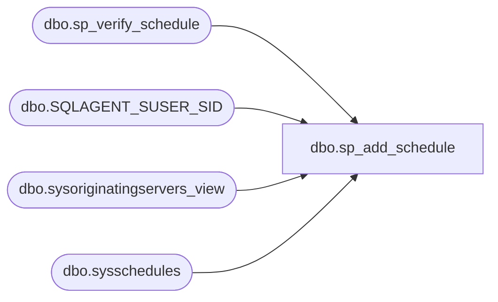

# dbo.sp_add_schedule

**Database:** msdb  
**Server:** STL-SSIS-P-01  

## Architecture Diagram



## Table Dependencies

| Referenced Table |
|---|
| dbo.sp_verify_schedule |
| dbo.SQLAGENT_SUSER_SID |
| dbo.sysoriginatingservers_view |
| dbo.sysschedules |

## Stored Procedure Code

```sql
CREATE PROCEDURE sp_add_schedule
(
  @schedule_name        sysname,
  @enabled              TINYINT         = 1,            -- Name does not have to be unique
  @freq_type            INT             = 0,
  @freq_interval        INT             = 0,
  @freq_subday_type        INT             = 0,
  @freq_subday_interval    INT             = 0,
  @freq_relative_interval  INT             = 0,
  @freq_recurrence_factor  INT             = 0,
  @active_start_date    INT             = NULL,         -- sp_verify_schedule assigns a default
  @active_end_date         INT             = 99991231,     -- December 31st 9999
  @active_start_time    INT             = 000000,       -- 12:00:00 am
  @active_end_time         INT             = 235959,       -- 11:59:59 pm
  @owner_login_name        sysname         = NULL,
  @schedule_uid             UNIQUEIDENTIFIER= NULL  OUTPUT, -- Used by a TSX machine when inserting a schedule
  @schedule_id              INT             = NULL  OUTPUT,
  @originating_server       sysname        = NULL
)   
AS
BEGIN
  DECLARE @retval           INT
  DECLARE @owner_sid        VARBINARY(85)
  DECLARE @orig_server_id   INT

  SET NOCOUNT ON

  -- Remove any leading/trailing spaces from parameters
  SELECT @schedule_name         = LTRIM(RTRIM(@schedule_name)),
         @owner_login_name      = LTRIM(RTRIM(@owner_login_name)),
         @originating_server    = UPPER(LTRIM(RTRIM(@originating_server))),
         @schedule_id           = 0
         
         
   -- If the owner isn't supplied make if the current user
  IF(@owner_login_name IS NULL OR @owner_login_name = '')
  BEGIN
    --Get the current users sid
    SELECT @owner_sid = SUSER_SID()
  END
  ELSE
  BEGIN
    -- Get the sid for @owner_login_name SID
    --force case insensitive comparation for NT users
    SELECT @owner_sid = dbo.SQLAGENT_SUSER_SID(@owner_login_name)
    -- Cannot proceed if @owner_login_name doesn't exist
    IF(@owner_sid IS NULL)
    BEGIN
      RAISERROR(14262, -1, -1, '@owner_login_name', @owner_login_name)
      RETURN(1) -- Failure
    END
  END

  -- Check schedule (frequency and owner) parameters
  EXECUTE @retval = sp_verify_schedule NULL,   -- schedule_id does not exist for the new schedule
                                       @name                    = @schedule_name,
                                       @enabled                 = @enabled,
                                       @freq_type               = @freq_type,
                                       @freq_interval           = @freq_interval            OUTPUT,
                                       @freq_subday_type        = @freq_subday_type         OUTPUT,
                                       @freq_subday_interval    = @freq_subday_interval     OUTPUT,
                                       @freq_relative_interval  = @freq_relative_interval   OUTPUT,
                                       @freq_recurrence_factor  = @freq_recurrence_factor   OUTPUT,
                                       @active_start_date       = @active_start_date        OUTPUT,
                                       @active_start_time       = @active_start_time        OUTPUT,
                                       @active_end_date         = @active_end_date          OUTPUT,
                                       @active_end_time         = @active_end_time          OUTPUT,
                                       @owner_sid               = @owner_sid
  IF (@retval <> 0)
    RETURN(1) -- Failure

  -- ignore @originating_server unless SQLAgent is calling
  if((@originating_server IS NULL) OR (@originating_server = N'') OR (PROGRAM_NAME() NOT LIKE N'SQLAgent%'))
  BEGIN
    --Get the local originating_server_id
    SELECT @orig_server_id = originating_server_id 
    FROM msdb.dbo.sysoriginatingservers_view 
    WHERE master_server = 0
  END
  ELSE
  BEGIN
    --Get the MSX originating_server_id. If @originating_server isn't the msx server error out
    SELECT @orig_server_id = originating_server_id 
    FROM msdb.dbo.sysoriginatingservers_view 
    WHERE (originating_server = @originating_server)

    IF (@orig_server_id IS NULL)
    BEGIN
      RAISERROR(14370, -1, -1)
      RETURN(1) -- Failure
    END
  END
  
  IF (@schedule_uid IS NULL)
  BEGIN
    -- Assign the GUID
    SELECT @schedule_uid = NEWID()
  END
  ELSE IF (@schedule_uid <> CONVERT(UNIQUEIDENTIFIER, 0x00))
  BEGIN
    --Try and find the schedule if a @schedule_uid is provided. 
    --A TSX server uses the @schedule_uid to identify a schedule downloaded from the MSX
   SELECT @schedule_id = schedule_id
    FROM msdb.dbo.sysschedules
    WHERE schedule_uid = @schedule_uid

   IF((@schedule_id IS NOT NULL) AND (@schedule_id <> 0))
   BEGIN
      --If found update the fields
      UPDATE msdb.dbo.sysschedules
        SET name              = ISNULL(@schedule_name, name),
            enabled              = ISNULL(@enabled, enabled),
         freq_type            = ISNULL(@freq_type, freq_type),
         freq_interval        = ISNULL(@freq_interval, freq_interval),
         freq_subday_type     = ISNULL(@freq_subday_type, freq_subday_type),
         freq_subday_interval = ISNULL(@freq_subday_interval, freq_subday_interval),
         freq_relative_interval  = ISNULL(@freq_relative_interval, freq_relative_interval),
         freq_recurrence_factor  = ISNULL(@freq_recurrence_factor, freq_recurrence_factor),
         active_start_date    = ISNULL(@active_start_date, active_start_date),
         active_end_date         = ISNULL(@active_end_date, active_end_date),
         active_start_time    = ISNULL(@active_start_time, active_start_time),
         active_end_time         = ISNULL(@active_end_time, active_end_time)
      WHERE schedule_uid = @schedule_uid

      RETURN(@@ERROR)
   END
  END
  
  --MSX not found so add a record to sysschedules
  INSERT INTO msdb.dbo.sysschedules
         (schedule_uid,
          originating_server_id,
          name,
          owner_sid,
          enabled,
          freq_type,
          freq_interval,
          freq_subday_type,
          freq_subday_interval,
          freq_relative_interval,
          freq_recurrence_factor,
          active_start_date,
          active_end_date,
          active_start_time,
          active_end_time)
  select @schedule_uid,
         @orig_server_id, 
         @schedule_name,
         @owner_sid,
         @enabled,
         @freq_type,
         @freq_interval,
         @freq_subday_type,
         @freq_subday_interval,
         @freq_relative_interval,
         @freq_recurrence_factor,
         @active_start_date,
         @active_end_date,
         @active_start_time,
         @active_end_time
          
  SELECT @retval = @@ERROR,
         @schedule_id = @@IDENTITY

  RETURN(@retval) -- 0 means success
END

dbo,sp_add_targetservergroup,CREATE PROCEDURE sp_add_targetservergroup
  @name sysname
AS
BEGIN
  SET NOCOUNT ON

  -- Only a sysadmin can do this
  IF (ISNULL(IS_SRVROLEMEMBER(N'sysadmin'), 0) <> 1) 
  BEGIN
    RAISERROR(15003, 16, 1, N'sysadmin')
    RETURN(1) -- Failure
  END

  -- Remove any leading/trailing spaces from parameters
  SELECT @name = LTRIM(RTRIM(@name))

  -- Check if the group already exists
  IF (EXISTS (SELECT *
              FROM msdb.dbo.systargetservergroups
              WHERE name = @name))
  BEGIN
    RAISERROR(14261, -1, -1, '@name', @name)
    RETURN(1) -- Failure
  END

  -- Disallow names with commas in them (since sp_apply_job_to_targets parses a comma-separated list of group names)
  IF (@name LIKE N'%,%')
  BEGIN
    RAISERROR(14289, -1, -1, '@name', ',')
    RETURN(1) -- Failure
  END

  INSERT INTO msdb.dbo.systargetservergroups (name)
  VALUES (@name)

  RETURN(@@error) -- 0 means success
END

dbo,sp_add_targetsvrgrp_member,CREATE PROCEDURE sp_add_targetsvrgrp_member
  @group_name  sysname,
  @server_name sysname
AS
BEGIN
  DECLARE @servergroup_id INT
  DECLARE @server_id      INT

  SET NOCOUNT ON

  -- Remove any leading/trailing spaces from parameters
  SELECT @group_name = LTRIM(RTRIM(@group_name))
  SELECT @server_name = UPPER(LTRIM(RTRIM(@server_name)))

  -- Check if the group exists
  SELECT @servergroup_id = servergroup_id
  FROM msdb.dbo.systargetservergroups
  WHERE (name = @group_name)

  IF (@servergroup_id IS NULL)
  BEGIN
    RAISERROR(14262, -1, -1, '@group_name', @group_name)
    RETURN(1) -- Failure
  END

  -- Check if the server exists
  SELECT @server_id = server_id
  FROM msdb.dbo.systargetservers
  WHERE (UPPER(server_name) = @server_name)

  IF (@server_id IS NULL)
  BEGIN
    RAISERROR(14262, -1, -1, '@server_name', @server_name)
    RETURN(1) -- Failure
  END

  -- Check if the server is already in this group
  IF (EXISTS (SELECT *
              FROM msdb.dbo.systargetservergroupmembers
              WHERE (servergroup_id = @servergroup_id)
                AND (server_id = @server_id)))
  BEGIN
    RAISERROR(14263, -1, -1, @server_name, @group_name)
    RETURN(1) -- Failure
  END

  -- Add the row to systargetservergroupmembers
  INSERT INTO msdb.dbo.systargetservergroupmembers
  VALUES (@servergroup_id, @server_id)

  RETURN(@@error) -- 0 means success
END

dbo,sp_addtask,CREATE PROCEDURE sp_addtask
  @name                   sysname,               -- Was VARCHAR(100) in 6.x
  @subsystem              NVARCHAR(40)   = N'TSQL', -- Was VARCHAR(30) in 6.x
  @server                 sysname        = NULL,
  @username               sysname        = NULL, -- Was VARCHAR(30) in 6.x
  @databasename           sysname        = NULL, -- Was VARCHAR(30) in 6.x
  @enabled                TINYINT        = 0,
  @freqtype               INT            = 2,    -- 2 means OnDemand
  @freqinterval           INT            = 1,
  @freqsubtype            INT            = 1,
  @freqsubinterval        INT            = 1,
  @freqrelativeinterval   INT            = 1,
  @freqrecurrencefactor   INT            = 1,
  @activestartdate        INT            = 0,
  @activeenddate          INT            = 0,
  @activestarttimeofday   INT            = 0,
  @activeendtimeofday     INT            = 0,
  @nextrundate            INT            = 0,
  @nextruntime            INT            = 0,
  @runpriority            INT            = 0,
  @emailoperatorname      sysname        = NULL, -- Was VARCHAR(50) in 6.x
  @retryattempts          INT            = 0,
  @retrydelay             INT            = 10,
  @command                NVARCHAR(max) = NULL,
  @loghistcompletionlevel INT            = 2,
  @emailcompletionlevel   INT            = 0,
  @description            NVARCHAR(512)  = NULL, -- Was VARCHAR(255) in 6.x
  @tagadditionalinfo      VARCHAR(96)    = NULL, -- Obsolete in 7.0
  @tagobjectid            INT            = NULL, -- Obsolete in 7.0
  @tagobjecttype          INT            = NULL, -- Obsolete in 7.0
  @newid                  INT            = NULL OUTPUT,
  @parameters             NVARCHAR(max)  = NULL, -- Was TEXT in 6.x
  @cmdexecsuccesscode     INT            = 0,
  @category_name          sysname        = NULL, -- New for 7.0
  @category_id            INT            = NULL  -- New for 7.0
AS
BEGIN
  DECLARE @retval INT
  DECLARE @job_id UNIQUEIDENTIFIER
  DECLARE @id     INT
  DECLARE @distdb sysname
  DECLARE @proc nvarchar(255)

  SET NOCOUNT ON

  SELECT @retval = 1 -- 0 means success, 1 means failure

  -- Set 7.0 category names for 6.5 replication tasks
  IF (LOWER(@subsystem) = N'sync')
    SELECT @category_id = 15
  ELSE IF (LOWER(@subsystem) = N'logreader')
    SELECT @category_id = 13
  ELSE IF (LOWER(@subsystem) = N'distribution')
    SELECT @category_id = 10

  -- Convert old replication synchronization subsystem name to the 7.0 name
  IF (LOWER(@subsystem) = N'sync')
    SELECT @subsystem = N'Snapshot'

  -- If a category ID is provided this overrides any supplied category name
  IF (@category_id IS NOT NULL)
  BEGIN
    SELECT @category_name = name
    FROM msdb.dbo.syscategories
    WHERE (category_id = @category_id)
    SELECT @category_name = ISNULL(@category_name, FORMATMESSAGE(14205))
  END

  -- In 6.x active start date was not restricted, but it is in 7.0; so to avoid a "noisey"
  -- failure in sp_add_jobschedule we modify the value accordingly
  IF ((@activestartdate <> 0) AND (@activestartdate < 19900101))
    SELECT @activestartdate = 19900101

  BEGIN TRANSACTION

    -- Add the job
    EXECUTE @retval = sp_add_job
      @job_name                   = @name,
      @enabled                    = @enabled,
      @start_step_id              = 1,
      @description                = @description,
      @category_name              = @category_name,
      @notify_level_eventlog      = @loghistcompletionlevel,
      @notify_level_email         = @emailcompletionlevel,
      @notify_email_operator_name = @emailoperatorname,
      @job_id                     = @job_id OUTPUT

    IF (@retval <> 0)
    BEGIN
      ROLLBACK TRANSACTION
      GOTO Quit
    END

    -- Add an entry to systaskids for the new job (created by a 6.x client)
    INSERT INTO msdb.dbo.systaskids (job_id) VALUES (@job_id)

    -- Get the assigned task id
    SELECT @id = task_id, @newid = task_id
    FROM msdb.dbo.systaskids
    WHERE (job_id = @job_id)

    -- Add the job step
    EXECUTE @retval = sp_add_jobstep
      @job_id                = @job_id,
      @step_id               = 1,
      @step_name             = N'Step 1',
      @subsystem             = @subsystem,
      @command               = @command,
      @additional_parameters = @parameters,
      @cmdexec_success_code  = @cmdexecsuccesscode,
      @server                = @server,
      @database_name         = @databasename,
      @database_user_name    = @username,
      @retry_attempts        = @retryattempts,
      @retry_interval        = @retrydelay,
      @os_run_priority       = @runpriority

    IF (@retval <> 0)
    BEGIN
      ROLLBACK TRANSACTION
      GOTO Quit
    END

    -- Add the job schedule
    IF (@activestartdate = 0)
      SELECT @activestartdate = NULL
    IF (@activeenddate = 0)
      SELECT @activeenddate = NULL
    IF (@activestarttimeofday = 0)
      SELECT @activestarttimeofday = NULL
    IF (@activeendtimeofday = 0)
      SELECT @activeendtimeofday = NULL
    IF (@freqtype <> 0x2) -- OnDemand tasks simply have no schedule in 7.0
    BEGIN
      EXECUTE @retval = sp_add_jobschedule
        @job_id                 = @job_id,
        @name                   = N'6.x schedule',
        @enabled                = 1,
        @freq_type              = @freqtype,
        @freq_interval          = @freqinterval,
        @freq_subday_type       = @freqsubtype,
        @freq_subday_interval   = @freqsubinterval,
        @freq_relative_interval = @freqrelativeinterval,
        @freq_recurrence_factor = @freqrecurrencefactor,
        @active_start_date      = @activestartdate,
        @active_end_date        = @activeenddate,
        @active_start_time      = @activestarttimeofday,
        @active_end_time        = @activeendtimeofday

      IF (@retval <> 0)
      BEGIN
        ROLLBACK TRANSACTION
        GOTO Quit
      END
    END

    -- And finally, add the job server
    EXECUTE @retval = sp_add_jobserver @job_id = @job_id, @server_name = NULL

    IF (@retval <> 0)
    BEGIN
      ROLLBACK TRANSACTION
      GOTO Quit
    END

    -- Add the replication agent for monitoring
    IF (@category_id = 13) -- Logreader
    BEGIN
      SELECT @distdb = distribution_db from MSdistpublishers where name = @server
      SELECT @proc = @distdb + '.dbo.sp_MSadd_logreader_agent'

      EXECUTE @retval = @proc
        @name = @name,
        @publisher = @server,
        @publisher_db = @databasename,
        @publication = '',
        @local_job = 1,
        @job_existing = 1,
        @job_id = @job_id

      IF (@retval <> 0)
      BEGIN
        ROLLBACK TRANSACTION
        GOTO Quit
      END
    END
    ELSE
    IF (@category_id = 15) -- Snapshot
    BEGIN
      DECLARE @publication sysname

      EXECUTE @retval = master.dbo.sp_MSget_publication_from_taskname
                            @taskname = @name,
                            @publisher = @server,
                            @publisherdb = @databasename,
                            @publication = @publication OUTPUT

      IF (@publication IS NOT NULL)
      BEGIN

        SELECT @distdb = distribution_db from MSdistpublishers where name = @server
        SELECT @proc = @distdb + '.dbo.sp_MSadd_snapshot_agent'

        EXECUTE @retval = @proc
                @name = @name,
                @publisher = @server,
                @publisher_db = @databasename,
                @publication = @publication,
                @local_job = 1,
                @job_existing = 1,
                @snapshot_jobid = @job_id

        IF (@retval <> 0)
        BEGIN
          ROLLBACK TRANSACTION
          GOTO Quit
        END

        SELECT @proc = @distdb + '.dbo.sp_MSadd_publication'
        EXECUTE @retval = @proc
                @publisher = @server,
                @publisher_db = @databasename,
                @publication = @publication,
                @publication_type = 0 -- Transactional
        IF (@retval <> 0)
        BEGIN
          ROLLBACK TRANSACTION
          GOTO Quit
        END
      END
    END

  COMMIT TRANSACTION

  -- If this is an autostart LogReader or Distribution job, add the [new] '-Continuous' paramter to the command
  IF (@freqtype = 0x40) AND ((UPPER(@subsystem collate SQL_Latin1_General_CP1_CS_AS) = N'LOGREADER') OR (UPPER(@subsystem collate SQL_Latin1_General_CP1_CS_AS) = N'DISTRIBUTION'))
  BEGIN
    UPDATE msdb.dbo.sysjobsteps
    SET command = command + N' -Continuous'
    WHERE (job_id = @job_id)
      AND (step_id = 1)
  END

  -- If this is an autostart job, start it now (for backwards compatibility with 6.x SQLExecutive behaviour)
  IF (@freqtype = 0x40)
    EXECUTE msdb.dbo.sp_start_job @job_id = @job_id, @error_flag = 0, @output_flag = 0

Quit:
  RETURN(@retval) -- 0 means success

END
```

