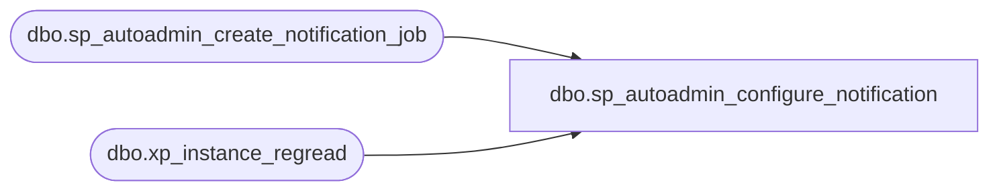

# dbo.sp_autoadmin_configure_notification

**Database:** msdb  
**Server:** STL-SSIS-P-01  

## Architecture Diagram



## Table Dependencies

| Referenced Table |
|---|
| dbo.sp_autoadmin_create_notification_job |
| dbo.xp_instance_regread |

## Stored Procedure Code

```sql
CREATE PROCEDURE sp_autoadmin_configure_notification
AS
BEGIN
    -- Check if Database Mail was enabled
    IF NOT EXISTS (SELECT cfg.Name
            FROM
            sys.configurations AS cfg
            WHERE cfg.Name = 'Database Mail XPs'
            AND cfg.Value  = 1)
    BEGIN
        RAISERROR (45210, 17, 1);
        RETURN
    END

    -- Check if Database mail profile is setup for Agent Notifications
    DECLARE @databasemail_profile              NVARCHAR(255)
    EXECUTE master.dbo.xp_instance_regread N'HKEY_LOCAL_MACHINE',
                                            N'SOFTWARE\Microsoft\MSSQLServer\SQLServerAgent',
                                            N'DatabaseMailProfile',
                                            @databasemail_profile OUTPUT,
                                            N'no_output'

    IF (@databasemail_profile IS NULL)
    BEGIN
		RAISERROR (45211, 17, 2);
		RETURN
    END
    -- Configure Smartadmin notification agent job
    EXEC [msdb].[dbo].[sp_autoadmin_create_notification_job]
    
END
```

