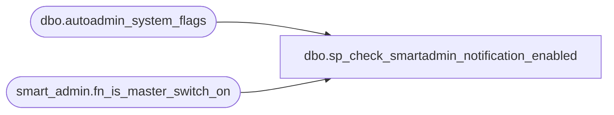

# dbo.sp_check_smartadmin_notification_enabled

**Database:** msdb  
**Server:** STL-SSIS-P-01  

## Architecture Diagram



## Table Dependencies

| Referenced Table |
|---|
| dbo.autoadmin_system_flags |
| smart_admin.fn_is_master_switch_on |

## Stored Procedure Code

```sql
CREATE PROCEDURE sp_check_smartadmin_notification_enabled
AS
BEGIN
    -- Check if master switch is on
    IF (0 =  msdb.smart_admin.fn_is_master_switch_on ())
    BEGIN
        RAISERROR (45208, 17, 1);
        RETURN
    END

    -- Check if notification Email was set
    DECLARE @notification_email_ids NVARCHAR(MAX)
    SELECT @notification_email_ids = value
    FROM [msdb].[dbo].[autoadmin_system_flags]
    WHERE name = 'SSMBackup2WANotificationEmailIds'

    IF (@notification_email_ids IS NULL) OR (@notification_email_ids = N'')
    BEGIN
        RAISERROR (45209, 17, 2);
        RETURN
    END

END

dbo,sp_clear_dbmaintplan_by_db,CREATE PROCEDURE sp_clear_dbmaintplan_by_db
  @db_name sysname
AS
BEGIN
  DECLARE planid_cursor CURSOR
  FOR
  select plan_id from msdb.dbo.sysdbmaintplan_databases where database_name=@db_name
  OPEN planid_cursor
  declare @planid uniqueidentifier
  FETCH NEXT FROM planid_cursor INTO @planid
  WHILE (@@FETCH_STATUS <> -1)
  BEGIN
    IF (@@FETCH_STATUS <> -2)
    BEGIN
      delete from msdb.dbo.sysdbmaintplan_databases where plan_id=@planid AND database_name=@db_name
      if (NOT EXISTS(select * from msdb.dbo.sysdbmaintplan_databases where plan_id=@planid))
      BEGIN
        --delete the job
        DECLARE jobid_cursor CURSOR
        FOR
        select job_id from msdb.dbo.sysdbmaintplan_jobs where plan_id=@planid
        OPEN jobid_cursor
        DECLARE @jobid uniqueidentifier
        FETCH NEXT FROM jobid_cursor INTO @jobid
        WHILE (@@FETCH_STATUS <> -1)
        BEGIN
          if (@@FETCH_STATUS <> -2)
          BEGIN
            execute msdb.dbo.sp_delete_job @jobid
          END
          FETCH NEXT FROM jobid_cursor into @jobid
        END
        CLOSE jobid_cursor
        DEALLOCATE jobid_cursor
        --delete the history
        delete from msdb.dbo.sysdbmaintplan_history where plan_id=@planid
        --delete the plan
        delete from msdb.dbo.sysdbmaintplans where plan_id=@planid
      END
    END
    FETCH NEXT FROM planid_cursor INTO @planid
  END
  CLOSE planid_cursor
  DEALLOCATE planid_cursor
END

dbo,sp_convert_jobid_to_char,CREATE PROCEDURE sp_convert_jobid_to_char
  @job_id         UNIQUEIDENTIFIER,
  @job_id_as_char NVARCHAR(34) OUTPUT -- 34 because of the leading '0x'
AS
BEGIN
  DECLARE @job_id_as_binary BINARY(16)
  DECLARE @temp             NCHAR(8)
  DECLARE @counter          INT
  DECLARE @byte_value       INT
  DECLARE @high_word        INT
  DECLARE @low_word         INT
  DECLARE @high_high_nybble INT
  DECLARE @high_low_nybble  INT
  DECLARE @low_high_nybble  INT
  DECLARE @low_low_nybble   INT

  SET NOCOUNT ON

  SELECT @job_id_as_binary = CONVERT(BINARY(16), @job_id)
  SELECT @temp = CONVERT(NCHAR(8), @job_id_as_binary)

  SELECT @job_id_as_char = N''
  SELECT @counter = 1

  WHILE (@counter <= (DATALENGTH(@temp) / 2))
  BEGIN
    SELECT @byte_value       = CONVERT(INT, CONVERT(BINARY(2), SUBSTRING(@temp, @counter, 1)))
    SELECT @high_word        = (@byte_value & 0xff00) / 0x100
    SELECT @low_word         = (@byte_value & 0x00ff)
    SELECT @high_high_nybble = (@high_word & 0xff) / 16
    SELECT @high_low_nybble  = (@high_word & 0xff) % 16
    SELECT @low_high_nybble  = (@low_word & 0xff) / 16
    SELECT @low_low_nybble   = (@low_word & 0xff) % 16

    IF (@high_high_nybble < 10)
      SELECT @job_id_as_char = @job_id_as_char + NCHAR(ASCII('0') + @high_high_nybble)
    ELSE
      SELECT @job_id_as_char = @job_id_as_char + NCHAR(ASCII('A') + (@high_high_nybble - 10))

    IF (@high_low_nybble < 10)
      SELECT @job_id_as_char = @job_id_as_char + NCHAR(ASCII('0') + @high_low_nybble)
    ELSE
      SELECT @job_id_as_char = @job_id_as_char + NCHAR(ASCII('A') + (@high_low_nybble - 10))

    IF (@low_high_nybble < 10)
      SELECT @job_id_as_char = @job_id_as_char + NCHAR(ASCII('0') + @low_high_nybble)
    ELSE
      SELECT @job_id_as_char = @job_id_as_char + NCHAR(ASCII('A') + (@low_high_nybble - 10))

    IF (@low_low_nybble < 10)
      SELECT @job_id_as_char = @job_id_as_char + NCHAR(ASCII('0') + @low_low_nybble)
    ELSE
      SELECT @job_id_as_char = @job_id_as_char + NCHAR(ASCII('A') + (@low_low_nybble - 10))

    SELECT @counter = @counter + 1
  END

  SELECT @job_id_as_char = N'0x' + LOWER(@job_id_as_char)
END

dbo,sp_create_log_shipping_monitor_account,CREATE PROCEDURE sp_create_log_shipping_monitor_account @password sysname
AS
BEGIN
  DECLARE @rv INT
  SET NOCOUNT ON
-- raise an error if the password already exists
  if exists(select * from master.dbo.syslogins where loginname = N'log_shipping_monitor_probe')
  begin
    raiserror(15025,-1,-1,N'log_shipping_monitor_probe')
    RETURN (1) -- error
  end

  IF (@password = N'')
  BEGIN
    EXECUTE @rv = sp_addlogin N'log_shipping_monitor_probe', @defdb = N'msdb'
    IF @@error <>0 or @rv <> 0
      RETURN (1) -- error
  END
  ELSE
  BEGIN
    EXECUTE @rv = sp_addlogin N'log_shipping_monitor_probe', @password, N'msdb'
    IF @@error <>0 or @rv <> 0
      RETURN (1) -- error
  END

  EXECUTE @rv = sp_grantdbaccess N'log_shipping_monitor_probe', N'log_shipping_monitor_probe'
  IF @@error <>0 or @rv <> 0
    RETURN (1) -- error

  GRANT UPDATE ON log_shipping_primaries   TO log_shipping_monitor_probe
  GRANT UPDATE ON log_shipping_secondaries TO log_shipping_monitor_probe
  GRANT SELECT ON log_shipping_primaries   TO log_shipping_monitor_probe
  GRANT SELECT ON log_shipping_secondaries TO log_shipping_monitor_probe

  RETURN (0)
END
```

