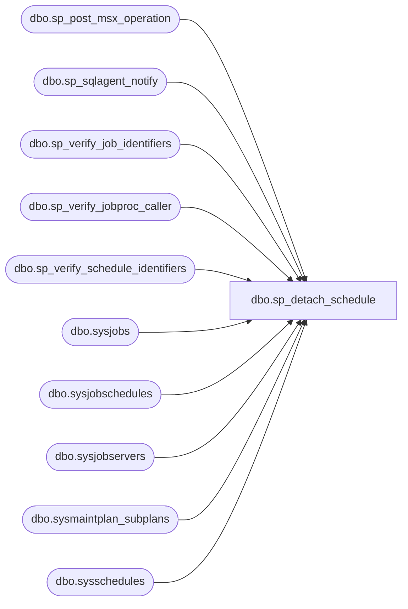

# dbo.sp_detach_schedule

**Database:** msdb  
**Server:** STL-SSIS-P-01  

## Architecture Diagram



## Table Dependencies

| Referenced Table |
|---|
| dbo.sp_post_msx_operation |
| dbo.sp_sqlagent_notify |
| dbo.sp_verify_job_identifiers |
| dbo.sp_verify_jobproc_caller |
| dbo.sp_verify_schedule_identifiers |
| dbo.sysjobs |
| dbo.sysjobschedules |
| dbo.sysjobservers |
| dbo.sysmaintplan_subplans |
| dbo.sysschedules |

## Stored Procedure Code

```sql
CREATE PROCEDURE sp_detach_schedule
(
  @job_id               UNIQUEIDENTIFIER    = NULL,     -- Must provide either this or job_name
  @job_name             sysname             = NULL,     -- Must provide either this or job_id
  @schedule_id          INT                 = NULL,     -- Must provide either this or schedule_name
  @schedule_name        sysname             = NULL,     -- Must provide either this or schedule_id
  @delete_unused_schedule BIT               = 0,        -- Can optionally delete schedule if it isn't referenced.
                                                        -- The default is to keep schedules 
  @automatic_post       BIT                 = 1         -- If 1 will post notifications to all tsx servers to that run this job
)   
AS
BEGIN
  DECLARE @retval   INT
  DECLARE @sched_owner_sid VARBINARY(85)
  DECLARE @job_owner_sid    VARBINARY(85)
  
  SET NOCOUNT ON

  -- Check that we can uniquely identify the job
  EXECUTE @retval = msdb.dbo.sp_verify_job_identifiers '@job_name',
                                                       '@job_id',
                                                        @job_name OUTPUT,
                                                        @job_id   OUTPUT,
                                                        @owner_sid = @job_owner_sid OUTPUT
  IF (@retval <> 0)
    RETURN(1) -- Failure

  -- Check authority (only SQLServerAgent can add a schedule to a non-local job)
  EXECUTE @retval = sp_verify_jobproc_caller @job_id = @job_id, @program_name = N'SQLAgent%'
  IF (@retval <> 0)
    RETURN(@retval)
        
  -- Check that we can uniquely identify the schedule
  EXECUTE @retval = msdb.dbo.sp_verify_schedule_identifiers @name_of_name_parameter = '@schedule_name',
                                                            @name_of_id_parameter   = '@schedule_id',
                                                            @schedule_name          = @schedule_name OUTPUT,
                                                            @schedule_id            = @schedule_id   OUTPUT,
                                                            @owner_sid              = @sched_owner_sid OUTPUT,
                                                            @orig_server_id         = NULL,
                                                            @job_id_filter          = @job_id
  IF (@retval <> 0)
      RETURN(1) -- Failure
 
  -- If the record doesn't exist raise an error
  IF( NOT EXISTS(SELECT *  
                 FROM msdb.dbo.sysjobschedules
                 WHERE (schedule_id = @schedule_id)
                   AND (job_id = @job_id)) )
  BEGIN
    RAISERROR(14374, 0, 1, @schedule_name, @job_name)    
    RETURN(1) -- Failure   
  END
  ELSE
  BEGIN
  
   -- Permissions check:
   --  If sysadmin continue (sysadmin can detach schedules they don't own)
   --  Otherwise if the caller owns the job, we can detach it
   --  Except If @delete_unused_schedule = 1 then the caller has to own both the job and the schedule
   IF (ISNULL(IS_SRVROLEMEMBER(N'sysadmin'), 0) <> 1)
   BEGIN
    IF (@job_owner_sid = SUSER_SID())
    BEGIN
      IF ((@delete_unused_schedule = 1) AND (@sched_owner_sid <> SUSER_SID()))
      BEGIN
        -- Cannot delete the schedule
        RAISERROR(14394, -1, -1)
        RETURN(1) -- Failure
      END
    END
    ELSE -- the caller is not sysadmin and it does not own the job -> throw
    BEGIN
      RAISERROR(14391, -1, -1)
      RETURN(1) -- Failure
    END
   END

    DELETE FROM msdb.dbo.sysjobschedules
    WHERE (job_id = @job_id)
      AND (schedule_id = @schedule_id)
    
    SELECT @retval = @@ERROR
    
    --delete the schedule if requested and it isn't referenced
    IF(@retval = 0 AND @delete_unused_schedule = 1)
    BEGIN
        IF(NOT EXISTS(SELECT * 
                      FROM msdb.dbo.sysjobschedules
                      WHERE (schedule_id = @schedule_id)))
        BEGIN
            DELETE FROM msdb.dbo.sysschedules
            WHERE (schedule_id = @schedule_id)
        END
    END

    -- Update the job's version/last-modified information
    UPDATE msdb.dbo.sysjobs
    SET version_number = version_number + 1,
        date_modified = GETDATE()
    WHERE (job_id = @job_id)

    -- Notify SQLServerAgent of the change, but only if we know the job has been cached
    IF (EXISTS (SELECT *
                FROM msdb.dbo.sysjobservers
                WHERE (job_id = @job_id)
                    AND (server_id = 0)))
    BEGIN
        EXECUTE msdb.dbo.sp_sqlagent_notify @op_type     = N'S',
                                            @job_id      = @job_id,
                                            @schedule_id = @schedule_id,
                                            @action_type = N'D'
    END

    -- For a multi-server job, remind the user that they need to call sp_post_msx_operation
    IF (EXISTS (SELECT *
                FROM msdb.dbo.sysjobservers
                WHERE (job_id = @job_id)
                    AND (server_id <> 0)))
      -- sp_post_msx_operation will do nothing if the schedule isn't assigned to any tsx machines 
      IF (@automatic_post = 1)
        EXECUTE sp_post_msx_operation @operation = 'INSERT', @object_type = 'JOB', @job_id = @job_id
      ELSE
        RAISERROR(14547, 0, 1, N'INSERT', N'sp_post_msx_operation')
    
    -- set this job's subplan to the first schedule in sysjobschedules or NULL if there is none 
    UPDATE msdb.dbo.sysmaintplan_subplans
    SET schedule_id = (    SELECT TOP(1) schedule_id
                        FROM msdb.dbo.sysjobschedules
                        WHERE (job_id = @job_id) )
    WHERE (job_id = @job_id)
      AND (schedule_id = @schedule_id)
  END
  
  RETURN(@retval) -- 0 means success
END

dbo,sp_downloaded_row_limiter,CREATE PROCEDURE sp_downloaded_row_limiter
  @server_name sysname -- Target server name
AS
BEGIN
  -- This trigger controls how many downloaded (status = 1) sysdownloadlist rows exist
  -- for any given server.  It does NOT control the absolute number of rows in the table.

  DECLARE @current_rows_per_server INT
  DECLARE @max_rows_per_server     INT -- This value comes from the resgistry (DownloadedMaxRows)
  DECLARE @rows_to_delete          INT
  DECLARE @quoted_server_name      NVARCHAR(514) -- enough room to accomodate the quoted name
  SET NOCOUNT ON

  -- Remove any leading/trailing spaces from parameters
  SELECT @server_name = LTRIM(RTRIM(@server_name))

  -- Check the server name (if it's bad we fail silently)
  IF (@server_name IS NULL) OR
     (NOT EXISTS (SELECT *
                  FROM msdb.dbo.sysdownloadlist
                  WHERE (target_server = @server_name)))
    RETURN(1) -- Failure

  SELECT @max_rows_per_server = 0

  -- Get the max-rows-per-server from the registry
  EXECUTE master.dbo.xp_instance_regread N'HKEY_LOCAL_MACHINE',
                                         N'SOFTWARE\Microsoft\MSSQLServer\SQLServerAgent',
                                         N'DownloadedMaxRows',
                                         @max_rows_per_server OUTPUT,
                                         N'no_output'

  -- Check if we are limiting sysdownloadlist rows
  IF (ISNULL(@max_rows_per_server, -1) = -1)
    RETURN

  -- Check that max_rows_per_server is >= 0
  IF (@max_rows_per_server < -1)
  BEGIN
    -- It isn't, so default to 100 rows
    SELECT @max_rows_per_server = 100
    EXECUTE master.dbo.xp_instance_regwrite N'HKEY_LOCAL_MACHINE',
                                            N'SOFTWARE\Microsoft\MSSQLServer\SQLServerAgent',
                                            N'DownloadedMaxRows',
                                            N'REG_DWORD',
                                            @max_rows_per_server
  END

  -- Get the number of downloaded rows in sysdownloadlist for the target server in question
  -- NOTE: Determining this [quickly] requires a [non-clustered] index on target_server
  SELECT @current_rows_per_server = COUNT(*)
  FROM msdb.dbo.sysdownloadlist
  WHERE (target_server = @server_name)
    AND (status = 1)

  -- Delete the oldest downloaded row(s) for the target server in question if the new row has
  -- pushed us over the per-server row limit
  SELECT @rows_to_delete = @current_rows_per_server - @max_rows_per_server
  IF (@rows_to_delete > 0)
  BEGIN
    WITH RowsToDelete AS (
      SELECT TOP (@rows_to_delete) *
      FROM msdb.dbo.sysdownloadlist
      WHERE (target_server = @server_name)
        AND (status = 1)
      ORDER BY instance_id
    )
    DELETE FROM RowsToDelete;
  END
END
```

