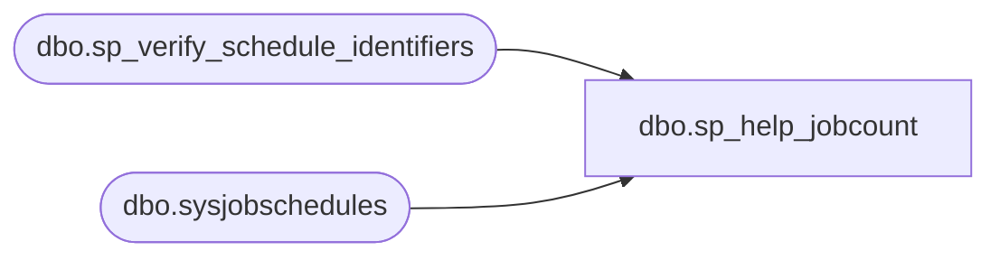

# dbo.sp_help_jobcount

**Database:** msdb  
**Server:** STL-SSIS-P-01  

## Architecture Diagram



## Table Dependencies

| Referenced Table |
|---|
| dbo.sp_verify_schedule_identifiers |
| dbo.sysjobschedules |

## Stored Procedure Code

```sql
CREATE PROCEDURE sp_help_jobcount 
  @schedule_name       sysname  = NULL, -- Specify if @schedule_id is null
  @schedule_id         INT      = NULL  -- Specify if @schedule_name is null
AS
BEGIN
  SET NOCOUNT ON

  DECLARE @retval   INT

  -- Check that we can uniquely identify the schedule. This only returns a schedule that is visible to this user
  EXECUTE @retval = msdb.dbo.sp_verify_schedule_identifiers @name_of_name_parameter = '@schedule_name',
                                                            @name_of_id_parameter   = '@schedule_id',
                                                            @schedule_name          = @schedule_name    OUTPUT,
                                                            @schedule_id            = @schedule_id      OUTPUT,
                                                            @owner_sid              = NULL,
                                                            @orig_server_id         = NULL
  IF (@retval <> 0)
    RETURN(1) -- Failure 


  SELECT COUNT(*) AS JobCount
  FROM msdb.dbo.sysjobschedules
  WHERE (schedule_id = @schedule_id)


  RETURN (0) -- 0 means success
END

dbo,sp_help_jobhistory,CREATE PROCEDURE [dbo].[sp_help_jobhistory]
  @job_id               UNIQUEIDENTIFIER = NULL,
  @job_name             sysname          = NULL,
  @step_id              INT              = NULL,
  @sql_message_id       INT              = NULL,
  @sql_severity         INT              = NULL,
  @start_run_date       INT              = NULL,     -- YYYYMMDD
  @end_run_date         INT              = NULL,     -- YYYYMMDD
  @start_run_time       INT              = NULL,     -- HHMMSS
  @end_run_time         INT              = NULL,     -- HHMMSS
  @minimum_run_duration INT              = NULL,     -- HHMMSS
  @run_status           INT              = NULL,     -- SQLAGENT_EXEC_X code
  @minimum_retries      INT              = NULL,
  @oldest_first         INT              = 0,        -- Or 1
  @server               sysname          = NULL,
  @mode                 VARCHAR(7)       = 'SUMMARY' -- Or 'FULL' or 'SEM'
AS
BEGIN
  DECLARE @retval   INT
  DECLARE @order_by INT  -- Must be INT since it can be -1

  SET NOCOUNT ON

  -- Remove any leading/trailing spaces from parameters
  SELECT @server   = LTRIM(RTRIM(@server))
  SELECT @mode     = LTRIM(RTRIM(@mode))

  -- Turn [nullable] empty string parameters into NULLs
  IF (@server = N'')   SELECT @server = NULL

  -- Check job id/name (if supplied)
  IF ((@job_id IS NOT NULL) OR (@job_name IS NOT NULL))
  BEGIN
    EXECUTE @retval = sp_verify_job_identifiers '@job_name',
                                                '@job_id',
                                                 @job_name OUTPUT,
                                                 @job_id   OUTPUT
    IF (@retval <> 0)
      RETURN(1) -- Failure
  END

  -- Check @start_run_date
  IF (@start_run_date IS NOT NULL)
  BEGIN
    EXECUTE @retval = sp_verify_job_date @start_run_date, '@start_run_date'
    IF (@retval <> 0)
      RETURN(1) -- Failure
  END

  -- Check @end_run_date
  IF (@end_run_date IS NOT NULL)
  BEGIN
    EXECUTE @retval = sp_verify_job_date @end_run_date, '@end_run_date'
    IF (@retval <> 0)
      RETURN(1) -- Failure
  END

  -- Check @start_run_time
  EXECUTE @retval = sp_verify_job_time @start_run_time, '@start_run_time'
  IF (@retval <> 0)
    RETURN(1) -- Failure

  -- Check @end_run_time
  EXECUTE @retval = sp_verify_job_time @end_run_time, '@end_run_time'
  IF (@retval <> 0)
    RETURN(1) -- Failure

  -- Check @run_status
  IF ((@run_status < 0) OR (@run_status > 5))
  BEGIN
    RAISERROR(14198, -1, -1, '@run_status', '0..5')
    RETURN(1) -- Failure
  END

  -- Check mode
  SELECT @mode = UPPER(@mode collate SQL_Latin1_General_CP1_CS_AS)
  IF (@mode NOT IN ('SUMMARY', 'FULL', 'SEM'))
  BEGIN
    RAISERROR(14266, -1, -1, '@mode', 'SUMMARY, FULL, SEM')
    RETURN(1) -- Failure
  END

  SELECT @order_by = -1
  IF (@oldest_first = 1)
    SELECT @order_by = 1

  DECLARE @distributed_job_history BIT 
  SET @distributed_job_history = 0
  
  IF (@job_id IS NOT NULL) AND ( EXISTS (SELECT *
                              FROM msdb.dbo.sysjobs       sj,
                                 msdb.dbo.sysjobservers sjs
                              WHERE (sj.job_id = sjs.job_id)
                                 AND (sj.job_id = @job_id)
                                 AND (sjs.server_id <> 0)))
   SET @distributed_job_history = 1

  -- Return history information filtered by the supplied parameters.
  -- Having actual queries in subprocedures allows better query plans because query optimizer sniffs correct parameters
  IF (@mode = 'FULL')
  BEGIN
  -- NOTE: SQLDMO relies on the 'FULL' format; ** DO NOT CHANGE IT **
      EXECUTE sp_help_jobhistory_full
         @job_id,
         @job_name,
         @step_id,
         @sql_message_id,
         @sql_severity,
         @start_run_date,
         @end_run_date,
         @start_run_time,
         @end_run_time,
         @minimum_run_duration,
         @run_status,
         @minimum_retries,
         @oldest_first,
         @server,
         @mode,
         @order_by,
         @distributed_job_history
  END
  ELSE
  IF (@mode = 'SUMMARY')
  BEGIN
    -- Summary format: same WHERE clause as for full, just a different SELECT list
    EXECUTE sp_help_jobhistory_summary
         @job_id,
         @job_name,
         @step_id,
         @sql_message_id,
         @sql_severity,
         @start_run_date,
         @end_run_date,
         @start_run_time,
         @end_run_time,
         @minimum_run_duration,
         @run_status,
         @minimum_retries,
         @oldest_first,
         @server,
         @mode,
         @order_by,
         @distributed_job_history
  END
  ELSE
  IF (@mode = 'SEM')
  BEGIN
    -- SQL Enterprise Manager format
    EXECUTE sp_help_jobhistory_sem
         @job_id,
         @job_name,
         @step_id,
         @sql_message_id,
         @sql_severity,
         @start_run_date,
         @end_run_date,
         @start_run_time,
         @end_run_time,
         @minimum_run_duration,
         @run_status,
         @minimum_retries,
         @oldest_first,
         @server,
         @mode,
         @order_by,
         @distributed_job_history
  END
  RETURN(0) -- Success
END

dbo,sp_help_jobhistory_full,CREATE PROCEDURE sp_help_jobhistory_full
               @job_id               UNIQUEIDENTIFIER,
               @job_name             sysname,
               @step_id              INT,
               @sql_message_id       INT,
               @sql_severity         INT,
               @start_run_date       INT,
               @end_run_date         INT,
               @start_run_time       INT,
               @end_run_time         INT,
               @minimum_run_duration INT,
               @run_status           INT,
               @minimum_retries      INT,
               @oldest_first         INT,
               @server               sysname,
               @mode                 VARCHAR(7),
               @order_by             INT,
               @distributed_job_history BIT
AS
BEGIN
-- First save the current transaction isolation level
DECLARE @TRANSACTION_ISOLATION_LEVEL INT
SELECT @TRANSACTION_ISOLATION_LEVEL = transaction_isolation_level FROM sys.dm_exec_sessions where session_id = @@SPID
-- If the isolation level is not known, do nothing!
IF @TRANSACTION_ISOLATION_LEVEL >0 AND @TRANSACTION_ISOLATION_LEVEL < 6
BEGIN
  -- Set transaction isolation level to READ UNCOMMITTED 
  --  This will ensure that we can still read the history even if the rows are locked by the TABLOCKX operation on the history row limiter
  SET TRANSACTION ISOLATION LEVEL READ UNCOMMITTED
END

IF(@distributed_job_history = 1)
  SELECT null as instance_id, 
     sj.job_id,
     job_name = sj.name,
     null as step_id,
     null as step_name,
     null as sql_message_id,
     null as sql_severity,
     sjh.last_outcome_message as message,
     sjh.last_run_outcome as run_status,
     sjh.last_run_date as run_date,
     sjh.last_run_time as run_time,
    sjh.last_run_duration as run_duration,
     null as operator_emailed,
     null as operator_netsentname,
     null as operator_paged,
     null as retries_attempted,
     sts.server_name as server
  FROM msdb.dbo.sysjobservers                sjh
  JOIN msdb.dbo.systargetservers sts ON (sts.server_id = sjh.server_id)
  JOIN msdb.dbo.sysjobs_view     sj  ON(sj.job_id = sjh.job_id)
  WHERE 
  (@job_id = sjh.job_id)
  AND ((@start_run_date       IS NULL) OR (sjh.last_run_date >= @start_run_date))
  AND ((@end_run_date         IS NULL) OR (sjh.last_run_date <= @end_run_date))
  AND ((@start_run_time       IS NULL) OR (sjh.last_run_time >= @start_run_time))
  AND ((@minimum_run_duration IS NULL) OR (sjh.last_run_duration >= @minimum_run_duration))
  AND ((@run_status           IS NULL) OR (@run_status = sjh.last_run_outcome))
  AND ((@server               IS NULL) OR (sts.server_name = @server))
ELSE
  SELECT sjh.instance_id, -- This is included just for ordering purposes
     sj.job_id,
     job_name = sj.name,
     sjh.step_id,
     sjh.step_name,
     sjh.sql_message_id,
     sjh.sql_severity,
     sjh.message,
     sjh.run_status,
     sjh.run_date,
     sjh.run_time,
     sjh.run_duration,
     operator_emailed = so1.name,
     operator_netsent = so2.name,
     operator_paged = so3.name,
     sjh.retries_attempted,
     sjh.server
  FROM msdb.dbo.sysjobhistory                sjh
     LEFT OUTER JOIN msdb.dbo.sysoperators so1  ON (sjh.operator_id_emailed = so1.id)
     LEFT OUTER JOIN msdb.dbo.sysoperators so2  ON (sjh.operator_id_netsent = so2.id)
     LEFT OUTER JOIN msdb.dbo.sysoperators so3  ON (sjh.operator_id_paged = so3.id),
     msdb.dbo.sysjobs_view sj
  WHERE (sj.job_id = sjh.job_id)
  AND ((@job_id               IS NULL) OR (@job_id = sjh.job_id))
  AND ((@step_id              IS NULL) OR (@step_id = sjh.step_id))
  AND ((@sql_message_id       IS NULL) OR (@sql_message_id = sjh.sql_message_id))
  AND ((@sql_severity         IS NULL) OR (@sql_severity = sjh.sql_severity))
  AND ((@start_run_date       IS NULL) OR (sjh.run_date >= @start_run_date))
  AND ((@end_run_date         IS NULL) OR (sjh.run_date <= @end_run_date))
  AND ((@start_run_time       IS NULL) OR (sjh.run_time >= @start_run_time))
  AND ((@end_run_time         IS NULL) OR (sjh.run_time <= @end_run_time))
  AND ((@minimum_run_duration IS NULL) OR (sjh.run_duration >= @minimum_run_duration))
  AND ((@run_status           IS NULL) OR (@run_status = sjh.run_status))
  AND ((@minimum_retries      IS NULL) OR (sjh.retries_attempted >= @minimum_retries))
  AND ((@server               IS NULL) OR (sjh.server = @server))
  ORDER BY (sjh.instance_id * @order_by)

-- Revert the isolation level
IF @TRANSACTION_ISOLATION_LEVEL = 1
  SET TRANSACTION ISOLATION LEVEL READ UNCOMMITTED
ELSE IF @TRANSACTION_ISOLATION_LEVEL = 2
  SET TRANSACTION ISOLATION LEVEL READ COMMITTED
ELSE IF @TRANSACTION_ISOLATION_LEVEL = 3
  SET TRANSACTION ISOLATION LEVEL REPEATABLE READ
ELSE IF @TRANSACTION_ISOLATION_LEVEL = 4
  SET TRANSACTION ISOLATION LEVEL SERIALIZABLE
ELSE IF @TRANSACTION_ISOLATION_LEVEL = 5
  SET TRANSACTION ISOLATION LEVEL SNAPSHOT

END
```

