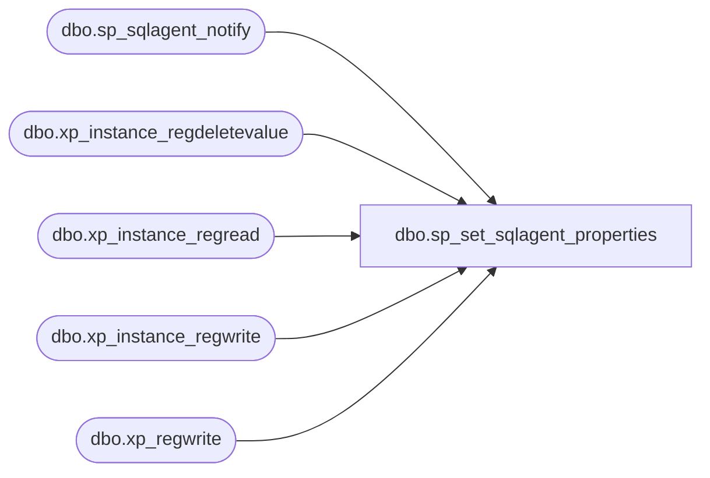

# dbo.sp_set_sqlagent_properties

**Database:** msdb  
**Server:** STL-SSIS-P-01  

## Architecture Diagram



## Table Dependencies

| Referenced Table |
|---|
| dbo.sp_sqlagent_notify |
| dbo.xp_instance_regdeletevalue |
| dbo.xp_instance_regread |
| dbo.xp_instance_regwrite |
| dbo.xp_regwrite |

## Stored Procedure Code

```sql
CREATE PROCEDURE dbo.sp_set_sqlagent_properties
  @auto_start                  INT           = NULL, -- 1 or 0
  -- Non-SQLDMO exposed properties
  @sqlserver_restart           INT           = NULL, -- 1 or 0
  @jobhistory_max_rows         INT           = NULL, -- No maximum = -1, otherwise must be > 1
  @jobhistory_max_rows_per_job INT           = NULL, -- 1 to @jobhistory_max_rows
  @errorlog_file               NVARCHAR(255) = NULL, -- Full drive\path\name of errorlog file
  @errorlogging_level          INT           = NULL, -- 1 = error, 2 = warning, 4 = information
  @error_recipient             NVARCHAR(30)  = NULL, -- Network address of error popup recipient
  @monitor_autostart           INT           = NULL, -- 1 or 0
  @local_host_server           SYSNAME      = NULL, -- Alias of local host server
  @job_shutdown_timeout        INT           = NULL, -- 5 to 600 seconds
  @cmdexec_account             VARBINARY(64) = NULL, -- CmdExec account information
  @regular_connections         INT           = NULL, -- obsolete
  @host_login_name             SYSNAME       = NULL, -- obsolete
  @host_login_password         VARBINARY(512) = NULL, -- obsolete
  @login_timeout               INT           = NULL, -- 5 to 45 (seconds)
  @idle_cpu_percent            INT           = NULL, -- 1 to 100
  @idle_cpu_duration           INT           = NULL, -- 20 to 86400 seconds
  @oem_errorlog                INT           = NULL, -- 1 or 0
  @sysadmin_only               INT           = NULL, -- not applicable to Yukon server, for backwards compatibility only
  @email_profile               NVARCHAR(64)  = NULL, -- obsolete - SQLMail profile, Rely on DBMail for notifications
  @email_save_in_sent_folder   INT           = NULL, -- obsolete
  @cpu_poller_enabled          INT           = NULL, -- 1 or 0
  @alert_replace_runtime_tokens INT          = NULL, -- 1 or 0
  @use_databasemail            INT           = NULL,  -- 1 or 0
  @databasemail_profile        SYSNAME       = NULL

AS
BEGIN
  -- NOTE: We set all SQLServerAgent properties at one go for performance reasons.
  -- NOTE: You cannot set the value of the properties msx_server_name, is_msx or
  --       startup_account - they are all read only.

  DECLARE @res_valid_range           NVARCHAR(100)
  DECLARE @existing_core_engine_mask INT

  SET NOCOUNT ON

  -- Remove any leading/trailing spaces from parameters
  SELECT @errorlog_file     = LTRIM(RTRIM(@errorlog_file))
  SELECT @error_recipient   = LTRIM(RTRIM(@error_recipient))
  SELECT @local_host_server = LTRIM(RTRIM(@local_host_server))
    
  -- Make sure values (if supplied) are good
  IF (@auto_start IS NOT NULL)
  BEGIN
    -- NOTE: When setting the the services start value, 2 == auto-start, 3 == Don't auto-start
    SELECT @auto_start = CASE @auto_start
                           WHEN 0 THEN 3
                           WHEN 1 THEN 2
                           ELSE 3 -- Assume non auto-start if passed a junk value
                          END
  END

  -- Non-SQLDMO exposed properties
  IF ((@sqlserver_restart IS NOT NULL) AND (@sqlserver_restart <> 0))
    SELECT @sqlserver_restart = 1

  IF (@jobhistory_max_rows IS NOT NULL)
  BEGIN
    SELECT @res_valid_range = FORMATMESSAGE(14207)
    IF ((@jobhistory_max_rows < -1) OR (@jobhistory_max_rows = 0))
    BEGIN
      RAISERROR(14266, -1, -1, '@jobhistory_max_rows', @res_valid_range)
      RETURN(1) -- Failure
    END
  END
  ELSE
  BEGIN
    EXECUTE master.dbo.xp_instance_regread N'HKEY_LOCAL_MACHINE',
                                           N'SOFTWARE\Microsoft\MSSQLServer\SQLServerAgent',
                                           N'JobHistoryMaxRows',
                                           @jobhistory_max_rows OUTPUT,
                                           N'no_output'
    SELECT @jobhistory_max_rows = ISNULL(@jobhistory_max_rows, -1)
  END

  IF (@jobhistory_max_rows_per_job IS NOT NULL)
  BEGIN
    IF (@jobhistory_max_rows = -1)
      SELECT @jobhistory_max_rows_per_job = 0
    ELSE
    BEGIN
      IF ((@jobhistory_max_rows_per_job < 1) OR (@jobhistory_max_rows_per_job > @jobhistory_max_rows))
      BEGIN
        SELECT @res_valid_range = N'1..' + CONVERT(NVARCHAR, @jobhistory_max_rows)
        RAISERROR(14266, -1, -1, '@jobhistory_max_rows', @res_valid_range)
        RETURN(1) -- Failure
      END
    END
  END

  IF (@errorlogging_level IS NOT NULL) AND ((@errorlogging_level < 1) OR (@errorlogging_level > 7))
  BEGIN
    RAISERROR(14266, -1, -1, '@errorlogging_level', '1..7')
    RETURN(1) -- Failure
  END

  IF (@monitor_autostart IS NOT NULL) AND ((@monitor_autostart < 0) OR (@monitor_autostart > 1))
  BEGIN
    RAISERROR(14266, -1, -1, '@monitor_autostart', '0, 1')
    RETURN(1) -- Failure
  END

  IF (@job_shutdown_timeout IS NOT NULL) AND ((@job_shutdown_timeout < 5) OR (@job_shutdown_timeout > 600))
  BEGIN
    RAISERROR(14266, -1, -1, '@job_shutdown_timeout', '5..600')
    RETURN(1) -- Failure
  END

  IF (@login_timeout IS NOT NULL) AND ((@login_timeout < 5) OR (@login_timeout > 45))
  BEGIN
    RAISERROR(14266, -1, -1, '@login_timeout', '5..45')
    RETURN(1) -- Failure
  END

  IF ((@idle_cpu_percent IS NOT NULL) AND ((@idle_cpu_percent < 1) OR (@idle_cpu_percent > 100)))
  BEGIN
    RAISERROR(14266, -1, -1, '@idle_cpu_percent', '10..100')
    RETURN(1) -- Failure
  END

  IF ((@idle_cpu_duration IS NOT NULL) AND ((@idle_cpu_duration < 20) OR (@idle_cpu_duration > 86400)))
  BEGIN
    RAISERROR(14266, -1, -1, '@idle_cpu_duration', '20..86400')
    RETURN(1) -- Failure
  END

  IF (@oem_errorlog IS NOT NULL) AND ((@oem_errorlog < 0) OR (@oem_errorlog > 1))
  BEGIN
    RAISERROR(14266, -1, -1, '@oem_errorlog', '0, 1')
    RETURN(1) -- Failure
  END

  IF (@sysadmin_only IS NOT NULL)
  BEGIN
    RAISERROR(14378, -1, -1)
    RETURN(1) -- Failure
  END

  IF (@cpu_poller_enabled IS NOT NULL) AND ((@cpu_poller_enabled < 0) OR (@cpu_poller_enabled > 1))
  BEGIN
    RAISERROR(14266, -1, -1, 'cpu_poller_enabled', '0, 1')
    RETURN(1) -- Failure
  END

  IF (@alert_replace_runtime_tokens IS NOT NULL) AND ((@alert_replace_runtime_tokens < 0) OR (@alert_replace_runtime_tokens > 1))
  BEGIN
    RAISERROR(14266, -1, -1, 'alert_replace_runtime_tokens', '0, 1')
    RETURN(1) -- Failure
  END

  -- Write out the values
  IF (@auto_start IS NOT NULL)
  BEGIN
    IF ((PLATFORM() & 0x1) = 0x1) -- NT
    BEGIN
      DECLARE @key NVARCHAR(200)

      SELECT @key = N'SYSTEM\CurrentControlSet\Services\'
      IF (SERVERPROPERTY('INSTANCENAME') IS NOT NULL)
        SELECT @key = @key + N'SQLAgent$' + CONVERT (sysname, SERVERPROPERTY('INSTANCENAME'))
      ELSE
        SELECT @key = @key + N'SQLServerAgent'

      EXECUTE master.dbo.xp_regwrite N'HKEY_LOCAL_MACHINE',
                                     @key,
                                     N'Start',
                                     N'REG_DWORD',
                                     @auto_start
    END
    ELSE
      RAISERROR(14546, 16, 1, '@auto_start')
  END

  -- Non-SQLDMO exposed properties
  IF (@sqlserver_restart IS NOT NULL)
    EXECUTE master.dbo.xp_instance_regwrite N'HKEY_LOCAL_MACHINE',
                                            N'SOFTWARE\Microsoft\MSSQLServer\SQLServerAgent',
                                            N'RestartSQLServer',
                                            N'REG_DWORD',
                                            @sqlserver_restart
  IF (@jobhistory_max_rows IS NOT NULL)
    EXECUTE master.dbo.xp_instance_regwrite N'HKEY_LOCAL_MACHINE',
                                            N'SOFTWARE\Microsoft\MSSQLServer\SQLServerAgent',
                                            N'JobHistoryMaxRows',
                                            N'REG_DWORD',
                                            @jobhistory_max_rows
  IF (@jobhistory_max_rows_per_job IS NOT NULL)
    EXECUTE master.dbo.xp_instance_regwrite N'HKEY_LOCAL_MACHINE',
                                            N'SOFTWARE\Microsoft\MSSQLServer\SQLServerAgent',
                                            N'JobHistoryMaxRowsPerJob',
                                            N'REG_DWORD',
                                            @jobhistory_max_rows_per_job
  IF (@errorlog_file IS NOT NULL)
    EXECUTE master.dbo.xp_instance_regwrite N'HKEY_LOCAL_MACHINE',
                                            N'SOFTWARE\Microsoft\MSSQLServer\SQLServerAgent',
                                            N'ErrorLogFile',
                                            N'REG_SZ',
                                            @errorlog_file
  IF (@errorlogging_level IS NOT NULL)
    EXECUTE master.dbo.xp_instance_regwrite N'HKEY_LOCAL_MACHINE',
                                            N'SOFTWARE\Microsoft\MSSQLServer\SQLServerAgent',
                                            N'ErrorLoggingLevel',
                                            N'REG_DWORD',
                                            @errorlogging_level
  IF (@error_recipient IS NOT NULL)
    EXECUTE master.dbo.xp_instance_regwrite N'HKEY_LOCAL_MACHINE',
                                            N'SOFTWARE\Microsoft\MSSQLServer\SQLServerAgent',
                                            N'ErrorMonitor',
                                            N'REG_SZ',
                                            @error_recipient
  IF (@monitor_autostart IS NOT NULL)
    EXECUTE master.dbo.xp_instance_regwrite N'HKEY_LOCAL_MACHINE',
                                            N'SOFTWARE\Microsoft\MSSQLServer\SQLServerAgent',
                                            N'MonitorAutoStart',
                                            N'REG_DWORD',
                                            @monitor_autostart
  IF (@local_host_server IS NOT NULL)
    EXECUTE master.dbo.xp_instance_regwrite N'HKEY_LOCAL_MACHINE',
                                            N'SOFTWARE\Microsoft\MSSQLServer\SQLServerAgent',
                                            N'ServerHost',
                                            N'REG_SZ',
                                            @local_host_server
  IF (@job_shutdown_timeout IS NOT NULL)
    EXECUTE master.dbo.xp_instance_regwrite N'HKEY_LOCAL_MACHINE',
                                            N'SOFTWARE\Microsoft\MSSQLServer\SQLServerAgent',
                                            N'JobShutdownTimeout',
                                            N'REG_DWORD',
                                            @job_shutdown_timeout
  IF (@cmdexec_account IS NOT NULL)
    EXECUTE master.dbo.xp_instance_regwrite N'HKEY_LOCAL_MACHINE',
                                            N'SOFTWARE\Microsoft\MSSQLServer\SQLServerAgent',
                                            N'CmdExecAccount',
                                            N'REG_BINARY',
                                            @cmdexec_account

  IF (@login_timeout IS NOT NULL)
    EXECUTE master.dbo.xp_instance_regwrite N'HKEY_LOCAL_MACHINE',
                                            N'SOFTWARE\Microsoft\MSSQLServer\SQLServerAgent',
                                            N'LoginTimeout',
                                            N'REG_DWORD',
                                            @login_timeout
  IF (@idle_cpu_percent IS NOT NULL)
    EXECUTE master.dbo.xp_instance_regwrite N'HKEY_LOCAL_MACHINE',
                                            N'SOFTWARE\Microsoft\MSSQLServer\SQLServerAgent',
                                            N'IdleCPUPercent',
                                            N'REG_DWORD',
                                            @idle_cpu_percent
  IF (@idle_cpu_duration IS NOT NULL)
    EXECUTE master.dbo.xp_instance_regwrite N'HKEY_LOCAL_MACHINE',
                                            N'SOFTWARE\Microsoft\MSSQLServer\SQLServerAgent',
                                            N'IdleCPUDuration',
                                            N'REG_DWORD',
                                            @idle_cpu_duration
  IF (@oem_errorlog IS NOT NULL)
    EXECUTE master.dbo.xp_instance_regwrite N'HKEY_LOCAL_MACHINE',
                                            N'SOFTWARE\Microsoft\MSSQLServer\SQLServerAgent',
                                            N'OemErrorLog',
                                            N'REG_DWORD',
                                            @oem_errorlog

  IF (@alert_replace_runtime_tokens IS NOT NULL)
    EXECUTE master.dbo.xp_instance_regwrite N'HKEY_LOCAL_MACHINE',
                                            N'SOFTWARE\Microsoft\MSSQLServer\SQLServerAgent',
                                            N'AlertReplaceRuntimeTokens',
                                            N'REG_DWORD',
                                            @alert_replace_runtime_tokens  
  IF (@cpu_poller_enabled IS NOT NULL)
  BEGIN
    EXECUTE master.dbo.xp_instance_regread N'HKEY_LOCAL_MACHINE',
                                           N'SOFTWARE\Microsoft\MSSQLServer\SQLServerAgent',
                                           N'CoreEngineMask',
                                           @existing_core_engine_mask OUTPUT,
                                           N'no_output'

  

    IF ((@existing_core_engine_mask IS NOT NULL) OR (@cpu_poller_enabled = 1))
    BEGIN
      IF (@cpu_poller_enabled = 1)
        SELECT @cpu_poller_enabled = (ISNULL(@existing_core_engine_mask, 0) & ~32)
      ELSE
        SELECT @cpu_poller_enabled = (ISNULL(@existing_core_engine_mask, 0) | 32)

      IF ((@existing_core_engine_mask IS NOT NULL) AND (@cpu_poller_enabled = 32))
        EXECUTE master.dbo.xp_instance_regdeletevalue N'HKEY_LOCAL_MACHINE',
                                                      N'SOFTWARE\Microsoft\MSSQLServer\SQLServerAgent',
                                                      N'CoreEngineMask'
      ELSE
        EXECUTE master.dbo.xp_instance_regwrite N'HKEY_LOCAL_MACHINE',
                                                N'SOFTWARE\Microsoft\MSSQLServer\SQLServerAgent',
                                                N'CoreEngineMask',
                                                N'REG_DWORD',
                                                @cpu_poller_enabled
    END
  END

  DECLARE @notify_sqlagent_dbmail_settings_update BIT
  SET @notify_sqlagent_dbmail_settings_update = 0
  IF(@use_databasemail IS NOT NULL)
  BEGIN
      
     EXECUTE master.dbo.xp_instance_regwrite N'HKEY_LOCAL_MACHINE',
                                            N'SOFTWARE\Microsoft\MSSQLServer\SQLServerAgent',
                                            N'UseDatabaseMail',
                                            N'REG_DWORD',
                                            @use_databasemail
	
      SET @notify_sqlagent_dbmail_settings_update = 1
  END
  
  IF(@databasemail_profile IS NOT NULL)
  BEGIN
     EXECUTE master.dbo.xp_instance_regwrite N'HKEY_LOCAL_MACHINE',
                                            N'SOFTWARE\Microsoft\MSSQLServer\SQLServerAgent',
                                            N'DatabaseMailProfile',
                                            N'REG_SZ',
                                            @databasemail_profile
	
      SET @notify_sqlagent_dbmail_settings_update = 1
  END
  
  IF(@notify_sqlagent_dbmail_settings_update = 1 )
  BEGIN
        -- Notify SQL Agent that Databasemail settings for SQL Agent was changed. force a reload
        EXECUTE msdb.dbo.sp_sqlagent_notify @op_type     = N'M'
  END
    
  RETURN(0) -- Success
END

dbo,sp_sqlagent_check_msx_version,CREATE PROCEDURE sp_sqlagent_check_msx_version
  @required_microsoft_version INT = NULL
AS
BEGIN
  SET NOCOUNT ON

  DECLARE @msx_version          NVARCHAR(16)
  DECLARE @required_msx_version NVARCHAR(16)

  IF (@required_microsoft_version IS NULL)
    SELECT @required_microsoft_version = 0x07000252 -- 7.0.594

  IF (@@microsoftversion < @required_microsoft_version)
  BEGIN
    SELECT @msx_version = CONVERT( NVARCHAR(2), CONVERT( INT, CONVERT( BINARY(1), @@microsoftversion / 0x1000000 ) ) )
   + N'.' 
   + CONVERT( NVARCHAR(2), CONVERT( INT, CONVERT( BINARY(1), CONVERT( BINARY(2), ((@@microsoftversion / 0x10000) % 0x100) ) ) ) )
   + N'.'
   + CONVERT( NVARCHAR(4), @@microsoftversion % 0x10000 )

    SELECT @required_msx_version = CONVERT( NVARCHAR(2), CONVERT( INT, CONVERT( BINARY(1), @required_microsoft_version / 0x1000000 ) ) )
   + N'.'
   + CONVERT( NVARCHAR(2), CONVERT( INT, CONVERT( BINARY(1), CONVERT( BINARY(2), ((@required_microsoft_version / 0x10000) % 0x100) ) ) ) )
   + N'.' 
   + CONVERT( NVARCHAR(4), @required_microsoft_version % 0x10000 )    

   RAISERROR(14541, -1, -1, @msx_version, @required_msx_version)
    RETURN(1) -- Failure
  END
  RETURN(0) -- Success
END

dbo,sp_sqlagent_create_jobactivity,CREATE PROCEDURE [dbo].[sp_sqlagent_create_jobactivity]
    @session_id            INT,
    @job_id                UNIQUEIDENTIFIER,
	@is_system             TINYINT = 0
AS
BEGIN
    IF(@is_system = 1)
    BEGIN
        -- TODO:: Call job activity update spec proc
    RETURN
    END

    IF(@job_id IS NULL)
    BEGIN
        -- On SQL Agent startup, session id along with all jobs are populated 
        INSERT [msdb].[dbo].[sysjobactivity]
        (session_id, job_id) 
        SELECT @session_id, job_id 
        FROM [msdb].[dbo].[sysjobs]
    END
    ELSE
    BEGIN
        -- whenever a new job was created later & started, only that specific job_id is populated in 
        -- sysjobactivity table
        INSERT [msdb].[dbo].[sysjobactivity]
        (session_id, job_id) 
        VALUES(
            @session_id,
            @job_id
        )
    END
END

dbo,sp_sqlagent_get_perf_counters,CREATE PROCEDURE sp_sqlagent_get_perf_counters
  @all_counters BIT = 0
AS
BEGIN

  SET NOCOUNT ON

  -- 32 bit fraction counter types
  DECLARE @perfTypeRawFraction INT
  DECLARE @perfTypeRawBase     INT

  -- A counter of type PERF_RAW_FRACTION, which is a 32-bit counter value.
  SET @perfTypeRawFraction = 537003008 --  In hex, 0x20020400.

   -- A count of type PERF_RAW_BASE, which is the 32-bit divisor used
   -- when handling PERF_RAW_FRACTION types. This counter type should
   -- not be displayed to the user since it is used for mathematical
   -- operations.
  SET @perfTypeRawBase     = 1073939459 -- In hex, 0x40030403.


  -- 64 bit fraction counter types
  DECLARE @perfTypeLargeRawFraction INT
  DECLARE @perfTypeLargeRawBase     INT

  -- A counter of type PERF_LARGE RAW_FRACTION, which is a 64-bit counter value.
  SET @perfTypeLargeRawFraction = 537003264 --  In hex, 0x20020500.

   -- A count of type PERF_LARGE_RAW_BASE, which is the 64-bit divisor used
   -- when handling PERF_LARGE_RAW_FRACTION types. This counter type should
   -- not be displayed to the user since it is used for mathematical
   -- operations.
  SET @perfTypeLargeRawBase     = 1073939712 -- In hex, 0x40030500.


  IF (@all_counters = 0)
  BEGIN
        SELECT  spi1.object_name,
                spi1.counter_name,
                'instance_name' = CASE spi1.instance_name
                                    WHEN N'' THEN NULL
                                    ELSE spi1.instance_name
                                    END,
                'value' = CASE spi1.cntr_type
                            WHEN @perfTypeRawFraction -- 32 bit fraction
                                THEN CONVERT(FLOAT, spi1.cntr_value) / (SELECT CASE spi2.cntr_value 
                                                                            WHEN 0 THEN 1 
                                                                            ELSE spi2.cntr_value 
                                                                            END
                                                                        FROM sysalerts_performance_counters_view spi2
                                                                        WHERE (RTRIM(spi1.counter_name) + ' ' = SUBSTRING(spi2.counter_name, 1, PATINDEX('% base%', LOWER(spi2.counter_name))))
                                                                        AND spi1.object_name = spi2.object_name
                                                                        AND spi1.server_name = spi2.server_name
                                                                        AND spi1.instance_name = spi2.instance_name
                                                                        AND spi2.cntr_type = @perfTypeRawBase
                                                                        )
                            WHEN @perfTypeLargeRawFraction  -- 64 bit fraction
                                THEN CONVERT(FLOAT, spi1.cntr_value) / (SELECT CASE spi2.cntr_value 
                                                                            WHEN 0 THEN 1 
                                                                            ELSE spi2.cntr_value 
                                                                            END
                                                                        FROM sysalerts_performance_counters_view spi2
                                                                        WHERE (RTRIM(spi1.counter_name) + ' ' = SUBSTRING(spi2.counter_name, 1, PATINDEX('% base%', LOWER(spi2.counter_name))))
                                                                        AND spi1.object_name = spi2.object_name
                                                                        AND spi1.server_name = spi2.server_name
                                                                        AND spi1.instance_name = spi2.instance_name
                                                                        AND spi2.cntr_type = @perfTypeLargeRawBase
                                                                        )
                                ELSE spi1.cntr_value
                            END,
       'type' = spi1.cntr_type,
        spi1.server_name
        FROM sysalerts_performance_counters_view spi1,
        (
                SELECT DISTINCT 
                    SUBSTRING(performance_condition, 
                                PATINDEX('%:%', performance_condition) + 1, 
                                CHARINDEX('|', performance_condition, 
                                            PATINDEX('%_|_%', performance_condition) + 2)-(PATINDEX('%:%', performance_condition) + 1
                                         )
                             )
                AS performance_condition_s  
                FROM msdb.dbo.sysalerts
                WHERE performance_condition IS NOT NULL
                AND ISNULL(event_id, 0) <> 8 -- exclude WMI events that reuse performance_condition field
                AND enabled = 1
        ) tmp -- We want to select only those counters that have an enabled performance sysalert
        WHERE spi1.cntr_type <> @perfTypeRawBase      -- ignore 32-bit denominator counter type
        AND spi1.cntr_type <> @perfTypeLargeRawBase      -- ignore 64-bit denominator counter type
        AND tmp.performance_condition_s = (spi1.object_name + '|' + spi1.counter_name)
        OPTION (HASH JOIN, LOOP JOIN) -- Avoid merge join when small number of alerts are defined
  END
  ELSE
  BEGIN
        SELECT  spi1.object_name,
                spi1.counter_name,
                'instance_name' = CASE spi1.instance_name
                                    WHEN N'' THEN NULL
                                    ELSE spi1.instance_name
                                    END,
                'value' = CASE spi1.cntr_type
                            WHEN @perfTypeRawFraction -- 32 bit fraction
                            THEN CONVERT(FLOAT, spi1.cntr_value) / (SELECT CASE spi2.cntr_value 
                                                                        WHEN 0 THEN 1 
                                                                        ELSE spi2.cntr_value 
                                                                        END
                                                                    FROM sysalerts_performance_counters_view spi2
                                                                    WHERE (RTRIM(spi1.counter_name) + ' ' = SUBSTRING(spi2.counter_name, 1, PATINDEX('% base%', LOWER(spi2.counter_name))))
                                                                    AND spi1.object_name = spi2.object_name
                                                                    AND spi1.server_name = spi2.server_name
                                                                    AND spi1.instance_name = spi2.instance_name
                                                                    AND spi2.cntr_type = @perfTypeRawBase
                                                                    )
                            WHEN @perfTypeLargeRawFraction  -- 64 bit fraction
                            THEN CONVERT(FLOAT, spi1.cntr_value) / (SELECT CASE spi2.cntr_value 
                                                                        WHEN 0 THEN 1 
                                                                        ELSE spi2.cntr_value 
                                                                        END
                                                                    FROM sysalerts_performance_counters_view spi2
                                                                    WHERE (RTRIM(spi1.counter_name) + ' ' = SUBSTRING(spi2.counter_name, 1, PATINDEX('% base%', LOWER(spi2.counter_name))))
                                                                    AND spi1.object_name = spi2.object_name
                                                                    AND spi1.server_name = spi2.server_name
                                                                    AND spi1.instance_name = spi2.instance_name
                                                                    AND spi2.cntr_type = @perfTypeLargeRawBase
                                                                    )
                            ELSE spi1.cntr_value
                        END,
                'type' = spi1.cntr_type,
                spi1.server_name
        FROM sysalerts_performance_counters_view spi1
        WHERE spi1.cntr_type <> @perfTypeRawBase      -- ignore 32-bit denominator counter type
        AND spi1.cntr_type <> @perfTypeLargeRawBase -- ignore 64-bit denominator counter type
  END
END


dbo,sp_sqlagent_get_startup_info,CREATE PROCEDURE sp_sqlagent_get_startup_info
AS
BEGIN
  DECLARE @tbu INT
  DECLARE @agentAllowed INT

  SET NOCOUNT ON

  IF (ServerProperty('InstanceName') IS NULL)
  BEGIN
    EXECUTE @tbu = master.dbo.xp_qv '1338198028'
    EXECUTE @agentAllowed = master.dbo.xp_qv '2858542058'
  END
  ELSE
  BEGIN
    DECLARE @instancename NVARCHAR(128)
    SELECT @instancename = CONVERT(NVARCHAR(128), ServerProperty('InstanceName'))
    EXECUTE @tbu = master.dbo.xp_qv '1338198028', @instancename
    EXECUTE @agentAllowed = master.dbo.xp_qv '2858542058', @instancename
  END

  IF (@tbu < 0)
    SELECT @tbu = 0

  IF (@agentAllowed < 0)
    SELECT @agentAllowed = 0

  SELECT ( CASE WHEN DATABASEPROPERTYEX('msdb', 'Updateability') = 'READ_ONLY' 
                THEN 1 
                ELSE 0 
           END )  AS msdb_read_only,
         ( CASE WHEN DATABASEPROPERTYEX('msdb', 'Status') = 'ONLINE' THEN 1 ELSE 0 END  &
           CASE WHEN DATABASEPROPERTYEX('msdb', 'UserAccess') = 'MULTI_USER' THEN 1 ELSE 0 END)  AS msdb_available,
         CASE ISNULL((SELECT 1 WHERE 'a' = 'A'), 0)
             WHEN 1 THEN 0
             ELSE 1
         END AS case_sensitive_server,
         (SELECT value_in_use FROM sys.configurations WHERE (name = 'user connections')) AS max_user_connection,
         CONVERT(sysname, SERVERPROPERTY('SERVERNAME')) AS sql_server_name,
         ISNULL(@tbu, 0) AS tbu,
         PLATFORM() AS platform,
         ISNULL(CONVERT(sysname, SERVERPROPERTY('INSTANCENAME')), 'MSSQLSERVER') AS instance_name ,
         CONVERT(INT, SERVERPROPERTY('ISCLUSTERED')) AS is_clustered,
         @agentAllowed AS agent_allowed

  RETURN(0) -- Success
END

dbo,sp_sqlagent_has_server_access,CREATE PROCEDURE sp_sqlagent_has_server_access
  @login_name         sysname = NULL,
  @job_id             uniqueidentifier = NULL, -- if this is not null, @login_name will be ignored!
  @is_sysadmin_member INT     = NULL OUTPUT
AS
BEGIN
  DECLARE @has_server_access BIT
  DECLARE @is_sysadmin       BIT
  DECLARE @actual_login_name sysname
  -- Set only when login_name is actually found. It will be zero when @actual_login_name is (unknown).
  DECLARE @login_found BIT
  DECLARE @cachedate         DATETIME

  SET NOCOUNT ON

  SELECT @cachedate = NULL

  -- remove expired entries from the cache
  DELETE msdb.dbo.syscachedcredentials
  WHERE  DATEDIFF(MINUTE, cachedate, GETDATE()) >= 29

  -- query the cache
  SELECT  @is_sysadmin = is_sysadmin_member,
          @has_server_access = has_server_access,
          @cachedate = cachedate
  FROM    msdb.dbo.syscachedcredentials
  WHERE   login_name = @login_name
  AND     DATEDIFF(MINUTE, cachedate, GETDATE()) < 29

  IF (@cachedate IS NOT NULL)
  BEGIN
    -- no output variable
    IF (@is_sysadmin_member IS NULL)
    BEGIN
      -- Return result row
      SELECT has_server_access = @has_server_access,
             is_sysadmin       = @is_sysadmin,
             actual_login_name = @login_name
      RETURN
    END
    ELSE
    BEGIN
      SELECT @is_sysadmin_member = @is_sysadmin
      RETURN
    END
  END -- select from cache

  -- Set defaults
  SELECT @has_server_access = 0
  SELECT @is_sysadmin = 0
  SELECT @actual_login_name = FORMATMESSAGE(14205)
  SELECT @login_found = 0

    -- If @job_id was set, get the current name associated with the job owner sid.
  if (@job_id IS NOT NULL) 
  BEGIN
	SELECT @login_name = dbo.SQLAGENT_SUSER_SNAME(owner_sid)
	FROM msdb.dbo.sysjobs_view
	WHERE @job_id = job_id

    -- If the job_id is invalid, return error
    IF (@login_name IS NULL)  
    BEGIN  
      RETURN 1;
    END  
	
  END
  
 IF (@login_name IS NULL)
  BEGIN
    SELECT has_server_access = 1,
           is_sysadmin       = IS_SRVROLEMEMBER(N'sysadmin'),
           actual_login_name = SUSER_SNAME()
    RETURN
  END

  IF (@login_name LIKE '%\%')
  BEGIN
    -- Handle the LocalSystem account ('NT AUTHORITY\SYSTEM') as a special case
    IF (UPPER(@login_name collate SQL_Latin1_General_CP1_CS_AS) = N'NT AUTHORITY\SYSTEM')
    BEGIN
      IF (EXISTS (SELECT *
                  FROM master.dbo.syslogins
                  WHERE (UPPER(loginname collate SQL_Latin1_General_CP1_CS_AS) = N'NT AUTHORITY\SYSTEM')))
      BEGIN
        SELECT @has_server_access = hasaccess,
               @is_sysadmin = sysadmin,
               @actual_login_name = loginname
        FROM master.dbo.syslogins
        WHERE (UPPER(loginname collate SQL_Latin1_General_CP1_CS_AS) = N'NT AUTHORITY\SYSTEM')

        SET @login_found = 1
      END
      ELSE
      IF (EXISTS (SELECT *
                  FROM master.dbo.syslogins
                  WHERE (UPPER(loginname collate SQL_Latin1_General_CP1_CS_AS) = N'BUILTIN\ADMINISTRATORS')))
      BEGIN
        SELECT @has_server_access = hasaccess,
               @is_sysadmin = sysadmin,
               @actual_login_name = loginname
        FROM master.dbo.syslogins
        WHERE (UPPER(loginname collate SQL_Latin1_General_CP1_CS_AS) = N'BUILTIN\ADMINISTRATORS')

        SET @login_found = 1
      END
    END
    ELSE
    BEGIN
      -- Check if the NT login has been explicitly denied access
      IF (EXISTS (SELECT *
                  FROM master.dbo.syslogins
                  WHERE (loginname = @login_name)
                    AND (denylogin = 1)))
      BEGIN
        SELECT @has_server_access = 0,
               @is_sysadmin = sysadmin,
               @actual_login_name = loginname
        FROM master.dbo.syslogins
        WHERE (loginname = @login_name)

        SET @login_found = 1
      END
      ELSE
      BEGIN
        -- declare table variable for storing results
        DECLARE @xp_results TABLE
        (
        account_name      sysname      COLLATE database_default NOT NULL PRIMARY KEY,
        type              NVARCHAR(10) COLLATE database_default NOT NULL,
        privilege         NVARCHAR(10) COLLATE database_default NOT NULL,
        mapped_login_name sysname      COLLATE database_default NOT NULL,
        permission_path   sysname      COLLATE database_default NULL
        )

        -- Call xp_logininfo to determine server access
        INSERT INTO @xp_results
        EXECUTE master.dbo.xp_logininfo @login_name

        IF (SELECT COUNT(*) FROM @xp_results) > 0
        BEGIN
          SET @has_server_access = 1
          SET @login_found = 1
        END
        
        SELECT @actual_login_name = mapped_login_name,
               @is_sysadmin = CASE UPPER(privilege collate SQL_Latin1_General_CP1_CS_AS)
                                WHEN 'ADMIN' THEN 1
                                ELSE 0
                             END
        FROM @xp_results
      END
    END
    -- Only cache the NT logins to approximate the behavior of Sql Server and Windows (see bug 323287)
    -- update the cache only if something is found
    IF  (UPPER(@actual_login_name collate SQL_Latin1_General_CP1_CS_AS) <> '(UNKNOWN)')
    BEGIN
      -- Procedure starts its own transaction.
      BEGIN TRANSACTION;
      
      -- Modify database.
      -- use a try catch login to prevent any error when trying 
      -- to insert/update syscachedcredentials table
      -- no need to fail since the job owner has been validated
      BEGIN TRY      
        IF EXISTS (SELECT * FROM msdb.dbo.syscachedcredentials WITH (TABLOCKX) WHERE login_name = @login_name)
        BEGIN
          UPDATE msdb.dbo.syscachedcredentials
          SET    has_server_access = @has_server_access,
                is_sysadmin_member = @is_sysadmin,
                cachedate = GETDATE()
          WHERE  login_name = @login_name
        END
        ELSE
        BEGIN
          INSERT INTO msdb.dbo.syscachedcredentials(login_name, has_server_access, is_sysadmin_member) 
          VALUES(@login_name, @has_server_access, @is_sysadmin)
        END
        END TRY
        BEGIN CATCH
            -- If an error occurred we want to ignore it
        END CATCH
        
        -- The procedure must commit the transaction it started.
        COMMIT TRANSACTION;  
    END
  
  END
  ELSE
  BEGIN
    -- Standard login
    IF (EXISTS (SELECT *
                FROM master.dbo.syslogins
                WHERE (loginname = @login_name)))
    BEGIN
      SELECT @has_server_access = hasaccess,
             @is_sysadmin = sysadmin,
             @actual_login_name = loginname
      FROM master.dbo.syslogins
      WHERE (loginname = @login_name)
      
      SET @login_found = 1
    END
  END

  IF (@is_sysadmin_member IS NULL)
    -- Return result row
    SELECT has_server_access = @has_server_access,
           is_sysadmin       = @is_sysadmin,
           actual_login_name = @actual_login_name,
           login_found       = @login_found
  ELSE
    -- output variable only
    SELECT @is_sysadmin_member = @is_sysadmin
END
```

