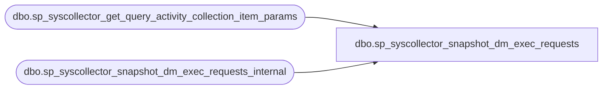

# dbo.sp_syscollector_snapshot_dm_exec_requests

**Database:** msdb  
**Server:** STL-SSIS-P-01  

## Architecture Diagram



## Table Dependencies

| Referenced Table |
|---|
| dbo.sp_syscollector_get_query_activity_collection_item_params |
| dbo.sp_syscollector_snapshot_dm_exec_requests_internal |

## Stored Procedure Code

```sql
CREATE PROC [dbo].[sp_syscollector_snapshot_dm_exec_requests]
  @collection_item_id         int
AS
BEGIN
    DECLARE @include_system_databases bit = 1

    DECLARE @returnValue int = 1
    EXEC @returnValue = [dbo].[sp_syscollector_get_query_activity_collection_item_params] @collection_item_id, @include_system_databases OUTPUT

    IF(@returnValue <> 1 )
    BEGIN
        EXEC [dbo].[sp_syscollector_snapshot_dm_exec_requests_internal]  @include_system_databases
    END
END
```

