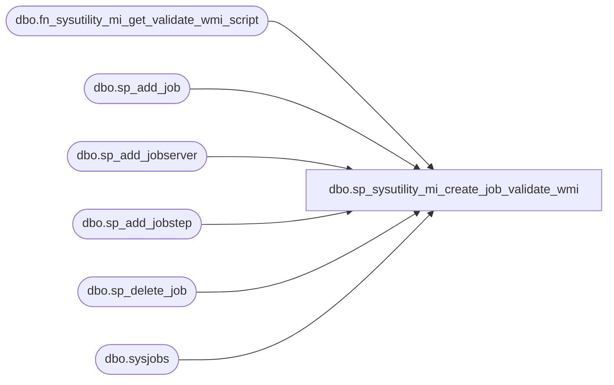

# dbo.sp_sysutility_mi_create_job_validate_wmi

**Database:** msdb  
**Server:** STL-SSIS-P-01  

## Architecture Diagram



## Table Dependencies

| Referenced Table |
|---|
| dbo.fn_sysutility_mi_get_validate_wmi_script |
| dbo.sp_add_job |
| dbo.sp_add_jobserver |
| dbo.sp_add_jobstep |
| dbo.sp_delete_job |
| dbo.sysjobs |

## Stored Procedure Code

```sql
CREATE PROCEDURE [dbo].[sp_sysutility_mi_create_job_validate_wmi]
AS
BEGIN

   DECLARE @job_name sysname = N'sysutility_mi_validate_wmi'
   DECLARE @job_id uniqueidentifier
   DECLARE @description nvarchar(512) = N''
   DECLARE @psScript NVARCHAR(MAX) = (SELECT [dbo].[fn_sysutility_mi_get_validate_wmi_script]());

   -- Delete the job if it already exists
   WHILE (EXISTS (SELECT * FROM msdb.dbo.sysjobs WHERE name = @job_name))
   BEGIN
      EXEC sp_delete_job @job_name=@job_name
   END

   -- Create the job
   EXEC  msdb.dbo.sp_add_job @job_name=@job_name, 
			@enabled=1,
			@notify_level_eventlog=0, 
			@notify_level_email=2, 
			@notify_level_netsend=2, 
			@notify_level_page=2, 
			@delete_level=0, 
			@category_id=0,
			@job_id = @job_id OUTPUT

   EXEC msdb.dbo.sp_add_jobserver @job_name=@job_name, @server_name = @@SERVERNAME

   -- Add the validation step
   EXEC msdb.dbo.sp_add_jobstep 
          @job_id=@job_id, 
          @step_name=N'Validate WMI configuration', 
          @step_id=1, 
          @cmdexec_success_code=0, 
          @on_fail_action=2, 
          @on_fail_step_id=0,
          @on_success_action=1, 
          @retry_attempts=0, 
          @retry_interval=0, 
          @os_run_priority=0, 
          @subsystem=N'Powershell',
          @command=@psScript

END

dbo,sp_sysutility_mi_disable_collection,CREATE PROCEDURE [dbo].[sp_sysutility_mi_disable_collection]
WITH EXECUTE AS OWNER
AS
BEGIN
   SET NOCOUNT ON;
   
   BEGIN TRY
   DECLARE @tran_name NVARCHAR(32) = N'sysutility_mi_disable_colle' -- transaction names can be no more than 32 characters

   BEGIN TRANSACTION @tran_name
      DECLARE @job_category sysname       = N'Utility - Managed Instance';
      DECLARE @job_category_id INT        = (SELECT category_id FROM msdb.dbo.syscategories WHERE name=@job_category AND category_class=1)
      
      DECLARE @collect_and_upload_job_name sysname              = N'sysutility_mi_collect_and_upload';
      DECLARE @collect_and_upload_job_id uniqueidentifier       = (SELECT jobs.job_id
                                                                   FROM [msdb].[dbo].[sysjobs] jobs
                                                                   WHERE jobs.name = @collect_and_upload_job_name 
                                                                   AND jobs.category_id = @job_category_id);
                                                                     
      -- Dac performance collection job varaibles
      DECLARE @dac_perf_job_name sysname              = N'sysutility_mi_collect_performance';
      DECLARE @dac_perf_job_id uniqueidentifier       = (SELECT jobs.job_id
                                                         FROM [msdb].[dbo].[sysjobs] jobs
                                                         WHERE jobs.name = @dac_perf_job_name 
                                                         AND jobs.category_id = @job_category_id);

      IF(@collect_and_upload_job_id IS NOT NULL)
      BEGIN
         EXEC msdb.dbo.sp_update_job @job_id=@collect_and_upload_job_id, @enabled=0;
      END
      
      IF(@dac_perf_job_id IS NOT NULL)
      BEGIN
         EXEC msdb.dbo.sp_update_job @job_id=@dac_perf_job_id, @enabled=0;
      END
     		   
   COMMIT TRANSACTION @tran_name
   END TRY
   
   BEGIN CATCH
        -- Roll back our transaction if it's still open
        IF (@@TRANCOUNT > 0)
        BEGIN
            ROLLBACK TRANSACTION;
        END;
 
        -- Rethrow the error.  Unfortunately, we can't retrow the exact same error number b/c RAISERROR 
        -- does not allow you to use error numbers below 13000.  We rethrow error 14684: 
        -- Caught error#: %d, Level: %d, State: %d, in Procedure: %s, Line: %d, with Message: %s
        DECLARE @ErrorMessage   NVARCHAR(4000);
        DECLARE @ErrorSeverity  INT;
        DECLARE @ErrorState     INT;
        DECLARE @ErrorNumber    INT;
        DECLARE @ErrorLine      INT;
        DECLARE @ErrorProcedure NVARCHAR(200);
        SELECT @ErrorLine = ERROR_LINE(),
               @ErrorSeverity = ERROR_SEVERITY(),
               @ErrorState = ERROR_STATE(),
               @ErrorNumber = ERROR_NUMBER(),
               @ErrorMessage = ERROR_MESSAGE(),
               @ErrorProcedure = ISNULL(ERROR_PROCEDURE(), '-');
        RAISERROR (14684, -1, -1 , @ErrorNumber, @ErrorSeverity, @ErrorState, @ErrorProcedure, @ErrorLine, @ErrorMessage);
    END CATCH;
   
END
```

