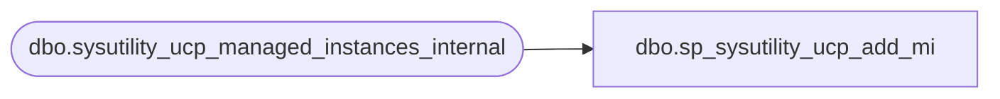

# dbo.sp_sysutility_ucp_add_mi

**Database:** msdb  
**Server:** STL-SSIS-P-01  

## Architecture Diagram



## Table Dependencies

| Referenced Table |
|---|
| dbo.sysutility_ucp_managed_instances_internal |

## Stored Procedure Code

```sql
CREATE PROCEDURE [dbo].[sp_sysutility_ucp_add_mi]
   @instance_name sysname,
   @virtual_server_name sysname,
   @agent_proxy_account sysname,
   @cache_directory nvarchar(520),
   @management_state int,
   @instance_id int = NULL OUTPUT
WITH EXECUTE AS OWNER
AS
BEGIN
   SET NOCOUNT ON
   
   DECLARE @retval INT
   
   DECLARE @null_column nvarchar(600)
   SET @null_column = NULL

    IF (@instance_name IS NULL OR @instance_name = N'')
        SET @null_column = '@instance_name'
    ELSE IF (@virtual_server_name IS NULL OR @virtual_server_name = N'')
        SET @null_column = '@virtual_server_name'
    ELSE IF (@management_state IS NULL)
        SET @null_column = '@management_state'
    ELSE IF (@agent_proxy_account IS NULL OR @agent_proxy_account = N'')
        SET @null_column = '@agent_proxy_account'    

    -- @cache_directory can be null or empty
    

   IF @null_column IS NOT NULL
   BEGIN
        RAISERROR(14043, -1, -1, @null_column, 'sp_sysutility_ucp_add_mi')
        RETURN(1)
   END
   
   
    IF EXISTS (SELECT * FROM dbo.sysutility_ucp_managed_instances_internal WHERE (instance_name = @instance_name))
    BEGIN
        RAISERROR(34010, -1, -1, 'Managed_Instance', @instance_name)
        RETURN(1)
    END
       
    INSERT INTO [dbo].[sysutility_ucp_managed_instances_internal]
      (instance_name, virtual_server_name, agent_proxy_account, cache_directory, management_state)
    VALUES
      (@instance_name, @virtual_server_name, @agent_proxy_account, @cache_directory, @management_state)
      
       
    SELECT @retval = @@error
    SET @instance_id = SCOPE_IDENTITY()
    RETURN(@retval)
    
END 

dbo,sp_sysutility_ucp_add_policy,CREATE PROCEDURE [dbo].[sp_sysutility_ucp_add_policy] 
   @policy_name SYSNAME,
   @rollup_object_type INT,
   @rollup_object_urn NVARCHAR(4000),
   @target_type INT,
   @resource_type INT,
   @utilization_type INT,
   @utilization_threshold FLOAT,
   @resource_health_policy_id INT = NULL OUTPUT
WITH EXECUTE AS OWNER
AS
BEGIN

    DECLARE @retval INT
    DECLARE @null_column    SYSNAME
    
    SET @null_column = NULL

    IF (@policy_name IS NULL OR @policy_name = N'')
        SET @null_column = '@policy_name'
    ELSE IF (@rollup_object_type IS NULL OR @rollup_object_type < 1 OR @rollup_object_type > 3)
        SET @null_column = '@rollup_object_type'
    ELSE IF (@rollup_object_urn IS NULL OR @rollup_object_urn = N'')
        SET @null_column = '@rollup_object_urn'
    ELSE IF (@target_type IS NULL OR @target_type < 1 OR @target_type > 6)
        SET @null_column = '@target_type'
    ELSE IF (@resource_type IS NULL OR @resource_type < 1 OR @resource_type > 5)
        SET @null_column = '@resource_type'
    ELSE IF (@utilization_type IS NULL OR @utilization_type < 1 OR @utilization_type > 2)
        SET @null_column = '@utilization_type'
    ELSE IF (@utilization_threshold IS NULL OR @utilization_threshold < 0 OR @utilization_threshold > 100)
        SET @null_column = '@utilization_threshold'       
    
    IF @null_column IS NOT NULL
    BEGIN
        RAISERROR(14043, -1, -1, @null_column, 'sp_sysutility_ucp_add_policy')
        RETURN(1)
    END

    IF NOT EXISTS (SELECT * FROM dbo.syspolicy_policies WHERE name = @policy_name)
    BEGIN
        RAISERROR(14027, -1, -1, @policy_name)
        RETURN(1)
    END

    INSERT INTO dbo.sysutility_ucp_health_policies_internal(policy_name, rollup_object_type, rollup_object_urn, target_type, resource_type, utilization_type, utilization_threshold)
    VALUES(@policy_name, @rollup_object_type, @rollup_object_urn, @target_type, @resource_type, @utilization_type, @utilization_threshold)
    
    SELECT @retval = @@error
    SET @resource_health_policy_id = SCOPE_IDENTITY()
    RETURN(@retval)
END
```

