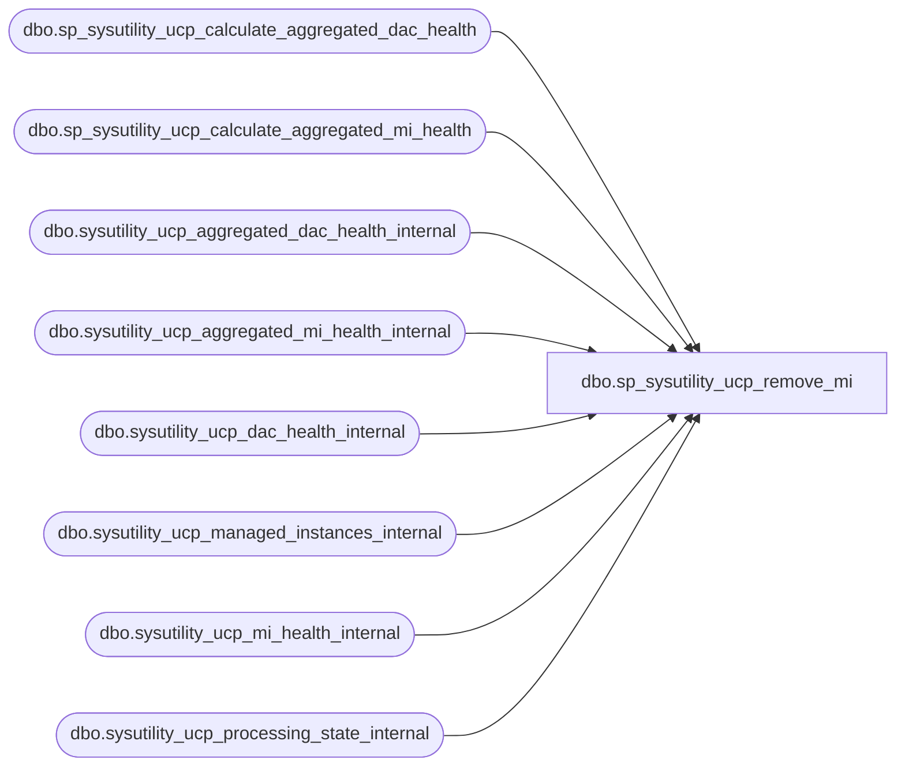

# dbo.sp_sysutility_ucp_remove_mi

**Database:** msdb  
**Server:** STL-SSIS-P-01  

## Architecture Diagram



## Table Dependencies

| Referenced Table |
|---|
| dbo.sp_sysutility_ucp_calculate_aggregated_dac_health |
| dbo.sp_sysutility_ucp_calculate_aggregated_mi_health |
| dbo.sysutility_ucp_aggregated_dac_health_internal |
| dbo.sysutility_ucp_aggregated_mi_health_internal |
| dbo.sysutility_ucp_dac_health_internal |
| dbo.sysutility_ucp_managed_instances_internal |
| dbo.sysutility_ucp_mi_health_internal |
| dbo.sysutility_ucp_processing_state_internal |

## Stored Procedure Code

```sql
CREATE PROCEDURE [dbo].[sp_sysutility_ucp_remove_mi]
@instance_id int
WITH EXECUTE AS OWNER
AS
BEGIN
   DECLARE @retval              INT


    IF (@instance_id IS NULL)
    BEGIN
        RAISERROR(14043, -1, -1, 'instance_id', 'sp_sysutility_ucp_remove_mi')
        RETURN(1)
    END

    DECLARE @instance_name SYSNAME
    SELECT @instance_name = instance_name 
    FROM msdb.dbo.sysutility_ucp_managed_instances_internal 
    WHERE instance_id = @instance_id
    
    -- Clean up managed instance health states and update dashboard stats
    -- This block comes before the delete from sysutility_ucp_managed_instances_internal
    -- so we can retrieve the instance name in case there's an error inside the block and
    -- this sp is rerun
    IF EXISTS (SELECT 1 FROM msdb.dbo.sysutility_ucp_mi_health_internal WHERE mi_name = @instance_name)
    BEGIN
        DECLARE @health_state_id INT
        SELECT @health_state_id = latest_health_state_id FROM msdb.dbo.sysutility_ucp_processing_state_internal
        
        -- Delete the managed instance record
        DELETE FROM msdb.dbo.sysutility_ucp_mi_health_internal WHERE mi_name = @instance_name

        -- Re-compute the dashboard health stats
        DELETE FROM msdb.dbo.sysutility_ucp_aggregated_mi_health_internal WHERE set_number = @health_state_id
        EXEC msdb.dbo.sp_sysutility_ucp_calculate_aggregated_mi_health @health_state_id   
        
        -- Delete the health records of DACs in the removed instance.
        DELETE FROM msdb.dbo.sysutility_ucp_dac_health_internal WHERE dac_server_instance_name = @instance_name        
        
        -- Re-compute the DAC health stats in the dashboard
        DELETE FROM msdb.dbo.sysutility_ucp_aggregated_dac_health_internal WHERE set_number = @health_state_id
        EXEC msdb.dbo.sp_sysutility_ucp_calculate_aggregated_dac_health @health_state_id   
    END

    DELETE [dbo].[sysutility_ucp_managed_instances_internal] 
        WHERE instance_id = @instance_id

    SELECT @retval = @@error
    RETURN(@retval)
END

dbo,sp_sysutility_ucp_update_policy,CREATE PROCEDURE [dbo].[sp_sysutility_ucp_update_policy] 
   @resource_health_policy_id INT
   , @utilization_threshold INT
WITH EXECUTE AS OWNER
AS
BEGIN

    DECLARE @retval INT
    DECLARE @null_column    SYSNAME
    
    SET @null_column = NULL

    IF (@resource_health_policy_id IS NULL OR @resource_health_policy_id = 0)
        SET @null_column = '@resource_health_policy_id'
    ELSE IF (@utilization_threshold IS NULL OR @utilization_threshold < 0 OR @utilization_threshold > 100)
        SET @null_column = '@utilization_threshold'    

    IF @null_column IS NOT NULL
    BEGIN
        RAISERROR(14043, -1, -1, @null_column, 'sp_sysutility_ucp_update_policy')
        RETURN(1)
    END

    IF NOT EXISTS (SELECT * FROM dbo.sysutility_ucp_health_policies_internal WHERE health_policy_id = @resource_health_policy_id)
    BEGIN
        RAISERROR(22981, -1, -1)
        RETURN(1)
    END
    
    UPDATE dbo.sysutility_ucp_health_policies_internal
    SET utilization_threshold = @utilization_threshold
    WHERE health_policy_id = @resource_health_policy_id
    
    SELECT @retval = @@error
    RETURN(@retval)
END

dbo,sp_sysutility_ucp_update_utility_configuration,CREATE PROCEDURE [dbo].[sp_sysutility_ucp_update_utility_configuration] 
   @name SYSNAME,
   @value SQL_VARIANT
WITH EXECUTE AS OWNER
AS
BEGIN

    DECLARE @retval INT
    DECLARE @null_column    SYSNAME
    
    SET @null_column = NULL

    IF (@name IS NULL OR @name = N'')
        SET @null_column = '@name'
    ELSE IF (@value IS NULL)
        SET @null_column = '@value'
    
    IF @null_column IS NOT NULL
    BEGIN
        RAISERROR(14043, -1, -1, @null_column, 'sp_sysutility_ucp_update_utility_configuration')
        RETURN(1)
    END

    IF NOT EXISTS (SELECT 1 FROM dbo.sysutility_ucp_configuration_internal WHERE name = @name)
    BEGIN
        RAISERROR(14027, -1, -1, @name)
        RETURN(1)
    END

    UPDATE dbo.sysutility_ucp_configuration_internal SET current_value = @value WHERE name = @name
    
    SELECT @retval = @@error
    RETURN(@retval)
END
```

