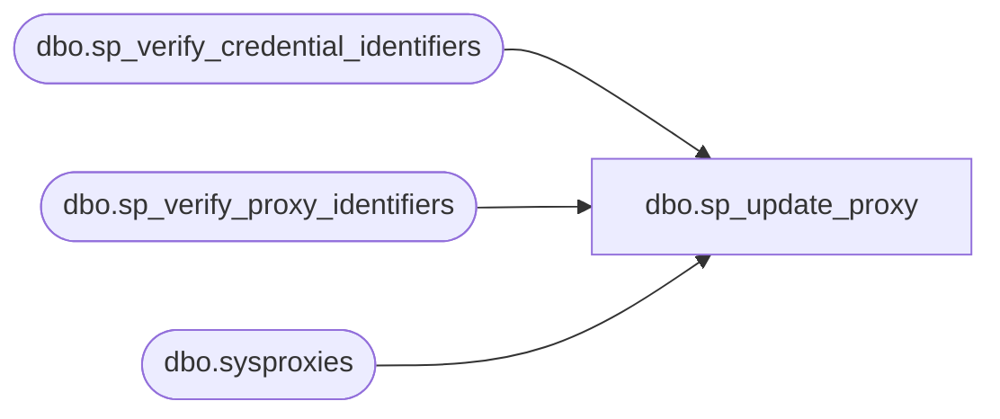

# dbo.sp_update_proxy

**Database:** msdb  
**Server:** STL-SSIS-P-01  

## Architecture Diagram



## Table Dependencies

| Referenced Table |
|---|
| dbo.sp_verify_credential_identifiers |
| dbo.sp_verify_proxy_identifiers |
| dbo.sysproxies |

## Stored Procedure Code

```sql
CREATE PROCEDURE dbo.sp_update_proxy
   @proxy_id [int] = NULL,
   @proxy_name [sysname] = NULL, 
   -- must specify only one of above parameter identify the proxy
   @credential_name [sysname] = NULL,
   @credential_id [INT] = NULL,
   @new_name [sysname] = NULL,
   @enabled [tinyint] = NULL,
   @description [nvarchar](512) = NULL
AS
BEGIN
   DECLARE  @x_new_name [sysname] 
   DECLARE  @x_credential_id [int] 
   DECLARE  @x_enabled [tinyint] 
   DECLARE @x_description [nvarchar](512)
   DECLARE @x_credential_date_created [datetime]
   DECLARE @user_sid VARBINARY(85)
      DECLARE @full_name [sysname] --two sysnames + \
   DECLARE @retval   INT
   SET NOCOUNT ON
    
   EXECUTE @retval = sp_verify_proxy_identifiers '@proxy_name',
                                                  '@proxy_id',
                                                   @proxy_name OUTPUT,
                                                   @proxy_id   OUTPUT
  IF (@retval <> 0)
    RETURN(1) -- Failure

  IF @credential_id IS NOT NULL OR @credential_name IS NOT NULL
  BEGIN
     EXECUTE @retval = sp_verify_credential_identifiers '@credential_name',
                                                    '@credential_id',
                                                    @credential_name OUTPUT,
                                                    @credential_id   OUTPUT
    IF (@retval <> 0)
      RETURN(1) -- Failure
  END

   -- Remove any leading/trailing spaces from parameters
   SELECT @new_name                = LTRIM(RTRIM(@new_name))
   SELECT @description             = LTRIM(RTRIM(@description))
  -- Turn [nullable] empty string parameters into NULLs
  IF @new_name      = '' SELECT @new_name = NULL
  IF @description    = '' SELECT @description = NULL

  -- Set the x_ (existing) variables
  SELECT    @x_new_name      = name,
    @x_credential_id = credential_id,
      @x_enabled       = enabled,
      @x_description   = description,
    @x_credential_date_created = credential_date_created
   FROM sysproxies
   WHERE proxy_id = @proxy_id

  --get the new date from credential table
  IF  (@credential_id IS NOT NULL)
    SELECT @x_credential_date_created = create_date FROM master.sys.credentials
    WHERE  credential_id = @credential_id
        
    -- Fill out the values for all non-supplied parameters from the existing values
   IF    (@new_name      IS NULL) SELECT   @new_name          =           @x_new_name                          
   IF (@credential_id IS NULL) SELECT   @credential_id     =           @x_credential_id                                    
   IF (@enabled       IS NULL) SELECT   @enabled           =           @x_enabled                                    
   IF (@description   IS NULL) SELECT   @description       =           @x_description            

  -- warn if the user_domain\user_name does not exist
  SELECT @full_name = credential_identity from master.sys.credentials 
  WHERE  credential_id = @credential_id
  
  --force case insensitive comparation for NT users
  SELECT @user_sid = SUSER_SID(@full_name, 0)
  IF @user_sid IS NULL
  BEGIN
    RAISERROR(14529, -1, -1, @full_name)
    RETURN(1)
  END
 
  -- Finally, do the actual UPDATE
  UPDATE msdb.dbo.sysproxies
   SET
   name     =  @new_name,
   credential_id  =  @credential_id,
   user_sid =  @user_sid,
   enabled     =  @enabled,
   description =  @description,
   credential_date_created = @x_credential_date_created  --@x_ is OK in this case
   WHERE proxy_id = @proxy_id
END

dbo,sp_update_replication_job_parameter,CREATE PROCEDURE sp_update_replication_job_parameter
  @job_id        UNIQUEIDENTIFIER,
  @old_freq_type INT,
  @new_freq_type INT
AS
BEGIN
  DECLARE @category_id INT
  DECLARE @pattern     NVARCHAR(50)
  DECLARE @patternidx  INT
  DECLARE @cmdline     NVARCHAR(3200)
  DECLARE @step_id     INT

  SET NOCOUNT ON
  SELECT @pattern = N'%[-/][Cc][Oo][Nn][Tt][Ii][Nn][Uu][Oo][Uu][Ss]%'

  -- Make sure that we are dealing with relevant replication jobs
  SELECT @category_id = category_id
  FROM msdb.dbo.sysjobs
  WHERE (@job_id = job_id)

  -- @category_id = 10 (REPL-Distribution), 13 (REPL-LogReader), 14 (REPL-Merge),
  --  19 (REPL-QueueReader)
  IF @category_id IN (10, 13, 14, 19)
  BEGIN
    -- Adding the -Continuous parameter (non auto-start to auto-start)
    IF ((@old_freq_type <> 0x40) AND (@new_freq_type = 0x40))
    BEGIN
      -- Use a cursor to handle multiple replication agent job steps
      DECLARE step_cursor CURSOR LOCAL FOR
      SELECT command, step_id
      FROM msdb.dbo.sysjobsteps
      WHERE (@job_id = job_id)
        AND (UPPER(subsystem collate SQL_Latin1_General_CP1_CS_AS) IN (N'MERGE', N'LOGREADER', N'DISTRIBUTION', N'QUEUEREADER'))
      OPEN step_cursor
      FETCH step_cursor INTO @cmdline, @step_id

      WHILE (@@FETCH_STATUS <> -1)
      BEGIN
        SELECT @patternidx = PATINDEX(@pattern, @cmdline)
        -- Make sure that the -Continuous parameter has not been specified already
        IF (@patternidx = 0)
        BEGIN
          SELECT @cmdline = @cmdline + N' -Continuous'
          UPDATE msdb.dbo.sysjobsteps
          SET command = @cmdline
          WHERE (@job_id = job_id)
            AND (@step_id = step_id)
        END -- IF (@patternidx = 0)
        FETCH NEXT FROM step_cursor into @cmdline, @step_id
      END -- WHILE (@@FETCH_STATUS <> -1)
      CLOSE step_cursor
      DEALLOCATE step_cursor
    END -- IF ((@old_freq_type...
    -- Removing the -Continuous parameter (auto-start to non auto-start)
    ELSE
    IF ((@old_freq_type = 0x40) AND (@new_freq_type <> 0x40))
    BEGIN
      DECLARE step_cursor CURSOR LOCAL FOR
      SELECT command, step_id
      FROM msdb.dbo.sysjobsteps
      WHERE (@job_id = job_id)
        AND (UPPER(subsystem collate SQL_Latin1_General_CP1_CS_AS) IN (N'MERGE', N'LOGREADER', N'DISTRIBUTION', N'QUEUEREADER'))
      OPEN step_cursor
      FETCH step_cursor INTO @cmdline, @step_id

      WHILE (@@FETCH_STATUS <> -1)
      BEGIN
        SELECT @patternidx = PATINDEX(@pattern, @cmdline)
        IF (@patternidx <> 0)
        BEGIN
          -- Handle multiple instances of -Continuous in the commandline
          WHILE (@patternidx <> 0)
          BEGIN
            SELECT @cmdline = STUFF(@cmdline, @patternidx, 11, N'')
            IF (@patternidx > 1)
            BEGIN
              -- Remove the preceding space if -Continuous does not start at the beginning of the commandline
              SELECT @cmdline = stuff(@cmdline, @patternidx - 1, 1, N'')
            END
            SELECT @patternidx = PATINDEX(@pattern, @cmdline)
          END -- WHILE (@patternidx <> 0)
          UPDATE msdb.dbo.sysjobsteps
          SET command = @cmdline
          WHERE (@job_id = job_id)
            AND (@step_id = step_id)
        END -- IF (@patternidx <> -1)
        FETCH NEXT FROM step_cursor INTO @cmdline, @step_id
      END -- WHILE (@@FETCH_STATUS <> -1)
      CLOSE step_cursor
      DEALLOCATE step_cursor
    END -- ELSE IF ((@old_freq_type = 0x40)...
  END -- IF @category_id IN (10, 13, 14)

  RETURN 0
END
```

