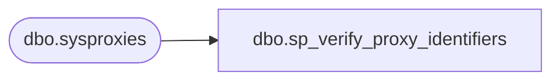

# dbo.sp_verify_proxy_identifiers

**Database:** msdb  
**Server:** STL-SSIS-P-01  

## Architecture Diagram



## Table Dependencies

| Referenced Table |
|---|
| dbo.sysproxies |

## Stored Procedure Code

```sql
CREATE PROCEDURE sp_verify_proxy_identifiers
   @name_of_name_parameter [varchar](60),
   @name_of_id_parameter [varchar](60),
   @proxy_name [sysname] OUTPUT,
   @proxy_id [INT] OUTPUT
AS
BEGIN
  DECLARE @retval         INT
  DECLARE @proxy_id_as_char NVARCHAR(36)

  SET NOCOUNT ON

  -- Remove any leading/trailing spaces from parameters
  SELECT @name_of_name_parameter = LTRIM(RTRIM(@name_of_name_parameter))
  SELECT @name_of_id_parameter   = LTRIM(RTRIM(@name_of_id_parameter))
  SELECT @proxy_name             = LTRIM(RTRIM(@proxy_name))

  IF (@proxy_name = N'') SELECT @proxy_name = NULL

  IF ((@proxy_name IS NULL)     AND (@proxy_id IS NULL)) OR
     ((@proxy_name IS NOT NULL) AND (@proxy_id IS NOT NULL))
  BEGIN
    RAISERROR(14524, -1, -1, @name_of_id_parameter, @name_of_name_parameter)
    RETURN(1) -- Failure
  END

  -- Check proxy id
  IF (@proxy_id IS NOT NULL)
  BEGIN
    SELECT @proxy_name = name
    FROM msdb.dbo.sysproxies
    WHERE (proxy_id = @proxy_id)
    IF (@proxy_name IS NULL)
    BEGIN
     SELECT @proxy_id_as_char = CONVERT(nvarchar(36), @proxy_id)
      RAISERROR(14262, -1, -1, @name_of_id_parameter, @proxy_id_as_char)
      RETURN(1) -- Failure
    END
  END
  ELSE
  -- Check proxy name
  IF (@proxy_name IS NOT NULL)
  BEGIN
    -- The name is not ambiguous, so get the corresponding proxy_id (if the job exists)
    SELECT @proxy_id = proxy_id
    FROM msdb.dbo.sysproxies
    WHERE (name = @proxy_name)
    IF (@proxy_id IS NULL)
    BEGIN
      RAISERROR(14262, -1, -1, @name_of_name_parameter, @proxy_name)
      RETURN(1) -- Failure
    END
  END

  RETURN(0) -- Success
END

dbo,sp_verify_proxy_permissions,CREATE PROCEDURE dbo.sp_verify_proxy_permissions
   @subsystem_name sysname,
   @proxy_id      INT = NULL,
   @name       NVARCHAR(256) = NULL,
   @raise_error    INT = 1,
   @allow_disable_proxy INT = 0,
   @verify_special_account INT = 0,
   @check_only_read_perm INT = 0
AS 
BEGIN
  DECLARE @retval   INT
  DECLARE @granted_sid VARBINARY(85)
  DECLARE @is_member INT
  DECLARE @is_sysadmin BIT
  DECLARE @flags TINYINT
  DECLARE @enabled TINYINT
  DECLARE @name_sid VARBINARY(85)
  DECLARE @role_from_sid sysname
  DECLARE @name_from_sid sysname
  DECLARE @is_SQLAgentOperatorRole BIT
  DECLARE @check_only_subsystem BIT
  DECLARE proxy_subsystem CURSOR LOCAL
  FOR
    SELECT p.sid, p.flags
    FROM sysproxyloginsubsystem_view p, syssubsystems s
    WHERE p.proxy_id = @proxy_id AND p.subsystem_id = s.subsystem_id
        AND UPPER(s.subsystem collate SQL_Latin1_General_CP1_CS_AS) = 
            UPPER(@subsystem_name collate SQL_Latin1_General_CP1_CS_AS)
   
  SET NOCOUNT ON
  SELECT @retval = 1

  IF @proxy_id IS NULL
    RETURN(0)

   -- TSQL subsystem prohibited
  IF (UPPER(@subsystem_name collate SQL_Latin1_General_CP1_CS_AS) = N'TSQL')
  BEGIN
    RAISERROR(14517, -1, -1)
    RETURN(1) -- Failure
  END
   
  --check if the date stored inside proxy still exists and match the cred create_date inside proxy
  --otherwise the credential has been tempered from outside
  --if so, disable proxy and continue execution
  --only a sysadmin caller have cross database permissions but
  --when executing by sqlagent this check will be always performed
  IF (ISNULL(IS_SRVROLEMEMBER(N'sysadmin'), 0) = 1) 
  BEGIN
    IF NOT EXISTS(SELECT * FROM sysproxies p JOIN master.sys.credentials c ON p.credential_id = c.credential_id
            WHERE p.proxy_id = @proxy_id AND p.credential_date_created = c.create_date AND enabled=1)
    BEGIN
        UPDATE sysproxies SET enabled=0 WHERE proxy_id = @proxy_id
    END
  END
  
  --if no login has been passed check permission against the caller 
  IF @name IS NULL
    SELECT @name = SUSER_SNAME()  
    
  --check if the proxy is disable and continue or not based on
  --allow_disable_proxy
  --allow creation of a job step with a disabled proxy but
  --sqlagent always call with @allow_disable_proxy = 0
  SELECT @enabled = enabled FROM sysproxies WHERE proxy_id = @proxy_id
  IF (@enabled = 0) AND (@allow_disable_proxy = 0)
  BEGIN
    RAISERROR(14537, -1, -1, @proxy_id)
    RETURN(2) -- Failure
  END

  --we need to check permission only against subsystem in following cases
  --1. @name is sysadmin
  --2. @name is member of SQLAgentOperatorRole and @check_only_read_perm=1
  --3. @verify_special_account =1
  --sysadmin and SQLAgentOperatorRole have permission to view all proxies
  IF (@verify_special_account = 1)
    SET @check_only_subsystem = 1  
  ELSE
  BEGIN
    EXEC @is_sysadmin = sp_sqlagent_is_srvrolemember N'sysadmin', @name 
    IF (@is_sysadmin = 1)
      SET @check_only_subsystem = 1  
    ELSE
    BEGIN
      EXEC @is_SQLAgentOperatorRole = sp_sqlagent_is_srvrolemember N'SQLAgentOperatorRole', @name -- check role membership 
      IF ((@is_SQLAgentOperatorRole = 1) AND (@check_only_read_perm = 1))
        SET @check_only_subsystem = 1 
    END
  END 
  
  IF (@check_only_subsystem = 1)
  BEGIN
    IF NOT EXISTS(SELECT * FROM sysproxysubsystem sp JOIN syssubsystems s ON sp.subsystem_id = s.subsystem_id
                  WHERE proxy_id = @proxy_id  AND UPPER(s.subsystem collate SQL_Latin1_General_CP1_CS_AS) = 
                     UPPER(@subsystem_name collate SQL_Latin1_General_CP1_CS_AS))
    BEGIN
      IF (@raise_error <> 0)
      BEGIN
        RAISERROR(14516, -1, -1, @proxy_id, @subsystem_name, @name)
      END         
      RETURN(1) -- Failure     
    END
    RETURN(0)
  END
  
  --get SID from name; we verify if a login has permission to use a certain proxy
  --force case insensitive comparation for NT users
  SELECT @name_sid = SUSER_SID(@name, 0)

  --check first if name has been granted explicit permissions
  IF (@name_sid IS NOT NULL)
  BEGIN
      IF EXISTS(SELECT * FROM sysproxyloginsubsystem_view p, syssubsystems s
        WHERE p.proxy_id = @proxy_id AND p.subsystem_id = s.subsystem_id
            AND UPPER(s.subsystem collate SQL_Latin1_General_CP1_CS_AS) = 
                UPPER(@subsystem_name collate SQL_Latin1_General_CP1_CS_AS)
            AND
        p.sid = @name_sid) -- name has been granted explicit permissions
      BEGIN
        RETURN(0)
      END
  END

  OPEN proxy_subsystem
  FETCH NEXT FROM proxy_subsystem INTO @granted_sid, @flags
  WHILE (@@fetch_status = 0 AND @retval = 1)
  BEGIN
    IF @flags = 0 AND @granted_sid IS NOT NULL AND @name_sid IS NOT NULL -- NT GROUP 
    BEGIN
        EXEC @is_member = sp_sqlagent_is_member @group_sid = @granted_sid, @login_sid = @name_sid 
        IF @is_member = 1
          SELECT @retval = 0
    END
    ELSE IF @flags = 2 AND @granted_sid IS NOT NULL -- MSDB role (@name_sid can be null in case of a loginless user member of msdb)
    BEGIN
        DECLARE @principal_id INT
        SET @principal_id = msdb.dbo.get_principal_id(@granted_sid)
        EXEC @is_member = sp_sqlagent_is_member @role_principal_id = @principal_id, @login_sid = @name_sid 
        IF @is_member = 1
          SELECT @retval = 0
    END
    ELSE IF (@flags = 1) AND @granted_sid IS NOT NULL AND @name_sid IS NOT NULL -- FIXED SERVER Roles
    BEGIN   
      -- we have to use impersonation to check for role membership
      SELECT @role_from_sid = SUSER_SNAME(@granted_sid)
      SELECT @name_from_sid = SUSER_SNAME(@name_sid)
      EXEC   @is_member = sp_sqlagent_is_srvrolemember @role_from_sid, @name_from_sid -- check role membership 

      IF @is_member = 1
        SELECT @retval = 0
    END

    IF @retval = 1
    BEGIN
        SELECT @granted_sid = NULL
        FETCH NEXT FROM proxy_subsystem INTO @granted_sid, @flags
    END
  END
  DEALLOCATE proxy_subsystem
  
  IF (@retval = 1 AND @raise_error <> 0)
  BEGIN
    RAISERROR(14516, -1, -1, @proxy_id, @subsystem_name, @name)
    RETURN(1) -- Failure
  END

   --0 is for success
   RETURN @retval
END

dbo,sp_verify_schedule,CREATE PROCEDURE sp_verify_schedule
  @schedule_id            INT,
  @name                   sysname,
  @enabled                TINYINT,
  @freq_type              INT,          
  @freq_interval          INT OUTPUT,   -- Output because we may set it to 0 if Frequency Type is one-time or auto-start
  @freq_subday_type       INT OUTPUT,   -- As above
  @freq_subday_interval   INT OUTPUT,   -- As above
  @freq_relative_interval INT OUTPUT,   -- As above
  @freq_recurrence_factor INT OUTPUT,   -- As above
  @active_start_date      INT OUTPUT,
  @active_start_time      INT OUTPUT,
  @active_end_date        INT OUTPUT,
  @active_end_time        INT OUTPUT,
  @owner_sid              VARBINARY(85) --Must be a valid sid. Will fail if this is NULL
AS
BEGIN
  DECLARE @return_code             INT
  DECLARE @res_valid_range         NVARCHAR(100)
  DECLARE @reason                  NVARCHAR(200)
  DECLARE @isAdmin                 INT
  SET NOCOUNT ON

  -- Remove any leading/trailing spaces from parameters
  SELECT @name = LTRIM(RTRIM(@name))

  -- Make sure that NULL input/output parameters - if NULL - are initialized to 0
  SELECT @freq_interval          = ISNULL(@freq_interval, 0)
  SELECT @freq_subday_type       = ISNULL(@freq_subday_type, 0)
  SELECT @freq_subday_interval   = ISNULL(@freq_subday_interval, 0)
  SELECT @freq_relative_interval = ISNULL(@freq_relative_interval, 0)
  SELECT @freq_recurrence_factor = ISNULL(@freq_recurrence_factor, 0)
  SELECT @active_start_date      = ISNULL(@active_start_date, 0)
  SELECT @active_start_time      = ISNULL(@active_start_time, 0)
  SELECT @active_end_date        = ISNULL(@active_end_date, 0)
  SELECT @active_end_time        = ISNULL(@active_end_time, 0)


  -- Check owner 
  IF(ISNULL(IS_SRVROLEMEMBER(N'sysadmin'), 0) = 1)
    SELECT @isAdmin = 1
  ELSE
    SELECT @isAdmin = 0


  -- If a non-sa is [illegally] trying to create a schedule for another user then raise an error
  IF ((@isAdmin <> 1) AND 
      (ISNULL(IS_MEMBER('SQLAgentOperatorRole'),0) <> 1 AND @schedule_id IS NULL) AND
      (@owner_sid <> SUSER_SID()))
  BEGIN
     RAISERROR(14366, -1, -1)
     RETURN(1) -- Failure
  END


  -- Now just check that the login id is valid (ie. it exists and isn't an NT group)
  IF (@owner_sid <> 0x010100000000000512000000) AND -- NT AUTHORITY\SYSTEM sid
     (@owner_sid <> 0x010100000000000514000000)     -- NT AUTHORITY\NETWORK SERVICE sid
  BEGIN
     IF (@owner_sid IS NULL) OR (EXISTS (SELECT *
                                      FROM master.dbo.syslogins
                                      WHERE (sid = @owner_sid)
                                      AND (isntgroup <> 0)))
     BEGIN
       -- NOTE: In the following message we quote @owner_login_name instead of @owner_sid
       --       since this is the parameter the user passed to the calling SP (ie. either
       --       sp_add_schedule, sp_add_job and sp_update_job)
       SELECT @res_valid_range = FORMATMESSAGE(14203)
       RAISERROR(14234, -1, -1, '@owner_login_name', @res_valid_range)
       RETURN(1) -- Failure
     END
  END
  
  -- Verify name (we disallow schedules called 'ALL' since this has special meaning in sp_delete_jobschedules)
  IF (UPPER(@name collate SQL_Latin1_General_CP1_CS_AS) = N'ALL')
  BEGIN
    RAISERROR(14200, -1, -1, '@name')
    RETURN(1) -- Failure
  END

  -- Verify enabled state
  IF (@enabled <> 0) AND (@enabled <> 1)
  BEGIN
    RAISERROR(14266, -1, -1, '@enabled', '0, 1')
    RETURN(1) -- Failure
  END

  -- Verify frequency type
  IF (@freq_type = 0x2) -- OnDemand is no longer supported
  BEGIN
    RAISERROR(14295, -1, -1)
    RETURN(1) -- Failure
  END
  IF (@freq_type NOT IN (0x1, 0x4, 0x8, 0x10, 0x20, 0x40, 0x80))
  BEGIN
    RAISERROR(14266, -1, -1, '@freq_type', '1, 4, 8, 16, 32, 64, 128')
    RETURN(1) -- Failure
  END

  -- Verify frequency sub-day type
  IF (@freq_subday_type <> 0) AND (@freq_subday_type NOT IN (0x1, 0x2, 0x4, 0x8))
  BEGIN
    RAISERROR(14266, -1, -1, '@freq_subday_type', '0x1, 0x2, 0x4, 0x8')
    RETURN(1) -- Failure
  END

  -- Default active start/end date/times (if not supplied, or supplied as NULLs or 0)
  IF (@active_start_date = 0)
    SELECT @active_start_date = DATEPART(yy, GETDATE()) * 10000 +
                                DATEPART(mm, GETDATE()) * 100 +
                                DATEPART(dd, GETDATE()) -- This is an ISO format: "yyyymmdd"
  IF (@active_end_date = 0)
    SELECT @active_end_date = 99991231  -- December 31st 9999
  IF (@active_start_time = 0)
    SELECT @active_start_time = 000000  -- 12:00:00 am
  IF (@active_end_time = 0)
    SELECT @active_end_time = 235959    -- 11:59:59 pm

  -- Verify active start/end dates
  IF (@active_end_date = 0)
    SELECT @active_end_date = 99991231

  EXECUTE @return_code = sp_verify_job_date @active_end_date, '@active_end_date'
  IF (@return_code <> 0)
    RETURN(1) -- Failure

  EXECUTE @return_code = sp_verify_job_date @active_start_date, '@active_start_date'
  IF (@return_code <> 0)
    RETURN(1) -- Failure

  IF (@active_end_date < @active_start_date)
  BEGIN
    RAISERROR(14288, -1, -1, '@active_end_date', '@active_start_date')
    RETURN(1) -- Failure
  END

  EXECUTE @return_code = sp_verify_job_time @active_end_time, '@active_end_time'
  IF (@return_code <> 0)
    RETURN(1) -- Failure

  EXECUTE @return_code = sp_verify_job_time @active_start_time, '@active_start_time'
  IF (@return_code <> 0)
    RETURN(1) -- Failure

  -- NOTE: It's valid for active_end_time to be less than active_start_time since in this
  --       case we assume that the user wants the active time zone to span midnight.
  --       But it's not valid for active_start_date and active_end_date to be the same for recurring sec/hour/minute schedules

  IF (@active_start_time = @active_end_time and (@freq_subday_type in (0x2, 0x4, 0x8)))
  BEGIN
    SELECT @res_valid_range = FORMATMESSAGE(14202)
    RAISERROR(14266, -1, -1, '@active_end_time', @res_valid_range)
    RETURN(1) -- Failure
  END

  -- NOTE: The rest of this procedure is a SQL implementation of VerifySchedule in job.c

  IF ((@freq_type = 0x1) OR  -- FREQTYPE_ONETIME
      (@freq_type = 0x40) OR -- FREQTYPE_AUTOSTART
      (@freq_type = 0x80))   -- FREQTYPE_ONIDLE
  BEGIN
    -- Set standard defaults for non-required parameters
    SELECT @freq_interval          = 0
    SELECT @freq_subday_type       = 0
    SELECT @freq_subday_interval   = 0
    SELECT @freq_relative_interval = 0
    SELECT @freq_recurrence_factor = 0

    -- Check that a one-time schedule isn't already in the past
    -- Bug 442883: let the creation of the one-time schedule succeed but leave a disabled schedule
    /*
    IF (@freq_type = 0x1) -- FREQTYPE_ONETIME
    BEGIN
      DECLARE @current_date INT
      DECLARE @current_time INT

      -- This is an ISO format: "yyyymmdd"
      SELECT @current_date = CONVERT(INT, CONVERT(VARCHAR, GETDATE(), 112))
      SELECT @current_time = (DATEPART(hh, GETDATE()) * 10000) + (DATEPART(mi, GETDATE()) * 100) + DATEPART(ss, GETDATE())
      IF (@active_start_date < @current_date) OR ((@active_start_date = @current_date) AND (@active_start_time <= @current_time))
      BEGIN
        SELECT @res_valid_range = '> ' + CONVERT(VARCHAR, @current_date) + ' / ' + CONVERT(VARCHAR, @current_time)
        SELECT @reason = '@active_start_date = ' + CONVERT(VARCHAR, @active_start_date) + ' / @active_start_time = ' + CONVERT(VARCHAR, @active_start_time)
        RAISERROR(14266, -1, -1, @reason, @res_valid_range)
        RETURN(1) -- Failure
      END
    END
    */

    GOTO ExitProc
  END

  -- Safety net: If the sub-day-type is 0 (and we know that the schedule is not a one-time or
  --             auto-start) then set it to 1 (FREQSUBTYPE_ONCE).  If the user wanted something
  --             other than ONCE then they should have explicitly set @freq_subday_type.
  IF (@freq_subday_type = 0)
    SELECT @freq_subday_type = 0x1 -- FREQSUBTYPE_ONCE

  IF ((@freq_subday_type <> 0x1) AND  -- FREQSUBTYPE_ONCE   (see qsched.h)
      (@freq_subday_type <> 0x2) AND  -- FREQSUBTYPE_SECOND (see qsched.h)
      (@freq_subday_type <> 0x4) AND  -- FREQSUBTYPE_MINUTE (see qsched.h)
      (@freq_subday_type <> 0x8))     -- FREQSUBTYPE_HOUR   (see qsched.h)
  BEGIN
    SELECT @reason = FORMATMESSAGE(14266, '@freq_subday_type', '0x1, 0x2, 0x4, 0x8')
    RAISERROR(14278, -1, -1, @reason)
    RETURN(1) -- Failure
  END

  IF ((@freq_subday_type <> 0x1) AND (@freq_subday_interval < 1)) -- FREQSUBTYPE_ONCE and less than 1 interval
     OR
     ((@freq_subday_type = 0x2) AND (@freq_subday_interval < 10)) -- FREQSUBTYPE_SECOND and less than 10 seconds (see MIN_SCHEDULE_GRANULARITY in SqlAgent source code)
  BEGIN
    SELECT @reason = FORMATMESSAGE(14200, '@freq_subday_interval')
    RAISERROR(14278, -1, -1, @reason)
    RETURN(1) -- Failure
  END

  IF (@freq_type = 0x4)      -- FREQTYPE_DAILY
  BEGIN
    SELECT @freq_recurrence_factor = 0
    IF (@freq_interval < 1)
    BEGIN
      SELECT @reason = FORMATMESSAGE(14572)
      RAISERROR(14278, -1, -1, @reason)
      RETURN(1) -- Failure
    END
  END

  IF (@freq_type = 0x8)      -- FREQTYPE_WEEKLY
  BEGIN
    IF (@freq_interval < 1)   OR
       (@freq_interval > 127) -- (2^7)-1 [freq_interval is a bitmap (Sun=1..Sat=64)]
    BEGIN
      SELECT @reason = FORMATMESSAGE(14573)
      RAISERROR(14278, -1, -1, @reason)
      RETURN(1) -- Failure
    END

  END

  IF (@freq_type = 0x10)    -- FREQTYPE_MONTHLY
  BEGIN
    IF (@freq_interval < 1)  OR
       (@freq_interval > 31)
    BEGIN
      SELECT @reason = FORMATMESSAGE(14574)
      RAISERROR(14278, -1, -1, @reason)
      RETURN(1) -- Failure
    END

  END

  IF (@freq_type = 0x20)     -- FREQTYPE_MONTHLYRELATIVE
  BEGIN
    IF (@freq_relative_interval <> 0x01) AND  -- RELINT_1ST
       (@freq_relative_interval <> 0x02) AND  -- RELINT_2ND
       (@freq_relative_interval <> 0x04) AND  -- RELINT_3RD
       (@freq_relative_interval <> 0x08) AND  -- RELINT_4TH
       (@freq_relative_interval <> 0x10)      -- RELINT_LAST
    BEGIN
      SELECT @reason = FORMATMESSAGE(14575)
      RAISERROR(14278, -1, -1, @reason)
      RETURN(1) -- Failure
    END
  END

  IF (@freq_type = 0x20)     -- FREQTYPE_MONTHLYRELATIVE
  BEGIN
    IF (@freq_interval <> 01) AND -- RELATIVE_SUN
       (@freq_interval <> 02) AND -- RELATIVE_MON
       (@freq_interval <> 03) AND -- RELATIVE_TUE
       (@freq_interval <> 04) AND -- RELATIVE_WED
       (@freq_interval <> 05) AND -- RELATIVE_THU
       (@freq_interval <> 06) AND -- RELATIVE_FRI
       (@freq_interval <> 07) AND -- RELATIVE_SAT
       (@freq_interval <> 08) AND -- RELATIVE_DAY
       (@freq_interval <> 09) AND -- RELATIVE_WEEKDAY
       (@freq_interval <> 10)     -- RELATIVE_WEEKENDDAY
    BEGIN
      SELECT @reason = FORMATMESSAGE(14576)
      RAISERROR(14278, -1, -1, @reason)
      RETURN(1) -- Failure
    END
  END

  IF ((@freq_type = 0x08)  OR   -- FREQTYPE_WEEKLY
      (@freq_type = 0x10)  OR   -- FREQTYPE_MONTHLY
      (@freq_type = 0x20)) AND  -- FREQTYPE_MONTHLYRELATIVE
      (@freq_recurrence_factor < 1)
  BEGIN
    SELECT @reason = FORMATMESSAGE(14577)
    RAISERROR(14278, -1, -1, @reason)
    RETURN(1) -- Failure
  END

ExitProc:
  -- If we made it this far the schedule is good
  RETURN(0) -- Success

END

dbo,sp_verify_schedule_identifiers,CREATE PROCEDURE sp_verify_schedule_identifiers
  @name_of_name_parameter   VARCHAR(60),             -- Eg. '@schedule_name'
  @name_of_id_parameter     VARCHAR(60),             -- Eg. '@schedule_id'
  @schedule_name            sysname             OUTPUT, 
  @schedule_id              INT                 OUTPUT,
  @owner_sid                VARBINARY(85)       OUTPUT,
  @orig_server_id           INT                 OUTPUT,
  @job_id_filter            UNIQUEIDENTIFIER    = NULL
AS
BEGIN
  DECLARE @retval         INT
  DECLARE @schedule_id_as_char VARCHAR(36)
  DECLARE @sch_name_count INT

  SET NOCOUNT ON
  
  -- Remove any leading/trailing spaces from parameters
  SELECT @name_of_name_parameter = LTRIM(RTRIM(@name_of_name_parameter))
  SELECT @name_of_id_parameter   = LTRIM(RTRIM(@name_of_id_parameter))
  SELECT @schedule_name          = LTRIM(RTRIM(@schedule_name))
  SELECT @sch_name_count         = 0
  

  IF (@schedule_name = N'') SELECT @schedule_name = NULL

  IF ((@schedule_name IS NULL)     AND (@schedule_id IS NULL)) OR
     ((@schedule_name IS NOT NULL) AND (@schedule_id IS NOT NULL))
  BEGIN
    RAISERROR(14373, -1, -1, @name_of_id_parameter, @name_of_name_parameter)
    RETURN(1) -- Failure
  END

  -- Check schedule id
  IF (@schedule_id IS NOT NULL)
  BEGIN
    -- if Agent is calling look in all schedules not just the local server schedules
    if(PROGRAM_NAME() LIKE N'SQLAgent%')
    BEGIN
        -- Look at all schedules
        SELECT @schedule_name   = name,
           @owner_sid           = owner_sid,
           @orig_server_id      = originating_server_id
        FROM msdb.dbo.sysschedules
        WHERE (schedule_id = @schedule_id)
    END
    ELSE
    BEGIN
        --Look at local schedules only
        SELECT @schedule_name   = name,
           @owner_sid           = owner_sid,
           @orig_server_id      = originating_server_id
        FROM msdb.dbo.sysschedules_localserver_view
        WHERE (schedule_id = @schedule_id)
    END

    IF (@schedule_name IS NULL)
    BEGIN
     --If the schedule is from an MSX and a sysadmin is calling report a specific 'MSX' message
      IF(PROGRAM_NAME() NOT LIKE N'SQLAgent%' AND
         ISNULL(IS_SRVROLEMEMBER(N'sysadmin'), 0) = 1 AND
         EXISTS(SELECT * 
                FROM msdb.dbo.sysschedules as sched
                  JOIN msdb.dbo.sysoriginatingservers_view as svr
                    ON sched.originating_server_id = svr.originating_server_id
                WHERE (schedule_id = @schedule_id) AND 
                      (svr.master_server = 1)))
     BEGIN
       RAISERROR(14274, -1, -1)
     END
      ELSE  
      BEGIN
        SELECT @schedule_id_as_char = CONVERT(VARCHAR(36), @schedule_id)
        RAISERROR(14262, -1, -1, '@schedule_id', @schedule_id_as_char)
      END

      RETURN(1) -- Failure
    END
  END
  ELSE
  -- Check job name
  IF (@schedule_name IS NOT NULL)
  BEGIN
    -- if a job_id is supplied use it as a filter. This helps with V8 legacy support
    IF(@job_id_filter IS NOT NULL)
    BEGIN
        -- Check if the job name is ambiguous and also get the schedule_id optimistically.
        -- If the name is not ambiguous this gets the corresponding schedule_id (if the schedule exists)
        SELECT @sch_name_count = COUNT(*),
               @schedule_id    = MIN(s.schedule_id),
               @owner_sid      = MIN(owner_sid),
               @orig_server_id = MIN(originating_server_id)
        FROM msdb.dbo.sysschedules_localserver_view as s
          JOIN msdb.dbo.sysjobschedules as js 
            ON s.schedule_id = js.schedule_id
        WHERE (name = @schedule_name) AND
              (js.job_id = @job_id_filter)
    END
    ELSE
    BEGIN
      -- Check if the job name is ambiguous from the count(*) result
        -- If the name is not ambiguous it is safe use the fields returned by the MIN() function
        SELECT @sch_name_count = COUNT(*),
         @schedule_id     = MIN(schedule_id),
            @owner_sid       = MIN(owner_sid),
            @orig_server_id  = MIN(originating_server_id)
        FROM msdb.dbo.sysschedules_localserver_view
        WHERE (name = @schedule_name)
    END

    IF(@sch_name_count > 1)
    BEGIN
        -- ambiguous, user needs to use a schedule_id instead of a schedule_name
        RAISERROR(14371, -1, -1, @schedule_name, @name_of_id_parameter, @name_of_name_parameter)
        RETURN(1) -- Failure
    END

    --schedule_id isn't visible to this user or doesn't exist
    IF (@schedule_id IS NULL)
    BEGIN
      --If the schedule is from an MSX and a sysadmin is calling report a specific 'MSX' message
      IF(PROGRAM_NAME() NOT LIKE N'SQLAgent%' AND
         ISNULL(IS_SRVROLEMEMBER(N'sysadmin'), 0) = 1 AND
         EXISTS(SELECT * 
                FROM msdb.dbo.sysschedules as sched
                  JOIN msdb.dbo.sysoriginatingservers_view as svr
                    ON sched.originating_server_id = svr.originating_server_id
                  JOIN msdb.dbo.sysjobschedules as js 
                    ON sched.schedule_id = js.schedule_id
                WHERE (svr.master_server = 1) AND
                      (name = @schedule_name) AND
                      ((@job_id_filter IS NULL) OR (js.job_id = @job_id_filter))))
     BEGIN
       RAISERROR(14274, -1, -1)
     END
      ELSE
      BEGIN
        --If not a MSX schedule raise local error
        RAISERROR(14262, -1, -1, '@schedule_name', @schedule_name)
      END

      RETURN(1) -- Failure
    END
  END

  RETURN(0) -- Success
END

dbo,sp_verify_subsystem,CREATE PROCEDURE sp_verify_subsystem
  @subsystem NVARCHAR(40)
AS
BEGIN
  DECLARE @retval         INT
  SET NOCOUNT ON

  -- this call will populate subsystems table if necessary
  EXEC @retval = msdb.dbo.sp_verify_subsystems
  IF @retval <> 0
     RETURN(@retval)

  -- Remove any leading/trailing spaces from parameters
  SELECT @subsystem = LTRIM(RTRIM(@subsystem))

  -- Make sure Dts is translated into new subsystem's name SSIS
  IF (@subsystem IS NOT NULL AND UPPER(@subsystem collate SQL_Latin1_General_CP1_CS_AS) = N'DTS')
  BEGIN
    SET @subsystem = N'SSIS'
  END

  IF EXISTS (SELECT * FROM syssubsystems 
          WHERE  UPPER(@subsystem collate SQL_Latin1_General_CP1_CS_AS) =
                 UPPER(subsystem collate SQL_Latin1_General_CP1_CS_AS))
    RETURN(0) -- Success
  ELSE
  BEGIN
    RAISERROR(14234, -1, -1, '@subsystem', 'sp_enum_sqlagent_subsystems')
    RETURN(1) -- Failure
  END
END
```

