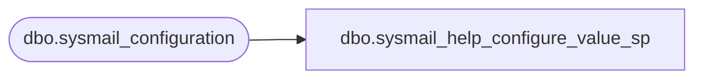

# dbo.sysmail_help_configure_value_sp

**Database:** msdb  
**Server:** STL-SSIS-P-01  

## Architecture Diagram



## Table Dependencies

| Referenced Table |
|---|
| dbo.sysmail_configuration |

## Stored Procedure Code

```sql
CREATE PROCEDURE dbo.sysmail_help_configure_value_sp
   @parameter_name nvarchar(256),
   @parameter_value nvarchar(256) OUTPUT
AS
   SET NOCOUNT ON
   SET @parameter_value = NULL
    
   IF (@parameter_name IS NULL)
   BEGIN
      RAISERROR(14618, 16, 1, '@parameter_name')
      RETURN(1)   
   END

    SELECT @parameter_value = paramvalue
    FROM msdb.dbo.sysmail_configuration
    WHERE paramname = @parameter_name

   RETURN(0)
```

