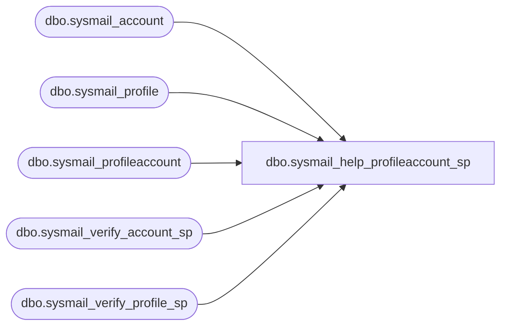

# dbo.sysmail_help_profileaccount_sp

**Database:** msdb  
**Server:** STL-SSIS-P-01  

## Architecture Diagram



## Table Dependencies

| Referenced Table |
|---|
| dbo.sysmail_account |
| dbo.sysmail_profile |
| dbo.sysmail_profileaccount |
| dbo.sysmail_verify_account_sp |
| dbo.sysmail_verify_profile_sp |

## Stored Procedure Code

```sql
CREATE PROCEDURE dbo.sysmail_help_profileaccount_sp
   @profile_id int = NULL, -- must provide id or name
   @profile_name sysname = NULL,
   @account_id int = NULL, -- must provide id or name
   @account_name sysname = NULL
AS
   SET NOCOUNT ON

   DECLARE @rc int
   DECLARE @profileid int
   DECLARE @accountid int

   exec @rc = msdb.dbo.sysmail_verify_profile_sp @profile_id, @profile_name, 1, 0, @profileid OUTPUT
   IF @rc <> 0
      RETURN(1)

   exec @rc = msdb.dbo.sysmail_verify_account_sp @account_id, @account_name, 1, 0, @accountid OUTPUT
   IF @rc <> 0
      RETURN(2)

   IF (@profileid IS NOT NULL AND @accountid IS NOT NULL)
      SELECT p.profile_id,profile_name=p.name,a.account_id,account_name=a.name,c.sequence_number
      FROM msdb.dbo.sysmail_profile p, msdb.dbo.sysmail_account a, msdb.dbo.sysmail_profileaccount c
      WHERE p.profile_id=c.profile_id AND a.account_id=c.account_id AND c.profile_id=@profileid AND c.account_id=@accountid
   
   ELSE IF (@profileid IS NOT NULL)
      SELECT p.profile_id,profile_name=p.name,a.account_id,account_name=a.name,c.sequence_number
      FROM msdb.dbo.sysmail_profile p, msdb.dbo.sysmail_account a, msdb.dbo.sysmail_profileaccount c
      WHERE p.profile_id=c.profile_id AND a.account_id=c.account_id AND c.profile_id=@profileid

   ELSE IF (@accountid IS NOT NULL)
      SELECT p.profile_id,profile_name=p.name,a.account_id,account_name=a.name,c.sequence_number
      FROM msdb.dbo.sysmail_profile p, msdb.dbo.sysmail_account a, msdb.dbo.sysmail_profileaccount c
      WHERE p.profile_id=c.profile_id AND a.account_id=c.account_id AND c.account_id=@accountid

   ELSE
      SELECT p.profile_id,profile_name=p.name,a.account_id,account_name=a.name,c.sequence_number
      FROM msdb.dbo.sysmail_profile p, msdb.dbo.sysmail_account a, msdb.dbo.sysmail_profileaccount c
      WHERE p.profile_id=c.profile_id AND a.account_id=c.account_id
      
   RETURN(0)

dbo,sysmail_help_queue_sp,CREATE PROCEDURE sysmail_help_queue_sp
   @queue_type nvarchar(6) = NULL -- Type of queue
AS
BEGIN

   SELECT @queue_type       = LTRIM(RTRIM(@queue_type))
   IF @queue_type           = '' SELECT @queue_type = NULL

   IF ( (@queue_type IS NOT NULL) AND
         (LOWER(@queue_type collate SQL_Latin1_General_CP1_CS_AS) NOT IN ( N'mail', N'status') ) )
   BEGIN
        RAISERROR(14266, -1, -1, '@queue_type', 'mail, status')
      RETURN(1) -- Failure
   END   

   DECLARE @depth      int
   DECLARE @temp TABLE (
                        queue_type nvarchar(6),
                        length INT NOT NULL, 
                        state nvarchar(64), 
                        last_empty_rowset_time DATETIME,
                        last_activated_time DATETIME
                       )
  
   IF ( (@queue_type IS NULL) OR (LOWER(@queue_type collate SQL_Latin1_General_CP1_CS_AS) = N'mail' ) )
   BEGIN
      SET @depth = (SELECT COUNT(*) FROM ExternalMailQueue WITH (NOWAIT NOLOCK READUNCOMMITTED))

      INSERT INTO @temp
         SELECT 
                N'mail',
                @depth, 
            qm.state as state,
            qm.last_empty_rowset_time as last_empty_rowset_time,
            qm.last_activated_time as last_activated_time
         FROM sys.dm_broker_queue_monitors qm
         JOIN sys.service_queues sq ON sq.object_id = qm.queue_id
         WHERE sq.name = 'ExternalMailQueue'
   END

   IF ( (@queue_type IS NULL) OR (LOWER(@queue_type collate SQL_Latin1_General_CP1_CS_AS) = N'status' ) )
   BEGIN
      SET @depth = (SELECT COUNT(*) FROM InternalMailQueue WITH (NOWAIT NOLOCK READUNCOMMITTED))

      INSERT INTO @temp
         SELECT 
                N'status',
                @depth, 
            qm.state as state,
            qm.last_empty_rowset_time as last_empty_rowset_time,
            qm.last_activated_time as last_activated_time
         FROM sys.dm_broker_queue_monitors qm
         JOIN sys.service_queues sq ON sq.object_id = qm.queue_id
         WHERE sq.name = 'InternalMailQueue'
   END

   SELECT * from @temp
END

dbo,sysmail_help_status_sp,CREATE PROCEDURE sysmail_help_status_sp
  WITH EXECUTE AS 'dbo'
AS
BEGIN
    IF NOT EXISTS (SELECT * FROM sys.service_queues WHERE name = N'ExternalMailQueue' AND is_receive_enabled = 1)
       SELECT 'STOPPED' AS Status
    ELSE
       SELECT 'STARTED' AS Status
END

dbo,sysmail_logmailevent_sp,-- sysmail_logmailevent_sp : inserts an entry in the sysmail_log table
CREATE PROCEDURE sysmail_logmailevent_sp
    @event_type     INT,
    @description    NVARCHAR(max)   = NULL, 
    @process_id     INT             = NULL,
    @mailitem_id    INT             = NULL,
    @account_id     INT             = NULL
AS
    SET NOCOUNT ON

    --Try and get the optional logging level for the DatabaseMail process
    DECLARE @loggingLevel nvarchar(256)
    EXEC msdb.dbo.sysmail_help_configure_value_sp @parameter_name = N'LoggingLevel', 
                                                  @parameter_value = @loggingLevel OUTPUT

    DECLARE @loggingLevelInt int   
    SET @loggingLevelInt = dbo.ConvertToInt(@loggingLevel, 3, 2) 

    IF (@event_type = 3) OR                           -- error
       (@event_type = 2 AND @loggingLevelInt >= 2) OR -- warning with extended logging
       (@event_type = 1 AND @loggingLevelInt >= 2) OR -- info with extended logging
       (@event_type = 0 AND @loggingLevelInt >= 3)    -- success with verbose logging
    BEGIN
       INSERT sysmail_log(event_type, description, process_id, mailitem_id, account_id) 
       VALUES(@event_type, @description, @process_id , @mailitem_id, @account_id)
    END
RETURN 0

dbo,sysmail_start_sp,-- sysmail_start_sp : allows databasemail to process mail from the queue 
CREATE PROCEDURE sysmail_start_sp
AS
    SET NOCOUNT ON
    DECLARE @rc INT 
   DECLARE @localmessage nvarchar(255)

    ALTER QUEUE ExternalMailQueue WITH STATUS = ON
    SELECT @rc = @@ERROR
    IF(@rc = 0)
    BEGIN
      ALTER QUEUE ExternalMailQueue WITH ACTIVATION (STATUS = ON);
       SET @localmessage = FORMATMESSAGE(14639, SUSER_SNAME())
       exec msdb.dbo.sysmail_logmailevent_sp @event_type=1, @description=@localmessage
    END
RETURN @rc

dbo,sysmail_stop_sp,-- sysmail_stop_sp : stops the DatabaseMail process. Mail items remain in the queue until sqlmail started 
CREATE PROCEDURE sysmail_stop_sp
AS
    SET NOCOUNT ON
    DECLARE @rc INT
   DECLARE @localmessage nvarchar(255)
  
    ALTER QUEUE ExternalMailQueue WITH ACTIVATION (STATUS = OFF);
    SELECT @rc = @@ERROR
    IF(@rc = 0)
    BEGIN
       ALTER QUEUE ExternalMailQueue WITH STATUS = OFF;
       SELECT @rc = @@ERROR
       IF(@rc = 0)
       BEGIN
          SET @localmessage = FORMATMESSAGE(14640, SUSER_SNAME())
          exec msdb.dbo.sysmail_logmailevent_sp @event_type=1, @description=@localmessage
       END
    END
RETURN @rc
```

