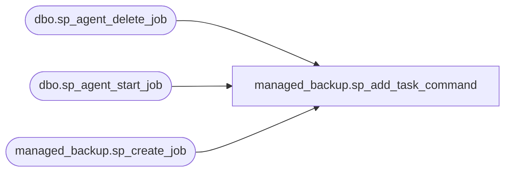

# managed_backup.sp_add_task_command

**Database:** msdb  
**Server:** STL-SSIS-P-01  

## Architecture Diagram



## Table Dependencies

| Referenced Table |
|---|
| dbo.sp_agent_delete_job |
| dbo.sp_agent_start_job |
| managed_backup.sp_create_job |

## Stored Procedure Code

```sql
CREATE PROCEDURE managed_backup.sp_add_task_command 
    @task_name			NVARCHAR(50), 
    @additional_params	NVARCHAR(MAX),
    @cmd_output			NVARCHAR(MAX) = NULL OUTPUT
AS 
BEGIN
    SET NOCOUNT ON

    -- Check if SQL Agent is running
    DECLARE @agent_service_status INT
    SELECT @agent_service_status = [status]
    FROM sys.dm_server_services
    WHERE servicename like'%SQL Server Agent%'
    
    -- Status 4 is running - http://msdn.microsoft.com/en-us/library/hh204542.aspx
    IF(@agent_service_status <> 4)
    BEGIN
        RAISERROR (45201, 17, 1);
        RETURN
    END

    DECLARE @task_command NVARCHAR(MAX);
    DECLARE @job_id UNIQUEIDENTIFIER;
    DECLARE @step_uid UNIQUEIDENTIFIER;
    DECLARE @total_delay INT;

    SELECT @task_command = 
    CASE @task_name
        WHEN 'masterswitch' 
            THEN 'masterswitch'
        WHEN 'backup' 
            THEN 'smartbackup'
        ELSE 
            'other'
    END  
    + ' ' + @additional_params

    EXEC managed_backup.sp_create_job 
        @task_command=@task_command, 
        @task_job_id = @job_id OUTPUT, 
        @task_job_step_id = @step_uid OUTPUT
        
    IF (@@ERROR <> 0)
    BEGIN
        GOTO Quit
    END

    -- start system job
    EXEC dbo.sp_agent_start_job @job_id = @job_id;
        
    IF (@@ERROR <> 0)
    BEGIN
        GOTO Quit
    END
    
SET @total_delay = 0; 
WaitForJobFinish:
    IF NOT EXISTS (SELECT [message] 
                    FROM sys.fn_sqlagent_job_history(@job_id, 0)
                  )
    BEGIN
        IF (@total_delay > 480)
        BEGIN
            RAISERROR (45202, 17, 3, 120);
            GOTO Quit;
        END
        
        WAITFOR DELAY '00:00:00.250';
        SET @total_delay += 1;
        GOTO WaitForJobFinish;
    END

    DECLARE @job_output NVARCHAR(MAX)

    DECLARE @xml_output XML
    DECLARE @error INT
    DECLARE @state INT
    DECLARE @msg NVARCHAR(MAX)

    SET @cmd_output = ''

    DECLARE job_output_cursor CURSOR FOR
    SELECT [log_text] 
    FROM sys.fn_sqlagent_jobsteps_logs(@step_uid)
    ORDER BY date_created

    OPEN job_output_cursor

    FETCH NEXT FROM job_output_cursor
    INTO @job_output

    WHILE @@FETCH_STATUS = 0
    BEGIN
        SELECT @xml_output = CAST(@job_output AS XML)
        SELECT @error = @xml_output.value('(/Message/Error)[1]', 'INT')
        SELECT @state = @xml_output.value('(/Message/State)[1]', 'INT')
        SELECT @msg = @xml_output.value('xs:base64Binary((/Message/Text)[1])', 'VARBINARY(MAX)')
    
        IF @error IS NOT NULL AND @error <> 0
        BEGIN
            RAISERROR (45207, 17, @state, @msg);
        END
        ELSE
        BEGIN
            PRINT @msg
        END

        SET @cmd_output += @job_output + ' '
		
	FETCH NEXT FROM job_output_cursor
	INTO @job_output
    END

    CLOSE job_output_cursor
    DEALLOCATE job_output_cursor
    
    -- delete the system job now
    EXEC dbo.sp_agent_delete_job @job_id = @job_id, @is_system= 1

Quit:
END

managed_backup,sp_backup_config_advanced,-- Configure the advanced parameters for managed backups v2
--
CREATE PROCEDURE managed_backup.sp_backup_config_advanced
	@database_name SYSNAME = NULL,
	@encryption_algorithm SYSNAME = NULL, 
	@encryptor_type NVARCHAR(32) = NULL,
	@encryptor_name SYSNAME = NULL,
	@local_cache_path NVARCHAR(1024) = NULL
AS
BEGIN
	-- Local caching is not yet implemented. Throw error for now.
	--
	if (@local_cache_path IS NOT NULL)
	BEGIN
		RAISERROR (45215, 17, 1);
		RETURN
	END
	
	SET @database_name = ISNULL(@database_name, '');
	SET @encryption_algorithm = LTRIM(RTRIM(ISNULL(@encryption_algorithm, '')));
	SET @encryptor_type = LTRIM(RTRIM(ISNULL(@encryptor_type, '')));
	SET @encryptor_name = ISNULL(@encryptor_name, '');
	SET @local_cache_path = ISNULL(@local_cache_path, '');

	IF (CHARINDEX(' ', @encryption_algorithm) > 0)
	BEGIN
		RAISERROR (45212, 17, 1, N'@encryption_algorithm', N'encryption algorithm');
		RETURN
	END

 	IF (CHARINDEX(' ', @encryptor_type) > 0)
	BEGIN
		RAISERROR (45212, 17, 1, N'@encryptor_type', N'encryptor type');
		RETURN
	END

	IF (UPPER(@encryption_algorithm) = 'NO_ENCRYPTION')
	BEGIN
		IF (LEN(@encryptor_type) != 0) OR (LEN(@encryptor_name) != 0)
		BEGIN
			RAISERROR (45217, 17, 1);
			RETURN
		END
	END
	ELSE IF (UPPER(@encryption_algorithm) = 'AES_128') OR (UPPER(@encryption_algorithm) = 'AES_192') OR (UPPER(@encryption_algorithm) = 'AES_256') OR (UPPER(@encryption_algorithm) = 'TRIPLE_DES_3KEY')
	BEGIN
		IF (LEN(@encryptor_type) = 0) OR (LEN(@encryptor_name) = 0)
		BEGIN
			RAISERROR (45218, 17, 1);
			RETURN
		END
	END

	DECLARE @input VARBINARY(MAX);
	DECLARE @params NVARCHAR(MAX);

	SET @input = CONVERT(VARBINARY(MAX), @database_name)
	DECLARE @db_name_base64 NVARCHAR(MAX) = CAST(N'' as XML).value('xs:base64Binary(sql:variable("@input"))', 'NVARCHAR(MAX)')

	SET @input = CONVERT(VARBINARY(MAX), @encryptor_name)
	DECLARE @enc_name_base64 NVARCHAR(MAX) = CAST(N'' as XML).value('xs:base64Binary(sql:variable("@input"))', 'NVARCHAR(MAX)')
	
	SET @input = CONVERT(VARBINARY(MAX), @local_cache_path)
	DECLARE @local_cache_path_base64 NVARCHAR(MAX) = CAST(N'' as XML).value('xs:base64Binary(sql:variable("@input"))', 'NVARCHAR(MAX)')

	SET @params = N'configure_backup_advanced' + N' ' + @db_name_base64 + N' ' + @enc_name_base64 + N' ' + @encryption_algorithm + N' ' + @encryptor_type + N' ' + @local_cache_path_base64
	EXEC managed_backup.sp_add_task_command @task_name='backup', @additional_params=@params
END
```

