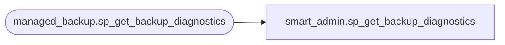

# smart_admin.sp_get_backup_diagnostics

**Database:** msdb  
**Server:** STL-SSIS-P-01  

## Architecture Diagram



## Table Dependencies

| Referenced Table |
|---|
| managed_backup.sp_get_backup_diagnostics |

## Stored Procedure Code

```sql
CREATE PROCEDURE smart_admin.sp_get_backup_diagnostics
	@xevent_channel VARCHAR(255) = 'Xevent',
	@begin_time DATETIME = NULL,
	@end_time DATETIME = NULL
AS
BEGIN
	EXECUTE managed_backup.sp_get_backup_diagnostics @xevent_channel, @begin_time, @end_time
END
```

