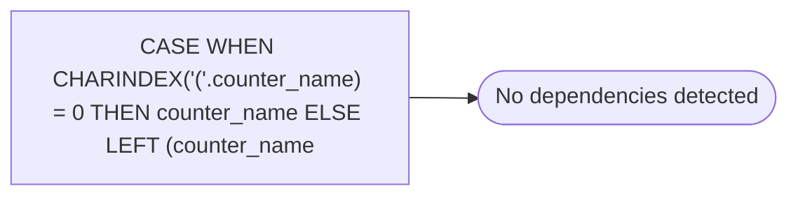

# CASE WHEN CHARINDEX('('.counter_name) = 0 THEN counter_name ELSE LEFT (counter_name

**Database:** DBAUtility  
**Server:** STL-SSIS-P-01  

## Architecture Diagram



## Table Dependencies

_No table references detected._

## View Code

```sql
CHARINDEX('('
```

