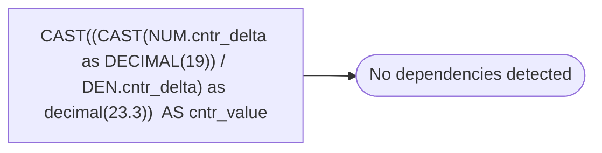

# CAST((CAST(NUM.cntr_delta as DECIMAL(19)) / DEN.cntr_delta) as decimal(23.3))  AS cntr_value

**Database:** DBAUtility  
**Server:** STL-SSIS-P-01  

## Architecture Diagram



## Table Dependencies

_No table references detected._

## View Code

```sql

```

