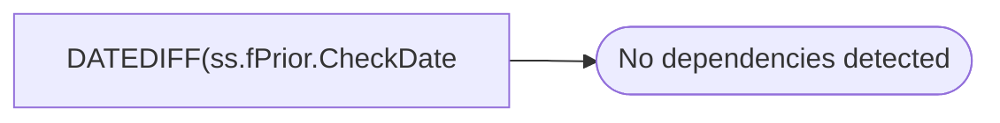

# DATEDIFF(ss.fPrior.CheckDate

**Database:** DBAUtility  
**Server:** STL-SSIS-P-01  

## Architecture Diagram



## Table Dependencies

_No table references detected._

## View Code

```sql
f.CheckDate) AS ElapsedSeconds
```

