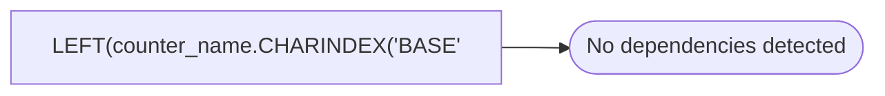

# LEFT(counter_name.CHARINDEX('BASE'

**Database:** DBAUtility  
**Server:** STL-SSIS-P-01  

## Architecture Diagram



## Table Dependencies

_No table references detected._

## View Code

```sql
UPPER(counter_name))-1) AS counter_join
```

