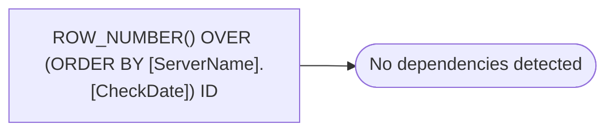

# ROW_NUMBER() OVER (ORDER BY [ServerName].[CheckDate]) ID

**Database:** DBAUtility  
**Server:** STL-SSIS-P-01  

## Architecture Diagram



## Table Dependencies

_No table references detected._

## View Code

```sql

```

