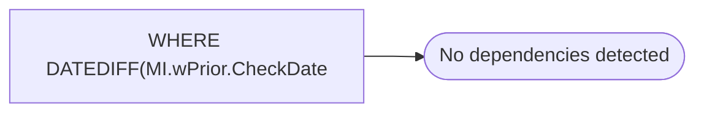

# WHERE DATEDIFF(MI.wPrior.CheckDate

**Database:** DBAUtility  
**Server:** STL-SSIS-P-01  

## Architecture Diagram



## Table Dependencies

_No table references detected._

## View Code

```sql
w.CheckDate) BETWEEN 1 AND 60
```

