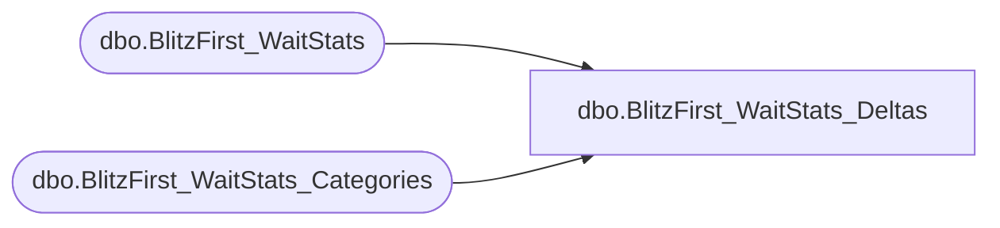

# dbo.BlitzFirst_WaitStats_Deltas

**Database:** DBAUtility  
**Server:** STL-SSIS-P-01  

## Architecture Diagram



## Table Dependencies

| Referenced Table |
|---|
| dbo.BlitzFirst_WaitStats |
| dbo.BlitzFirst_WaitStats_Categories |

## View Code

```sql
CREATE VIEW [dbo].[BlitzFirst_WaitStats_Deltas] AS
```

