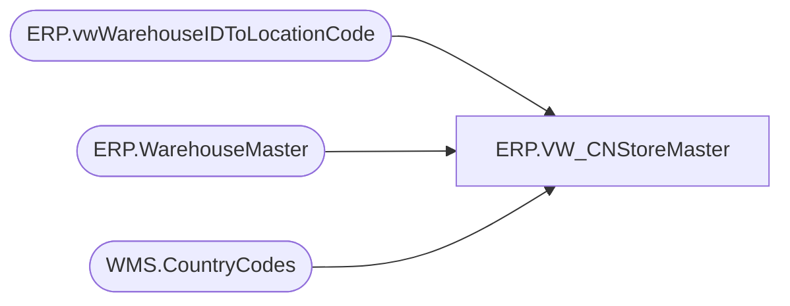

# ERP.VW_CNStoreMaster

**Database:** IntegrationStaging  
**Server:** STL-SSIS-P-01  

## Architecture Diagram



## Table Dependencies

| Referenced Table |
|---|
| ERP.vwWarehouseIDToLocationCode |
| ERP.WarehouseMaster |
| WMS.CountryCodes |

## View Code

```sql
--SET QUOTED_IDENTIFIER ON
--GO

CREATE VIEW [ERP].[VW_CNStoreMaster] AS
SELECT DISTINCT CAST(ISNULL(vw.LocationCode, wm.WarehouseId) AS nvarchar (30)) store_nbr
	, CAST(CONCAT('BUILD-A-BEAR WORKSHOP #',ISNULL(vw.LocationCode, wm.WarehouseId)) AS nvarchar (30)) [name]
	, CAST(replace(replace(replace(replace(replace(replace(substring(UPPER(wm.PrimaryAddressStreet),1,39),'CENTER','CTR'),'SOUTH','S'),'NORTH','N'),'EAST','E'),'WEST','W'),'SUITE','STE') AS nvarchar (30)) addr_line_1
	--, LEN(replace(replace(replace(replace(replace(replace(substring(UPPER(wm.PrimaryAddressStreet),1,39),'CENTER','CTR'),'SOUTH','S'),'NORTH','N'),'EAST','E'),'WEST','W'),'SUITE','STE')) LENaddr_line_1
--	,wm.PrimaryAddressStreet
	, CAST('' AS nvarchar (30)) addr_line_2
	, CAST(
		REPLACE(REPLACE(
			REPLACE(REPLACE(REPLACE(REPLACE(REPLACE(REPLACE(
				SUBSTRING(
					UPPER(REPLACE(REPLACE(wm.PrimaryAddressStreet, CHAR(13), ' '), CHAR(10), ' ')),
					1, 200
				),
				'CENTER','CTR'),
				'SOUTH','S'),
				'NORTH','N'),
				'EAST','E'),
				'WEST','W'),
				'SUITE','STE'
			), CHAR(13), ''), CHAR(10), '')  -- optional redundant cleanup
		AS nvarchar(200))

 addr_line_full
	, CAST(wm.PrimaryAddressCity AS nvarchar (30)) city
	, CAST(CASE WHEN wm.PrimaryAddressStateId = '' THEN '' ELSE cc.CountryCode2D END AS nvarchar (30)) AS [state]
	, CAST(case when cc.CountryCode2D = 'US' then
		right('00000' + convert(varchar(5),left(wm.PrimaryAddressZipCode,5)),5)
		else wm.PrimaryAddressZipCode
		end AS nvarchar (30)) as ZIP
	, CAST(cc.CountryCode2D AS nvarchar (30)) cntry
	, CAST('' AS nvarchar (30)) addr_line_1CH
	, CAST('' AS nvarchar (30)) addr_line_2CH
	, CAST('' AS nvarchar (30)) cityCH
	, CAST('' AS nvarchar (30)) stateCH
	, CAST('' AS nvarchar (30)) zipCH
	, CAST('' AS nvarchar (30)) cntryCH
  FROM ERP.WarehouseMaster wm with(nolock)
	LEFT JOIN ERP.vwWarehouseIDToLocationCode vw ON wm.WarehouseId = vw.WarehouseID	
	LEFT JOIN WMS.CountryCodes cc on wm.PrimaryAddressCountryRegionId=cc.CountryCode3D
  WHERE 1=1
	AND RIGHT(wm.WarehouseId,1) <> 'T' -- Exclude transit warehouses
	AND wm.PrimaryAddressCountryRegionId = 'CHN'
	AND wm.WarehouseId NOT IN ('8199') --excluded; possibly because it's a direct delivery location? LT 03/11/2026
;
```

