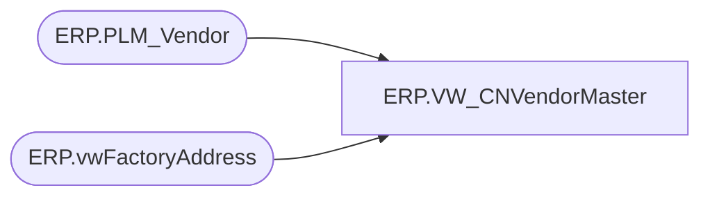

# ERP.VW_CNVendorMaster

**Database:** IntegrationStaging  
**Server:** STL-SSIS-P-01  

## Architecture Diagram



## Table Dependencies

| Referenced Table |
|---|
| ERP.PLM_Vendor |
| ERP.vwFactoryAddress |

## View Code

```sql
CREATE VIEW [ERP].[VW_CNVendorMaster] 
AS

SELECT DISTINCT 
vm.FactoryCode
, vm.AddressDescription
, vm.VendorName
, vm.AddressName
, vm.FOBPort
, vm.SupplierCode
, LTRIM(RTRIM(
            REPLACE(REPLACE(vm.Street, CHAR(13), ' '), CHAR(10), ' ') -- remove line break
        )) AS Street
, vm.City
, vm.Province
, vm.Country
, vm.PhoneNumber
, MAX(vm.LastModified) AS LastModified
FROM ERP.vwFactoryAddress vm
--JOIN ERP.vwItemFactoryCN fc ON vm.VendorAccount = fc.VendorAccountNumber AND vm.Entity =fc.Entity
JOIN ERP.PLM_Vendor v with(nolock) ON vm.FactoryCode = v.FactoryId AND vm.SupplierCode = v.Suppliercode
--Where vm.Entity = '3001'
--WHERE vm.SupplierCode NOT IN ('13248','99001')
GROUP BY vm.FactoryCode
, vm.AddressDescription
, vm.VendorName
, vm.AddressName
, vm.FOBPort
, vm.SupplierCode
, LTRIM(RTRIM(
            REPLACE(REPLACE(vm.Street, CHAR(13), ' '), CHAR(10), ' ') -- remove line break
        ))
, vm.City
, vm.Province
, vm.Country
, vm.PhoneNumber
```

