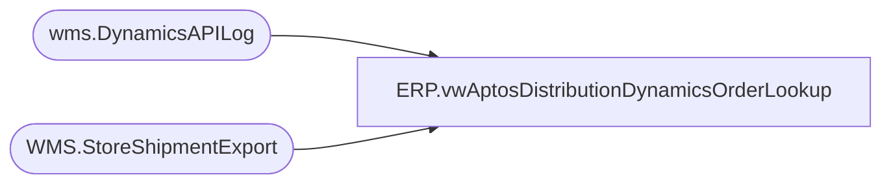

# ERP.vwAptosDistributionDynamicsOrderLookup

**Database:** IntegrationStaging  
**Server:** STL-SSIS-P-01  

## Architecture Diagram



## Table Dependencies

| Referenced Table |
|---|
| wms.DynamicsAPILog |
| WMS.StoreShipmentExport |

## View Code

```sql
CREATE view [ERP].[vwAptosDistributionDynamicsOrderLookup]


as 

select distinct 
       api.StoreShipmentNumber, 
       case 
             when api.ResponseBody like '%Transfer order%was created successully%'
                    then substring(api.ResponseBody, charindex('Transfer order ', api.ResponseBody, 1)+15, 12)
             when api.ResponseBody like '%Intercompany sales order%has been created%'
                    then replace(substring(api.ResponseBody, charindex('Intercompany sales order ', api.ResponseBody, 1)+24, 16), ' ha', '')
             else NULL
       end as DynamicsOrder,
       api.InsertDate as APIDate,
	   --sse.Company as Entity -- Replaced on 1/21/2021 as the prod SSE table doesn't have Company field as WMS_TransferOrderCreateFromAptos is not currenly loading it 
	   cast(
			case 
				when sse.FromWarehouse in ('9960', '9980')
					then '1100'
				when sse.FromWarehouse = '9970'
					then '2110'
				when sse.FromWarehouse = '9940'
					then '3001'
			end as varchar(4)
		)
	as Entity
from wms.DynamicsAPILog api (nolock) 
left join WMS.StoreShipmentExport SSE (nolock) on api.StoreShipmentNumber=sse.AptosShipmentNumber
where api.IntegrationName in ('WMS_TransferOrderCreateFromAptos', 'WMS_POtoSOIntercompanyOrderCreate')
```

