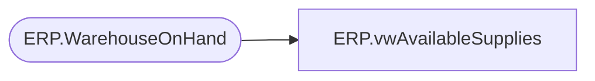

# ERP.vwAvailableSupplies

**Database:** IntegrationStaging  
**Server:** STL-SSIS-P-01  

## Architecture Diagram



## Table Dependencies

| Referenced Table |
|---|
| ERP.WarehouseOnHand |

## View Code

```sql
CREATE VIEW [ERP].[vwAvailableSupplies]
AS
SELECT        RIGHT(ItemNumber, 6) AS ItemNumber, InventoryWarehouseId, AvailableOnHandQuantity
FROM            ERP.WarehouseOnHand
WHERE        (InventoryWarehouseId IN ('9960', '9980', '8010', '9970')) AND (ItemNumber LIKE 'S%') AND (MerchYearPeriod = CAST(DATEPART(YEAR, GETDATE()) AS VARCHAR) + RIGHT('00' + CAST(DATEPART(MONTH, GETDATE()) 
                         AS VARCHAR), 2))
```

