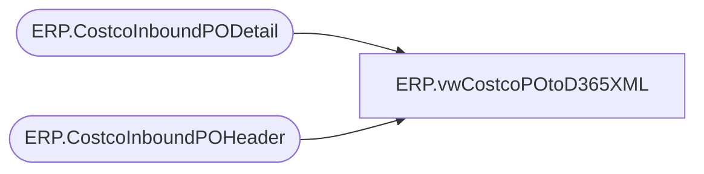

# ERP.vwCostcoPOtoD365XML

**Database:** IntegrationStaging  
**Server:** STL-SSIS-P-01  

## Architecture Diagram



## Table Dependencies

| Referenced Table |
|---|
| ERP.CostcoInboundPODetail |
| ERP.CostcoInboundPOHeader |

## View Code

```sql
CREATE view [ERP].[vwCostcoPOtoD365XML]

as

--------------------------------------------------------------------------------------------------
-- vwCostcoPOtoD365XML - Outputs XML for integration into Dynamics365 ERP system
--							Queries tables that are populated via SSIS, view is tied to same package flow
--- 2017-08-08 - Dan Tweedie - Created View
--------------------------------------------------------------------------------------------------


with 
Header as
	(
		select *
		from ERP.CostcoInboundPOHeader 
		where Transmitted = 0
	),
Detail as
	(
		select pod.*
		from ERP.CostcoInboundPODetail pod
		join Header h on pod.PurchaseOrderID = h.PurchaseOrderID
	),
XMLStage (XMLData) as 
	(
		select 
			'' as 'SALESORDERNUMBER', 
			'USD' as 'CURRENCYCODE',
			h.CUSTOMERREQUISITIONNUMBER as 'CUSTOMERREQUISITIONNUMBER',
			h.CUSTOMERSORDERREFERENCE as 'CUSTOMERSORDERREFERENCE',
			h.INVOICECUSTOMERACCOUNTNUMBER as 'INVOICECUSTOMERACCOUNTNUMBER',
			'en-us' as 'LANGUAGEID',
			h.ORDERINGCUSTOMERACCOUNTNUMBER as 'ORDERINGCUSTOMERACCOUNTNUMBER',
			h.REQUESTEDSHIPPINGDATE as 'REQUESTEDSHIPPINGDATE',
			h.DELIVERYADDRESSCITY as 'DELIVERYADDRESSCITY',
			h.DELIVERYADDRESSDESCRIPTION as 'DELIVERYADDRESSDESCRIPTION',
			h.DELIVERYADDRESSNAME as 'DELIVERYADDRESSNAME',
			h.DELIVERYADDRESSSTREET as 'DELIVERYADDRESSSTREET',
			h.DELIVERYADDRESSCITY as 'DELIVERYADDRESSCITY',
			h.DELIVERYADDRESSSTATEID as 'DELIVERYADDRESSSTATEID',
			h.DELIVERYADDRESSZIPCODE as 'DELIVERYADDRESSZIPCODE',
			h.DELIVERYADDRESSCOUNTRYREGIONID as 'DELIVERYADDRESSCOUNTRYREGIONID',
				(	
					select 
						d.CUSTOMERSLINENUMBER as 'CUSTOMERSLINENUMBER',
						d.ITEMNUMBER as 'ITEMNUMBER',
						d.ORDEREDSALESQUANTITY as 'ORDEREDSALESQUANTITY',
						d.SALESPRICE as 'SALESPRICE',
						1.000000 as 'SALESPRICEQUANTITY',
						d.SALESUNITSYMBOL as 'SALESUNITSYMBOL'
					from Detail d 
					where h.CUSTOMERREQUISITIONNUMBER = d.CUSTOMERREQUISITIONNUMBER
					for xml path('SalesOrderLineEntity'), Type
				)
		from 
			Header h
		for xml path('SalesOrderHeaderEntity'), root('Document'), Type
	)
select XMLData
from XMLStage


	


ERP,vwDBSchenkerPOFromStaged,CREATE view ERP.vwDBSchenkerPOFromStaged

as

select 
	ProjID,	PurchaseOrder,PurposeCode,Division,Department,Buyer,SupplierName,SupplierCode, SupplierAddress1,SupplierAddress2,SupplierAddress3,SupplierAddress4,
	UNLOCCodeValue,ScheduleKCode1,SupplierCity,SupplierState,SupplierCountry,SupplierPostal,OrderPaymentTerms,FreightPaymentTerms,OrderDate,PORef1,PORef2,PORef3,
	ShipToName,ShipToCode,ShipToEmail,ShipToAddress1,ShipToAddress2,ShipToAddress3,ShiptoAddress4,UNLOCCode1,ScheduleDorKCode,ShipToCountry,ShipToCity,ShipToState,
	ShipToZipCode,FactoryName,FactoryCode, FactoryAddress1,FactoryAddress2,FactoryAddress3,FactoryAddress4, UNLOCCode2,ScheduleKCode2,FactoryCity,FactoryState,FactoryCountry,
	FactoryPostal,ShipWindowStart,ShipWindowEnd,ShipWindowCancelDate,ProductDetailID,ProductDetailProductCode,ProductDetailProductDesc,ProductDetailHTS,ProductDetailOrderQuantity,
	QuantityUOM,UnitCost,Mode, ProductDetailMasterPackQty,ProductDetailNoOfPackages,ProductDetailInnerPackQty,ProductDetailTotalVolume,ProductDetailTotalWeight,ProductDetailProductPriority,
	ProductDetailManufacturerID,ProductDetailProductRef,ProductDetailProductRef2,ProductDetailProductRef3,ProductDetailProductRef4,ProductDetailProductRef5,OriginCountry, 
	OriginCity, FinalDestination,POETA,ProductDate1,ProductDate2,Consolidator,Broker,Currency,SKUNumber,Size,Color,LineEndIndicator	

from ERP.PurchaseOrderToDBSchenker
where SendData = 1
```

