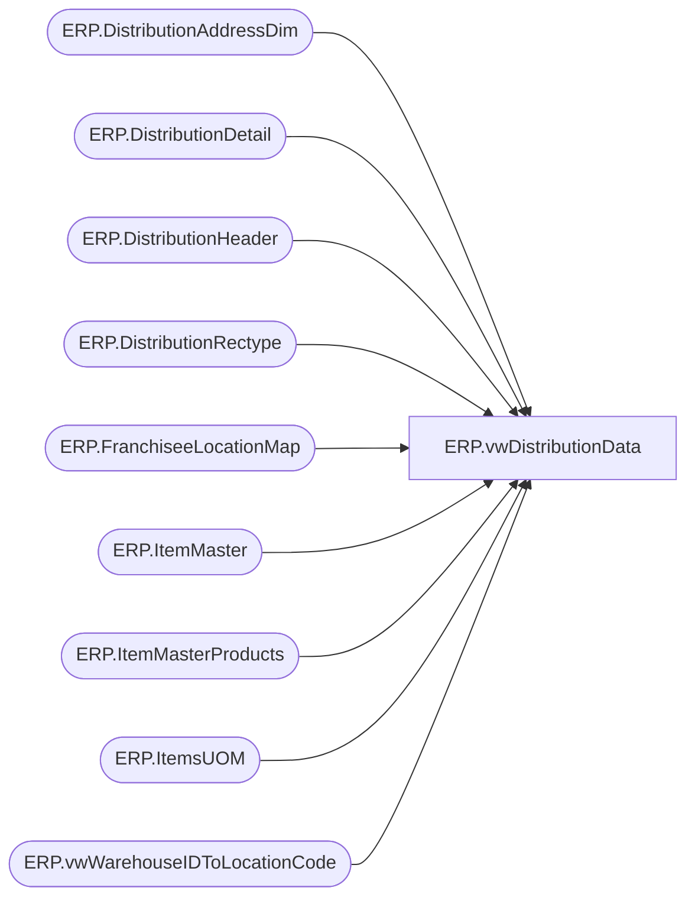

# ERP.vwDistributionData

**Database:** IntegrationStaging  
**Server:** STL-SSIS-P-01  

## Architecture Diagram



## Table Dependencies

| Referenced Table |
|---|
| ERP.DistributionAddressDim |
| ERP.DistributionDetail |
| ERP.DistributionHeader |
| ERP.DistributionRectype |
| ERP.FranchiseeLocationMap |
| ERP.ItemMaster |
| ERP.ItemMasterProducts |
| ERP.ItemsUOM |
| ERP.vwWarehouseIDToLocationCode |

## View Code

```sql
CREATE view [ERP].[vwDistributionData]


as 

With 
DistroData as 
	(
			select DISTINCT 
				h.Entity,
				h.PICKLISTID,
				h.CUSTOMERREQUISITIONID,
				h.DELIVERYTERM,
				cast(lc1.OperationalSiteCode as varchar(10)) as FROMWAREHOUSE,
				case when isnumeric(isnull(h.ModeOfDelivery,1)) = 0 then 1 else isnull(h.ModeOfDelivery,1) end as MODEOFDELIVERY,
				CAST(h.ORDERID as varchar(12)) AS ORDERID,
				h.ORDERTYPE,
				h.SHIPTONAME,
				CASE 
					WHEN h.ORDERTYPE = 'Sales' and f.LocationCode is not null  ---SALES ORDER FOR FRANCHISEE LOCATION THAT IS MAPPED IN ERP.FranchiseeLocationMap, CAME FROM RON TO TELL US LOCATION CODES FOR FRANCHISEES AS THEY ARE NOT IN DYNAMICS AS WAREHOUSE/SITE
						THEN f.LocationCode
					else 
							----ORIGNAL CASE STATEMENT
							cast(
									case when lc4.OperationalSiteCode is not null
										then cast(lc4.OperationalSiteCode as varchar)
										else
											case 
												when lc2.OperationalSiteCode is not null 
													then cast(lc2.OperationalSiteCode as varchar)
													else isnull(cast(a.location_code as varchar), cast(a.AddressID as varchar) )
											end
									 end 
								 as varchar(10))
				END as TOWAREHOUSE,
				h.TRANSACTIONDATETIME,
				d.ITEMDESCRIPTION,
				case when left(d.ITEMNUMBER,1) = 'S' then 'Supply' else 'Merch' end as MerchOrSupply,
				cast(right(d.ITEMNUMBER,6) as varchar(20)) as ITEMNUMBER,
				D.QUANTITY,
				cast( isnull(uom.Factor,1) * d.Quantity as int) as ConvertedQuantity,
				d.QUANTITYUNITOFMEASURE,
				d.SALESPRICE,
				isnull(rt.RecType,1) as RecType,
				rt.ReasonCode,
				rt.Priority,
				upper(datename(dw,getdate())) as current_day,
				a.AddressID OrderAddressID,
				a.location_code OrderLocationCode,
				case when lc3.WarehouseID is null 
					then 0
					else 1
				end as SaleToStore,
				case 
					when d.Warehouse = '8175' then 'WholeSale'
					when d.Warehouse = '8500' then 'Franchisee'
					else NULL
				end as SaleType,
				d.Warehouse as MerchLocationCode
			from 
				ERP.DistributionHeader h
			join ERP.DistributionDetail d on h.OrderID = d.OrderID and h.PickListID = d.PickListID and h.entity = d.entity 
			left join ERP.DistributionRectype rt on rt.RecType = case when isnumeric(isnull(h.ModeOfDelivery,1)) = 0 then 1 else isnull(h.ModeOfDelivery,1) end
			join ERP.ItemMaster im with (nolock)  on d.ItemNumber = im.ProductNumber and d.Entity = im.Entity  
			join ERP.ItemMasterProducts p with (nolock) on d.ItemNumber = p.ProductNumber
			left join ERP.ItemsUOM uom with (nolock) 
				on d.ItemNumber = uom.ProductNumber
				and d.UOM = uom.FromUnitSymbol
				and d.Entity = uom.Entity
				and uom.ToUnitSymbol = 'wmea'
			left join ERP.vwWarehouseIDToLocationCode lc1 with (nolock) on 
						case when left(h.OrderType,8) = 'Transfer'
							then h.FROMWAREHOUSE
							else d.Warehouse 
						 end = lc1.WarehouseID
						 and h.Entity = lc1.Entity 
			left join ERP.vwWarehouseIDToLocationCode lc2 with (nolock) on 
						case when left(h.OrderType,8) = 'Transfer'
							then cast(h.ToWAREHOUSE as varchar(5))
							else cast(d.Location as varchar(5))
						 end = cast(lc2.WarehouseID as varchar(5))
						 and h.Entity = lc2.Entity 
			left join ERP.DistributionAddressDim a with (nolock) on h.SHIPTONAME = a.SHIPTONAME
			left join ERP.vwWarehouseIDToLocationCode lc3 with (nolock) on lc2.LocationCode = replace(lc3.WarehouseID, '-','') and h.Entity = lc3.Entity 
			left join ERP.vwWarehouseIDToLocationCode lc4 with (nolock) on h.ShipToName = lc4.PrimaryAddressDescription and left(h.OrderType,5) = 'Sales' and h.Entity = lc4.Entity -- SALES ORDERS TO CANADA STORES..
			left join ERP.FranchiseeLocationMap f on h.SHIPTONAME = f.FranchiseeName and h.entity = f.entity 
			where 1=1
			and d.QUANTITY > 0
			and left(im.ItemNumber, 1) in ('M', 'S')
			AND 
				(
					(left(h.OrderType,8) = 'Transfer' and h.TOWAREHOUSE is not null)
					OR
					(left(h.OrderType,4) = 'Sale' and h.TOWAREHOUSE is null)
				)
			--and 
			--	(
			--		(isnull(rt.RecType,1) >= 50 or (left(h.OrderType,4) = 'Sale' AND lc4.PrimaryAddressDescription is NULL)) --EITHER RECTYPE >= 50 OR IS A SALE THAT IS NOT TO CANADIAN STORE
			--		or		
			--		(
			--			isnull(rt.RecType,1) < 50 
			--			and 
			--			datepart(hh,getdate()) >= case when lc1.LocationCode = '3970' then 15 else 18 end
			--		)
			--	)
		

	)
select  
	Entity,
	PICKLISTID,
	CUSTOMERREQUISITIONID,
	DELIVERYTERM,
	FROMWAREHOUSE,
	MODEOFDELIVERY,
	ORDERID,
	ORDERTYPE,
	SHIPTONAME,
	TOWAREHOUSE,
	TRANSACTIONDATETIME,
	ITEMDESCRIPTION,
	MerchOrSupply,
	ITEMNUMBER,
	QUANTITY,
	ConvertedQuantity,
	QUANTITYUNITOFMEASURE,
	SALESPRICE,
	RecType as RecType,
	ReasonCode,
	Priority,
	row_number() over(order by OrderID, ToWarehouse, ItemNumber, ModeOfDelivery) as SequenceNumber,
	row_number() over(order by OrderID, ItemNumber, CustomerRequisitionID) as ref_field_1,
	current_day,
	OrderAddressID,
	OrderLocationCode,
	SaleToStore,
	SaleType,
	MerchLocationCode
from DistroData
where TOWAREHOUSE is NOT NULL
and isnull(FROMWAREHOUSE,'x') not in ('9980', '1013') --- need to add this code for WMS
```

