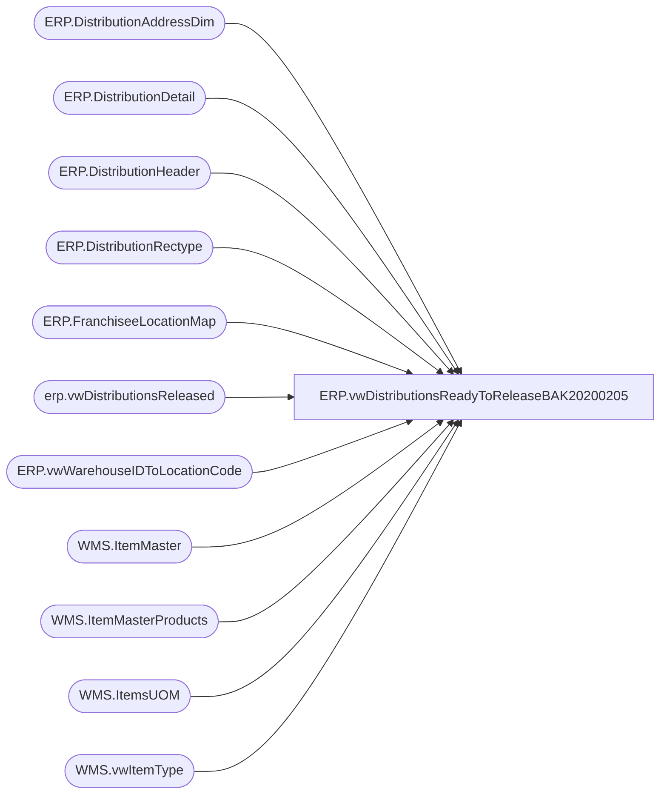

# ERP.vwDistributionsReadyToReleaseBAK20200205

**Database:** IntegrationStaging  
**Server:** STL-SSIS-P-01  

## Architecture Diagram



## Table Dependencies

| Referenced Table |
|---|
| ERP.DistributionAddressDim |
| ERP.DistributionDetail |
| ERP.DistributionHeader |
| ERP.DistributionRectype |
| ERP.FranchiseeLocationMap |
| erp.vwDistributionsReleased |
| ERP.vwWarehouseIDToLocationCode |
| WMS.ItemMaster |
| WMS.ItemMasterProducts |
| WMS.ItemsUOM |
| WMS.vwItemType |

## View Code

```sql
CREATE view [ERP].[vwDistributionsReadyToReleaseBAK20200205]

as

------------------------------------------------------------------------------------------------------------------------------------------------
---- 2017-08-21 -- Dan Tweedie	--	Created view to capture data to stage for distribution split. Data has been pre-staged from Dynamics365 XML
--	2018-10-12 -- Dan Tweedie	-- Updated view to exclude rows where the count of rows returned would exceed the count of rows staged, which would be caused by duplicate dimension data causing the joins to return additional rows than intended
-- 2020-02-02	-	Dan Tweedie	-	Updated for new WMS so no longer handles s/m items
------------------------------------------------------------------------------------------------------------------------------------------------
With 
DistroData as 
	(
			select DISTINCT 
				h.Entity,
				h.PICKLISTID,
				h.CUSTOMERREQUISITIONID,
				h.DELIVERYTERM,
				cast(lc1.OperationalSiteCode as varchar(10)) as FROMWAREHOUSE,
				case when isnumeric(isnull(h.ModeOfDelivery,1)) = 0 then 1 else isnull(h.ModeOfDelivery,1) end as MODEOFDELIVERY,
				CAST(h.ORDERID as varchar(12)) AS ORDERID,
				h.ORDERTYPE,
				h.SHIPTONAME,
				
				CASE 
					WHEN h.ORDERTYPE = 'Sales' and f.LocationCode is not null  ---SALES ORDER FOR FRANCHISEE LOCATION THAT IS MAPPED IN ERP.FranchiseeLocationMap, CAME FROM RON TO TELL US LOCATION CODES FOR FRANCHISEES AS THEY ARE NOT IN DYNAMICS AS WAREHOUSE/SITE
						THEN f.LocationCode
					else 
							----ORIGNAL CASE STATEMENT
							cast(
									case when lc4.OperationalSiteCode is not null
										then cast(lc4.OperationalSiteCode as varchar)
										else
											case 
												when lc2.OperationalSiteCode is not null 
													then cast(lc2.OperationalSiteCode as varchar)
													else isnull(cast(a.location_code as varchar), cast(a.AddressID as varchar) )
											end
									 end 
								 as varchar(10))
				END as TOWAREHOUSE,
				h.TRANSACTIONDATETIME,
				d.ITEMDESCRIPTION,
				--case when left(d.ITEMNUMBER,1) = 'S' then 'Supply' else 'Merch' end as MerchOrSupply,
				case when it.ItemType = 'Supplies' then 'Supply' else 'Merch' end as MerchOrSupply,
				cast(right(d.ITEMNUMBER,6) as varchar(20)) as ITEMNUMBER,
				D.QUANTITY,
				cast( isnull(uom.Factor,1) * d.Quantity as int) as ConvertedQuantity,
				d.QUANTITYUNITOFMEASURE,
				d.SALESPRICE,
				isnull(rt.RecType,1) as RecType,
				rt.ReasonCode,
				rt.Priority,
				upper(datename(dw,getdate())) as current_day,
				a.AddressID OrderAddressID,
				a.location_code OrderLocationCode,
				case when lc4.WarehouseID is null 
					then 0
					else 1
				end as SaleToStore,
				---next 4 fields are for use in the 3pl files
				cast(right(d.ITEMNUMBER,6) as varchar(6)) as VendorStyle,
				'00' as ColorCode,
				cast(p.PRODUCTDESCRIPTION as varchar(52)) as ShortDesription,
				case 
					--when left(im.ProductNumber,1) = 'M'
					when it.ItemType = 'Merch'
					then 1
					else cast(uom.Factor as int)
				end as DistributionMultiple 
			from 
				ERP.DistributionHeader h with (nolock)
			join ERP.DistributionDetail d with (nolock) on h.OrderID = d.OrderID and h.PickListID = d.PickListID and h.entity = d.entity 
			left join ERP.DistributionRectype rt with (nolock) on rt.RecType = case when isnumeric(isnull(h.ModeOfDelivery,1)) = 0 then 1 else isnull(h.ModeOfDelivery,1) end
			join WMS.ItemMaster im with (nolock) on d.ItemNumber = im.ProductNumber and d.Entity = im.Entity  
			join WMS.ItemMasterProducts p with (nolock) on d.ItemNumber = p.ProductNumber
			left join WMS.ItemsUOM uom with (nolock) 
				on d.ItemNumber = uom.ProductNumber
				and d.UOM = uom.FromUnitSymbol
				and d.Entity = uom.Entity
				and uom.ToUnitSymbol = 'wmea'
			left join ERP.vwWarehouseIDToLocationCode lc1 with (nolock) on 
						case when left(h.OrderType,8) = 'Transfer'
							then h.FROMWAREHOUSE
							else d.Warehouse 
						 end = lc1.WarehouseID
						 and h.Entity = lc1.Entity 
			left join ERP.vwWarehouseIDToLocationCode lc2 with (nolock) on 
						case when left(h.OrderType,8) = 'Transfer'
							then cast(h.ToWAREHOUSE as varchar(5))
							else cast(d.Location as varchar(5))
						 end = cast(lc2.WarehouseID as varchar(5))
						 and h.Entity = lc2.Entity 
			left join ERP.DistributionAddressDim a with (nolock) on h.SHIPTONAME = a.SHIPTONAME
			left join ERP.vwWarehouseIDToLocationCode lc3 with (nolock) on lc2.LocationCode = replace(lc3.WarehouseID, '-','') and h.Entity = lc3.Entity 
			left join ERP.vwWarehouseIDToLocationCode lc4 with (nolock) on h.ShipToName = lc4.PrimaryAddressDescription and left(h.OrderType,5) = 'Sales' and h.Entity = lc4.Entity -- SALES ORDERS TO CANADA STORES..
			left join ERP.FranchiseeLocationMap f with (nolock) on h.SHIPTONAME = f.FranchiseeName and h.entity = f.entity 
			join WMS.vwItemType it on im.ProductNumber=it.ItemNumber and im.Entity=it.Entity
			where 1=1
			and d.QUANTITY > 0
			and h.ReleaseDate is NULL
			--and left(im.ItemNumber, 1) in ('M', 'S')
			and it.ItemType in ('Merch', 'Supplies')
			and 
				(
					(left(h.OrderType,8) = 'Transfer' and h.TOWAREHOUSE is not null)
					OR
					(left(h.OrderType,4) = 'Sale' and h.TOWAREHOUSE is null)
				)
			and left(isnull(h.FromWarehouse,666),2) not in ('92','93','94') --excludes various hubs, pool points, etc 
			and isnull(h.FromWarehouse,666) <> '8010' --Keenpac - uk 
			--and h.OrderID = 'TO0000013765' 
	),
MaxSequence as
	(
		select 
			OrderID,
			max(SequenceNumber) MaxSequence 
		from erp.vwDistributionsReleased 
		where OrderID in (select OrderID from DistroData)
		group by OrderID 
	),
DistroRawCounts as
	(
		select h.Entity, h.OrderID, count(*) Rowz
		from 
			ERP.DistributionHeader h with (nolock)
		join ERP.DistributionDetail d with (nolock) 
			on h.OrderID = d.OrderID 
			and h.PickListID = d.PickListID 
			and h.entity = d.entity 
		where 1=1
			and d.QUANTITY > 0
			and d.ReleaseDate is NULL
			and 
				(
					(left(h.OrderType,8) = 'Transfer' and h.TOWAREHOUSE is not null)
					OR
					(left(h.OrderType,4) = 'Sale' and h.TOWAREHOUSE is null)
				)
			and left(isnull(h.FromWarehouse,666),2) not in ('92','93','94') --excludes various hubs, pool points, etc 
			and isnull(h.FromWarehouse,666) <> '8010' --Keenpac - uk 
			and h.OrderID in (select OrderID from DistroData)
		group by h.Entity, h.OrderID 
	),
DistroDataCounts as
	(
		select Entity, OrderID, count(*) Rowz
		from DistroData 
		group by Entity, OrderID

	),
CountExceptions as
	(
		select r.Entity, r.OrderID, r.Rowz RawCount, dd.Rowz ExportCount
		from DistroRawCounts r 
		join DistroDataCounts dd 
			on r.entity =dd.entity 
			and r.OrderID = dd.OrderID 
			and r.Rowz <> dd.Rowz
	)
select  
	dd.Entity,
	dd.PICKLISTID,
	dd.CUSTOMERREQUISITIONID,
	dd.DELIVERYTERM,
	dd.FROMWAREHOUSE,
	dd.MODEOFDELIVERY,
	dd.ORDERID,
	dd.ORDERTYPE,
	dd.SHIPTONAME,
	dd.TOWAREHOUSE,
	dd.TRANSACTIONDATETIME,
	dd.ITEMDESCRIPTION,
	dd.MerchOrSupply,
	dd.ITEMNUMBER,
	dd.QUANTITY,
	dd.ConvertedQuantity,
	dd.QUANTITYUNITOFMEASURE,
	dd.SALESPRICE,
	dd.RecType as RecType,
	dd.ReasonCode,
	dd.Priority,
	case 
		when ms.MaxSequence is NULL 
			then row_number() over(partition by dd.Entity, dd.OrderID order by dd.OrderID, dd.PicklistID, dd.ToWarehouse, dd.ItemNumber, dd.ModeOfDelivery)
			else row_number() over(partition by dd.Entity, dd.OrderID order by dd.OrderID, dd.PicklistID, dd.ToWarehouse, dd.ItemNumber, dd.ModeOfDelivery) + isnull(ms.MaxSequence,0) +100 
	end as SequenceNumber,
	row_number() over(partition by dd.Entity, dd.OrderID order by dd.OrderID, dd.PicklistID, dd.ItemNumber, dd.CustomerRequisitionID) as ref_field_1,
	dd.current_day,
	dd.OrderAddressID,
	dd.OrderLocationCode,
	dd.SaleToStore,
	dd.VendorStyle,
	dd.ColorCode,
	dd.ShortDesription,
	dd.DistributionMultiple 
from DistroData dd
left join MaxSequence ms on dd.OrderID = ms.OrderID
where dd.TOWAREHOUSE is NOT NULL
AND isnull(dd.TOWAREHOUSE,'x') <> isnull(dd.FROMWAREHOUSE,'x')
AND
				(
					(isnull(dd.RecType,1) >= 50 or (left(dd.OrderType,4) = 'Sale' AND dd.SaleToStore = 0)) --EITHER RECTYPE >= 50 OR IS A SALE THAT IS NOT TO CANADIAN STORE
					or		
					(
						isnull(dd.RecType,1) < 50 
						and 
						datepart(hh,getdate()) >= case when dd.FROMWAREHOUSE = '3970' then 15 else 18 end
					)
				
				)
--and isnull(dd.FROMWAREHOUSE,'x') not in ('9980', '1013') --- need to add this code for WMS
```

