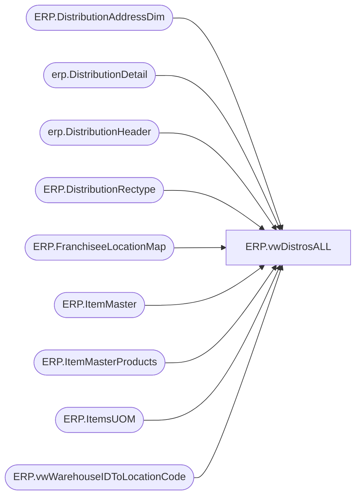

# ERP.vwDistrosALL

**Database:** IntegrationStaging  
**Server:** STL-SSIS-P-01  

## Architecture Diagram



## Table Dependencies

| Referenced Table |
|---|
| ERP.DistributionAddressDim |
| erp.DistributionDetail |
| erp.DistributionHeader |
| ERP.DistributionRectype |
| ERP.FranchiseeLocationMap |
| ERP.ItemMaster |
| ERP.ItemMasterProducts |
| ERP.ItemsUOM |
| ERP.vwWarehouseIDToLocationCode |

## View Code

```sql
CREATE view [ERP].[vwDistrosALL]

as 
with 
AllDistros as
	(
		select 
			case when h.Entity = 9999 then 1100 else h.Entity end as Entity, ---updated a ton to 9999 due to being duplicates
			h.OrderType,
			h.OrderID,
			h.FromWarehouse HeaderFromWhse,
			h.ToWarehouse HeaderToWarehouse,
			h.SHIPTONAME HeaderShipToName,
			d.location DetailLocation,
			d.Warehouse DetailWarehouse,
			h.ModeOfDelivery,
			d.ItemNumber,
			d.UOM,
			d.Quantity,
			h.TransactionDateTime OrderCreateDate,
			h.InsertDate OrderIntegrationDate,
			h.ReleaseDate OrderReleasedToWhseDate
		from erp.DistributionHeader h with (nolock)
		join erp.DistributionDetail d with (nolock) 
			on h.OrderID = d.OrderID 
			and h.PICKLISTID = d.picklistid 
			and h.entity = d.entity 		
		where left(d.ItemNumber, 1) in ('M', 'S')
	),
DistroDerivedData as
	(
		select 
			cast(AD.Entity as nvarchar(4)) as Entity,
			AD.OrderType,
			AD.OrderID,
			AD.HeaderFromWhse,
			AD.HeaderToWarehouse,
			AD.HeaderShipToName,
			AD.DetailLocation,
			AD.DetailWarehouse,
			AD.ModeOfDelivery,
			AD.ItemNumber,
			AD.UOM,
			AD.Quantity,
			AD.OrderCreateDate,
			AD.OrderIntegrationDate,
			AD.OrderReleasedToWhseDate,
			case when isnumeric(isnull(AD.ModeOfDelivery,1)) = 0 then 1 else isnull(AD.ModeOfDelivery,1) end as DerivedModeOfDelivery,
			isnull(rt.RecType,1) as RecType,
			cast(lc1.OperationalSiteCode as varchar(10)) as DerivedFromWarehouse,
			CASE 
				WHEN AD.ORDERTYPE = 'Sales' and f.LocationCode is not null  ---SALES ORDER FOR FRANCHISEE LOCATION THAT IS MAPPED IN ERP.FranchiseeLocationMap, CAME FROM RON TO TELL US LOCATION CODES FOR FRANCHISEES AS THEY ARE NOT IN DYNAMICS AS WAREHOUSE/SITE
					THEN f.LocationCode
				else 
						----ORIGNAL CASE STATEMENT
						cast(
								case when lc4.OperationalSiteCode is not null
									then cast(lc4.OperationalSiteCode as varchar)
									else
										case 
											when lc2.OperationalSiteCode is not null 
												then cast(lc2.OperationalSiteCode as varchar)
												else isnull(cast(a.location_code as varchar), cast(a.AddressID as varchar) )
										end
									end 
								as varchar(10))
			END as DerivedTOWAREHOUSE,
			right(AD.ItemNumber,6) as DerivedStyleCode,
			cast( isnull(uom.Factor,1) * AD.Quantity as int) as DerivedQTY,
			case when im.ProductNumber is NULL then 'NO' else 'YES' end as HasItemMasterData,
			case when uom.ProductNumber is NULL then 'NO' else 'YES' end as HasItemUOMData,
			case when p.ProductNumber is NULL then 'NO' else 'YES' end as HasProductData
		from AllDistros AD 
		left join ERP.DistributionRectype rt on rt.RecType = case when isnumeric(isnull(AD.ModeOfDelivery,1)) = 0 then 1 else isnull(AD.ModeOfDelivery,1) end
		left join ERP.vwWarehouseIDToLocationCode lc1 with (nolock) on 
					case when AD.OrderType = 'Transfer'
						then AD.HeaderFromWhse
						else AD.DetailWarehouse 
						end = lc1.WarehouseID
						and AD.Entity = lc1.Entity 
		left join ERP.vwWarehouseIDToLocationCode lc2 with (nolock) on 
					case when AD.OrderType = 'Transfer'
						then cast(AD.HeaderToWarehouse as varchar(5))
						else cast(AD.DetailLocation as varchar(5))
						end = cast(lc2.WarehouseID as varchar(5))
						and AD.Entity = lc2.Entity 
		left join ERP.DistributionAddressDim a with (nolock) on AD.HeaderShipToName = a.SHIPTONAME
		left join ERP.vwWarehouseIDToLocationCode lc3 with (nolock) on lc2.LocationCode = replace(lc3.WarehouseID, '-','') and AD.Entity = lc3.Entity 
		left join ERP.vwWarehouseIDToLocationCode lc4 with (nolock) on AD.HeaderShipToName = lc4.PrimaryAddressDescription and AD.OrderType = 'Sales' and AD.Entity = lc4.Entity --SALES ORDERS TO CANADA STORES..
		left join ERP.FranchiseeLocationMap f on AD.HeaderShipToName = f.FranchiseeName and AD.Entity = f.entity 
		left join ERP.ItemMaster im with (nolock) on AD.ItemNumber = im.ProductNumber and AD.Entity = im.Entity
		left join ERP.ItemMasterProducts p with (nolock) on AD.ItemNumber = p.ProductNumber
		left join ERP.ItemsUOM uom with (nolock) 
			on AD.ItemNumber = uom.ProductNumber
			and AD.UOM = uom.FromUnitSymbol
			and AD.Entity = uom.Entity
			and uom.ToUnitSymbol = 'wmea'
	)
select 
	Entity,
	OrderType,
	OrderID,
	HeaderFromWhse,
	HeaderToWarehouse,
	HeaderShipToName,
	DetailLocation,
	DetailWarehouse,
	ModeOfDelivery,
	ItemNumber,
	UOM,
	Quantity,
	OrderCreateDate,
	OrderIntegrationDate,
	OrderReleasedToWhseDate,
	DerivedModeOfDelivery,
	RecType,
	DerivedFromWarehouse,
	DerivedTOWAREHOUSE,
	DerivedStyleCode,
	DerivedQTY,
	HasItemMasterData,
	HasItemUOMData,
	HasProductData,
	case when DerivedFromWarehouse = DerivedTOWAREHOUSE then 'YES' else 'NO' end as FromEqualsTo,
	case 
		when 
			datediff(dd, OrderIntegrationDate, getdate()) > 0  --DISTRO STAGED YESTERDAY OR BEFORE
			OR  
				(
					datediff(dd, OrderIntegrationDate, getdate()) = 0 --DISTRO STAGED TODAY
					AND --MEETS REC TYPE CRITERIA TO RELEASE BEFORE 6PM OR QUERY IS RUNNING AFTER 6PM AND MEETS CRITERIA TO RELEASE AFTER 6PM
					(
							(isnull(RecType,1) >= 50 ) --EITHER RECTYPE >= 50 OR IS A SALE THAT IS NOT TO CANADIAN STORE
							or		
							(
								isnull(RecType,1) < 50 
								and 
								datepart(hh,getdate()) >= case when DerivedFromWarehouse = '3970' then 15 else 18 end
							)
						)
				)
			then 'YES'
			else 'NO'
		end as MeetsRecTypeReleaseCriteria,
		upper(datename(dw,getdate())) as CurrentDay
from DistroDerivedData
```

